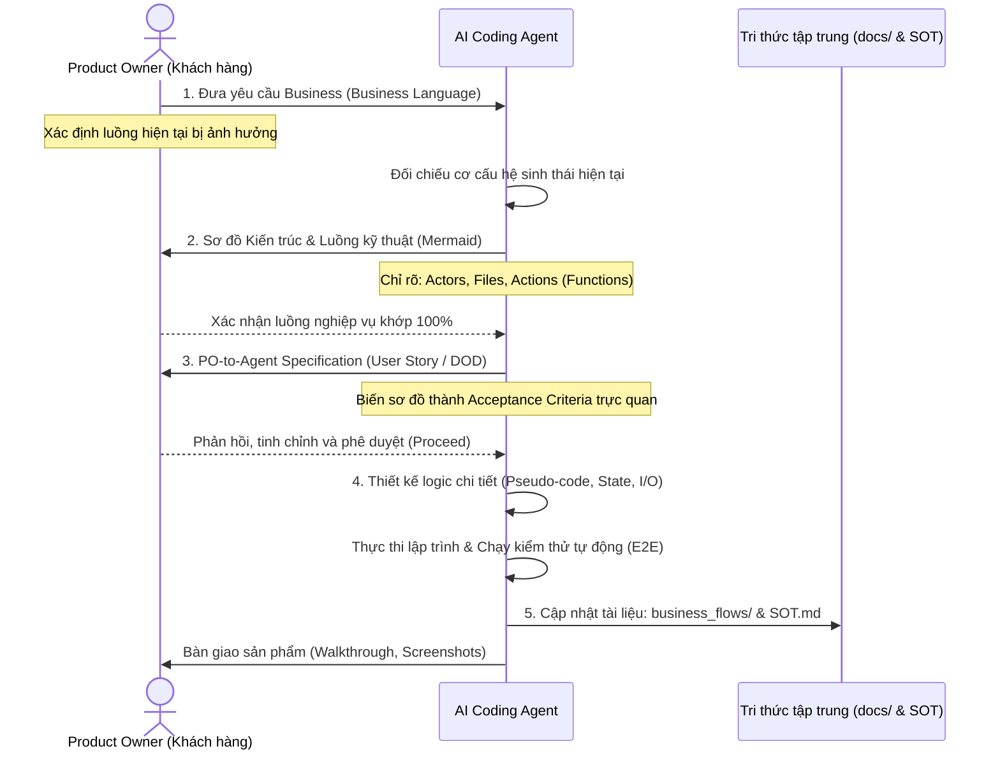

# Quy trình Chuẩn Agentic SDLC dành cho Product Owner (PO)

Tài liệu này định nghĩa khung làm việc chuẩn **Agentic SDLC (Software Development Life Cycle)** tối ưu hóa sự phối hợp giữa Product Owner (Con người) và AI Coding Agent. Mục tiêu là triệt tiêu lỗi hiểu sai nghiệp vụ, tăng tốc độ triển khai và đảm bảo hệ thống lưu trữ tri thức dự án luôn đồng bộ.

---

## I. Sơ đồ Quy trình Tuần tự (SDLC Sequence Diagram)



---

## II. 5 Bước Thực Hiện Chi Tiết

### Bước 1: PO Khởi Tạo Yêu Cầu (PO Business Request)
PO mô tả tính năng bằng ngôn ngữ kinh doanh tự nhiên. 
> [!TIP]
> **Quy tắc vàng cho PO:** Khi mô tả yêu cầu, hãy luôn xác định: **"Hệ thống hiện tại có các luồng nào? Tính năng này tác động vào luồng nào?"**

*Mẫu soạn thảo nhanh của PO:*
*   **Mục tiêu:** [Tôi muốn...]
*   **Luồng nghiệp vụ tác động:** [Tác động luồng cào tin, hiển thị khách...]
*   **Ràng buộc cốt lõi:** [Ví dụ: Không được mất ảnh tự upload...]

---

### Bước 2: AI Vẽ Sơ đồ Kỹ thuật (Architectural Mapping)
AI Agent bắt buộc phải phản hồi bằng một sơ đồ kiến trúc dữ liệu thể hiện rõ:
- **Tên các luồng nghiệp vụ** tham gia.
- **Đối tượng thực hiện** (Actors).
- **Hệ thống Client/UI** tương tác cụ thể.
- **File vật lý** chịu tác động (Path cụ thể).
- **Hành động kỹ thuật** (Tên hàm hiện tại hoặc hàm cần tạo mới, kết thúc bằng `()`).

*Ví dụ sơ đồ chi tiết do AI vẽ:*
```mermaid
sequenceDiagram
    actor Admin as Admin (Người biên tập)
    participant AdminUI as Vercel Admin UI (Browser)
    participant Backend as FastAPI Server (Local Python)
    database SQLite as CSDL SQLite (listings & listings_images)
    participant SheetsPool as Google Sheets (Tab Pool)
    participant AppsScript as Google Apps Script
    participant SheetsSource as Google Sheets (Tab Source)
    actor Guest as Khách hàng cuối (Client Viewer)
    participant GuestUI as Vercel Client UI (Browser)

    %% Luồng 1: Biên Tập Ảnh (Vercel Admin Curation)
    Note over Admin, AdminUI: Admin biên tập ảnh trên giao diện Curation
    Admin->>AdminUI: Kéo thả xếp thứ tự, ẩn/hiện, chọn role (mặt tiền, sơ đồ, hẻm, nội thất)
    Note over AdminUI: Thao tác Client-side thuần túy (Chưa gọi server)
    
    Admin->>AdminUI: Bấm nút "Lưu thay đổi" (hoặc "Lên sóng")
    AdminUI->>Backend: 1. POST /api/listings/save (payload JSON: system_id, images list)
    
    Backend->>Backend: Xác thực token & lọc dữ liệu
    Backend->>SQLite: Ghi bảng listings_images (system_id, tk_id, url, role, seq, is_hidden)
    Backend->>SQLite: UPDATE listings SET images_admin_json = ?, images_public_json = ? WHERE tk_id = ?
    
    Backend->>Backend: Ghi song song dữ liệu Pool & Source
    Backend->>SheetsPool: 2a. Ghi cột Images_Admin_JSON mới + 35 Cột phẳng thô cũ (Anh_1-25, Hinh_Hem_1-10)
    Backend->>SheetsSource: 2b. Ghi cột Images_Public_JSON mới + 15 Cột phẳng public (anh_1 đến anh_15) + Cột preview mặt tiền/sơ đồ
    Backend-->>AdminUI: Phản hồi Success
    AdminUI-->>Admin: Hiển thị thông báo thành công

    %% Luồng 2: Đồng bộ ngầm Sheets
    Note over SheetsPool, SheetsSource: Đồng bộ ngầm (Smart Merge)
    AppsScript->>SheetsPool: Đọc dữ liệu
    AppsScript->>SheetsSource: 3. smartMerge() ghi đè 15 cột phẳng và cột Images_Public_JSON (đã lọc ảnh Private)

    %% Luồng 3: Hiển thị Khách hàng cuối
    Guest->>GuestUI: Truy cập trang chi tiết nhà
    GuestUI->>SheetsSource: 4. gviz Query lấy dữ liệu (Images_Public_JSON + 15 Cột phẳng)
    GuestUI->>GuestUI: Đọc cột Images_Public_JSON
    alt Có Images_Public_JSON
        GuestUI->>GuestUI: Render Carousel đầy đủ từ JSON (Đã sắp xếp)
    else Không có Images_Public_JSON (Fallback)
        GuestUI->>GuestUI: Render Carousel giới hạn từ 15 cột phẳng (anh_1 đến anh_15)
    end
    GuestUI-->>Guest: Hiển thị ảnh công khai đúng thứ tự
```

> [!NOTE]
> **Quy ước đánh số hành động trên sơ đồ:**
> - **Các bước có đánh số (1., 2., 3...):** Biểu diễn **Tác vụ kích hoạt chính hoặc Trao đổi dữ liệu liên hệ thống** (giao tiếp giữa UI Client, local server và Google Sheets).
> - **Các bước không đánh số (Gọi hàm..., Lưu CSDL...):** Biểu diễn **Xử lý nội bộ / Lời gọi hàm local** (các bước trung gian chạy bên trong một chương trình).

---

### Bước 3: Biên Dịch Thành User Story (PO-to-Agent Specification)
AI Agent chuyển đổi sơ đồ kỹ thuật thành định dạng **PO-to-Agent template** (tương đương User Story).
- Chứa các điều kiện nghiệm thu dạng hộp kiểm `- [ ]`.
- Ngôn ngữ rõ ràng, phân định ranh giới giữa Client và Backend.

*PO đọc, chỉnh sửa trực tiếp hoặc bấm **Proceed** để duyệt kế hoạch.*

---

### Bước 4: Thiết Kế Cấp Thấp & Thực Thi Bảo Mật (Logic Translation & Security Enforcement)
AI Agent tự động dịch User Story thành các biểu diễn logic tối giản đi kèm **ràng buộc bảo mật tối cao** để tự thực thi:
1.  **Hộp đen dữ liệu:** Định nghĩa `Input` $\rightarrow$ `Process` $\rightarrow$ `Output` của các hàm (ví dụ: `saveSourceChanges()`).
2.  **State Machine:** Bảng chuyển đổi trạng thái của thực thể (ví dụ: ảnh cũ $\rightarrow$ `is_hidden = 1` $\rightarrow$ `deleted`).
3.  **Pseudo-code:** Đoạn mã giả cấu trúc IF/ELSE để xử lý trường hợp biên.
4.  **Thực thi Bảo mật dữ liệu (Security Enforcement):**
    - **Xác thực (Authentication):** API `/api/listings/save` bắt buộc giải mã Google OAuth2 JWT, đối chiếu email của Admin trong Whitelist.
    - **Bảo mật PII (Data Sanitization):** Hàm `sanitize_pii()` dùng regex xóa sạch SĐT, email, số nhà thật trước khi lưu mô tả public.
    - **Ngăn chặn rò rỉ hình ảnh (Image Security):** Vercel Client của khách hàng cuối tuyệt đối không được phép nhận URL của ảnh có `role` là `facade` hoặc `diagram`. Logic client-side và API endpoint sẽ chặn nạp các role này nếu không có session admin.

*Sau khi thiết kế xong, Agent tự động viết mã nguồn và chạy các bộ kiểm thử E2E (Playwright/Pytest) để đảm bảo không lỗi hồi quy.*

---

### Bước 5: Cập Nhật Tri Thức Tập Trung (Knowledge Centralization)
Sau khi tính năng được kiểm thử thành công, AI Agent có nhiệm vụ cập nhật tri thức vào 2 nơi:

| Đối tượng | Nơi lưu trữ | Nội dung cập nhật |
| :--- | :--- | :--- |
| **Dành cho PO & Business Users** | Thư mục `docs/business_flows/` | - Sơ đồ nghiệp vụ tổng quát.<br>- Hướng dẫn sử dụng cho con người.<br>- Cách các luồng kết nối với nhau. |
| **Dành cho AI Agent (Môi trường kế tiếp)** | File `SOURCE_OF_TRUTH.md` | - Cập nhật Database Schema mới.<br>- Thay đổi cấu trúc API.<br>- Bài học xương máu (Lessons Learned).<br>- Cấu hình Sheets/R2. |

---

## III. Cú Pháp Kích Hoạt Nhanh Dành Cho PO

Để bắt đầu làm việc với AI Agent theo quy trình này, anh có thể sử dụng các câu lệnh sau:

*   **Để bắt đầu tính năng mới:**
    > *"Tôi muốn làm tính năng [Tên tính năng]. Hãy phỏng vấn tôi (/grill-me) và vẽ sơ đồ Agentic SDLC để tôi xác nhận."*
*   **Khi muốn xem sơ đồ nghiệp vụ:**
    > *"Hãy cập nhật sơ đồ các luồng nghiệp vụ hiện tại trong docs/business_flows/."*
*   **Khi chuẩn bị coding:**
    > *"Hãy chuyển User Story này thành đặc tả logic (Input/Process/Output & State Machine) trước khi viết code."*
