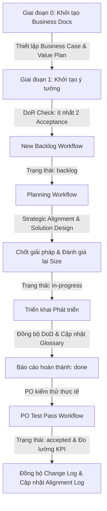
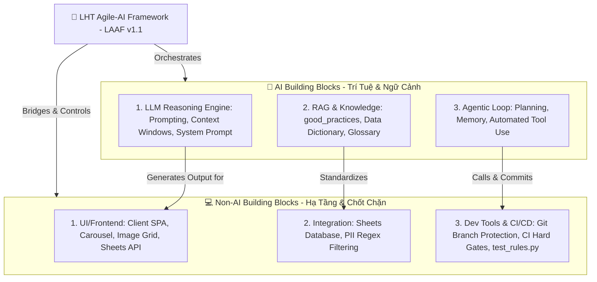

# 🚀 LHT Agile-AI Framework (LAAF) — Hướng Dẫn Nhân Bản Dự Án Nhanh

Chào mừng đến với **LHT Agile-AI Framework (LAAF)**. Đây là một bộ khung quy trình phát triển sản phẩm lai (Hybrid Framework) độc đáo do **Trang (System Designer)** thiết kế và phát triển nhằm tối ưu hóa sự cộng tác giữa AI Assistant và Lập trình viên để xây dựng hệ thống quản lý bất động sản phục vụ cho khách hàng/end-user là **Anh Khang Ngô**.

Tài liệu này đóng vai trò là **Landing Page** mô tả cấu trúc framework và hướng dẫn chi tiết cách đóng gói, nhân bản để khởi động một dự án mới bất kỳ trong **chưa đầy 5 phút**.

---

## 🌟 1. Tổng Quan Kiến Trúc LAAF (Core Framework Map)

LAAF giải quyết triệt để vấn đề lớn nhất của việc lập trình cùng AI: **"Mất ngữ cảnh (Context drift), code chạy bừa bãi không kiểm soát, và tài liệu hóa chắp vá"**.



### 4 Trụ Cột Vàng của LAAF:
1.  **Single Source of Truth (Nguồn sự thật duy nhất):** Không tạo file local rời rạc. Mọi Kế hoạch triển khai (Impl Plan), Sơ đồ logic (Mermaid) và Checklist tiến độ (TODO) đều nằm trực tiếp trong một file User Story.
2.  **Đồng bộ Tài liệu Liên tục (Continuous Doc Sync):** AI bắt buộc phải đồng bộ hóa trạng thái công việc sang `INDEX.md`, `NEXT_SESSION.md`, `SOURCE_OF_TRUTH.md` ngay lập tức tại mỗi bước chuyển đổi trạng thái để giữ cho hệ thống tài liệu luôn mới nhất.
3.  **Human-in-the-Loop & Quality Control:** Kiểm soát chất lượng thông qua chốt chặn **DoR** (khi tạo backlog), **DoD** (khi xong code), **Change Requests & Sub-versions** (khi PO test điều chỉnh yêu cầu) và **Test Pass** (khi nghiệm thu thực tế của anh Khang Ngô).
4.  **Quản trị Kinh doanh & Giá trị (Value & Business Governance):** Mọi dự án được bắt đầu bằng Business Case và Value Management Plan chuẩn PMP. AI và PM liên tục đối chiếu giải pháp kỹ thuật với mục tiêu chiến lược và theo dõi, ghi nhận sự tiến hóa, điều chỉnh giá trị thực tế qua từng phiên làm việc để tránh trôi lệch giá trị (KPI drift).

---

## 📂 2. Cấu Trúc Thư Mục Chuẩn để Nhân Bản

Khi đóng gói LAAF để nhân bản sang dự án mới, chị Trang chỉ cần giữ lại cấu trúc thư mục và các file lõi sau đây (loại bỏ dữ liệu đặc thù của dự án cũ):

```text
📁 [PROJECT_ROOT]/
├── 📄 BDS-AGENTS.md                   <-- Chỉ dẫn Agent (Thay đổi tên dự án và rules)
├── 📄 SOURCE_OF_TRUTH.md              <-- Bản đồ hệ thống & Change Log (Reset trống)
└── 📁 docs/
    ├── 📄 NEXT_SESSION.md             <-- Trạng thái phiên hiện tại (Reset trống)
    ├── 📁 _templates/
    │   ├── 📄 US_new.md               <-- Template tạo User Story chuẩn chỉnh
    │   └── 📄 US_stub_legacy.md       <-- Template tạo Story kế thừa (Legacy)
    ├── 📁 business_docs/              <-- Tài liệu quản trị kinh doanh & giá trị dự án (chuẩn PMP)
    │   ├── 📄 business_case.md        <-- Bản thuyết minh kinh doanh & CBA (Reset trống)
    │   └── 📄 value_management_plan.md <-- Kế hoạch quản lý & đo lường giá trị (Reset trống)
    ├── 📁 workflows/
    │   ├── 📄 Load Context.md         <-- Quy trình nạp context phiên làm việc mới
    │   ├── 📄 New Backlog.md          <-- Quy trình tạo nhanh Backlog (DoR check)
    │   ├── 📄 Planning.md             <-- Quy trình Lập kế hoạch & DoD check
    │   └── 📄 Test Pass.md            <-- Quy trình Nghiệm thu & Close task
    ├── 📁 stories/
    │   ├── 📄 INDEX.md                <-- Chỉ mục User Story (Reset trống bảng)
    │   └── 📁 _inbox/                 <-- Thư mục chứa các User Story (Xóa hết file cũ)
    ├── 📄 data_dictionary.md          <-- Từ điển dữ liệu mới (Cập nhật cột dự án mới)
    ├── 📄 data_standardization_rules.md <-- Quy tắc chuẩn hóa dữ liệu mới
    ├── 📄 project_glossary.md         <-- Bảng thuật ngữ mới (Jargon Dictionary)
    └── 📄 system_architecture_deployment.md <-- Sơ đồ kiến trúc & Deploy mới
```

---

## 📦 3. Hướng Dẫn 5 Bước Nhân Bản Dự Án Mới Siêu Nhanh

Để bắt đầu một dự án mới hoàn toàn bằng LAAF, chị Trang chỉ cần thực hiện 5 bước đơn giản sau:

### Bước 1: Sao chép bộ khung thư mục
1.  Tạo thư mục dự án mới trên máy tính (ví dụ: `D:\LHTBrain\01_PROJECTS\NEW-PROJECT`).
2.  Sao chép toàn bộ cấu trúc thư mục chuẩn ở mục 2 sang thư mục dự án mới.

### Bước 2: Dọn dẹp dữ liệu cũ (Reset)
1.  **`docs/stories/_inbox/`:** Xóa sạch toàn bộ các file `.md` cũ bên trong.
2.  **`docs/stories/INDEX.md`:** 
    *   Cập nhật `Total: 0`, `draft: 0`, `done: 0`, `accepted: 0`.
    *   Xóa sạch các dòng trong bảng **All Stories** (chỉ giữ lại header bảng).
    *   Xóa sạch danh mục dưới mục **By Keyword**.
3.  **`docs/NEXT_SESSION.md`:** Xóa sạch các nội dung task cũ, chỉ giữ lại khung sườn trống.
4.  **`SOURCE_OF_TRUTH.md`:** Reset lại mục **Section 7: Change Log** (Trống) và cập nhật tên dự án mới.
5.  **`docs/business_docs/`:** Reset lại nội dung trong `business_case.md` và `value_management_plan.md` về trạng thái bản mẫu, đặt lại các bảng nhật ký (Evolution Log và Alignment Log) về phiên bản `v1.0` ban đầu.

### Bước 3: Định hình Dữ liệu, Kinh doanh & Nghiệp vụ dự án mới (Tailoring)
1.  **`docs/business_docs/business_case.md`:** Xác định và điền đầy đủ Cost-Benefit Analysis (CBA), nhu cầu thực tế và tiêu chí thành công tài chính/phi tài chính của dự án mới.
2.  **`docs/business_docs/value_management_plan.md`:** Thiết lập khung đo lường giá trị thực tế, KPIs cam kết, chu kỳ đo lường và phân định trách nhiệm.
3.  **`docs/data_dictionary.md`:** Cập nhật lại sơ đồ các bảng dữ liệu, file Google Sheet ID, tên cột và công thức của dự án mới.
4.  **`docs/data_standardization_rules.md`:** Cập nhật lại các quy tắc chuẩn hóa dữ liệu đầu vào đặc thù của dự án mới.
5.  **`docs/project_glossary.md`:** Điền các thuật ngữ viết tắt hoặc Jargon nghiệp vụ ban đầu của dự án mới.
6.  **`BDS-AGENTS.md`:** Đổi tên tiêu đề dự án và cập nhật lại phần rules sống còn cho khớp dự án mới.

### Bước 4: Thiết lập Môi trường & Git Local
1.  Mở terminal tại thư mục dự án mới và chạy lệnh để cấu hình danh tính Git local (đảm bảo deploy mượt mà):
    ```bash
    git init
    git config --local user.name "[GIT_USER_NAME]"
    git config --local user.email "[GIT_USER_EMAIL]"
    ```
2.  Tạo NTFS Junction Link liên kết với thư mục bộ não của AI để đồng bộ context 2 chiều thời gian thực (nếu làm việc đa thiết bị).

### Bước 5: Kích hoạt AI Agent & Bắt đầu!
1.  Bắt đầu chat với AI Agent ở dự án mới, gõ câu lệnh nạp context:
    > `Đọc file d:\LHTBrain\01_PROJECTS\NEW-PROJECT\docs\workflows\Load Context.md để bắt đầu phiên mới`
2.  AI sẽ tự động nạp toàn bộ context kỹ thuật & nghiệp vụ kinh doanh của dự án mới.
3.  Gọi quy trình tạo backlog mới để ghi nhận câu chuyện đầu tiên:
    > `Chạy workflow New Backlog để tạo backlog đầu tiên: [Tên backlog]`
4.  **Bắt đầu lập kế hoạch (Planning), thiết kế giải pháp kỹ thuật có đối chiếu chiến lược trực tiếp trong US và triển khai code!**

## 🤖 4. Bản Đồ Khối Xây Dựng AI & Non-AI (AI Engineer Building Blocks Map)

Một AI Engineer chuyên nghiệp luôn tiếp cận hệ thống bằng cách phân chia dự án thành các **Khối xây dựng AI (AI Building Blocks)** kết hợp chặt chẽ với các **Khối phần mềm truyền thống (Non-AI Building Blocks)**. Bộ khung LAAF đóng vai trò là chiếc cầu nối và chốt chặn kiểm soát (Agentic Harness) để hai khối này vận hành nhịp nhàng:



### 1. Khối Xây Dựng AI (AI Building Blocks):
*   **LLM (Foundation Reasoning):** Lõi suy luận ngôn ngữ tự nhiên. LAAF tối ưu hóa việc quản lý cửa sổ ngữ cảnh (Context Window) thông qua cơ chế nạp context có chọn lọc và viết prompt cô lập (Rule 11/12).
*   **RAG & Context (Tri thức dự án):** Cung cấp dữ liệu nghiệp vụ không ảo tưởng. LAAF duy trì từ điển dữ liệu [Data Dictionary](file:///d:/LHTBrain/01_PROJECTS/BDS-KhangNgo/docs/data_dictionary.md), quy tắc chuẩn hóa [Standardization Rules](file:///d:/LHTBrain/01_PROJECTS/BDS-KhangNgo/docs/data_standardization_rules.md), và Sổ tay tri thức tập trung [good_practices.md](file:///d:/LHTBrain/01_PROJECTS/BDS-KhangNgo/docs/good_practices.md) đóng vai trò là cơ sở dữ liệu tri thức tĩnh hỗ trợ đắc lực cho LLM.
*   **Agentic AI (Bộ nhớ & Hành động tự trị):** Khả năng tự lập kế hoạch (Planning), tự phân rã User Story lớn, lưu giữ bộ nhớ (Update Logic & Retro), và tự sử dụng công cụ để chỉnh sửa file hoặc chạy mã nguồn.

### 2. Khối Xây Dựng Truyền Thống (Non-AI Building Blocks):
*   **UI/Frontend (Giao diện người dùng):** SPA, Carousel ảnh, Image Editor Grid, và các tương tác thời gian thực với Google Sheets API giúp end-user biên tập mượt mà.
*   **Integration & CSDL (Tích hợp & Bảo mật):** Cơ sở dữ liệu Google Sheets, SQLite local, và đặc biệt là bộ lọc bảo mật nhạy cảm (PII Regex Filters) chạy cục bộ để lọc sạch SĐT/Tên riêng trước khi gửi dữ liệu sang API bên thứ ba.
*   **Harness & Dev Tools (Chốt chặn & Tự động hóa Git):** Bộ test suite (`test_rules.py`), cơ chế tự động tạo nhánh/commit Git ảo, và CI Hard Gate tại Bước 0 đảm bảo Agent không bao giờ bị "ảo tưởng hoàn thành" và mã nguồn được tích hợp sạch sẽ 100%.

---

*LAAF là thành quả tinh hoa quản trị dự án hiện đại do Trang thiết kế, giúp Trang và AI Assistant bàn giao các sản phẩm hoàn hảo nhất cho Anh Khang Ngô.*
