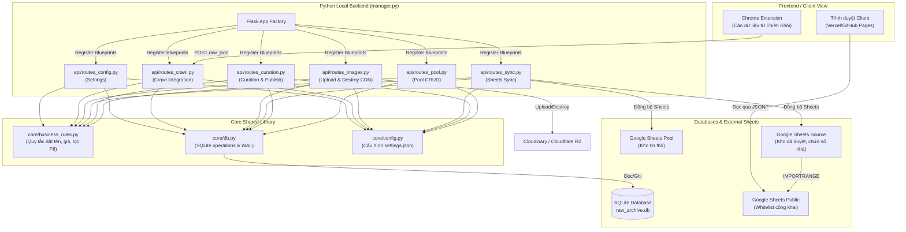

# 🗺️ Tổng Quan Kiến Trúc Hệ Thống (System Architecture Overview)

Tài liệu này mô tả sơ đồ kiến trúc tổng thể và mối tương quan giữa các thành phần phần mềm của dự án BDS Khang Ngô.

## 1. Sơ Đồ Kiến Trúc Hệ Thống (Mermaid Diagram)

---

## 2. Mô Tả Các Component

### a. Flask App Factory (`manager.py`)
- Khởi tạo ứng dụng Flask, nạp cấu hình tập trung và đăng ký các module API (Blueprints) độc lập.
- Giao diện Admin/Curation được gọi trực tiếp qua Vercel frontend hoặc chạy cục bộ.

### b. API Blueprints (`api/`)
- Phân rã các endpoints thành các module dịch vụ riêng biệt để cô lập lỗi:
  - `routes_pool.py`: Xử lý CRUD tin thô.
  - `routes_curation.py`: Duyệt tin, lưu thay đổi và phát sóng.
  - `routes_sync.py`: Đồng bộ dữ liệu SQLite với Google Sheets.
  - `routes_images.py`: Upload ảnh, gán nhãn và xóa ảnh lỗi.
  - `routes_crawl.py`: Kích hoạt và nhận payload từ Chrome Extension.
  - `routes_config.py`: Đọc ghi cấu hình hệ thống.

### c. Core Shared Library (`core/`)
- `business_rules.py`: Chứa 100% logic nghiệp vụ dùng chung, đảm bảo tính nhất quán của dữ liệu (chuẩn hóa tên đường, xử lý số nhà, sinh mã ID, xóa PII).
- `db.py`: Đóng gói cơ sở dữ liệu SQLite, tối ưu hóa ghi đồng thời bằng chế độ ghi trước nhật ký WAL (Write-Ahead Logging) và xử lý khóa tranh chấp (`timeout=30.0`).
- `config.py`: Quản lý nạp tệp cấu hình `settings.json` tập trung.

### d. Tầng Dữ Liệu Ngoại Vi (Google Sheets)
- Phân cấp 3 tầng (Pool -> Source -> Public) giúp bảo vệ thông tin cá nhân của chủ nhà (PII) và nâng cao hiệu năng truy vấn cho giao diện web tĩnh.
