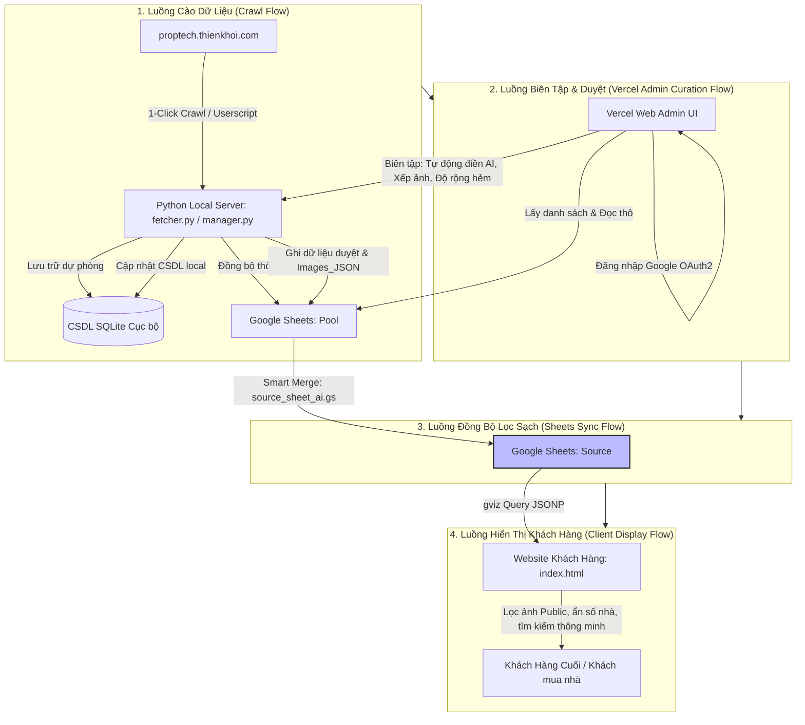

# Bản Đồ Các Luồng Nghiệp Vụ Hệ Thống (Business Flows Index)

Tài liệu này là trung tâm thông tin nghiệp vụ dành cho **Product Owner (PO) và Business Users**. Tài liệu mô tả cách hệ thống BDS Khang Ngô vận hành dưới góc nhìn quy trình kinh doanh, chỉ rõ các luồng dữ liệu đi qua các thành phần công nghệ.

---

## Sơ đồ Tổng quan Hệ thống (System Overview Map)

---

## Chi tiết 4 Luồng Nghiệp Vụ Cốt Lõi

### [Luồng 1: Cào Dữ Liệu (Crawl Flow)](file:///d:/LHTBrain/01_PROJECTS/BDS-KhangNgo/docs/business_flows/01_crawl_flow.md)
*   **Mục đích:** Thu thập thông tin nhà bán thô từ kho hàng của đối tác (Thiên Khôi) về hệ thống nội bộ.
*   **Tác nhân:** Userscript Tampermonkey, Python Local Server.
*   **Vận hành:** 
    1. Admin duyệt danh sách nhà trên website Thiên Khôi, click nút cào nhanh trên giao diện.
    2. Dữ liệu thô (gồm thông tin chung, địa chỉ thật, thông số diện tích, giá, mô tả chi tiết, ảnh sổ đỏ, ảnh thực tế) được cào về qua API cục bộ.
    3. Dữ liệu thô được ghi nhận vào SQLite để lưu trữ dự phòng và đồng bộ phẳng lên tab **Pool** của Google Sheets.

### [Luồng 2: Biên Tập & Duyệt (Vercel Admin Curation Flow)](file:///d:/LHTBrain/01_PROJECTS/BDS-KhangNgo/docs/business_flows/02_curation_flow.md)
*   **Mục đích:** Làm sạch thông tin, viết lại tiêu đề/mô tả bằng AI, phân loại hình ảnh (mặt tiền, hẻm, nội thất) và sắp xếp thứ tự hiển thị hoặc ẩn ảnh nhạy cảm trước khi xuất bản.
*   **Tác nhân:** Admin (anh Khang), Vercel Admin Curation Dashboard, OpenAI API.
*   **Vận hành:**
    1. Admin đăng nhập vào trang quản trị Vercel bằng tài khoản Google được phân quyền.
    2. Chọn căn nhà cần biên tập từ danh sách chờ duyệt (dữ liệu thô).
    3. Sử dụng công cụ Tự động điền AI để viết lại Tiêu đề/Mô tả chuẩn SEO (bảo mật số nhà hẻm).
    4. Curation hình ảnh: Sắp xếp thứ tự ảnh hiển thị, gắn vai trò ảnh (Mặt tiền, Sổ đỏ, Hẻm, Nội thất, Nền) hoặc ẩn đi các ảnh lỗi/không mong muốn (`is_hidden = 1`).
    5. Điền các thông số custom (độ rộng hẻm, diện tích sổ, hướng nhà custom).
    6. Click "Lưu & Duyệt Public": Hệ thống cập nhật dữ liệu biên tập vào SQLite local, đồng thời đẩy link ảnh đã xếp thứ tự dưới dạng JSON (`Images_JSON`) và đánh dấu trạng thái duyệt lên Google Sheets tab **Pool**.

### [Luồng 3: Đồng Bộ Lọc Sạch (Sheets Sync Flow)](file:///d:/LHTBrain/01_PROJECTS/BDS-KhangNgo/docs/business_flows/03_sync_flow.md)
*   **Mục đích:** Chuyển dữ liệu đã được duyệt và làm sạch từ kho thô (Pool) sang rổ hàng hiển thị (Source) một cách an toàn.
*   **Tác nhân:** Google Apps Script (`source_sheet_ai.gs` / `pool_backend_v3.gs`).
*   **Vận hành:**
    1. Một trigger tự động chạy định kỳ hoặc chạy thủ công khi Admin kích hoạt trên Google Sheets.
    2. Script quét tab **Pool**, lọc ra những căn nhà có trạng thái `Duyệt Public = TRUE` và `Trạng thái Public = Active`.
    3. Thực hiện đồng bộ chéo (Smart Merge) sang tab **Source**.
    4. Áp dụng cơ chế bảo vệ cột (Zebra style & IMAGE formula) để ngăn chặn việc ghi đè đè lên dữ liệu biên tập thủ công của Admin trên sheet Source.

### [Luồng 4: Hiển Thị Khách Hàng (Client Display Flow)](file:///d:/LHTBrain/01_PROJECTS/BDS-KhangNgo/docs/business_flows/04_display_flow.md)
*   **Mục đích:** Hiển thị rổ hàng sạch cho khách hàng cuối xem, tìm kiếm và đăng ký tư vấn.
*   **Tác nhân:** Người dùng cuối (Khách mua nhà), Web Client (Vercel).
*   **Vận hành:**
    1. Khách truy cập vào trang chủ Website Khang Ngô Nhà Phố.
    2. Trình duyệt gửi truy vấn gviz lấy dữ liệu công khai từ tab **Source** Google Sheets (đã ẩn đi các cột nhạy cảm như số nhà, thông tin chủ nhà, hình mặt tiền thật bằng cơ chế lệch cột IMPORTRANGE).
    3. Website hiển thị danh sách các căn nhà dưới dạng Card BĐS trực quan, hỗ trợ bộ lọc nâng cao (Quận, Phường, Giá, Diện tích, Hướng, Loại hẻm...).
    4. Khi khách click xem chi tiết: Trình duyệt đọc cột `Images_JSON`, lọc bỏ các hình ảnh Private (`facade`, `diagram`) và các ảnh bị ẩn (`is_hidden = 1` hoặc `deleted`), chỉ render các ảnh Public (`interior`, `alley`, `background`) lên thanh trượt Swiper theo đúng thứ tự sắp xếp của Admin.
    5. Khách có thể đăng ký thông tin tư vấn và gửi trực tiếp qua Zalo cho Admin.
