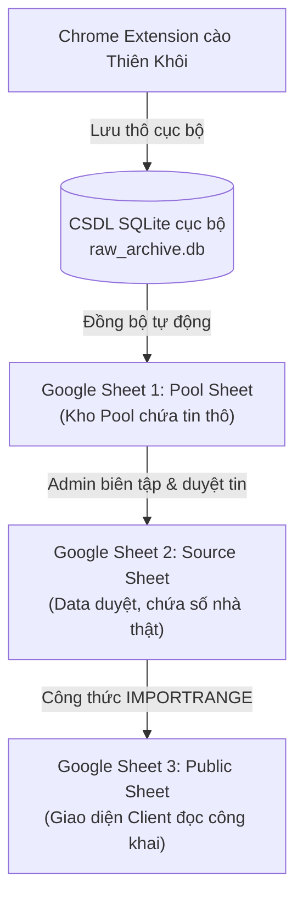

# 🔄 Quy Trình Biên Tập & Duyệt Tin (Curation Workflow)

Tài liệu này định nghĩa luồng dữ liệu 3 tầng (Three-Tier Sync Architecture) và quy trình biên tập duyệt tin của dự án BDS Khang Ngô.

## 1. Kiến Trúc Luồng Dữ Liệu 3 Tầng (Data Flow)

Dữ liệu di chuyển qua 3 trạng thái độc lập để đảm bảo an toàn và phân quyền truy cập:

---

## 2. Các Bước Thực Hiện Biên Tập & Lên Sóng

### Bước 1: Thu thập tin thô (Cào tin)
- Admin dùng Chrome Extension cào tin căn nhà từ website Thiên Khôi.
- Extension gửi dữ liệu thô về cổng Python API cục bộ, ghi nhận vào SQLite `raw_archive.db` và đẩy trực tiếp lên **Google Sheets Pool** (kho hàng thô).

### Bước 2: Curation (Duyệt tin) trên Vercel Admin Panel
- Admin đăng nhập bằng mật khẩu `trang` để mở giao diện quản trị.
- Chọn các căn trong **Kho Pool** chưa duyệt để biên tập:
  - Chọn ảnh bìa (Cover), ảnh mặt tiền, ảnh hẻm.
  - Gán nhãn ảnh sổ đỏ (ảnh sổ đỏ được ẩn hoàn toàn khỏi danh sách public và tự động tắt checkbox công khai để bảo mật).
  - Chọn nút **"Tự động điền"** để AI biên dịch mô tả thô thành tiêu đề và nội dung mô tả công khai ngắn gọn (đúng 4 đoạn, loại bỏ PII, không chứa emoji).
- Click **"Lên Sóng"** (Publish) hoặc **"Lưu Thay Đổi"**: Dữ liệu duyệt chính thức được lưu thẳng vào **Google Sheets Source** (chứa số nhà thật, thông tin bảo mật đầu chủ).

### Bước 3: Xuất bản Public tự động
- **Google Sheets Public** tự động đồng bộ một phần dữ liệu từ **Source** sang bằng công thức `=IMPORTRANGE("Source!D3:AT1000")` đặt ở ô `A3`.
- Công thức này bỏ qua 3 cột đầu tiên nhạy cảm của Source (Hình mặt tiền gốc, Cú pháp cào, Ghi chú) nhằm bảo mật rổ hàng.

---

## 3. Quy Tắc Lệch Chỉ Số Cột (Column Shift Bug)
- Do công thức `=IMPORTRANGE` dịch phạm vi dữ liệu từ cột D (Source) sang cột A (Public) để giấu đi 3 cột nhạy cảm đầu tiên của Source:
  - **Quy tắc lệch chỉ số cột:** Chỉ số cột trong JavaScript đọc ở Client View sẽ bị **dịch sang trái đúng 3 cột** so với cấu trúc cột trên Sheet Source gốc:
    `Chỉ số Public = Chỉ số Source - 3`
  - *Ví dụ thực tế:*
    - Mã căn `id` ở Source là Cột D (index 3) ➔ sang Public là Cột A (index 0).
    - `System ID` ở Source là Cột AL (index 37) ➔ sang Public là Cột AI (index 34).
    - `Hình Mặt Tiền` ở Source là Cột AM (index 38) ➔ sang Public là Cột AJ (index 35).
- AI và Lập trình viên bắt buộc phải kiểm tra kỹ chỉ số cột khi thay đổi API đọc/ghi ở cả backend và client.
