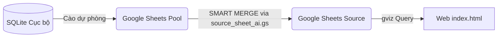

# Database & Data Dictionary (Từ Điển Dữ Liệu Dự Án)

Tài liệu này đóng vai trò là **Source of Truth** chính thức về cơ sở dữ liệu của hệ sinh thái BDS Khang Ngô, mô tả chi tiết vị trí tệp tin, ID tệp, cấu trúc cột, các công thức tính toán và mối liên hệ giữa các bảng.

---

## 1. Bản Đồ Tài Nguyên Dữ Liệu (Data Resources Map)

Hệ thống lưu trữ và đồng bộ dữ liệu trên 3 môi trường chính:

| Tên File / Bảng | Công nghệ | Vị trí / ID | Vai trò |
|---|---|---|---|
| **Google Sheets Pool** | Google Sheets | Tên sheet: `Pool` ID: *(Tra cứu trong credentials.json)* | Kho chứa dữ liệu thô cào về, ảnh gốc, và thông tin cá nhân. |
| **Google Sheets Source** | Google Sheets | Tên sheet: `Source` ID: *(Đồng bộ qua Apps Script)* | Rổ hàng sạch đã curation, dùng để kết xuất dữ liệu cho web. |
| **raw_archive.db** | SQLite | Đường dẫn: `d:\LHTBrain\01_PROJECTS\BDS-KhangNgo\raw_archive.db` | CSDL lưu trữ dự phòng toàn bộ lịch sử cào tin gốc. |

---

## 2. Từ Điển Dữ Liệu Chi Tiết (Data Dictionary — Pool Sheet)

Bảng dưới đây mô tả cấu trúc của bảng **Pool** (Google Sheets) — đây là bảng dữ liệu đầu vào cốt lõi:

| STT | Tên Cột (Header Name) | Column ID | Mô tả & Định dạng | Mối liên hệ / Công thức / Ghi chú |
|---|---|---|---|---|
| 1 | `Mã Hàng` | A (index 0) | ID cào tin gốc | Dùng để chống trùng lặp khi cào tin mới. |
| 4 | `Quận` | D (index 3) | Tên Quận tại TP.HCM | Dùng làm input cho thuật toán sinh **Mã Khang Ngô**. |
| 5 | `Phường` | E (index 4) | Tên Phường mới sáp nhập | Dùng làm input cho thuật toán sinh **Mã Khang Ngô**. |
| 6 | `Đường` | F (index 5) | Tên Đường đã được chuẩn hóa | Được đi qua bộ lọc chuẩn hóa địa chỉ (ví dụ: CMT8 ➔ TTMC). |
| 7 | `Ngõ/Số nhà` | G (index 6) | Số nhà thật sự | Bị ẩn trên public web. Chỉ dùng để AI suy đoán địa lý. |
| 8 | `Phân loại` | H (index 7) | Các từ khóa nổi bật (Tag USP) | Ví dụ: "Lô góc", "Hẻm xe hơi", "Nhà mới đẹp". |
| 11 | `Mô tả chi tiết` | K (index 10) | Mô tả thô từ đầu chủ/môi giới | Nguồn trích xuất thông tin chính cho prompt AI. |
| 14 | `DT Thực tế` | N (index 13) | Diện tích đất thực tế (m2) | Sử dụng làm thông số kỹ thuật cốt lõi. |
| 15 | `DT Trên sổ` | O (index 14) | Diện tích đất công nhận trên sổ | Hiển thị thông số pháp lý trên website. |
| 17 | `Mặt Tiền` | Q (index 16) | Chiều ngang thực tế của nhà (m) | Sử dụng trong prompt AI và hiển thị chi tiết căn nhà. |
| 18 | `Hướng` | R (index 17) | Hướng nhà (Đông Nam, Tây...) | Hiển thị thông số phong thủy. |
| 38 | `Hình Mặt Tiền` | AL (index 37) | URL ảnh chụp mặt tiền nhà | Được lưu trên Cloudinary. **Bảo mật PII bằng Google OAuth2**. |
| 53 | `Mã Khang Ngô (ID)` | BA (index 52) | ID hiển thị công khai | Được sinh tự động bằng hàm băm hoặc logic địa chỉ. |
| 54 | `Tiêu đề Public` | BB (index 53) | Tiêu đề tối ưu SEO sinh bởi AI | AI ghi vào đây sau khi curation. Độ dài < 85 ký tự. |
| 55 | `Mô tả Public` | BC (index 54) | Mô tả 4 đoạn sinh bởi AI | AI ghi vào đây sau khi curation. Tuyệt đối no emoji. |
| 56 | `Giá Public` | BD (index 55) | Giá bán hiển thị công khai (tỷ) | Dữ liệu lọc chính của khách hàng trên website. |
| 57 | `Phân loại Hẻm` | BE (index 56) | Loại hẻm trước nhà | Mặt tiền / Hẻm xe hơi / Hẻm 3 bánh... |
| 58 | `Đường trước nhà (m)`| BF (index 57) | Độ rộng đường trước nhà (m) | Dùng để kiểm tra độ rộng hẻm thực tế. |
| 64 | `Phường cũ (AI)` | BL (index 63) | Tên Phường cũ do AI suy đoán | AI tự động điền để phục vụ tra cứu địa lý lịch sử. |
| 65 | `Phường Custom` | `custom_phuong` | Cột ánh xạ nhanh từ cột thô Phường | Cột thuộc tính tùy biến tự tạo (Dynamic Schema). |
| 66 | `Hướng Custom` | `custom_huong` | Cột ánh xạ nhanh từ cột thô Hướng | Cột thuộc tính tùy biến tự tạo (Dynamic Schema). |

---

## 3. Mối Quan Hệ & Quy Luật Đồng Bộ Dữ Liệu (Data Relationships & Sync Rules)

### Quy luật SMART MERGE (từ Pool sang Source):
*   Script `source_sheet_ai.gs` chạy trigger tự động hoặc thủ công để quét bảng **Pool**.
*   Chỉ các dòng có cột `Duyệt Public` = `TRUE` và `Trạng thái Public` = `Active` mới được phép đồng bộ sang bảng **Source**.
*   **Cơ chế bảo vệ dòng (Zebra style & IMAGE formula):** Khi chèn dòng mới, Apps Script bắt buộc chèn đúng tọa độ để kế thừa định dạng màu xen kẽ zebra, viền bảng và giữ nguyên công thức `=IMAGE(Hình_Mặt_Tiền)`.

---

## 4. Thiết Kế Lưu Trữ Hình Ảnh Lớp Kép (Hybrid Image Caching Design)

Hệ thống Pool2 áp dụng mô hình lưu trữ kép (Hybrid) kết hợp giữa cấu trúc **JSON phẳng (Flattened)** và **Bảng quan hệ SQLite (Relational)** để tối ưu hóa hiệu năng và bảo mật:

### A. Lý do sử dụng cấu trúc kép:
1.  **Cột JSON (`curated_config_json` & `images_metadata_json`)**:
    *   *Mục đích:* Là trường vận chuyển (Transport Field) tối ưu cho Google Sheets và Web Client.
    *   *Lý do:* Giúp lưu trữ toàn bộ thông tin ảnh của một căn nhà (gồm URL, vai trò, thứ tự) gọn gàng trong **đúng 1 ô trên Google Sheets**. Tránh việc tạo một bảng `Images` chứa hàng chục ngàn dòng trên Sheets gây sập quota và giảm tốc độ tải của Web Client.
2.  **Bảng SQLite quan hệ (`listings_images`)**:
    *   *Mục đích:* Phục vụ các công cụ Python local xử lý dữ liệu và thống nhất thiết kế CSDL quan hệ cục bộ.
    *   *Lý do:* Cho phép Python truy vấn tốc độ cao thông qua SQL `JOIN` và `WHERE` để thực hiện các tác vụ local như: tự động xoay ảnh, kiểm toán ảnh lỗi, phân loại ảnh sổ đỏ, và đồng bộ cơ sở dữ liệu liên database mà không cần parse JSON phức tạp.

### B. Nguyên tắc Đồng Bộ Sống Còn:
*   Mọi thao tác thay đổi hình ảnh (thay đổi vai trò, thứ tự, ẩn/hiện) từ Web Curation phải **cập nhật đồng thời** vào cả hai định dạng (JSON trong `listings_v2` / `listings_custom_v2` và dòng quan hệ tương ứng trong `listings_images`).
*   **Logical Delete (Xóa logic):** Khi ẩn/xóa ảnh từ Admin, chỉ cập nhật `role = 'deleted'` hoặc `'hidden'` trong bảng `listings_images` để lưu vết, **không bao giờ xóa vật lý dòng ảnh** nhằm ngăn chặn cơ chế Recrawl kéo ảnh thô cũ về lại từ API đối tác.

---

*Tài liệu này được bảo trì bởi toàn bộ lập trình viên và hệ thống AI trong dự án để đảm bảo tính đồng bộ cao nhất.*
