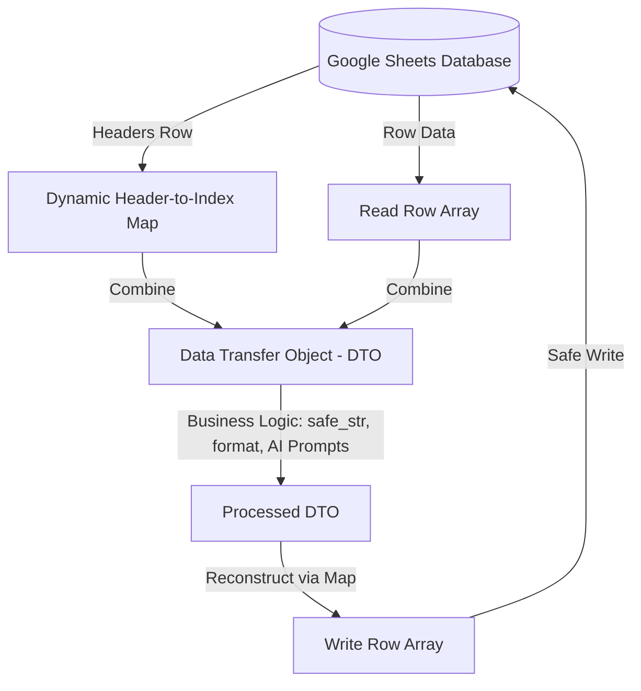

# 🗄️ Hướng Dẫn Kiến Trúc Quản Lý CSDL Google Sheets Cho AI Agent (Dynamic Mapping Architecture)

Tài liệu này định nghĩa các nguyên tắc thiết kế, phương pháp lập trình và luật lệ quản trị cơ sở dữ liệu (Database Governance) khi sử dụng **Google Sheets** làm cơ sở dữ liệu trong các dự án phát triển kết hợp với AI Agent. Mục tiêu tối thượng là **triệt tiêu hoàn toàn lỗi lệch index cột (Column Index Mismatch)** — nguyên nhân hàng đầu gây ra sự mất ổn định và trôi lệch tính năng.

---

## 🚨 1. Nguyên Nhân Sâu Xa Của Sự Mất Ổn Định

Trong các hệ thống lai (Hybrid Systems) sử dụng Google Sheets, lỗi trôi lệch thường phát sinh từ 3 điểm nghẽn kỹ thuật:
1. **Truy xuất chỉ số cứng (Hardcoded Array Indexing):** Cả Backend (Apps Script) và Frontend (JavaScript Client) thường truy xuất dữ liệu dạng `row[38]` hoặc `r.c[5]`. Khi người dùng hoặc Agent chèn thêm, xóa bớt, hoặc kéo thả sắp xếp lại cột trên bảng tính, các chỉ số này lập tức bị lệch, dẫn đến đọc ghi sai dữ liệu hoặc sập hệ thống.
2. **Kiểu dữ liệu hỗn hợp (Mixed Data Type Inference):** Google Visualization API (`gviz`) tự động phỏng đoán kiểu dữ liệu của cột dựa trên các dòng đầu tiên. Nếu một cột chứa dữ liệu hỗn hợp (ví dụ: vừa số `3`, `10` vừa chữ `PN`, `TB`), Google sẽ ép kiểu và trả về `null` cho các dòng chứa kiểu dữ liệu khác, gây crash các hàm xử lý chuỗi.
3. **Sự thiếu đồng bộ giữa tài liệu và code:** Agent cập nhật file tài liệu thiết kế schema nhưng không cập nhật hết tất cả các vị trí hardcoded index trong mã nguồn ở nhiều môi trường khác nhau.

---

## 🛠️ 2. Ba Trụ Cột Giải Pháp Kiến Trúc (Core Pillars)



### 1️⃣ Trụ cột 1: Ánh Xạ Tiêu Đề Động tại Runtime (Dynamic Header Mapping)
**Nguyên tắc vàng:** Tuyệt đối không hardcode bất kỳ chỉ số index cột nào trong code. Toàn bộ chỉ số cột phải được phân giải tự động từ dòng tiêu đề (Header Row - Dòng 1) của Google Sheets tại runtime.

#### A. Apps Script (Backend) Implementation
Xây dựng lớp Helper quản lý Sheet có khả năng tự động mapping:

```javascript
/**
 * Lớp wrapper cho Google Sheets để quản lý truy xuất động
 */
class SafeSheetHelper {
  constructor(sheetName) {
    this.sheet = SpreadsheetApp.getActiveSpreadsheet().getSheetByName(sheetName);
    if (!this.sheet) throw new Error("Không tìm thấy sheet: " + sheetName);
    
    // Tải và chuẩn hóa headers
    this.headers = this.sheet.getRange(1, 1, 1, this.sheet.getLastColumn()).getValues()[0]
                             .map(h => String(h).trim());
    
    // Tạo bản đồ ánh xạ Header -> Index (0-based)
    this.colMap = {};
    this.headers.forEach((header, index) => {
      this.colMap[header] = index;
    });
  }

  getColIndex(headerName) {
    if (this.colMap[headerName] === undefined) {
      throw new Error(`Lỗi: Cột '${headerName}' không tồn tại trong schema của sheet!`);
    }
    return this.colMap[headerName] + 1; // 1-based index dùng cho getRange()
  }

  getRowObject(rowNum) {
    const values = this.sheet.getRange(rowNum, 1, 1, this.headers.length).getValues()[0];
    const obj = {};
    this.headers.forEach((header, idx) => {
      obj[header] = values[idx];
    });
    return obj;
  }

  writeRowObject(rowNum, obj) {
    const rowData = this.headers.map(header => obj[header] !== undefined ? obj[header] : "");
    this.sheet.getRange(rowNum, 1, 1, rowData.length).setValues([rowData]);
  }
}
```

#### B. JavaScript (Frontend Client) Implementation
Khi lấy dữ liệu qua Google Visualization API (`gviz`), thay vì đọc `r.c[5]`, frontend phải sử dụng thuộc tính `label` được Google trả về trong cấu trúc Schema JSON để map động thành Object:

```javascript
/**
 * Chuyển đổi dữ liệu thô từ gviz thành mảng các Object có khóa là tiêu đề cột
 */
function parseGvizResponse(gvizJson) {
  if (!gvizJson || !gvizJson.table) return [];
  
  // Trích xuất labels của cột (Ưu tiên label đặt trên Sheet, nếu trống dùng ID cột A, B, C)
  const colLabels = gvizJson.table.cols.map(col => (col.label && col.label.trim() !== "") ? col.label.trim() : col.id);
  
  return gvizJson.table.rows.map(row => {
    const item = {};
    colLabels.forEach((label, idx) => {
      const cell = row.c[idx];
      item[label] = cell ? cell.v : null;
    });
    return item;
  });
}
```

---

## 2️⃣ Trụ cột 2: Cô Lập Ranh Giới Dữ Liệu (Data Boundary Isolation) & DTO (Data Transfer Object)

### A. DTO là gì trong ngữ cảnh Google Sheets?
**DTO (Data Transfer Object)** là một đối tượng chứa dữ liệu được gán nhãn khóa chuỗi (Key-Value) rõ ràng thay vì là một danh sách thô (Array/Mảng).
*   *Mảng thô (Array) cũ:* `["Q3", "Trần Hưng Đạo", 3, 8.5]` ➔ Code bắt buộc phải ghi nhớ index cố định: `row[0]` là Quận, `row[1]` là Đường. Nếu ai đó chèn thêm cột, index sẽ bị lệch và sinh lỗi nghiêm trọng.
*   *DTO (Object) mới:*
    ```json
    {
      "Quận": "Q3",
      "Đường": "Trần Hưng Đạo",
      "Số Tầng": 3,
      "Giá Public": 8.5
    }
    ```
    ➔ Thứ tự cột không còn quan trọng. Ta gọi `dto["Đường"]` luôn ra `"Trần Hưng Đạo"` dù cột này nằm ở bất cứ vị trí nào trên Google Sheets.

### B. Ẩn dụ về cách vận hành của Cửa khẩu dữ liệu (Boundary Isolation)
Hãy tưởng tượng **Google Sheets** là một **Tàu chở hàng** (hàng xếp theo ngăn cố định A, B, C, D...). Còn **Logic nghiệp vụ** của AI Agent là **Nhà kho xử lý**.
Để tránh việc Nhà kho bị loạn khi Tàu đổi cách sắp xếp ngăn, LAAF v1.1 thiết lập **Cửa khẩu kiểm soát (Boundary)** ở hai đầu:

```
[ Google Sheet ] (Chỉ biết Array: Cột A, B, C...)
      │
      ▼  (BƯỚC 1: NHẬP KHẨU - Chuyển Array thành DTO bằng Header Map)
=================== CỬA KHẨU VÀO (Boundary In) ===================
      │
      ▼  (BƯỚC 2: TRONG NHÀ KHO - Logic xử lý chỉ dùng DTO)
[ Logic xử lý của Agent / Server / UI ] (Chỉ gọi tên nhãn: dto["Giá Public"])
      │
      ▼  (BƯỚC 3: XUẤT KHẨU - Chuyển DTO thành Array khớp với Sheet)
=================== CỬA KHẨU RA (Boundary Out) ===================
      │
      ▼
[ Google Sheet ] (Chỉ ghi dạng Array: Cột A, B, C...)
```

1.  **Nhập khẩu (Boundary In):** Khi đọc dữ liệu từ Sheet, lập tức chuyển đổi mảng thô thành DTO thông qua Header Map. Bản sao mảng thô bị hủy bỏ ngay lập tức.
2.  **Trong Nhà Kho (Business Logic):** Tất cả các tác vụ như gửi prompt cho AI, chuẩn hóa địa chỉ, lọc PII chỉ được phép tương tác với DTO thông qua khóa chuỗi (ví dụ: `dto["Giá Public"]`). Tuyệt đối không chạm vào mảng hoặc index.
3.  **Xuất khẩu (Boundary Out):** Chỉ khi ghi dữ liệu ngược lại Sheet, DTO mới được dịch ngược lại thành một mảng thô thông qua việc đối chiếu vị trí cột tại runtime để ghi xuống an toàn.

### C. Minh họa bằng Code (So sánh Trước vs Sau)

#### ❌ Cách làm cũ (Dễ lỗi khi lệch cột):
```javascript
// Đọc dòng 5 (giả định cột Giá Public đang ở cột thứ 9 - Cột I)
var rowData = sheet.getRange(5, 1, 1, sheet.getLastColumn()).getValues()[0];
var currentPrice = rowData[8]; // index 8

// Tăng giá 10%
var newPrice = currentPrice * 1.1;

// Ghi đè lại cột thứ 9
sheet.getRange(5, 9).setValue(newPrice);
```
*Lỗi:* Nếu chèn thêm 1 cột vào trước cột Giá Public, nó bị đẩy sang cột 10. Code trên sẽ đọc nhầm dữ liệu cột khác, đồng thời `.setValue()` ở cột 9 sẽ ghi đè phá nát cột dữ liệu kế bên.

#### Cách làm mới (Tuyệt đối an toàn):
```javascript
// Khởi tạo Helper (Tự động nạp Header Map tại runtime)
var safeSheet = new SafeSheetHelper("Pool");

// 1. NHẬP KHẨU (Array -> DTO)
var dto = safeSheet.getRowObject(5); 

// 2. TRONG NHÀ KHO (Xử lý an toàn bằng DTO)
dto["Giá Public"] = parseFloat(dto["Giá Public"]) * 1.1;
dto["Tiêu đề Public"] = "Siêu phẩm đường " + dto["Đường"];

// 3. XUẤT KHẨU (DTO -> Array & ghi xuống Sheet)
safeSheet.writeRowObject(5, dto); 
```

---

## 3️⃣ Trụ cột 3: Quản Trị Thay Đổi Quy Củ (Schema Governance Rules)
Nếu AI Agent hoặc Lập trình viên muốn thêm một cột mới vào Google Sheets:
1. **Bước 1: Khai báo Schema:** Cập nhật tài liệu [docs/pool_sheet_schema.md](file:///d:/LHTBrain/01_PROJECTS/BDS-KhangNgo/docs/pool_sheet_schema.md) và [docs/data_dictionary.md](file:///d:/LHTBrain/01_PROJECTS/BDS-KhangNgo/docs/data_dictionary.md), xác định chính xác tên Header.
2. **Bước 2: Viết/Cập nhật code:** Sử dụng các khóa chuỗi động (ví dụ: `obj["Tên Cột Mới"]`). Tuyệt đối không thay đổi bất kỳ chỉ số index số học nào trong code.
3. **Bước 3: Chạy Unit Test:** Kiểm thử tự động đảm bảo cột mới không gây ra hiện tượng mixed-type hoặc crash khi nhận giá trị rỗng/Null.

---

## 🧪 3. Quy Tắc Phòng Vệ Đặc Thù Cho AI Agent (Rules for Agents)

AI Agent khi thực hiện lập trình hoặc sửa đổi mã nguồn liên quan đến Google Sheets bắt buộc phải tuân thủ nghiêm ngặt các điều khoản sau:

1. 🚫 **CẤM TUYỆT ĐỐI** viết hoặc chỉnh sửa code chứa các chỉ số index cứng dạng số học (ví dụ: `rowData[38]`, `row.c[5]`). Mọi index phải được thay thế bằng phương pháp gọi hàm map động `getIdx("Tên Cột")` hoặc `colMap["Tên Cột"]`.
2. 🛡️ **Kháng lỗi dữ liệu hỗn hợp (gviz Mixed-Type bug):** Khi đọc dữ liệu từ frontend, luôn thiết kế logic fallback dự phòng. Nếu một cột quan trọng bị Google trả về giá trị `null` do phỏng đoán sai kiểu dữ liệu, hệ thống phải tự động truy quét thô từ các cột Text bao quát khác (ví dụ: trích xuất Tên Quận từ cột tiêu đề hoặc cột mô tả chi tiết).
3. 🧪 **Kiểm thử phá hủy dữ liệu (Chaos/Mutation Test):** Khi thiết kế bộ test cho CSDL, AI phải giả lập các ca kiểm thử cực đoan:
    *   Trật tự cột trên Google Sheet bị xáo trộn ngẫu nhiên.
    *   Các cột không bắt buộc bị trả về giá trị `None` (NULL) hoặc chuỗi rỗng `""`.
    *   Dữ liệu nhập vào vượt quá độ dài quy định.
    Bộ test phải chứng minh hệ thống vẫn hoạt động đúng 100% trong các kịch bản trên.
