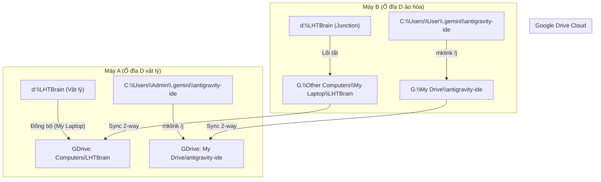

# US-038: Đồng bộ Cơ sở Dữ liệu Dự án & Bộ não AI (Memory) đa thiết bị qua Cloud Junction

## User story
**As an** Admin / Nhà phát triển dự án Khang Ngô BĐS
**I want** tự động đồng bộ hóa toàn bộ thư mục mã nguồn vật lý và bộ não AI (gemini/antigravity-ide) giữa Máy A và Máy B thông qua liên kết Junction của Google Drive
**So that** tôi có thể ngồi ở bất kỳ máy tính nào làm việc cũng đều có dữ liệu cào tin mới nhất, code chạy trực tiếp trên SSD không bị lag, và AI giữ nguyên vẹn lịch sử chat/bối cảnh liền mạch xuyên suốt mà không cần nén zip chép tay thủ công.

## Acceptance
- [x] Thiết lập đồng bộ hóa 2 chiều thời gian thực cho thư mục code vật lý `D:\LHTBrain` thông qua Google Drive Desktop ở chế độ "My Laptop" mà không thay đổi vị trí lưu trữ vật lý hay tạo độ trễ ổ đĩa ảo.
- [x] Thiết lập đồng bộ hóa tự động 2 chiều cho thư mục bộ não AI (`C:\Users\<Tên_User>\.gemini\antigravity-ide`) thông qua Google Drive và cơ chế liên kết ngược Junction Link để thống nhất lịch sử chat.
- [x] Đảm bảo cấu trúc đường dẫn tuyệt đối `D:\LHTBrain` được bảo toàn 100% trên cả 2 máy để toàn bộ liên kết nội bộ trong Stories Index hoạt động trơn tru.
- [x] Rút ra các nguyên tắc đóng app an toàn chống xung đột file ghi SQLite (`raw_archive.db`) khi luồng cào đang chạy chiếm dụng tài nguyên.

## Solution

> [note]- Configuration
> Đồng bộ Google Drive Desktop (Stream mode mặc định có ổ ảo G:)
> - **Máy A (Máy chính):**
>   - Thư mục code vật lý: `D:\LHTBrain` (Backup trực tiếp qua "My Laptop" Google Drive).
>   - Thư mục bộ não AI vật lý di chuyển sang: `G:\My Drive\antigravity-ide` (Bật Offline access).
> - **Máy B (Máy phụ):**
>   - Thư mục ảo hóa `D:\LHTBrain` trỏ sang: `G:\Other Computers\My Laptop\LHTBrain` (Bật Offline access).
>   - Thư mục bộ não AI ảo hóa trỏ sang: `G:\My Drive\antigravity-ide`.

> [note]- Key logic
> 1. **Cơ chế Junction Link chéo hệ thống:**
>    * Sử dụng lệnh `mklink /j` trên NTFS ổ đĩa cục bộ của Máy B trỏ sang thư mục ảo Google Drive `G:` để đánh lừa Windows nhận diện ổ đĩa `D:\LHTBrain` vật lý hoạt động bình thường, trong khi toàn bộ hoạt động ghi tệp tin được Google Drive đồng bộ 2 chiều tức thì.
>    * Áp dụng tương tự cho thư mục `antigravity-ide` để AI chia sẻ chung tập tin lịch sử `transcript.jsonl` thời gian thực.
> 2. **Nguyên tắc an toàn SQLite (`raw_archive.db`):**
>    * SQLite là cơ sở dữ liệu dạng file đơn lẻ. Khi Flask Server hoặc `KhangNgoCurator.exe` đang chạy, tệp database bị khóa độc quyền (exclusive lock).
>    * **Rule bắt buộc:** Phải tắt hoàn toàn phần mềm Curator trên Máy A trước khi mở và làm việc trên Máy B để giải phóng khóa tệp, cho phép Google Drive tải bản cập nhật database mới nhất lên mây và đẩy xuống Máy B an toàn.

## Verification Plan

### Manual Verification
1. Mở cmd dưới quyền Administrator trên Máy B, chạy lệnh liên kết:
   `mklink /j "D:\LHTBrain" "G:\Other Computers\My Laptop\LHTBrain"`
   Xác nhận thư mục `D:\LHTBrain` mở ra mượt mà và hiển thị đầy đủ code vật lý của Máy A.
2. Sửa thử một dòng tài liệu tại Máy A, lưu lại, chờ biểu tượng Drive báo xanh, sang Máy B kiểm tra thấy tài liệu đã tự động cập nhật lập tức.
3. Liên kết thành công bộ não `antigravity-ide` trên cả 2 máy. Chat thử 1 câu trên Máy A, lưu lại, sang Máy B mở IDE thấy câu chat hiển thị mượt mà trên khung lịch sử của Máy B.

## Files touched
- `C:\Users\<Name>\.gemini\antigravity-ide` — Thư mục bộ não AI và lịch sử chat (Synchronized).
- `D:\LHTBrain` — Thư mục workspace dự án (Synchronized).
