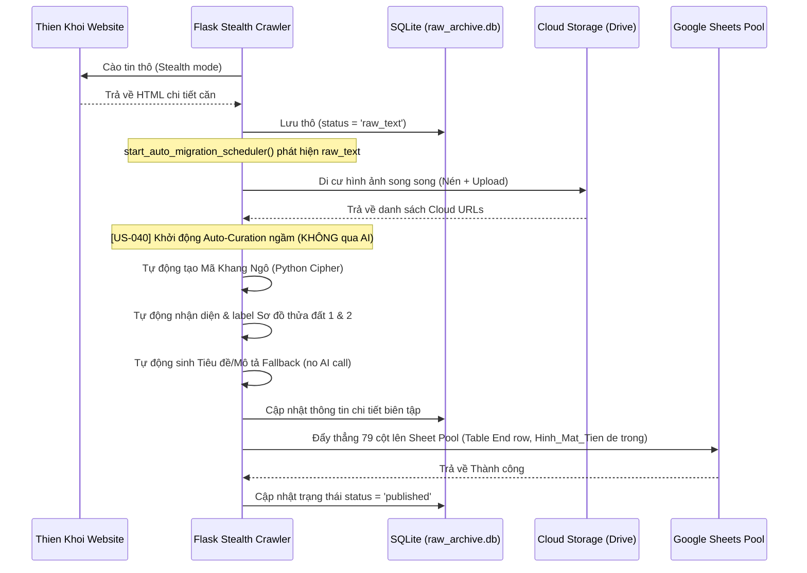

# US-040: Tự động hóa Luồng Curation & Dán nhãn Sơ đồ khi Cào tin đẩy thẳng về Pool (Tự động di cư đẩy Pool không qua AI Curation)

## User story
**As a** Admin (Khang Ngô / Trang)  
**I want** luồng xử lý cào tin ngầm tự động chạy hoàn toàn: Di cư hình ảnh $\rightarrow$ Tự động sinh Mã Khang Ngô $\rightarrow$ Tự động nhận diện & dán nhãn ảnh Sơ đồ đất $\rightarrow$ Tự động sinh nội dung Fallback $\rightarrow$ Đẩy thẳng 79 cột hoàn chỉnh lên Google Sheets **Pool** (KHÔNG gọi OpenAI ở bước cào ngầm để tiết kiệm chi phí)  
**So that** Tôi không cần biên tập hay nhấp nút thủ công trên CuratorApp. Mọi hoạt động biên tập hình ảnh (chọn ảnh Mặt Tiền bảo mật vs Ảnh Bìa public) và gọi OpenAI biên dịch nội dung chuẩn SEO sẽ được thực hiện trực quan và an toàn trên Web Admin Dashboard (`index.html`).

---

## Acceptance
- [x] **AC 1: Luồng xử lý Curation tự động không qua OpenAI ở Backend (Flask Scheduler):**
  - Ngay sau khi luồng di cư hình ảnh song song (`run_image_migration_thread`) hoàn tất tải và upload ảnh cho một căn (status = `raw_text`), hệ thống tự động kích hoạt Curation tự động.
  - **Tiết kiệm API:** Không gọi OpenAI API (gpt-4o-mini). Thay vào đó, tự động sinh nội dung tiêu đề và mô tả cơ bản bằng hàm `generate_fallback_content_python(d)`.
  - Tự động tạo `Ma_Khang_Ngo_ID` bằng thuật toán Cipher (Số -> Chữ, Reverse đường, chèn W vị trí 2) viết bằng Python đồng nhất 100% với JS.
- [x] **AC 2: Tự động nhận diện & dán nhãn ảnh Sơ đồ thửa đất (Diagram Auto-Labeling):**
  - Trích xuất ảnh Sơ đồ thửa đất ban đầu được bóc tách từ `#lightgalleryTD li` (từ Thiên Khôi).
  - Tự động map và cập nhật link Cloud/Drive sạch đã di cư tương ứng vào cột `So_do_thua_dat_1` và `So_do_thua_dat_2` trong SQLite.
- [x] **AC 3: Đẩy thẳng lên Google Sheets Pool (Direct Pool Push):**
  - Sau khi hoàn thành các bước trên, luồng ngầm tự động gọi API đẩy trực tiếp dòng dữ liệu 79 cột hoàn chỉnh lên sheet **Pool** trên Google Drive.
  - **Bảo mật ảnh Mặt Tiền:** Cột 29 `Hình Mặt Tiền` trên Pool được để trống hoàn toàn để con người tự chọn ở Web sau.
  - Cập nhật trạng thái của căn nhà trong SQLite cục bộ thành `published` (nếu đẩy thành công) kèm mốc thời gian `Last_Sync`, hoặc giữ `raw_complete` nếu đẩy thất bại để người dùng có thể bấm xuất bản thủ công sau.
- [x] **AC 4: Phân tách rõ ràng Ảnh Mặt Tiền (Bảo mật) & Ảnh Bìa (Public) trên Web Admin:**
  - **Ảnh Mặt Tiền (Bí mật - Môi giới nhìn để nhớ căn):** Lưu vào cột `Hình Mặt Tiền` (Cột AM - index 38 trên Sheet Source). Chỉ hiển thị cho Admin thấy, hoàn toàn bí mật với khách hàng.
  - **Ảnh Nền (Public - Đẹp nhất, làm ảnh bìa):** Lưu vào cột `Ảnh 1` (Cột U - index 20 trên Sheet Source). Hiển thị làm ảnh đại diện trên trang danh sách cho khách hàng xem.
  - **Image Editor Widget trên Web (`index.html`):**
    - Cung cấp nút **`🔒 Mặt Tiền` / `Làm Mặt Tiền`** (nền đỏ/hồng) trên mỗi thẻ ảnh để gán làm Ảnh Mặt Tiền bảo mật (lưu vào `#editCoverImgUrl`).
    - Cung cấp nút **`⭐ Ảnh Nền` / `Làm Nền`** (nền vàng gold) trên mỗi thẻ ảnh để gán làm Ảnh Nền công khai cho khách hàng (lưu vào `#editPublicCoverUrl`).
    - Khi tích chọn ảnh làm Ảnh Nền public, hệ thống tự động tích chọn checkbox "Hiện" (public) cho hình ảnh đó.
  - **Ghi Sheet Source (`saveNewListingFromPool` & `saveSourceChanges`):**
    - Ghi đúng giá trị Ảnh Mặt Tiền bảo mật được chọn (`coverImgUrl`) vào cột index 38 (`Hình Mặt Tiền` - Cột AM).
    - Ghi đúng giá trị Ảnh Nền public được chọn (`publicCoverUrl`) vào cột index 20 (`Ảnh 1` - Cột U) của mảng `publicRowData` ghi xuống Sheet Source.

---

## Solution

### 1. Kiến trúc luồng tự động (Stealth Cào $\rightarrow$ Drive Di Cư $\rightarrow$ Fallback Curation $\rightarrow$ Auto-Sheets Pool)

### 2. Mô tả các hàm logic mới (Key logic)
* **Hàm Python tạo Mã Khang Ngô (`gen_id_khang_ngo`):**
  Port thuật toán từ Javascript sang Python đồng nhất 100%:
  - Tách số nhà trước dấu `+`.
  - Thay số theo `digitMap = {'1':'M','2':'H','3':'B','4':'A','5':'N','6':'S','7':'Z','8':'T','9':'C','0':'O','/':'I','.':'I'}`.
  - Normalization đường: `cách mạng tháng (tám|8)|cmt8` -> `CMTT`; `3/2` -> `BTH`; `đường số (\d+)` -> `DS\1`.
  - Abbreviate: Viết tắt lấy chữ cái đầu của mỗi từ sau khi bỏ dấu.
  - Reverse tên đường viết tắt.
  - Ghép: `maSoNha + 'I' + reversedDuong`.
  - Chèn `'W'` vào vị trí thứ 2.
* **Tự động nhận diện & dán nhãn sơ đồ ở Backend:**
  - Khi Thiên Khôi bóc tách được danh sách ảnh gốc, ảnh nào nằm trong thẻ `#lightgalleryTD li` (Sơ đồ thửa đất) sẽ được đánh dấu.
  - Sau khi di cư ảnh Drive thành công, ta so khớp index ảnh gốc này để lấy link Drive tương ứng, gán thẳng vào cột `So_do_thua_dat_1` và `So_do_thua_dat_2` trong database SQLite và 79 cột gửi Sheets.
* **Web Admin Image Selector Widget (`index.html`):**
  - Bổ sung trường input ẩn `#editPublicCoverUrl` trên giao diện biên tập.
  - Widget ảnh hiển thị thêm hai phím chức năng độc lập trên mỗi thumbnail ảnh: `🔒 Mặt Tiền` (đỏ/hồng) và `⭐ Ảnh Nền` (vàng).
  - Bấm `🔒 Mặt Tiền` -> gán URL vào `#editCoverImgUrl` (Cột AM - index 38).
  - Bấm `⭐ Ảnh Nền` -> gán URL vào `#editPublicCoverUrl` (Cột U - index 20) + Tự động tick hiện ảnh đó.

---

## 📋 Implementation Plan

### Giai đoạn 1: Backend Python (`curator_server.py`)
1. **Viết hàm `gen_id_khang_ngo(so_nha, duong, quan)` bằng Python** đồng nhất với JS.
2. **Nâng cấp `generate_fallback_content_python`:** Sinh dữ liệu `tieu_de_public`, `mo_ta_public`, và `phuong_cu` (trống) mặc định.
3. **Nâng cấp Tiến trình Di cư Ảnh (`run_image_migration_thread`):**
   - Sau khi hoàn thành di cư Drive, kiểm tra xem căn nhà có status là `raw_text` không.
   - Nếu có, chạy luồng Auto-Curation ngầm:
     - Tạo Mã Khang Ngô.
     - Auto-label Sơ đồ đất 1 & 2.
     - Tạo thông tin fallback.
     - Lưu cơ sở dữ liệu SQLite cục bộ.
     - Bấm đẩy trực tiếp lên Google Sheets Pool (gọi hàm backend tương tự `publish_listing_to_sheets`).
     - Cập nhật SQLite status sang `published` (hoặc `raw_complete` nếu đẩy sheet thất bại).

### Giai đoạn 2: Web Admin Frontend (`index.html`)
1. **Thiết kế Image Editor Widget:** Thêm nút chọn bảo mật Mặt Tiền và Ảnh Nền public.
2. **Cập nhật lưu trữ:** Sửa đổi `saveNewListingFromPool` và `saveSourceChanges` để trích xuất đúng 2 biến ảnh và chèn vào mảng Row Data (Index 38 và Index 20) gửi lên Google Sheets Source.

---

## 📝 Task Checklist (TODO)
- [ ] Xây dựng thuật toán `gen_id_khang_ngo` bằng Python trong `curator_server.py`.
- [ ] Viết hàm `auto_curate_and_publish_listing_backend(listing_id)` chạy ngầm tự động hóa di cư xong đẩy Pool.
- [ ] Liên kết `auto_curate_and_publish_listing_backend` vào cuối tiến trình di cư ảnh song song trong `curator_server.py`.
- [ ] Chỉnh sửa giao diện Image Editor Widget trong `index.html` tích hợp 2 nút chọn bìa độc lập.
- [ ] Cập nhật hàm `saveNewListingFromPool` và `saveSourceChanges` trong `index.html` xử lý chính xác 2 cột ảnh bìa index 38 và index 20.
- [ ] Chạy thử nghiệm thực tế từ khâu cào tin đến khi tin tự động xuất hiện trên Google Sheets Pool không lỗi.
- [ ] Đóng gói lại file chạy độc lập `KhangNgoCuratorApp.exe` mới.

---

## Verification Plan

### Automated Tests
- Khởi chạy Flask server, cào tin 1 căn từ Thiên Khôi.
- Xác nhận sau khi terminal thông báo di cư ảnh xong, hệ thống chạy luồng Auto-Curation ngầm không gọi OpenAI, tạo đúng Mã Khang Ngô, dán đúng link Sơ đồ đất Drive và tự động đẩy thẳng lên Google Sheets Pool (status cục bộ đổi thành `published`).

### Manual Verification
- Mở Web Admin Dashboard `index.html` kết nối Pool.
- Tìm căn nhà vừa đẩy lên, mở modal biên tập hình ảnh.
- Bấm chọn "Làm Mặt Tiền" và "Làm Nền" trên hai ảnh khác nhau.
- Bấm "Lên sóng & Lưu" -> Mở Google Sheets Source, xác minh cột AM (index 38) chứa ảnh Mặt Tiền bảo mật và cột U (index 20) chứa đúng ảnh Nền public.

---

## Files touched
- [curator_server.py](file:///d:/LHTBrain/01_PROJECTS/BDS-KhangNgo/curator_server.py)
- [index.html](file:///d:/LHTBrain/01_PROJECTS/BDS-KhangNgo/index.html)

---

## 🔄 Change Requests (Yêu cầu Thay đổi)
* **Date:** 2026-05-29  
* **Requested by:** PO / Khang Ngô  
* **Old Requirement:** Tiến trình chạy ngầm gọi OpenAI (`gpt-4o-mini`) sinh Tiêu đề/Mô tả Public trước khi tự động đẩy lên Google Sheets Pool.  
* **New Requirement:** Để tiết kiệm chi phí và tăng tốc độ xử lý ngầm, **KHÔNG gọi OpenAI ở tiến trình cào và đẩy Pool**. Sử dụng hoàn toàn hàm sinh nội dung mặc định (fallback generator), tự động sinh Mã Khang Ngô và dán nhãn sơ đồ đất. Mọi công việc biên tập ảnh bìa bảo mật Mặt Tiền/Public, gọi OpenAI dịch tin bài sẽ dồn lên giao diện Web Admin Dashboard (`index.html`) để con người thực hiện trực quan và chủ động.  
* **Impact:** Tối ưu hóa cực lớn tốc độ cào thô và xử lý ngầm ở máy chủ cục bộ (zero API cost khi cào tin). Tăng cường trải nghiệm biên tập hình ảnh phân tách rõ ràng trên Web Admin.
