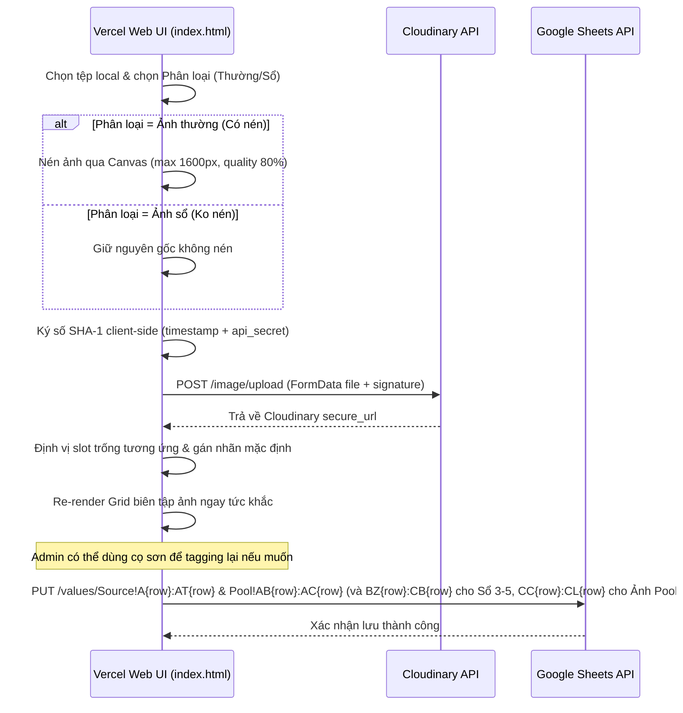

# US-053: Admin tự upload hình ảnh local cho căn nhà, tùy chọn nén & phân loại ảnh sổ/ảnh thường, tagging lại và nâng cấp schema hình ảnh

## User story
**As a** Admin / Người môi giới (Mr. Khang Ngô)
**I want** tự tay upload các hình ảnh thực tế từ máy tính (local images) trực tiếp từ giao diện Admin của Vercel Web, có tùy chọn phân loại khi upload là **Ảnh thường (Có nén)** hoặc **Ảnh sổ (Ko nén)**, tự động đẩy lên Cloudinary CDN, và có thể tagging lại sau đó.
**So that** tôi có thể chủ động làm giàu hình ảnh rổ hàng của mình với các hình chụp thực tế khi đi khảo sát nhà (lưu tối đa 25 ảnh ở Pool và hiển thị tối đa 15 ảnh công khai ở Source mà không lo lệch cột) mà không phụ thuộc hoàn toàn vào ảnh cào hay cấu hình Drive phức tạp, nâng cao tốc độ tải ảnh từ Cloudinary CDN và độ tin cậy của tin bài gửi khách.

## Acceptance
- [x] Giao diện Biên tập Curation Modal (trên Vercel Web Admin View - `index.html`) bổ sung thêm khu vực Tải hình ảnh cục bộ (Local Image Uploader) bóng bẩy theo phong cách gold-glassmorphism.
- [x] Khu vực uploader cung cấp bộ chọn phân loại dạng dropdown/radio:
  - **Ảnh thường (Có nén):** Tự động chạy canvas nén trên client-side (tối đa 1600x1600px, định dạng JPEG chất lượng 80%). Sau khi upload, tự động điền vào slot trống của Ảnh nội thất/Hẻm và mặc định bật hiển thị công khai (Public).
  - **Ảnh sổ (Ko nén):** Bỏ qua hoàn toàn cơ chế nén, giữ nguyên dung lượng/kích thước gốc của file. Sau khi upload, tự động điền vào slot trống của Sơ đồ thửa đất (Sổ 1 - Sổ 5) và mặc định tắt hiển thị công khai (Private).
- [x] Nút bấm kích hoạt upload hiển thị text: **`UP ẢNH`**.
- [x] Việc upload hình ảnh được thực hiện hoàn toàn ở client-side trực tiếp lên **Cloudinary CDN** sử dụng Signed REST API và mã hóa SHA-1 tích hợp sẵn trong trình duyệt (Web Crypto API) với bộ credential mặc định (`deru9p712`).
- [x] Cho phép chọn và upload nhiều file ảnh đồng thời, xử lý xếp hàng (queue) tải lên tuần tự hiển thị loader tiến độ trực quan dạng `Đang tải: N/M`.
- [x] Cung cấp khả năng **tagging lại**: Ảnh sau khi tải lên thành công và hiển thị trên Image Editor Grid có thể được Admin sử dụng bộ cọ sơn có sẵn (Mặt tiền, Nền, Sổ, Bỏ All) click vào để đổi nhãn, gán vai trò khác bình thường.
- [x] Mở rộng schema hình ảnh an toàn chống Column-Shift Bug ở đáy của cả hai bảng tính:
  - **Tab Pool:** Hỗ trợ tối đa **25 ảnh nội thất** (15 ảnh cũ index 40-54 và 10 ảnh mới ở đáy index 80-89).
  - **Tab Source:** Hỗ trợ tối đa **15 ảnh công khai** (10 ảnh cũ index 20-29 và 5 ảnh mới ở đáy index 41-45).
- [x] Khi click Lưu (hoặc Lên sóng), các liên kết ảnh mới được đồng bộ ghi nhận chính xác lên Google Sheets tương ứng (bao gồm cả Sổ 3-5).

## Solution

### 1. Phân loại & Nén ảnh phía Client-side
Sử dụng HTML5 `<canvas>` để nén ảnh trực tiếp trên trình duyệt nếu chọn "Ảnh thường (Có nén)":
- Đọc file dưới dạng DataURL qua `FileReader`.
- Vẽ lên canvas với giới hạn kích thước tối đa 1600px (giữ nguyên tỷ lệ).
- Xuất ra Blob định dạng `image/jpeg` chất lượng 0.8.
- Đối với "Ảnh sổ (Ko nén)", bỏ qua bước canvas, lấy trực tiếp đối tượng `File` thô để upload.

### 2. Cloudinary Signed Upload Client-side
Tận dụng các biến cấu hình Cloudinary mặc định từ hệ thống:
- `cloud_name`: `"deru9p712"`
- `api_key`: `"127963624723617"`
- `api_secret`: `"5WyIQlmssDMR4Cu69g4114py6HU"`
- `folder`: `"BDS-KhangNgo"`

**Quy trình ký và tải lên:**
- Lấy `timestamp` hiện tại tính bằng giây.
- Sắp xếp Alphabet tham số cần ký: `folder=BDS-KhangNgo&timestamp={timestamp}`
- Ghép `api_secret` vào cuối: `folder=BDS-KhangNgo&timestamp={timestamp}{api_secret}`
- Tạo mã SHA-1 signature bằng trình duyệt Web Crypto API:
  ```javascript
  async function sha1(string) {
    const utf8 = new TextEncoder().encode(string);
    const hashBuffer = await crypto.subtle.digest('SHA-1', utf8);
    const hashArray = Array.from(new Uint8Array(hashBuffer));
    return hashArray.map(b => b.toString(16).padStart(2, '0')).join('');
  }
  ```
- Đóng gói dữ liệu bằng `FormData` và gửi `POST` lên `https://api.cloudinary.com/v1_1/{cloud_name}/image/upload`.
- Nhận về URL ảnh an toàn (`secure_url`).

### 3. Cấu trúc Schema Mở rộng (An toàn tuyệt đối)
*   **Pool Sheet:** `Ảnh 16` đến `Ảnh 25` nằm tại cột `CC` đến `CL` (Index 80 đến 89), sau dải Sổ 3-5.
*   **Source Sheet:** `Ảnh 11` đến `Ảnh 15` nằm tại cột `AP` đến `AT` (Index 41 đến 45), sau cột `Đăng BDS`.

### 4. Sơ đồ tuần tự tương tác (Mermaid)



## 📋 Implementation Plan
1. **Khai báo biến active listing toàn cục:** Gán `window.activeCurationListing = p;` trong `openS` và `openPoolS`.
2. **Tích hợp các input ẩn cho Sổ 3, 4, 5:**
   Thêm `<input type="hidden" id="editSodo3Url">`, `#editSodo4Url`, `#editSodo5Url` vào container ẩn trong modal.
3. **Thêm UI Uploader trong `renderImageEditorWidget(p)`:**
   Chèn panel glassmorphism gồm dropdown chọn phân loại ảnh, file input ẩn, nút UP ẢNH và loader tiến độ nằm ngay trên thanh toolbar cọ sơn.
4. **Viết các hàm logic upload & nén:**
   - `sha1(str)`: Sử dụng Web Crypto API.
   - `compressImageClientSide(file)`: Canvas compression logic.
   - `uploadFileToCloudinary(file)`: Gửi POST lên Cloudinary với payload và signature.
   - `handleLocalImageUpload(event)`: Điều phối nén, upload tuần tự, gán vào slot trống tương ứng của `p`, update hidden inputs và gọi render lại grid.
5. **Cập nhật Logic Lưu dữ liệu (`saveSourceChanges` & `saveNewListingFromPool`):**
   - Đọc các giá trị `#editSodo3Url` đến `#editSodo5Url`.
   - Bổ sung request PUT lưu Sổ 3-5 lên dải cột `Pool!BZ{row}:CB{row}`.
   - Ghi nhận tối đa 15 ảnh public sang Source (10 ảnh ở index 20-29, 5 ảnh ở index 41-45).
   - Ghi nhận tối đa 25 ảnh nội thất sang Pool (15 ảnh ở index 40-54, 10 ảnh ở index 80-89).

## 📝 Task Checklist (TODO)
- [x] **Thiết kế & Khảo sát:**
  - [x] Khảo sát cơ chế Google Drive URL mapping trong `index.html`.
  - [x] Định vị container UI uploader thích hợp trong `renderImageEditorWidget`.
- [x] **Triển khai Code:**
  - [x] Khai báo `window.activeCurationListing = p;` trong `openS` và `openPoolS`.
  - [x] Thêm các hidden inputs `#editSodo3Url` đến `#editSodo5Url` trong modal.
  - [x] Viết các helper `compressImageClientSide`, `sha1`, `uploadFileToCloudinary`.
  - [x] Thiết kế UI panel Local Image Uploader trong `renderImageEditorWidget` dạng gold-glassmorphism.
  - [x] Viết hàm `handleLocalImageUpload` xử lý phân loại, nén/không nén, tìm slot trống và re-render grid.
  - [x] Cập nhật logic `saveSourceChanges` và `saveNewListingFromPool` để đồng bộ Sổ 3-5, 25 ảnh Pool và 15 ảnh Source.
- [x] **Kiểm thử & Bàn giao:**
  - [x] Thử nghiệm upload ảnh thường (Xác nhận nén, gán vào interior/alley trống, tự động bật public).
  - [x] Thử nghiệm upload ảnh sổ (Xác nhận không nén, gán vào sodo trống, tự động tắt public).
  - [x] Thử nghiệm dùng cọ sơn tagging lại ảnh vừa upload.
  - [x] Bấm lưu và kiểm tra Google Sheets ghi nhận đầy đủ.
  - [x] Cập nhật `walkthrough.md` báo cáo kết quả.

## 🛠️ Update Logic (Drafting while Doing)

## 🧠 Retro, Lessons Learned & Good Practices (Bảo tồn vĩnh viễn)

### 🚨 Sự cố phát sinh (Incidents) & Nguyên nhân gốc rễ
1. **Lỗi Vercel load hoài (Syntax Error):**
   - *Sự cố:* Sau khi deploy lên Vercel, trang web trắng xóa và không thể tải được dữ liệu.
   - *Nguyên nhân:* Có ký tự xuống dòng thô `\n\n` vô tình chèn vào mã nguồn JavaScript trong `index.html` khi thực hiện replace code tự động, dẫn đến lỗi cú pháp nghiêm trọng phá hỏng trang web.
2. **Lỗi uploader redraw target:**
   - *Sự cố:* Sau khi upload ảnh thành công, phần upload cục bộ biến mất hoặc vẽ đè lên các ô nhập liệu khác.
   - *Nguyên nhân:* Sử dụng selector chung chung `document.querySelector(".admin-edit-group")` để xác định khu vực vẽ lại Widget biên tập ảnh, dẫn đến việc DOM chọn nhầm hộp văn bản "Ghi chú riêng" (có cùng class).
3. **Lỗi Google Sheets API 400 (Bad Request):**
   - *Sự cố:* Khi bấm Lưu thay đổi thì hệ thống báo lỗi API 400.
   - *Nguyên nhân:* Range ghi chép cho sheet Source bị cố định ở `A${row}:AO${row}` (41 cột cũ) trong khi số lượng cột thực tế gửi lên là 46 cột (mở rộng thêm Ảnh 11-15 từ `AP` đến `AT`). Đồng thời lệch dải cột ghi sổ 3-5 và ảnh Pool 16-25.

### 💡 Bài học kinh nghiệm & Thực tiễn Tốt (Lessons Learned & Good Practices)
1. **Sử dụng ID duy nhất cho các thành phần quan trọng:**
   - Tránh dùng các class CSS chung chung (`.admin-edit-group`) làm Selector để chỉnh sửa hoặc vẽ lại DOM bằng JS. Luôn định nghĩa ID duy nhất (ví dụ: `imageEditorCurationGroup`) để đảm bảo tính chính xác tuyệt đối của Selector.
2. **Quản lý dải cột an toàn & mở rộng Schema:**
   - Khi mở rộng cấu trúc bảng tính (Google Sheets / SQLite), phải rà soát kỹ tất cả các hàm ghi, range API (ví dụ: `Source!A:AT` thay vì `Source!A:AO`) và các vòng lặp tính toán index cột để tránh Column-Shift.
3. **In ra chi tiết lỗi từ API phản hồi:**
   - Luôn phân tích cú pháp body JSON của API Google Sheets/Cloudinary để lấy `error.message` chi tiết khi gặp mã lỗi HTTP 400/500 nhằm tăng tốc độ gỡ lỗi.

## Verification Plan

### Automated Tests
Không áp dụng unit test offline cho luồng client-side Cloudinary; thực hiện kiểm thử thủ công và debug console trực tiếp.

### Manual Verification
1. Mở web Vercel Admin view local (`index.html`).
2. Chọn một căn nhà, mở Curation Modal.
3. Chọn "Ảnh thường (Có nén)", tải lên 2 file ảnh ➔ Xác nhận ảnh tự động nén, xuất hiện trên Grid, tích chọn public.
4. Chọn "Ảnh sổ (Ko nén)", tải lên 1 file ảnh ➔ Xác nhận ảnh giữ nguyên dung lượng gốc, xuất hiện trên Grid dưới nhãn Sổ, tắt checkbox public.
5. Dùng cọ sơn đổi nhãn các hình ảnh vừa tải lên.
6. Bấm "Lưu thay đổi" ➔ Kiểm tra Google Sheets Pool & Source được ghi nhận chính xác.
