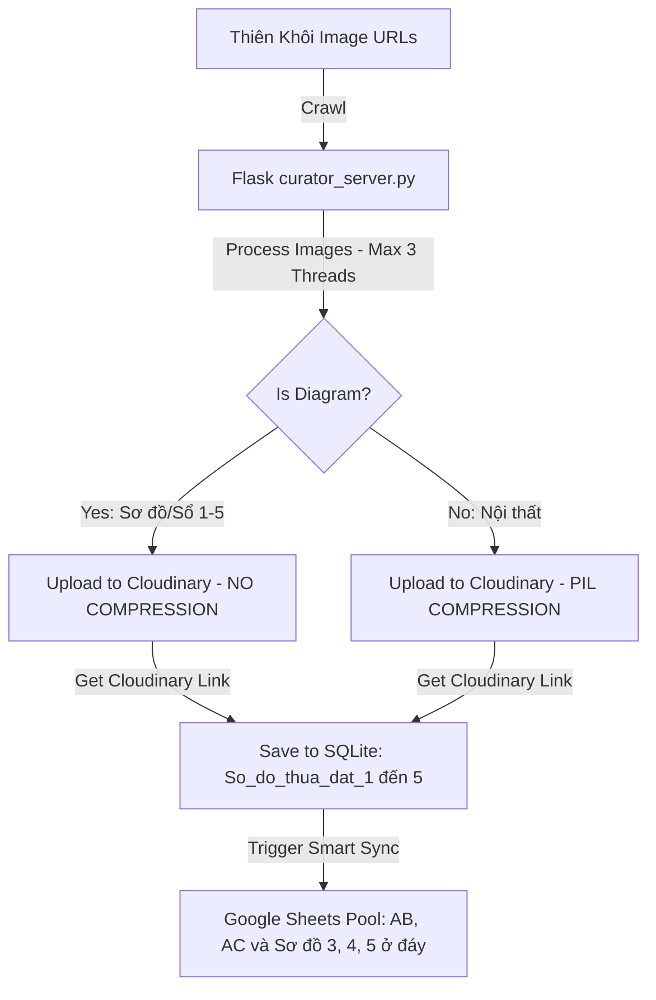

# US-054: Di cư ảnh Sổ không nén lên Cloudinary và lưu link về Pool sheet

## User story
**As a** Product Owner / Broker Khang Ngô
**I want** hệ thống tự động di cư ảnh sổ đỏ/sơ đồ thửa đất không nén lên Cloudinary và lấy liên kết lưu trực tiếp vào cột AB & AC (Sơ đồ thửa đất 1 & 2) trên tab Pool của Google Sheets
**So that** thông tin pháp lý được lưu trữ ở chất lượng gốc 100% cực kỳ sắc nét trên hạ tầng Cloudinary ổn định, phục vụ công việc quản lý và chia sẻ rổ hàng hiệu quả nhất, đóng góp trực tiếp vào KPI 1 (Tốc độ biên tập) và KPI 2 (Độ chính xác chuẩn hóa địa chỉ) trong Value Management Plan.

## Acceptance
- [ ] **Bỏ qua nén ảnh Sổ khi di cư lên Cloudinary:**
  - Khi luồng cào hoặc di cư ảnh phát hiện ảnh Sơ đồ thửa đất/Sổ pháp lý (được đánh dấu từ thẻ `#lightgalleryTD li`), hệ thống bỏ qua bước nén ảnh Pillow (`compress_image`) để giữ nguyên 100% dung lượng và độ phân giải chất lượng gốc.
  - Upload ảnh Sổ không nén trực tiếp lên thư mục chỉ định trên Cloudinary qua signed REST API.
- [ ] **Lấy link sau di cư lưu vào cột AB & AC trên sheet Pool:**
  - Sau khi upload Cloudinary thành công, bóc tách lấy chính xác URL Cloudinary đã tạo.
  - Tự động ghi nhận và đồng bộ trực tiếp 2 URL này vào cột **AB (Sơ đồ thửa đất 1)** và **AC (Sơ đồ thửa đất 2)** (tương ứng index 27 và 28) của dòng tương ứng trên tab Pool của Google Sheets.
- [ ] **Hỗ trợ tối đa 5 hình ảnh Sổ (Tích hợp thêm 3 cột Sơ đồ thửa đất 3, 4, 5):**
  - Tự động bóc tách tối đa 5 hình ảnh sơ đồ từ Thiên Khôi (mảng `images_td`).
  - Hỗ trợ thêm 3 cột mới vào cuối schema Pool (trước cột `Last Crawl` để bảo vệ chỉ số cột cũ): **`Sơ đồ thửa đất 3`**, **`Sơ đồ thửa đất 4`**, **`Sơ đồ thửa đất 5`**.
  - Tự động di cư không nén cả 5 ảnh sơ đồ này lên Cloudinary và đồng bộ đầy đủ URL Cloudinary về SQLite cục bộ và Google Sheets Pool.
- [ ] **Tương thích ngược & Hỗ trợ công cụ sửa lỗi bulk:**
  - Đảm bảo luồng xử lý tương thích với rổ hàng 2,000+ căn hiện có mà không gây crash hay lệch cột.
  - Hỗ trợ công cụ quét dọn sửa lỗi ảnh sơ đồ cũ (`repair_diagrams.py` hoặc tương đương) để di cư ảnh sổ thô cũ lên Cloudinary không nén và lưu đè link về đúng cột của sheet Pool.

## Solution

> [!note]- Configuration
> Hệ thống sử dụng cấu hình Cloudinary từ `curator_config.json`:
> ```json
> {
>   "cloudinary_cloud_name": "deru9p712",
>   "cloudinary_api_key": "127963624723617",
>   "cloudinary_api_secret": "5WyIQlmssDMR4Cu69g4114py6HU"
> }
> ```

> [!note]- Input
> - Ảnh Sơ đồ thửa đất cào được từ Thiên Khôi bóc tách từ `#lightgalleryTD li` (lấy tối đa 5 ảnh).
> - SQLite database local `raw_archive.db` chứa các bản ghi BĐS thô ở trạng thái `raw_text` hoặc `raw_complete`.

> [!note]- Output / Format
> - Tối đa 5 ảnh Sơ đồ thửa đất được lưu trữ trên Cloudinary với link dạng:
>   `https://res.cloudinary.com/deru9p712/image/upload/v12345678/BDS-KhangNgo/[tk_id]/sodo[1-5]_[tk_id].jpg`
> - Link Cloudinary được lưu trực tiếp vào SQLite cột `So_do_thua_dat_1` đến `5`.
> - Đồng bộ ghi đè lên các cột AB (index 27), AC (index 28) và các cột Sơ đồ 3, 4, 5 ở cuối tab Pool trên Google Sheets.

> [!note]- Key logic
> ### 1. Đồng bộ 100% ảnh lên Cloudinary & Throttling Tối ưu
> - Hệ thống **chỉ sử dụng Cloudinary** làm uploader duy nhất cho toàn bộ kho ảnh.
> - **Hạ giới hạn luồng song song:** Để tăng tính tàng hình (Stealth) và tránh bị rate limit bởi Cloudinary hay Thiên Khôi, **giảm số luồng song song xuống còn tối đa 3 luồng** (`max_workers = min(3, len(raw_images_tk))`).
> - **Bỏ qua nén Pillow cho ảnh Sổ:**
>   - Đối với cả 5 ảnh sơ đồ thửa đất (`is_diagram == True`), hệ thống bỏ qua hàm nén `compress_image()` để giữ nguyên byte ảnh và độ phân giải gốc 100%.
>   - Đối với ảnh thường (nội thất, facade), chạy qua bộ nén tối ưu hóa Pillow chất lượng 75% như cũ để tiết kiệm dung lượng.
> 
> ### 2. Thiết kế An toàn Chống Column-Shift Bug khi Thêm 3 Cột Sơ đồ Mới
> - **Rủi ro lớn:** Giao diện `index.html` đang sử dụng chỉ số mảng cứng từ `pool_row_data` (ví dụ `p.pool_row_data[29]` cho ảnh mặt tiền, `[40]` cho ảnh nội thất, `[62]` cho ảnh public). Nếu chèn 3 cột Sơ đồ 3, 4, 5 ngay sau Sơ đồ 2 (cột AD, AE, AF), toàn bộ chỉ số phía sau sẽ bị lệch 3 cột và **làm vỡ giao diện Curation & Preview**.
> - **Giải pháp an toàn 100% (KHUYÊN DÙNG):** 
>   - Thêm 3 cột **`Sơ đồ thửa đất 3`**, **`Sơ đồ thửa đất 4`**, **`Sơ đồ thửa đất 5`** vào **cuối danh sách cột của schema Pool** (ngay trước cột `Last Crawl` - index 77, 78, 79).
>   - **Kết quả:** Toàn bộ chỉ số mảng cũ của các cột nghiệp vụ phía trước (từ index 0 đến 76) được **bảo toàn nguyên vẹn 100%**. Giao diện `index.html` hoạt động ổn định tuyệt đối mà không có bất kỳ rủi ro nào!
>   - Backend Python và gspread tự động nhận diện và chèn co giãn thêm cột ở cuối sheet một cách mượt mà.
> 
> ### 3. Thuật toán map chỉ số chính xác trong `repair_diagrams.py` (Incident Prevention)
> - Đọc song song mảng ảnh thô Thiên Khôi (`raw_images_tk`) và mảng ảnh đã di cư Cloudinary (`raw_drive_images`). Hai mảng này luôn đồng bộ 100% về mặt chỉ số (index).
> - Tìm vị trí của `orig_sodo1` trong mảng `raw_drive_images` để lấy được index chính xác.
> - Truy xuất ngược lại ảnh gốc Thiên Khôi tại index đó trong `raw_images_tk` để tải xuống chất lượng cao nguyên bản.



## 📋 Implementation Plan
> [!plan]- Kế hoạch Triển khai (Size M)
> - **Cách tiếp cận:** Cập nhật logic di cư ảnh song song trong `curator_server.py` với tối đa 3 workers, cập nhật schema `POOL_HEADERS` ở cuối để thêm 3 cột Sơ đồ mới an toàn, sửa lỗi mapping chỉ số trong `repair_diagrams.py` hỗ trợ quét cả 5 sơ đồ.
> - **Các bước triển khai dự kiến:**
>   1. **Bước 1 (curator_server.py & crawl_pipeline.py):** Bổ sung 3 cột `Sơ đồ thửa đất 3, 4, 5` vào cuối danh sách cột `POOL_HEADERS` (ngay trước `Last Crawl`).
>   2. **Bước 2 (crawl_pipeline.py):** Cập nhật hàm cào `scrape_district` để tự động bóc tách tối đa 5 ảnh sơ đồ (mảng `images_td[0]` đến `[4]`) và ghi nhận vào SQLite.
>   3. **Bước 3 (curator_server.py):** Sửa đổi logic worker thread `process_single_image` giảm số luồng song song xuống 3, bỏ qua nén Pillow đối với cả 5 ảnh Sổ.
>   4. **Bước 4 (repair_diagrams.py):** Nâng cấp thuật toán so khớp index qua `raw_drive_images` và thực hiện quét, sửa lỗi không nén cho cả 5 sơ đồ.

## 📝 Task Checklist (TODO)
> [!todo]- Danh sách việc cần làm để theo dõi tiến độ
> - [x] **Thiết kế & Khảo sát:**
>   - [x] Khảo sát code `curator_server.py` | [x] Khảo sát code `repair_diagrams.py` | [x] Khảo sát code `crawl_pipeline.py` | [x] Chốt sơ đồ schema cuối an toàn
> - [x] **Triển khai Code:**
>   - [x] Bổ sung 3 cột Sơ đồ mới vào cuối `POOL_HEADERS` ở backend
>   - [x] Cập nhật hàm cào `scrape_district` bóc tách tối đa 5 ảnh sơ đồ
>   - [x] Cập nhật logic `process_single_image` trong `curator_server.py` (tối đa 3 workers, bỏ nén cả 5 sơ đồ)
>   - [x] Cập nhật công cụ `repair_diagrams.py` hỗ trợ sửa lỗi cả 5 sơ đồ thô sang Cloudinary
> - [x] **Kiểm thử sơ bộ:**
>   - [x] Chạy kiểm thử cào mới 1 căn để test luồng cào tối đa 5 sơ đồ
>   - [x] Chạy `repair_diagrams.py` cho 2 căn để test sửa sơ đồ thô cũ lên Cloudinary
>   - [x] Xác minh link Cloudinary xuất hiện chính xác trên các cột Sổ của tab Pool trên Sheets

## 🛠️ Update Logic (Drafting while Doing)
*(Sẽ sử dụng để ghi nhận logic thô trong quá trình triển khai thực tế)*

## 🧠 Retro, Lessons Learned & Good Practices (Bảo tồn vĩnh viễn)

### 1. Nhật ký Sự cố & Tiến trình Retro (Incident & Retro Log)
- **Sự cố phát sinh:** *[Mô tả lỗi hoặc blocker]*
- **Nguyên nhân gốc rễ (Root Cause):** *[Phân tích lý do]*
- **Giải pháp phòng ngừa:** *[Cách xử lý để không lặp lại]*

### 2. Thực tiễn tốt đúc kết (Good Practices)
- **Kinh nghiệm code & Cấu hình:** *[Mẹo viết code hoặc setup tối ưu]*
- **Kinh nghiệm kiểm thử:** *[Mẹo test nhanh hoặc phát hiện lỗi sớm]*

## Verification Plan

> [!check]- Automated Tests
> - Chạy thử nghiệm tự động bằng lệnh cào mới hoặc chạy tiện ích `repair_diagrams.py` với limit cụ thể:
>   `python repair_diagrams.py 2 --publish`

> [!check]- Manual Verification
> 1. Đảm bảo cấu hình Cloudinary hoạt động trong `curator_config.json`.
> 2. Chạy di cư ảnh cho căn mới (chọn căn có trên 2 sơ đồ thửa đất).
> 3. Xác minh: Toàn bộ ảnh (nội thất, facade, sơ đồ) đều upload lên Cloudinary. Tối đa 3 ảnh upload song song đồng thời.
> 4. Xác minh: Toàn bộ ảnh sơ đồ (tối đa 5 ảnh) giữ nguyên kích thước byte chất lượng gốc (không bị nén).
> 5. Mở Google Sheets Pool, kiểm tra cột AB, AC và các cột sơ đồ mới ở đáy chứa URL Cloudinary sắc nét.

## Files touched
- `curator_server.py` — [Cập nhật luồng di cư ảnh, POOL_HEADERS và bỏ nén ảnh Sổ 1-5]
- `crawl_pipeline.py` — [Cập nhật POOL_HEADERS và cào tối đa 5 ảnh sơ đồ]
- `repair_diagrams.py` — [Cập nhật công cụ sửa ảnh sơ đồ 1-5 thô sang Cloudinary]

## 🔄 Change Requests (Yêu cầu Thay đổi)
*(Sẽ sử dụng để ghi nhận nhật ký thay đổi yêu cầu của PO khi test hoặc triển khai)*
