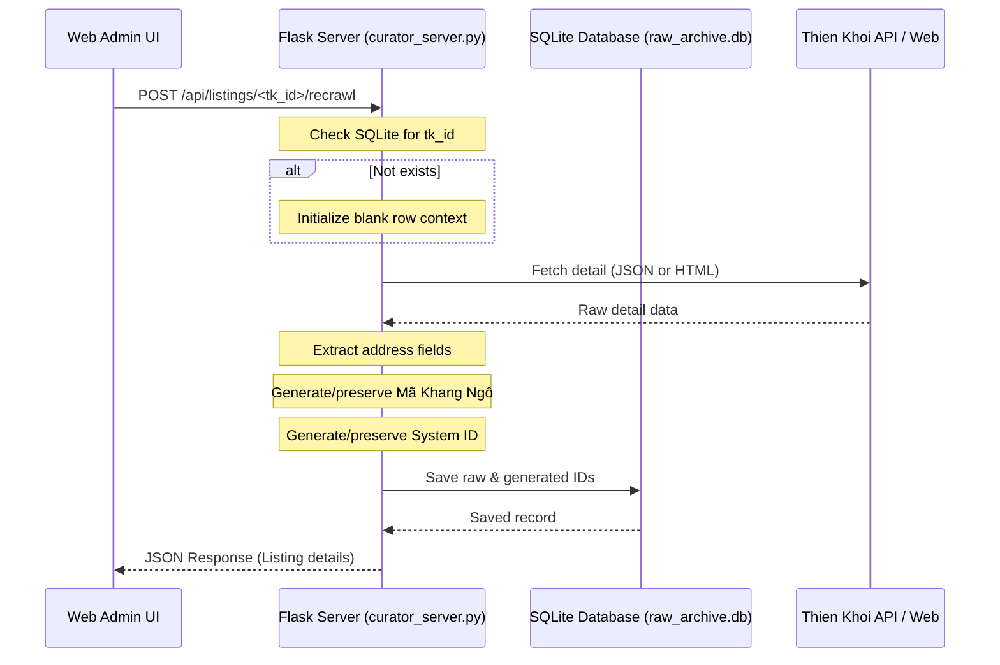

# US-068: Tự động sinh ID cho luồng cào từng căn lẻ

## User story
**As an** Admin
**I want** khi dán link cào lại hoặc cào lẻ 1 căn trên giao diện Web Admin, căn đó được sinh sẵn Mã Khang Ngô (ID) và System ID trong SQLite và cập nhật đầy đủ lên Pool sheet.
**So that** quy trình cào lẻ hoạt động đồng bộ và nhất quán với luồng cào hàng loạt.

## Acceptance
- Khi chạy API cào lẻ `/api/listings/<tk_id>/recrawl` trong `curator_server.py`, hệ thống tự động sinh Mã Khang Ngô và System ID cho bản ghi mới cào.
- Bản ghi lưu vào SQLite và đẩy lên Pool sheet có đầy đủ các mã ID này.

## Solution

### Mô hình hóa luồng dữ liệu (Mermaid)

## Implementation Plan

### 1. Backend (`curator_server.py`)
- Sửa route `/api/listings/<tk_id>/recrawl` để cho phép cào mới cả những căn chưa tồn tại trong SQLite.
- Trích xuất các trường thông tin địa chỉ từ phản hồi chi tiết (Proptech JSON hoặc traditional HTML soup).
- Gọi hàm sinh Mã Khang Ngô `gen_id_khang_ngo_python(so_nha, duong, quan)` và bảo toàn nếu đã tồn tại.
- Sinh System ID `SYS-YYYYMMDD-XXX` mới nếu chưa có, bảo toàn nếu đã tồn tại.
- Đưa Mã Khang Ngô và System ID vào payload cào thô và cập nhật SQLite qua `crawl_pipeline.save_raw_to_sqlite()`.

### 2. Frontend (`curator.html`)
- Thêm cơ chế nhận diện ID/URL mới trong ô tìm kiếm Sidebar.
- Nếu danh sách trống, hiển thị nút `➕ Cào mới căn [ID]`.
- Click nút sẽ gọi endpoint `/api/listings/<tk_id>/recrawl` và tự động chọn/hiển thị căn vừa cào mới.

---

## Tasks

- [x] Cho phép `/api/listings/<tk_id>/recrawl` cào mới các căn chưa tồn tại trong database SQLite.
- [x] Bảo toàn `System ID` đã có và tự động sinh mới nếu trống (cho cả hai luồng Proptech và Traditional).
- [x] Tự động sinh `Mã Khang Ngô (ID)` cho căn cào lẻ (sử dụng `gen_id_khang_ngo_python` và bảo toàn nếu đã có).
- [x] Lưu cả hai ID này vào SQLite thông qua `save_raw_to_sqlite`.
- [x] Tích hợp tính năng cào mới trực tiếp từ thanh tìm kiếm ở Sidebar trên UI `curator.html`.
- [x] Kiểm thử tự động và thực tế luồng cào lẻ cho cả căn đã có và căn mới tinh.
