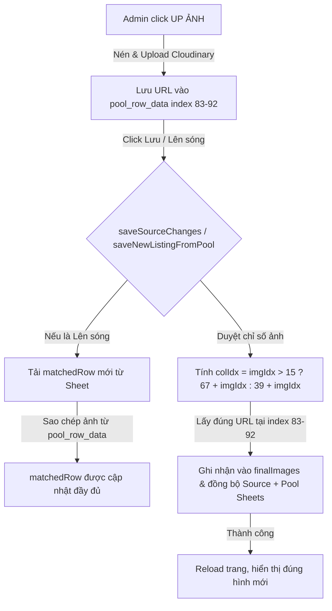

# US-073: Khắc phục lỗi lệch chỉ số cột ảnh nội thất 16-25 khi lưu Curation

## User story
**As an** Admin (Mr. Khang Ngô)
**I want** khi tải lên các hình ảnh thực tế từ máy tính (local images) và chọn công khai (public), hệ thống lưu lại chính xác các hình ảnh mới này.
**So that** tôi không bị mất các hình ảnh mới tải lên sau khi quay lại xem hoặc nạp lại dữ liệu, giúp làm giàu thông tin hình ảnh thực tế của căn nhà trên website một cách tin cậy.

## Acceptance
- [x] Khi Admin tải lên các hình ảnh nội thất mới (vào các slot từ 16 đến 25, tương ứng dải cột `CF` đến `CO` trên sheet Pool), việc click "Lưu thay đổi" (hoặc "Lên sóng & Lưu") phải lưu chính xác các hình ảnh này vào rổ ảnh công khai trên sheet Source (cột `AP` đến `AT`) và đồng bộ ngược về sheet Pool.
- [x] Dữ liệu hình ảnh mới tải lên ở slot 16-25 phải được hiển thị đầy đủ trên giao diện Admin sau khi tải lại trang hoặc khi mở lại chi tiết căn nhà từ danh sách.

## Solution

### 1. Phân giải chỉ số cột tập trung (DRY Column Index Helpers)
Để giải quyết triệt để vấn đề và tránh tình trạng lặp lại lỗi lệch chỉ số cột ảnh thô Pool trong tương lai, chúng ta sẽ **loại bỏ hoàn toàn** các công thức hardcode rải rác (`39+i`, `67+i`, `26+sodo`, `77+sodo`, `29+alley`) ở khắp nơi trong code.
Thay vào đó, khai báo 3 hàm helper toàn cục làm **Single Source of Truth** cho việc giải mã cột:
- `window.getPoolInteriorColIdx(imgIdx)`: Phân giải ảnh nội thất 1-25 (trả về `39 + imgIdx` nếu `imgIdx <= 15`, ngược lại trả về `67 + imgIdx` cho ảnh 16-25 để bỏ qua Sổ 3-5 ở index 80-82).
- `window.getPoolSodoColIdx(sodoIdx)`: Phân giải Sổ 1-5 (trả về `26 + sodoIdx` nếu `sodoIdx <= 2`, ngược lại trả về `77 + sodoIdx` cho Sổ 3-5).
- `window.getPoolAlleyColIdx(alleyIdx)`: Phân giải ảnh hẻm 1-10 (trả về `29 + alleyIdx`).

Toàn bộ các nơi đọc, ghi, và hiển thị ảnh trong `index.html` sẽ gọi qua 3 helper này. Khi có thay đổi schema trong tương lai, chúng ta chỉ cần cập nhật tại một nơi duy nhất.

### 2. Đồng bộ dữ liệu hình ảnh khi đăng căn mới từ Pool (saveNewListingFromPool)
- Trong hàm `saveNewListingFromPool`, hệ thống thực hiện tải lại dòng thô từ sheet Pool vào biến `matchedRow`. Tuy nhiên, biến này chưa được cập nhật các ảnh mới tải lên từ local (vốn được lưu trong biến `p.pool_row_data` ở bộ nhớ RAM).
- Vì vậy, hệ thống sẽ bị ghi đè dữ liệu trống rỗng ngược lại sheet Pool và không hiển thị ảnh mới trên Source.
- **Giải pháp**: Thực hiện sao chép toàn bộ các liên kết hình ảnh mới (bao gồm Sổ 1-5 và ảnh nội thất 1-25) từ `window.activeCurationListing.pool_row_data` vào `matchedRow` ngay sau khi tìm thấy dòng tương ứng.

### 3. Đồng bộ hóa việc nạp hình ảnh khi hiển thị danh sách (Pool Mapping Inconsistency)
- Trong hàm `getMappedPoolData()`, khi nạp dữ liệu thô từ kho Pool để phục vụ hiển thị danh sách hoặc xem nhanh, hệ thống chỉ duyệt các ảnh từ chỉ số 40 đến 54 (15 ảnh đầu):
  ```javascript
  const poolImgs = [];
  for (let c = 40; c <= 54; c++) {
    if (row[c]) poolImgs.push(row[c]);
  }
  ```
- Cần bổ sung vòng lặp nạp thêm 10 ảnh mới từ chỉ số 83 đến 92 giống như hàm `openPoolS()` và `loadData()` để đảm bảo tính đồng bộ dữ liệu:
  ```javascript
  for (let c = 83; c <= 92; c++) {
    if (row[c]) poolImgs.push(row[c]);
  }
  ```

### Sơ đồ tương tác luồng sửa lỗi (Mermaid)



## 📋 Implementation Plan
- **Cách tiếp cận:** Sửa đổi file `index.html` để cập nhật công thức tính chỉ số cột ảnh nội thất 16-25 từ `64 + imgIdx` thành `67 + imgIdx` tại các hàm lưu dữ liệu, đồng thời cập nhật hàm mapping dữ liệu Pool để hiển thị đầy đủ hình ảnh. Thêm cơ chế sao chép ảnh từ bộ nhớ RAM sang dòng thô `matchedRow` khi đăng căn từ Pool.
- **Các bước triển khai dự kiến:**
  1. Cập nhật `getMappedPoolData()` duyệt thêm dải index `83-92`.
  2. Sửa công thức `64 + imgIdx` thành `67 + imgIdx` tại 2 vị trí trong `saveSourceChanges()`.
  3. Cập nhật `saveNewListingFromPool()` sao chép hình ảnh từ `p.pool_row_data` sang `matchedRow`.
  4. Sửa công thức `64 + imgIdx` thành `67 + imgIdx` tại 2 vị trí trong `saveNewListingFromPool()`.

## 📝 Task Checklist (TODO)
- [x] **Thiết kế & Khảo sát:**
  - [x] Khảo sát code cũ trong `index.html`
  - [x] Chốt giải pháp và sơ đồ chỉ số cột Pool
- [x] **Triển khai Code:**
  - [x] Cập nhật hàm `getMappedPoolData` nạp đầy đủ 25 ảnh
  - [x] Cập nhật hàm `saveSourceChanges` sửa chỉ số cột đọc ảnh 16-25
  - [x] Cập nhật hàm `saveNewListingFromPool` thực hiện sao chép ảnh từ bộ nhớ RAM `p.pool_row_data` sang `matchedRow` và sửa chỉ số cột đọc ảnh 16-25
- [x] **Kiểm thử sơ bộ:**
  - [x] Chạy kiểm thử thủ công upload ảnh mới trên local
  - [x] Kiểm tra Google Sheets lưu trữ đúng và tải lại trang hiển thị đúng

## 🛠️ Update Logic (Drafting while Doing)

### 1. Nhật ký Debug & Phát kiến ngoài kế hoạch (Debug & Discoveries Log)
*Chưa thực hiện*

### 2. Nhật ký chạy thử nháp (Draft Test Logs)
*Chưa thực hiện*

## 🧠 Retro, Lessons Learned & Good Practices (Bảo tồn vĩnh viễn)

### 1. Nhật ký Sự cố & Tiến trình Retro (Incident & Retro Log)
*Chưa thực hiện*

### 2. Thực tiễn tốt đúc kết (Good Practices)
- **Kiểm soát offset chỉ số cột động:** Khi schema thay đổi hoặc chèn thêm cột ở giữa (như Sổ 3-5 chèn vào cột `CC:CE` trước cột ảnh 16-25), mọi công thức tính index tĩnh phải được cập nhật đồng loạt để tránh lệch chỉ số cột (Column-Shift).

## Verification Plan

### Automated Tests
Không áp dụng unit test tự động (vì là logic tương tác client-side và kết nối Google Sheets API trực tiếp).

### Manual Verification
1. Mở giao diện Admin Vercel Web local.
2. Chọn căn `343.22B7 Tô Hiến Thành` (hoặc căn bất kỳ chưa/đã lên sóng).
3. Sử dụng công cụ local upload **UP ẢNH** tải lên thêm 2 hình ảnh mới (chế độ Ảnh thường).
4. Xác nhận hình ảnh mới hiển thị trên Image Editor Grid.
5. Tích chọn "Hiện" để công khai các hình ảnh mới này.
6. Click nút **💾** (Lưu thay đổi) hoặc **⚡** (Lên sóng & Lưu).
7. Đợi trang tự động nạp lại dữ liệu, mở lại căn nhà đó và kiểm tra:
   - Các hình ảnh mới tải lên vẫn hiển thị đầy đủ.
   - Trạng thái công khai (public) của các hình ảnh mới được bảo toàn.
   - Kiểm tra trực tiếp trên Google Sheets (Source & Pool) xem các link ảnh được ghi đúng cột tương ứng.

## Files touched
- `index.html` — Cập nhật chỉ số cột mapping ảnh nội thất 16-25 khi lưu và nạp dữ liệu.
