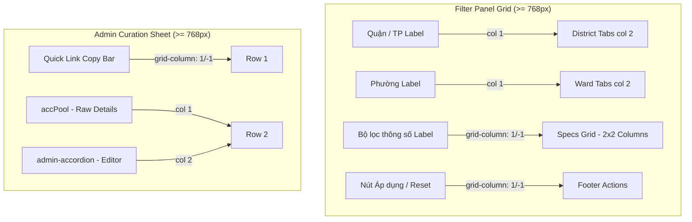

# US-074: Tối ưu hóa bố cục giao diện hiển thị trên thiết bị Laptop và màn hình lớn

## User story
**As a** Admin / Client  
**I want** các bộ lọc tìm kiếm và cửa sổ chi tiết (giao diện xem/biên tập) hiển thị rộng rãi, dàn trang ngang khoa học trên thiết bị laptop và màn hình lớn  
**So that** tôi có thể thao tác nhanh chóng, tận dụng tối đa diện tích màn hình lớn mà không làm phá vỡ hoặc ảnh hưởng đến trải nghiệm hiển thị mobile hiện tại.

## Acceptance
- [x] **Bố cục bộ lọc (Filter Panel) trên Laptop:** Trên màn hình lớn (width >= 768px), bảng bộ lọc chuyển từ cuộn dọc 1 cột sang dạng grid 2 cột (Cột trái: nhãn tiêu đề bộ lọc `160px`; Cột phải: các nút tabs/bong bóng bộ lọc hoặc các inputs). Các phần tiêu đề nhóm chính, Collection Manager, Google Admin config và chân trang chứa 2 nút (Áp dụng / Xóa điều kiện) tự động trải rộng chiếm toàn bộ chiều ngang (`grid-column: 1 / -1`). Khi ẩn/hiển thị các tab Phường/Đường/Hướng theo quận chọn, các hàng grid tự động co giãn thu gọn chiều cao về 0px.
- [x] **Bố cục bộ lọc thông số chi tiết:** Cụm input nhập khoảng số (Diện tích, Ngang, Dài, Phòng ngủ) được dàn đều thành 2 cột ngang thay vì xếp dọc từng hàng như cũ.
- [x] **Cửa sổ Biên tập/Curation Admin side-by-side:** Trong modal chi tiết của Admin, thanh copy link nhanh (`.admin-quick-link-bar`) được thiết lập trải dài toàn bộ chiều ngang (`grid-column: 1 / -1`), cho phép hai khu vực chính là thông tin thô từ Pool (`#accPool`) và khối accordion Curation (`.admin-accordion`) hiển thị song song bên nhau (2 cột) bắt đầu từ hàng thứ 2.
- [x] **Mở rộng Modal chi tiết trên màn hình rộng:** Trên màn hình desktop/laptop rộng (width >= 1200px), chiều rộng của modal chi tiết `.sheet` tăng lên `1100px` (thay vì cố định `850px` như trước) để hiển thị song song 2 cột thông tin rộng rãi, dễ đọc.
- [x] **Bảo toàn giao diện Mobile:** Giao diện trên thiết bị di động (width < 768px) giữ nguyên bố cục 1 cột cuộn dọc, Bottom Sheet kéo vuốt từ dưới lên, và hoạt động hoàn toàn bình thường không bị lệch/bóp méo.
- [x] **[US-074.2] Sửa lỗi hình đại diện bị co nhỏ & menu top đè lên:** Khắc phục triệt để lỗi khi mở giao diện desktop, các hình đại diện bị thu nhỏ (cao 15px) và bảng filter panel bị rò rỉ đè lên các nút xung quanh kể cả khi đang đóng.

## Solution

> [!note]- Configuration
> Không có biến cấu hình mới.

> [!note]- Input
> Không thay đổi schema đầu vào.

> [!note]- Output / Format
> Các thay đổi thuần túy về CSS styling và bổ sung các class CSS hỗ trợ phân bổ layout responsive.

### Sơ đồ phân bổ Grid hệ thống Filter Panel & Admin Modal (Desktop)

## 📋 Implementation Plan
- **Cách tiếp cận:**
  Sử dụng CSS Media Queries (`@media (min-width: 768px)` và `@media (min-width: 1200px)`) để định nghĩa lại layout Grid cho `#filterPanel` và `.sbody` trong trường hợp Admin. Bổ sung các class helper cụ thể (`detailed-specs-container`, `admin-quick-link-bar`) vào các thẻ HTML tương ứng trong `index.html` và viết CSS rules cho chúng nhằm thay đổi cách sắp xếp phần tử từ dọc thành ngang trên desktop.
- **Các bước triển khai dự kiến:**
  1. Thêm class `detailed-specs-container` vào thẻ div chứa bộ lọc thông số chi tiết trong `#filterPanel`.
  2. Thêm class `admin-quick-link-bar` vào thẻ div chứa nút "Copy link nhanh" trong hàm `openS`.
  3. Định nghĩa các CSS rules responsive cho `.filter-panel` trên desktop (grid 2 cột).
  4. Định nghĩa các CSS rules responsive cho `.detailed-specs-container` trên desktop (grid 2 cột).
  5. Định nghĩa các CSS rules responsive cho `.admin-quick-link-bar` và tăng chiều rộng `.sheet` lên `1100px` trên màn hình rộng >= 1200px.
  6. Kiểm tra giao diện local trên cả chế độ giả làm Mobile và Desktop để đảm bảo hiển thị đúng yêu cầu.

## 📝 Task Checklist (TODO)
- [x] **Thiết kế & Khảo sát:**
  - [x] Khảo sát code cũ và cấu trúc CSS/HTML của `index.html`
  - [x] Chốt giải pháp layout Grid responsive cho filter và modal admin
- [x] **Triển khai Code:**
  - [x] Bổ sung các class helper vào mã HTML trong `index.html`
  - [x] Thêm các media query CSS mới để tối ưu bố cục laptop cho `#filterPanel` và `.sbody`
  - [x] Tối ưu chiều rộng `.sheet` lên `1100px` trên màn hình lớn
  - [x] [US-074.2] Di dời các khối `@media` query xuống cuối thẻ ``. Điều này đảm bảo tính năng ghi đè của CSS (Cascading) hoạt động đúng như mong đợi.
- **[US-074.2] Lỗi rò rỉ Filter Panel khi đóng:**
  - *Nguyên nhân:* Việc sử dụng ID selector `#filterPanel` có độ ưu tiên cao hơn lớp class `.filter-panel`. Kể cả khi bảng lọc đang đóng (không có class `.open` để ẩn), thuộc tính `display: grid` và `padding` của ID vẫn được áp dụng, làm lộ một dải màu trắng phủ đè lên menu trên cùng và đẩy danh sách card xuống.
  - *Giải pháp:* Thay thế toàn bộ các selectors `#filterPanel` trong media query thành `#filterPanel.open`. Khi đóng, bảng sẽ dùng style mặc định của `.filter-panel` (`max-height: 0; padding: 0 16px; overflow: hidden;`) để ẩn đi hoàn toàn.

### 2. Nhật ký chạy thử nháp (Draft Test Logs)
- Đã chạy thử nghiệm CSS cục bộ và kiểm tra thứ tự render grid tự động. Grid tự động bỏ qua các phần tử có `display: none` như bộ lọc Phường/Đường thô khi chưa chọn Quận, thu hẹp chiều cao dòng bằng 0px hoàn hảo đúng như lý thuyết.

## 🧠 Retro, Lessons Learned & Good Practices (Bảo tồn vĩnh viễn)
- **Kinh nghiệm code & Cấu hình:** Khi thao tác với CSS Grid chứa các phần tử ẩn/hiển động (như bộ lọc đa tầng), thiết lập `gap` vừa phải và để grid-auto-flow tự điều hướng là giải pháp tối ưu thay vì hardcode grid-row/grid-column chỉ số tĩnh. Trình duyệt sẽ tự động thu gọn phần tử ẩn một cách tự nhiên.
- **[US-074.2] Cascading & Specifity của CSS:** Luôn nhớ đặt các khối Media Queries (đặc biệt khi code theo phương pháp Mobile-First) ở **cuối cùng** của file stylesheet để tránh bị các class global viết ở phần sau ghi đè vô hiệu hóa thuộc tính. Hạn chế sử dụng ID selector đơn độc để styling các thuộc tính thay đổi động (như display/padding), hãy kết hợp thêm lớp trạng thái (ví dụ `#id.state`) để giữ tính đóng gói.

## Verification Plan

> [!check]- Automated Tests
> Không áp dụng tự động cho thay đổi CSS layout.

> [!check]- Manual Verification
> 1. Mở trang web ở chế độ Admin (`?pwd=trang`) trên laptop.
> 2. Mở bảng bộ lọc, kiểm tra xem nhãn và các nút tabs có thẳng hàng dạng 2 cột song song không. Kiểm tra cụm nhập số (Diện tích, Chiều dài, Chiều ngang, Phòng ngủ) có chia làm 2 cột ngang gọn gàng không.
> 3. Click chọn Quận, xem các hàng Phường/Đường/Hướng có xuất hiện mượt mà và tự tạo thành các hàng grid tương ứng không.
> 4. Click vào một card BĐS bất kỳ (căn thô hoặc căn đã duyệt) để mở Modal chi tiết biên tập của Admin.
> 5. Xác minh xem nút "Copy link nhanh" có nằm ngang ở đầu modal, còn phần thông tin thô (`accPool`) và biên tập/preview (`admin-accordion`) có xếp song song cạnh nhau thành 2 cột cân xứng hay không.
> 6. Phóng to trình duyệt hoặc mở trên màn hình rộng >= 1200px để xem modal `.sheet` có mở rộng ra 1100px không.
> 7. Giả lập responsive màn hình nhỏ (< 768px) để đảm bảo layout quay về dạng 1 cột dọc chuẩn mobile, Bottom Sheet hoạt động hoàn hảo.

## Files touched
- `index.html` — Bổ sung class helper HTML và các media query CSS tối ưu hóa layout laptop.
- `docs/stories/_inbox/US-074_laptop_ui_optimization.md` — [NEW] Mô tả chi tiết User Story.
