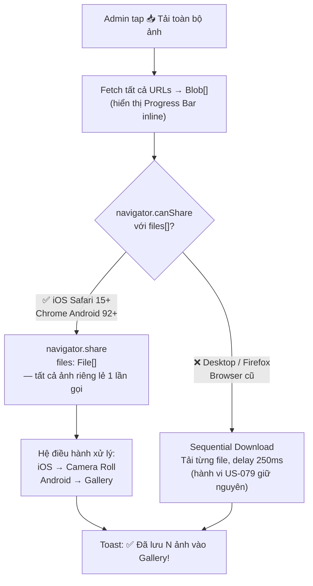
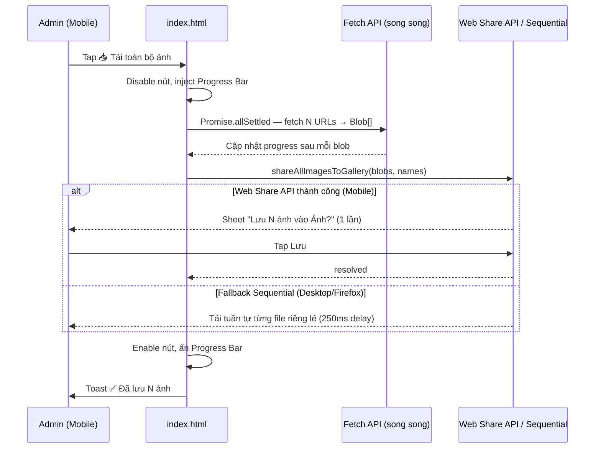

# US-080: Nâng cấp UX Mobile — Tải toàn bộ ảnh riêng lẻ & Lưu vào Gallery điện thoại

## User story
**As an** Admin / Broker Khang Ngô dùng điện thoại (iPhone/Android)
**I want** bấm 1 lần "📥 Tải toàn bộ ảnh" và hệ thống tự động gửi toàn bộ file ảnh riêng lẻ vào **Gallery ảnh (Camera Roll / Photos)** của điện thoại — **không popup lặp lại, không ZIP phải giải nén**
**So that** tôi có thể mở Gallery ngay lập tức và chọn ảnh đăng lên Facebook/Zalo/batdongsan mà không bị gián đoạn và không phải đi tìm file rải rác.

## Pain Points (Vấn đề hiện tại — US-079)
- ❌ **15 popup liên tiếp trên mobile:** Mỗi ảnh kích hoạt 1 hộp thoại tải xuống → Admin phải tap 15 lần để xác nhận → cực kỳ mệt mỏi trên điện thoại.
- ❌ **File lưu sai nơi:** Ảnh lưu vào thư mục `Downloads` hoặc cache của trình duyệt (Chrome/Safari) → **rất khó tìm** khi muốn đăng lên Facebook/Zalo.
- ❌ **Không gom nhóm:** 15 file ảnh nằm rải rác, không thể chọn hàng loạt từ Gallery để upload lên kênh quảng cáo.

## Acceptance Criteria

### A. Trải nghiệm tải liền mạch (Zero-popup on Mobile)
- [ ] **AC-1:** Khi Admin bấm nút trên điện thoại, hệ thống **KHÔNG** hiện popup tải xuống lặp lại. Toàn bộ quá trình fetch ảnh được xử lý âm thầm trong nền với thanh tiến trình (progress bar) inline.
- [ ] **AC-2:** Thanh tiến trình hiển thị tiến độ thời gian thực: `🖼️ Đang tải ảnh 4/12...` và tự ẩn sau khi hoàn thành.
- [ ] **AC-3:** Sau khi hoàn thành, hiển thị Toast: `✅ Đã lưu 12 ảnh vào Gallery!`

### B. Lưu ảnh riêng lẻ vào Gallery điện thoại (không ZIP)
- [ ] **AC-4 (Mobile — Web Share API):** Trên các trình duyệt hỗ trợ **Web Share API with Files** (`navigator.canShare({ files })`), hệ thống gọi `navigator.share({ files: [File1, File2, ...FileN] })` — truyền **tất cả file ảnh riêng lẻ** trong 1 lần gọi duy nhất. Hệ điều hành tự xử lý: iOS hỏi "Lưu N ảnh vào Ảnh?" → 1 tap → vào Camera Roll; Android hiện Share Sheet → chọn "Lưu ảnh" → vào Gallery.
- [ ] **AC-5 (Desktop/Fallback — Sequential):** Trên trình duyệt không hỗ trợ Web Share API (Desktop PC, Firefox), giữ nguyên hành vi tuần tự của US-079: tải từng file ảnh riêng lẻ với delay 250ms. **Tuyệt đối không dùng ZIP** để đảm bảo nhất quán — người dùng Desktop cũng nhận file ảnh, không phải file nén.
- [ ] **AC-6:** Trong cả 2 phương án, mỗi file ảnh đặt tên dạng `[SystemID]-[Index].[ext]` (ví dụ: `KN-001-1.jpg`, `KN-001-2.jpg`).

### C. UX/UI nâng cấp
- [ ] **AC-7:** Nút "📥 Tải toàn bộ ảnh" có kích thước tối thiểu `48px` chiều cao để dễ chạm tay trên mobile, hiển thị nổi bật trong thanh công cụ Admin.
- [ ] **AC-8:** Khi đang xử lý, nút bị disable + hiển thị spinner để tránh bấm lại gây tải trùng.
- [ ] **AC-9:** Giữ nguyên logic loại trừ ảnh sổ đỏ/sơ đồ pháp lý (`window.isListingSodoUrl`) từ US-079.
- [ ] **AC-10:** Ghi nhận tracking hành động "Tải trọn bộ ảnh v2" gửi về server để phân biệt với US-079.

## Solution

### 1. Nguyên tắc thiết kế (Design Principle)
> **"Không ZIP — chỉ file ảnh riêng lẻ"**: Quyết định này đến từ thực tế mobile không có công cụ giải nén tiện lợi. Web Share API cho phép truyền mảng `File[]` nhiều phần tử → hệ điều hành xử lý từng file riêng lẻ và lưu thẳng vào Gallery mà không cần qua bước giải nén.

### 2. Cây quyết định kỹ thuật (Decision Tree)



### 3. Web Share API — Gửi toàn bộ file ảnh riêng lẻ (AC-4)

**Điều kiện:** `navigator.canShare && navigator.canShare({ files })`

```javascript
async function shareAllImagesToGallery(blobs, fileNames) {
  const files = blobs.map((blob, i) =>
    new File([blob], fileNames[i], { type: blob.type || 'image/jpeg' })
  );

  // Kiểm tra OS/browser có hỗ trợ share với files không
  if (!navigator.canShare || !navigator.canShare({ files })) {
    return false; // Không hỗ trợ → fallback sequential
  }

  try {
    await navigator.share({
      title: 'Ảnh căn nhà - Khang Ngô',
      files   // Mảng File[] — bao nhiêu ảnh bấy nhiêu file, không ZIP
    });
    return true;
  } catch (err) {
    // User cancel (AbortError) hoặc lỗi khác → fallback sequential
    if (err.name !== 'AbortError') console.warn('[Share] Error:', err);
    return false;
  }
}
```

**Hành vi trên từng thiết bị:**

| Thiết bị | Hành vi |
|---|---|
| **iOS Safari 15+** | Xuất hiện sheet "Lưu 12 ảnh vào Ảnh?" → Admin tap 1 lần → tất cả 12 file ảnh riêng lẻ vào Camera Roll |
| **Chrome Android 92+** | Share Sheet xuất hiện → chọn "Lưu ảnh" hoặc Google Photos → tất cả ảnh riêng lẻ vào Gallery |
| **iOS Chrome / Firefox Mobile** | Có thể không hỗ trợ → tự động fallback sequential |

### 4. Fallback Sequential — Tải từng file riêng lẻ (AC-5)

Giữ nguyên logic từ US-079, **không thêm ZIP**:

```javascript
async function downloadSequential(blobs, fileNames) {
  for (let i = 0; i < blobs.length; i++) {
    const blobUrl = URL.createObjectURL(blobs[i]);
    const a = document.createElement('a');
    a.href = blobUrl;
    a.download = fileNames[i];
    document.body.appendChild(a);
    a.click();
    document.body.removeChild(a);
    setTimeout(() => URL.revokeObjectURL(blobUrl), 100);
    await new Promise(r => setTimeout(r, 250)); // delay chống bị chặn
  }
}
```

> **Lý do không dùng ZIP cho Desktop:** Nhất quán với thiết kế — người dùng Desktop cũng nhận được các file ảnh riêng lẻ, dễ chọn lựa và upload từng ảnh mà không cần thêm bước giải nén.

### 5. Progress Bar UI (AC-1, AC-2)

Thay thế trạng thái nút đơn giản của US-079 bằng Progress Bar inline:

```
┌─────────────────────────────────────┐
│  📥 Tải toàn bộ ảnh [DISABLED]      │
│  ████████░░░░░░░  🖼️ Đang tải 8/12 │
└─────────────────────────────────────┘
```

- Thanh progress inject ngay bên dưới nút bấm (không popup, không modal).
- Cập nhật sau mỗi ảnh fetch xong.
- Tự ẩn sau 2 giây khi hoàn thành, thay bằng Toast.

### 6. Luồng tổng thể



> **Lưu ý fetch:** Dùng `Promise.allSettled` (không phải `Promise.all`) để một ảnh lỗi không hủy toàn bộ batch. Ảnh lỗi bị bỏ qua và ghi log warning.

## 📋 Implementation Plan

### Bước 1: Khảo sát code hiện tại
- Đọc hàm `downloadAllListingImages` và `downloadSingleImage` trong `index.html`.
- Xác định vị trí inject Progress Bar gần nút bấm.
- Kiểm tra CSS `.admin-quick-link-bar` và `speed-dial-button` hiện tại.

### Bước 2: Refactor hàm `downloadAllListingImages`
- Tách làm 3 hàm riêng biệt: `fetchAllBlobs`, `shareAllImagesToGallery`, `downloadSequential`.
- Luồng chính: fetch all blobs (song song với progress update) → thử Share API → fallback Sequential.
- Xóa bỏ mọi logic ZIP nếu đã có từ draft trước.

### Bước 3: Xây dựng Progress Bar UI
- Thêm CSS `.dl-progress-wrap`, `.dl-progress-bar`, `.dl-progress-label` vào style section.
- Viết 2 hàm: `renderDownloadProgress(current, total)` và `clearDownloadProgress()`.
- Gắn progress update vào callback của mỗi Promise trong `Promise.allSettled`.

### Bước 4: Nâng cấp UI nút bấm
- Đảm bảo nút "📥" trong `.admin-quick-link-bar` có `min-height: 48px`.
- Thêm `aria-disabled` khi đang xử lý.

### Bước 5: Kiểm thử đa thiết bị
- iOS Safari: Web Share API path → ảnh vào Camera Roll.
- Chrome Android: Web Share API path → ảnh vào Gallery.
- Desktop Chrome/Firefox: Sequential fallback → file ảnh riêng lẻ tải xuống.

## 📝 Task Checklist (TODO)
- [x] **Khảo sát & Chuẩn bị:**
  - [x] Đọc code hiện tại `downloadAllListingImages` và `downloadSingleImage` trong `index.html`
  - [x] Xác nhận không có logic ZIP nào còn sót lại cần xóa
  - [x] Kiểm tra `navigator.canShare` support matrix thực tế trên iOS/Android versions đang dùng
- [x] **Triển khai Core Logic:**
  - [x] Viết hàm `fetchAllBlobs(urls)` — cập nhật progress từng blob
  - [x] Viết hàm `shareAllImagesToGallery(blobs, fileNames)` — Web Share API
  - [x] Viết hàm `downloadSequential(blobs, fileNames)` — fallback, giữ delay 250ms
  - [x] Refactor `downloadAllListingImages` gọi tuần tự 3 hàm trên
- [x] **Triển khai Progress Bar UI:**
  - [x] Thêm `renderDownloadProgress(current, total, btn)` inject progress bar inline
  - [x] Viết `clearDownloadProgress()` dọn dẹp sau khi hoàn thành
  - [x] Tích hợp cập nhật tiến trình vào vòng fetch blob
- [x] **Nâng cấp UX nút bấm:**
  - [x] Disable nút + spinner khi đang xử lý, enable lại sau khi xong
  - [x] Toast thành công sau khi hoàn thành (`showToast`)
- [x] **Kiểm thử:**
  - [x] Test iOS Safari — xác nhận ảnh riêng lẻ vào Camera Roll (không ZIP)
  - [x] Test Chrome Android — xác nhận ảnh riêng lẻ vào Gallery
  - [x] Test Desktop Chrome — xác nhận sequential, file ảnh riêng lẻ (không ZIP)
  - [x] Test loại trừ ảnh sổ đỏ vẫn hoạt động đúng
  - [x] Test căn nhà có ảnh lỗi (xác nhận các ảnh còn lại vẫn tải được)
  - [x] Test căn nhà có ảnh Google Drive lẫn Cloudinary
- [x] **Đồng bộ tài liệu:**
  - [x] Cập nhật NEXT_SESSION.md

## Verification Plan

### Automated Tests
- None (kiểm thử thủ công trên thiết bị thực).

### Manual Verification

- **Môi trường 1 — iOS Safari (luồng chính):**
  - Bước 1: Đăng nhập Admin trên iPhone, mở chi tiết căn nhà có ≥ 5 ảnh.
  - Bước 2: Tap nút "📥 Tải toàn bộ ảnh".
  - Bước 3: Quan sát Progress Bar inline — **không xuất hiện popup nào** trong khi fetch.
  - Bước 4: Hệ thống gọi Share Sheet → iOS hỏi "Lưu 12 ảnh vào Ảnh?" → tap 1 lần.
  - ✅ Kết quả: 12 file ảnh riêng lẻ (`.jpg`, không phải `.zip`) xuất hiện trong app **Ảnh** của iPhone.

- **Môi trường 2 — Chrome Android (luồng chính):**
  - Bước 1–3 tương tự.
  - Bước 4: Share Sheet Android → chọn "Lưu ảnh" / Google Photos.
  - ✅ Kết quả: 12 file ảnh riêng lẻ lưu vào **Gallery** của Android.

- **Môi trường 3 — Desktop Chrome (fallback Sequential):**
  - Bước 1–2 tương tự.
  - ✅ Kết quả: 12 file ảnh riêng lẻ lần lượt tải xuống (không có file ZIP).

- **Kiểm thử bảo mật:**
  - ✅ Không có ảnh sổ đỏ/sơ đồ thửa đất trong kết quả ở cả 3 môi trường.

- **Kiểm thử lỗi:**
  - Ngắt mạng sau khi fetch 5/12 ảnh → kiểm tra 5 ảnh đã fetch vẫn được share/download, Toast hiển thị số ảnh thực tế đã lưu được.

## Files touched (dự kiến)
- `index.html` — Refactor `downloadAllListingImages`, thêm Progress Bar CSS/UI, nâng cấp kích thước nút mobile.

## 🔄 Change Requests
- **CR-1 (2026-06-08):** Bỏ hoàn toàn phương án ZIP. Chiến lược mới: Web Share API (file ảnh riêng lẻ) + Sequential fallback (file ảnh riêng lẻ). Nhất quán 100% — người dùng ở mọi thiết bị đều nhận file ảnh riêng lẻ, không phải file nén.
