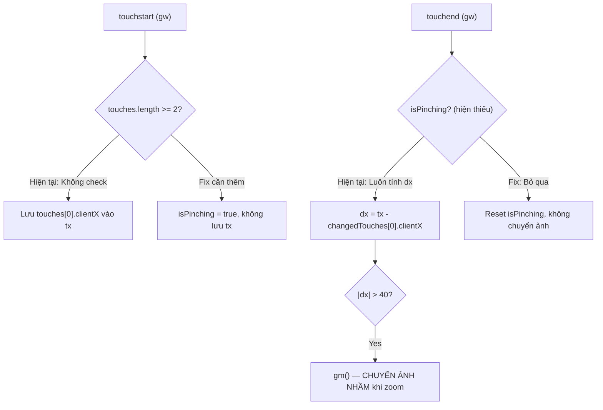

# US-081: Sửa lỗi Carousel Mobile — Zoom tự nhảy ảnh & Chuyển ảnh thiếu animation

## User story
**As a** Khách hàng xem trang chi tiết căn nhà trên điện thoại
**I want** carousel ảnh hoạt động ổn định khi tôi zoom vào để xem chi tiết hình, và chuyển ảnh mượt mà có hiệu ứng
**So that** tôi không bị mất vị trí ảnh khi zoom và trải nghiệm xem ảnh cảm giác liền mạch, chuyên nghiệp

## Acceptance
- [ ] **Bug 1 — Zoom tự nhảy ảnh:** Khi người dùng dùng gesture pinch-to-zoom (kéo 2 ngón tay ra/vào) trên ảnh carousel, carousel **không** tự động chuyển sang ảnh kế tiếp hoặc ảnh trước
- [ ] **Bug 2 — Animation chuyển ảnh:** Khi người dùng vuốt/nhấn để chuyển qua lại giữa các ảnh, ảnh phải trượt mượt mà (slide transition) thay vì ẩn/hiện đột ngột (flash)
- [ ] Gesture zoom vẫn hoạt động bình thường (phóng to/thu nhỏ ảnh) sau khi fix
- [ ] Vuốt trái/phải để chuyển ảnh vẫn hoạt động bình thường sau khi fix
- [ ] Trên desktop không bị ảnh hưởng

## Solution

> [!note]- Input
> - Gesture: `touchstart`, `touchmove`, `touchend` trên element `#gw` (gallery wrapper) và `#lbMain` (lightbox)
> - Số lượng ngón tay (`event.touches.length`): 1 ngón = swipe, 2 ngón = zoom/pinch
> ```json
> {
>   "touches.length": "number — 1: swipe intent, 2+: pinch/zoom intent",
>   "deltaX": "number — horizontal displacement for swipe detection"
> }
> ```

> [!note]- Key logic
> ### 🔴 Bug 1 — Zoom tự nhảy ảnh (ROOT CAUSE XÁC NHẬN)
>
> **Có 2 carousel riêng biệt, cả 2 đều mắc lỗi này:**
>
> **1a. Gallery chính (`#gw` / `buildG` — line 6461–6478):**
> - `ontouchstart` lưu `tx = e.touches[0].clientX` — **KHÔNG kiểm tra touches.length**
> - `ontouchend` tính `dx = tx - e.changedTouches[0].clientX` và trigger `gm()` nếu `|dx| > 40`
> - Khi pinch: 2 ngón di chuyển xa nhau → `touches[0]` dịch đủ > 40px → **kích hoạt chuyển ảnh nhầm**
> - CSS `.gwrap` có `touch-action: pan-y` — đúng hướng, nhưng **không đủ** vì handler JS vẫn chạy
>
> **1b. Lightbox (`#lbMain` — line 3692–3693):**
> - Inline HTML attribute: `ontouchstart="window.lbTx=event.touches[0].clientX"`
> - `ontouchend` không có guard cho pinch → **cùng vấn đề**
>
> ### 🔴 Bug 2 — Chuyển ảnh không có animation (ROOT CAUSE XÁC NHẬN)
>
> **Gallery chính (`#gw`):**
> - `.gtrack` có `transition: transform .28s cubic-bezier(...)` ✅ — **animation ĐÃ CÓ**
> - Hàm `gm(d)` dùng `gt.style.transform = translateX(-${gI * 100}%)` ✅ — đúng
> - **Tuy nhiên:** `buildG()` set `gt.style.transform = 'translateX(0)'` ngay khi load → OK
> - ⚠️ **Cần xác nhận thêm**: Có thể `innerHTML` bị reset hoặc `gtrack` bị rebuild mỗi lần không?
>
> **Lightbox (`#lbMain`):**
> - `lbMove()` cần đọc thêm tại line 6382 để xác nhận animation



## 📋 Implementation Plan
> [!plan]- Kế hoạch Triển khai (Bắt buộc cho Size M/L/XL)
> - **Cách tiếp cận:** Sửa trực tiếp 2 điểm touch handler trong `index.html` — không cần thư viện ngoài
> - **Phạm vi:** 2 carousel cần fix
>   - **Gallery chính** `#gw`: JS trong hàm `buildG()` tại ~line 6461
>   - **Lightbox** `#lbMain`: Inline HTML attribute tại line 3692–3693
> - **Các bước triển khai dự kiến:**
>   1. **Fix Bug 1a — Gallery `#gw`:** Thêm biến `let isPinching = false` trong scope `buildG()`. Sửa `ontouchstart` thêm check `touches.length >= 2`. Sửa `ontouchmove` set `isPinching = true` khi pinch. Sửa `ontouchend` guard trả về sớm nếu `isPinching`, sau đó reset.
>   2. **Fix Bug 1b — Lightbox `#lbMain`:** Chuyển inline attribute `ontouchstart`/`ontouchend` sang event listener JS với pinch guard tương tự.
>   3. **Fix Bug 2 — Animation:** Đọc `lbMove()` tại line 6382 để xác nhận cơ chế render (có CSS transition chưa). `.gtrack` đã CÓ `transition: transform .28s` — khả năng cao Bug 2 chỉ xảy ra ở Lightbox, không phải gallery chính.

## 📝 Task Checklist (TODO)
> [!todo]- Danh sách việc cần làm để theo dõi tiến độ
> - [ ] **Thiết kế & Khảo sát:** [ ] Tìm đoạn touch handler carousel trong `index.html` | [ ] Xác định cơ chế render ảnh (display/opacity/transform) | [ ] Chốt giải pháp transition
> - [ ] **Triển khai Code:** [ ] Fix Bug 1 — isPinching guard | [ ] Fix Bug 2 — CSS slide transition | [ ] Kiểm tra không break swipe bình thường
> - [ ] **Kiểm thử sơ bộ:** [ ] Test pinch-to-zoom không nhảy ảnh | [ ] Test chuyển ảnh có animation | [ ] Test desktop không bị ảnh hưởng | [ ] Đóng gói / Clean tài liệu

## 🛠️ Update Logic (Drafting while Doing)
> [!IMPORTANT]
> **Quy tắc Không Trùng Lắp (Non-Duplication Rule - BẮT BUỘC GIỮ LẠI VĨNH VIỄN):**
> - **Mục đích:** Lưu trữ lịch sử hành trình kỹ thuật thực tế (**HOW & WHY**). Tuyệt đối **KHÔNG** xóa bỏ mục này sau khi test pass.
> - **Nguyên tắc không trùng lắp:** Tuyệt đối không copy-paste các cấu trúc thô, JSON schema, prompt hoặc mã nguồn hoàn chỉnh đã có trong phần `Solution` hoặc `Verification Plan` chính thức ở trên.
> - **Nội dung cần tập trung ghi nhận:**
>   1.  *Nhật ký Debug & Sự cố giải quyết (Issue Resolution Log):* Liệt kê các lỗi kỹ thuật phát sinh thực tế và cách xử lý cụ thể.
>   2.  *Những phát kiến ngoài kế hoạch (Unexpected Discoveries):* Điểm tối ưu, giải pháp thông minh phát hiện khi viết code.
>   3.  *Lịch sử chạy thử nghiệm nháp (Draft Test Logs):* Nhật ký và output chạy thử nháp trước khi có kiểm thử chính thức.

### 1. Nhật ký Debug & Phát kiến ngoài kế hoạch (Debug & Discoveries Log)
- **Phạm vi thực tế:** Phát hiện có **2 carousel riêng biệt** đều mắc Bug 1: gallery chính `#gw` (JS trong `buildG()`) và lightbox `#lbMain` (inline HTML attrs). Kế hoạch ban đầu chỉ đề cập 1 điểm.
- **Phát kiến Bug 2:** `.gtrack` đã có CSS `transition: transform .28s` và `gm()` dùng `translateX` đúng chuẩn → gallery chính **không bị Bug 2**. Bug 2 chỉ xảy ra tại lightbox `renderLbMain()` do dùng `innerHTML` thay trực tiếp không có fade.
- **Lưu ý kỹ thuật:** Listener lightbox dùng `{ passive: true }` vì không cần gọi `preventDefault()` (lightbox không scrollable), giúp performance tốt hơn inline attr cũ.

### 2. Nhật ký chạy thử nháp (Draft Test Logs)
- **Script kiểm thử thô / nháp đã chạy:** *[Ví dụ: mở DevTools > Mobile emulator]*
- **Output kết quả nháp & Điểm nghẽn đã vượt qua:** *[Dán log lỗi và phân tích nếu có]*

## 🧠 Retro, Lessons Learned & Good Practices (Bảo tồn vĩnh viễn)
> [!TIP]
> **Mục đích:** Ghi nhận lại các sự cố thực tế xảy ra khi phát triển để họp rút kinh nghiệm (Retro), đồng thời đúc kết các bài học tốt (Good Practices) nhằm ngăn ngừa tuyệt đối các lỗi tương tự ở các US tiếp theo.
> - **Nhật ký Sự cố & Retro (Incident & Retro Log):** *[Ghi nhận lỗi nghiêm trọng xảy ra, nguyên nhân gốc rễ và giải pháp khắc phục thực tế]*
> - **Thực tiễn tốt đúc kết (Good Practices):** *[Ghi nhận các mẹo code, cấu hình an toàn, hoặc kinh nghiệm test đúc kết được giúp tăng hiệu suất / tránh lỗi]*

### 1. Nhật ký Sự cố & Tiến trình Retro (Incident & Retro Log)
- **Sự cố phát sinh:** *[Mô tả lỗi hoặc blocker]*
- **Nguyên nhân gốc rễ (Root Cause):** *[Phân tích lý do]*
- **Giải pháp phòng ngừa:** *[Cách xử lý để không lặp lại]*

### 2. Thực tiễn tốt đúc kết (Good Practices)
- **Kinh nghiệm code & Cấu hình:** *[Mẹo viết code hoặc setup tối ưu]*
- **Kinh nghiệm kiểm thử:** *[Mẹo test nhanh hoặc phát hiện lỗi sớm]*

## Verification Plan

> [!check]- Automated Tests
> Không có automated test — kiểm thử thủ công trên thiết bị/emulator

> [!check]- Manual Verification
> 1. Mở trang chi tiết căn nhà trên Chrome DevTools > Toggle Device Toolbar (iPhone SE hoặc Pixel 5)
> 2. **Test Bug 1:** Dùng chuột giả lập 2 ngón pinch-to-zoom trên carousel → carousel **không** chuyển ảnh
> 3. **Test Bug 2:** Nhấn nút prev/next hoặc vuốt 1 ngón → ảnh chuyển có hiệu ứng trượt mượt mà (0.3s)
> 4. **Regression:** Vuốt trái/phải bình thường vẫn chuyển ảnh đúng
> 5. **Desktop:** Mở trên màn hình thường, click prev/next vẫn hoạt động bình thường

## Files touched
- `index.html` — touch event handler carousel + CSS transition

## 🔄 Change Requests (Yêu cầu Thay đổi)
> [!quote]- Nhật ký các yêu cầu thay đổi nghiệp vụ của PO trong quá trình thực hiện
> *(Ghi nhận khi PO thay đổi yêu cầu cũ sang yêu cầu mới)*
> - **CR-01 (YYYY-MM-DD):**
>   - **Yêu cầu cũ:** [Mô tả yêu cầu gốc]
>   - **Yêu cầu mới:** [Mô tả yêu cầu thay đổi mới]
>   - **Tác động:** [Cập nhật Solution, Implementation Plan, v.v.]

## Notes
- Lỗi xảy ra trên trang chi tiết Vercel (view khách hàng), không phải Admin view
- Cần xác định rõ carousel dùng thư viện (Swiper.js?) hay custom code thuần JS để chọn đúng fix approach
