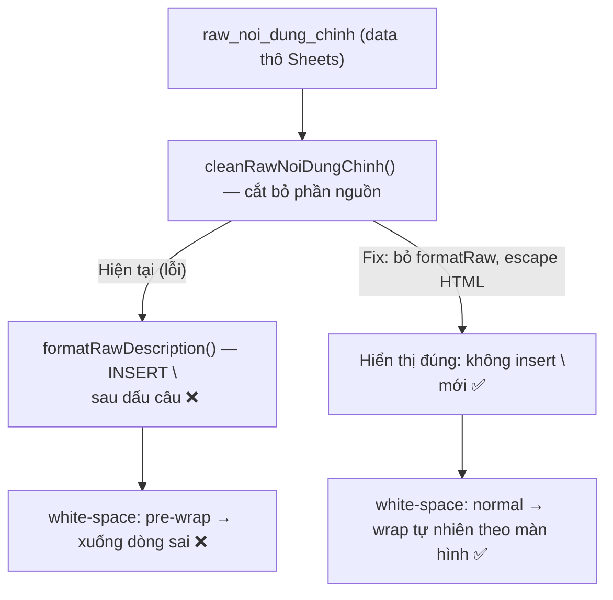

# US-082: Sửa lỗi xuống dòng Nội dung chính trong trang chi tiết Pool

## User story
**As a** Admin xem trang chi tiết căn nhà trong Pool (chưa lên sóng)
**I want** ô "Nội dung chính" hiển thị trên 1 dòng liên tục, không tự động xuống dòng theo dấu chấm/dấu câu
**So that** tôi đọc được toàn bộ nội dung thô gốc đúng như dữ liệu trong Google Sheets — không bị format lại làm khó đọc và dễ lẫn lộn thông tin

## Acceptance
- [ ] **Bug 1 — Không tự xuống dòng:** Ô "Nội dung chính" (màu đỏ, `admin-mota-box red-text`) trong trang chi tiết Pool hiển thị text trên 1 dòng liên tục (wrap theo chiều ngang màn hình), KHÔNG tự insert xuống dòng sau dấu chấm (`.`), dấu chấm than (`!`), dấu hỏi (`?`) hay trước các bullet (`-`, `+`, `*`)
- [ ] **Giữ nguyên hành vi Mô tả gốc:** Ô "Mô tả chi tiết" (`admin-mota-box black-text`, `adminMotaGocBox`) bên dưới vẫn giữ nguyên hành vi `formatRawDescription` — có xuống dòng theo dấu câu như hiện tại
- [ ] **Ví dụ pass:** Chuỗi `"727\n+ 721.2A Xô Viết Nghệ Tĩnh 131 4 3.7 25 20.9 tỷ Phường 26 Bình Thạnh 15\n- 25 tỷ HĐ Lê Văn Thơm_ĐC Phượng Hoàng 0902858978 H3GB"` phải hiển thị dạng wrap đơn giản, không insert thêm dấu `\n` giữa các phần

## Solution

> [!note]- Root Cause
> **Có 2 lớp gây lỗi xuống dòng:**
>
> **Lớp 1 — JS formatting (PRIMARY ROOT CAUSE):**
> - Hàm `formatRawDescription()` tại line ~4374 của `index.html` đang được gọi cho **cả Nội dung chính lẫn Mô tả gốc**
> - Hàm này insert `\n` sau mỗi dấu câu (`.`, `!`, `?`) và trước mỗi bullet (`-`, `+`, `*`, `•`, emoji), phù hợp cho **Mô tả** (text đã qua AI generate) nhưng **phá vỡ** Nội dung chính (data thô từ Sheets 1 dòng liên tục)
> - Line 6754 trong `openS()`:
>   ```html
>   <div class="admin-mota-box red-text">
>     ${formatRawDescription(cleanedNoiDungChinh)}
>   </div>
>   ```
>
> **Lớp 2 — CSS rendering:**
> - `.admin-mota-box` có `white-space: pre-wrap` → các ký tự `\n` đã được insert bởi `formatRawDescription()` sẽ render thành xuống dòng thật trên browser
>
> ```json
> {
>   "problem_line": "6754",
>   "bad_call": "formatRawDescription(cleanedNoiDungChinh)",
>   "css_class": ".admin-mota-box { white-space: pre-wrap }",
>   "affected_field": "Nội dung chính (raw_noi_dung_chinh)",
>   "not_affected": "Mô tả gốc (raw_mo_ta_chi_tiet) — giữ nguyên formatRawDescription"
> }
> ```

> [!note]- Key logic (Giải pháp)
> **Approach được chọn: Bỏ qua `formatRawDescription` cho Nội dung chính**
>
> Thay thế `formatRawDescription(cleanedNoiDungChinh)` bằng chính `cleanedNoiDungChinh` (escaped HTML) tại line 6754.
>
> Đồng thời, để tránh lỗi rendering với ký tự đặc biệt, cần escape HTML đơn giản (replace `<`, `>`, `&`):
>
> **Trước:**
> ```js
> <div class="admin-mota-box red-text">
>   ${formatRawDescription(cleanedNoiDungChinh) || 'Chưa có nội dung chính.'}
> </div>
> ```
>
> **Sau:**
> ```js
> <div class="admin-mota-box red-text" style="white-space: normal;">
>   ${(cleanedNoiDungChinh || 'Chưa có nội dung chính.').replace(/&/g,'&amp;').replace(/</g,'&lt;').replace(/>/g,'&gt;')}
> </div>
> ```
>
> **Lý do thêm `white-space: normal` inline:**
> - CSS class `.admin-mota-box` có `white-space: pre-wrap` (dùng chung với ô Mô tả gốc)
> - KHÔNG nên sửa class CSS chung — sẽ ảnh hưởng ô Mô tả gốc
> - Override inline `white-space: normal` CHỈ cho ô Nội dung chính là cách an toàn nhất, không tác động class chung
>
> **Bảo toàn hành vi hiện tại của `raw_mo_ta_chi_tiet` (ô đen):** Không thay đổi dòng 6755 — vẫn dùng `formatRawDescription(p.raw_mo_ta_chi_tiet || p.m)`



## 📋 Implementation Plan
> [!plan]- Kế hoạch Triển khai
> - **Phạm vi:** Chỉ sửa 1 dòng trong hàm `openS()` của `index.html`
> - **File cần sửa:** `index.html` — dòng ~6754
> - **Bước triển khai:**
>   1. Tìm đoạn render Nội dung chính trong `openS()`:
>      ```js
>      <div class="admin-mota-box red-text" style="margin-top:14px; margin-bottom:8px; font-size:12px;">
>        ${formatRawDescription(cleanedNoiDungChinh) || 'Chưa có nội dung chính.'}
>      </div>
>      ```
>   2. Thay thế `formatRawDescription(cleanedNoiDungChinh)` bằng escape HTML đơn giản + thêm `white-space: normal` vào style inline:
>      ```js
>      <div class="admin-mota-box red-text" style="margin-top:14px; margin-bottom:8px; font-size:12px; white-space: normal;">
>        ${(cleanedNoiDungChinh || 'Chưa có nội dung chính.').replace(/&/g,'&amp;').replace(/</g,'&lt;').replace(/>/g,'&gt;')}
>      </div>
>      ```
>   3. **KHÔNG thay đổi** dòng 6755 (ô Mô tả gốc / black-text) — vẫn giữ `formatRawDescription()`
>   4. Kiểm thử trực tiếp trên giao diện Admin Pool để xác nhận không còn lỗi xuống dòng sai

## 📝 Task Checklist (TODO)
> [!todo]- Danh sách việc cần làm
> - [ ] **Nghiên cứu:** [ ] Xác nhận line số của đoạn render Nội dung chính trong `openS()` | [ ] Xác nhận `cleanedNoiDungChinh` đã là plain string (không chứa HTML)
> - [ ] **Triển khai Code:** [ ] Thay thế `formatRawDescription(cleanedNoiDungChinh)` bằng plain text + HTML escape | [ ] Thêm `white-space: normal` inline style
> - [ ] **Kiểm thử:** [ ] Mở chi tiết 1 căn Pool — Nội dung chính hiển thị 1 dòng | [ ] Mở chi tiết 1 căn Pool — ô Mô tả gốc vẫn xuống dòng bình thường | [ ] Không bị lỗi XSS hoặc HTML injection từ dữ liệu thô

## 🛠️ Update Logic (Drafting while Doing)
> [!IMPORTANT]
> **Quy tắc Không Trùng Lắp (Non-Duplication Rule - BẮT BUỘC GIỮ LẠI VĨNH VIỄN):**
> - **Mục đích:** Lưu trữ lịch sử hành trình kỹ thuật thực tế (**HOW & WHY**). Tuyệt đối **KHÔNG** xóa bỏ mục này sau khi test pass.
> - **Nội dung cần ghi nhận:** Nhật ký debug, phát kiến ngoài kế hoạch, log chạy thử nháp.

### 1. Nhật ký Debug & Phát kiến ngoài kế hoạch (Debug & Discoveries Log)
- **Phát hiện:** Có 2 lớp gây lỗi — JS (`formatRawDescription` insert `\n`) + CSS (`white-space: pre-wrap`). Fix chỉ cần 1 dòng: bỏ `formatRawDescription` và override `white-space: normal` inline.
- **Quyết định override inline:** CSS class `.admin-mota-box` dùng chung cho cả ô đỏ (Nội dung chính) và ô đen (Mô tả gốc). Sửa class sẽ ảnh hưởng ô đen — vì vậy dùng `style="white-space:normal"` inline chỉ trên ô đỏ, an toàn tuyệt đối.
- **HTML escape:** Thêm `.replace(/&/g,'&amp;').replace(/</g,'&lt;').replace(/>/g,'&gt;')` để phòng trường hợp dữ liệu thô chứa ký tự HTML.
- **🔴 Root cause thật sự (phát hiện qua test):** Dữ liệu Google Sheets tại column J (Nội dung chính) chứa **ký tự `\n` vật lý** (người dùng nhập xuống dòng trong cell Sheets). `white-space:normal` trong CSS không đủ để loại bỏ `\n` đã được embed trong JS string khi inject vào `innerHTML` — browser vẫn render xuống dòng thật. Giải pháp cuối: thêm `.replace(/\r/g,'').replace(/\n/g,' ')` trước khi inject, chuyển tất cả newline thành khoảng trắng.

### 2. Nhật ký chạy thử nháp (Draft Test Logs)
- **Thay đổi 1 dòng tại line 6754** trong `openS()`: thay `formatRawDescription(cleanedNoiDungChinh)` → plain text + HTML escape + `white-space:normal`.

## 🧠 Retro, Lessons Learned & Good Practices (Bảo tồn vĩnh viễn)
> [!TIP]
> **Mục đích:** Ghi nhận lại các sự cố thực tế xảy ra khi phát triển để họp rút kinh nghiệm (Retro), đồng thời đúc kết các bài học tốt (Good Practices).

### 1. Nhật ký Sự cố & Tiến trình Retro
- **Incident-01:** Sau khi fix `formatRawDescription` + `white-space:normal`, vẫn còn lỗi — vì `\n` thật đã nằm trong JS string đọc từ Google Sheets Pool (người nhập trong Extension Chrome bấm Enter trong textarea TK). `white-space:normal` không xử lý được `\n` đã embed trong string.
- **Incident-02:** Điều tra SQLite → 0 records có `\n` trong `Noi_dung_chinh` → xác định nguồn là **Extension Chrome ghi thẳng lên GAS `doPost`** mà không strip `\n` trước khi POST.
- **Root cause thật:** Extension crawl HTML `#Detail_sNoiDung` từ TK (người dùng nhập xuống dòng trong textarea) → POST thẳng `noiDungChinh` có `\n` vào GAS → GAS `appendRow/setValues` → Google Sheets cell có `\n` → JS đọc về string có `\n` → browser render xuống dòng.

### 2. Thực tiễn tốt đúc kết (Good Practices)
- **Bài học từ US-082:** Hàm `formatRawDescription()` được thiết kế để format text đã qua AI xử lý. KHÔNG áp dụng cho data thô từ Sheets — dữ liệu thô cần giữ nguyên, chỉ wrap theo chiều ngang.
- **Nguyên tắc:** Khi override CSS class dùng chung, ưu tiên dùng `style=""` inline trên element cụ thể thay vì sửa class — tránh ảnh hưởng side-effects.
- **Bài học data pipeline từ US-082:** Khi debug lỗi ký tự đặc biệt trong dữ liệu, phải trace từng tầng: **UI render → JS string → Sheets cell → GAS write → Extension POST → HTML scrape**. Không giả định nguồn gốc mà không check từng tầng thực tế.
- **Nguyên tắc strip-at-source:** `\n` trong field text một dòng phải được strip **tại điểm đọc vào hệ thống** (GAS `doPost`, `crawl_pipeline.py`, `curator_server.py`). Strip tại UI là phòng thủ, không phải giải pháp gốc.
- **Nguyên tắc kiểm tra SQLite trước khi kết luận:** Trước khi kết luận nguồn lỗi, luôn query SQLite trực tiếp để biết data lưu trong DB có sạch không — tránh giả định sai.

## Verification Plan

> [!check]- Automated Tests
> Không có automated test — kiểm thử thủ công trên giao diện Admin

> [!check]- Manual Verification
> 1. Đăng nhập Admin, mở Pool (danh sách căn chưa lên sóng)
> 2. Click vào 1 căn có dữ liệu Nội dung chính phức tạp (VD: `727\n+ 721.2A Xô Viết Nghệ Tĩnh...`)
> 3. **Pass:** Ô đỏ "Nội dung chính" hiển thị text liên tục, không tự xuống dòng theo dấu chấm hay bullet
> 4. **Pass:** Ô đen "Mô tả chi tiết" ngay bên dưới vẫn có xuống dòng theo dấu câu (không bị ảnh hưởng)
> 5. **Pass:** Text không bị lỗi hiển thị HTML tag thô (không thấy `&lt;` hay `&gt;` ngoài ý muốn)

## Files touched
- `index.html` — Strip `\n` tại 4 điểm assign `raw_noi_dung_chinh` + bỏ `formatRawDescription` + override `white-space:normal` trong `openS()`
- `crawl_pipeline.py` — Strip `\n` trong `Noi_dung_chinh` khi crawl bulk HTML TK (line 625)
- `curator_server.py` — Strip `\n` trong `Noi_dung_chinh` khi recrawl lẻ HTML TK (line 2386)
- `pool_backend_v3.gs` — Strip `\n` trong `noiDungChinh` khi Extension ghi vào Pool qua GAS `doPost` (line 107)

## 🔄 Change Requests (Yêu cầu Thay đổi)
> [!quote]- Nhật ký các yêu cầu thay đổi nghiệp vụ của PO trong quá trình thực hiện
> *(Ghi nhận khi PO thay đổi yêu cầu cũ sang yêu cầu mới)*
> - **CR-01 (YYYY-MM-DD):**
>   - **Yêu cầu cũ:** [Mô tả yêu cầu gốc]
>   - **Yêu cầu mới:** [Mô tả yêu cầu thay đổi mới]
>   - **Tác động:** [Cập nhật Solution, Implementation Plan, v.v.]

## Notes
- Lỗi chỉ xảy ra trong trang chi tiết Pool (Admin view, `isFromPoolOnly = true`)
- Ô Mô tả gốc (`adminMotaGocBox`) là text đã qua AI → ĐƯỢC PHÉP dùng `formatRawDescription`
- Ô Nội dung chính (`cleanedNoiDungChinh`) là data thô từ Sheets → KHÔNG ĐƯỢC format lại
- `cleanRawNoiDungChinh()` đã xử lý cắt bỏ phần "nguồn" — vẫn giữ nguyên hàm đó, chỉ loại bỏ `formatRawDescription` ở bước tiếp theo
