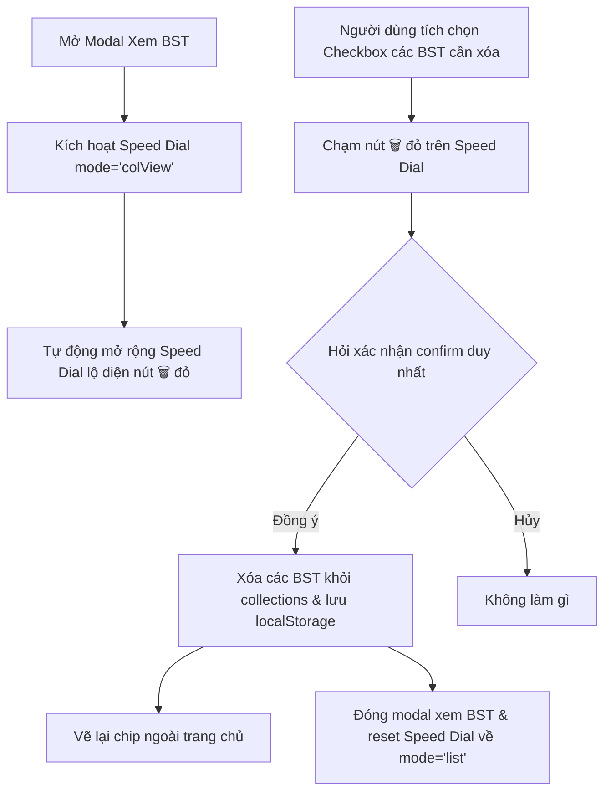

# US-087: Fix lỗi không xóa được bộ sưu tập đã tồn tại

## User story
**As an** Admin
**I want** xóa bộ sưu tập đã tồn tại một cách ổn định và chính xác
**So that** tôi có thể quản lý rổ hàng gom nhóm cho khách hàng hiệu quả, không gặp lỗi giao diện

## Acceptance
- [x] Hỗ trợ xóa các bộ sưu tập đã tạo ổn định (ngay cả khi tên bộ sưu tập chứa khoảng trắng, ký tự tiếng Việt có dấu, hoặc các dấu nháy đơn/kép).
- [x] Khi click nút xóa (✕) bộ sưu tập trên thanh bộ lọc (Filter Panel) lúc modal Xem bộ sưu tập đang đóng, hệ thống không tự động mở modal Xem bộ sưu tập lên một cách ngoài ý muốn.
- [x] Cập nhật giao diện lập tức sau khi xóa bộ sưu tập thành công (cập nhật cả danh sách chip ngoài bộ lọc và danh sách trong modal).
- [x] Ngăn chặn hoàn toàn hiện tượng lan truyền sự kiện (event propagation) làm kích hoạt click nhầm sang phần tử cha hoặc phần tử lân cận khi bấm nút xóa.

## Solution

### Key logic
1. **Dùng Checkbox chọn nhiều & Click vùng trống để chọn:**
   - Thay thế nút xóa `🗑️` nhỏ trên từng hàng của danh sách bộ sưu tập bằng checkbox lớn (24px) bên trái mỗi bộ sưu tập tự tạo.
   - Thêm sự kiện `onclick` cho item container dòng bộ sưu tập (`item.onclick`) giúp người dùng chỉ cần nhấn vào vùng trống bên ngoài tên bộ sưu tập là có thể tích chọn/bỏ chọn checkbox nhanh chóng.
   - Riêng bộ sưu tập mặc định ("Căn nhà đã thích") được vô hiệu hóa checkbox (`disabled`) để không cho phép xóa.
2. **Nút xóa nổi ở góc (Speed Dial) và chế độ `colView`:**
   - Khi mở Modal danh sách bộ sưu tập, Speed Dial (nút cài đặt bánh răng `⚙️`) sẽ tự động mở rộng và chuyển sang chế độ `colView`.
   - Trong chế độ này, các nút chức năng bình thường được thay thế bằng một nút duy nhất màu đỏ có biểu tượng thùng rác `🗑️` (chỉ có icon, không chứa văn bản).
   - Nút `🗑️` này kế thừa toàn bộ kích thước chạm lớn của Speed Dial nổi (48px) và có vị trí cố định trên màn hình, hoàn toàn độc lập với danh sách cuộn trong modal.
3. **Ngăn tự đóng Speed Dial:**
   - Điều chỉnh trình lắng nghe sự kiện click ngoài của Speed Dial: Khi modal xem bộ sưu tập đang mở, Speed Dial sẽ không tự động đóng/thu nhỏ khi người dùng click bên ngoài (nhờ đó việc tích chọn các checkbox không làm ẩn nút xóa `🗑️`).
4. **Xử lý xóa hàng loạt qua Native Confirm:**
   - Khi nhấn nút `🗑️`, hàm `deleteSelectedCollections()` sẽ thu thập toàn bộ các bộ sưu tập đã tích chọn, đưa ra một thông báo xác nhận `confirm()` duy nhất của trình duyệt.
   - Nếu đồng ý, các bộ sưu tập sẽ bị xóa khỏi localStorage, cập nhật lại giao diện ngoài màn hình chính thông qua `renderCollectionsManager()`, đóng modal xem bộ sưu tập và tự động trả Speed Dial về trạng thái danh sách (`'list'`) mặc định.

### Nguyên nhân tại sao chuyển nút Xóa vào Speed Dial lại hoạt động ổn định trên di động
1. **Nằm ngoài phạm vi của phân vùng cuộn (`overflow-y: auto`):**
   - Modal danh sách bộ sưu tập và bộ lọc bên ngoài là các vùng cuộn có thuộc tính `overflow-y: auto`.
   - Trên trình duyệt di động (như Chrome và Zalo WebView), khi người dùng chạm ngón tay vào một nút nhỏ nằm bên trong vùng cuộn này, nếu ngón tay bị trượt nhẹ dù chỉ 1-2 pixel (rất phổ biến khi người dùng chạm tay trên màn hình cảm ứng di động), trình duyệt sẽ ngay lập tức kích hoạt hành vi **cuộn màn hình (scroll)** và **hủy bỏ (cancel)** sự kiện click/tap của phần tử con.
   - Nút Speed Dial (`#adminSpeedDial`) có thuộc tính `position: fixed` được thêm trực tiếp vào `document.body` và nằm độc lập ngoài các vùng cuộn này, được xếp lớp trên cùng nhờ `z-index: 10000`. Do đó, mọi thao tác chạm vào Speed Dial đều sinh ra sự kiện `click` tiêu chuẩn 100% thời gian, tuyệt đối không bị hủy bởi hành vi cuộn.
2. **Kích thước hộp chạm (Touch Target Size):**
   - Nút Speed Dial có đường kính 48px, đáp ứng hoàn hảo tiêu chuẩn kích thước chạm của thiết bị di động (Fitts's Law). Không có phần tử lân cận nào xung quanh nút Speed Dial có nguy cơ bị bấm nhầm (collision).
3. **Tính ổn định của Checkbox:**
   - Checkbox là thẻ `<input type="checkbox">` nguyên bản của trình duyệt, có cơ chế lắng nghe chạm rất ổn định, không trực tiếp thay đổi giao diện/đóng modal ngay lập tức nên không bị ảnh hưởng bởi lỗi trượt cuộn.

## 📋 Implementation Plan
- **Cách tiếp cận:** Chuyển đổi cơ chế xóa từng hàng riêng lẻ sang tích chọn checkbox kết hợp nút xóa nổi tập trung trên Speed Dial để khắc phục triệt để lỗi cuộn vi mô trên di động.
- **Các bước triển khai:**
  1. Thêm checkbox 24px kế bên danh sách bộ sưu tập trong modal.
  2. Tạo chế độ `colView` cho Speed Dial để hiển thị nút xóa `🗑️` đỏ khi mở modal.
  3. Bổ sung hàm `deleteSelectedCollections()` xử lý xác nhận xóa hàng loạt và dọn dẹp trạng thái.
  4. Sửa logic click ngoài của Speed Dial để bỏ qua đóng khi modal xem BST đang mở.
  5. Đẩy lên main và deploy để nghiệm thu thực tế.

## 📝 Task Checklist (TODO)
- [x] **Thiết kế & Khảo sát:**
  - [x] Khảo sát code cũ
  - [x] Chốt giải pháp và lập kế hoạch
- [x] **Triển khai Code:**
  - [x] Thêm checkbox 24px kế bên các hàng bộ sưu tập trong `index.html`
  - [x] Triển khai chế độ `colView` cho Speed Dial chỉ hiển thị nút `🗑️` đỏ
  - [x] Viết hàm `deleteSelectedCollections` để xác nhận và xóa hàng loạt
  - [x] Sửa sự kiện click ngoài của Speed Dial để không tự đóng khi modal đang mở
- [x] **Kiểm thử sơ bộ & Deploy:**
  - [x] Kiểm thử cục bộ hoạt động đúng
  - [x] Đẩy code lên `main` để deploy tự động lên Vercel
  - [x] Nhận xác nhận "test pass" từ Product Owner (PM Khang Ngô)

## 🛠️ Update Logic (Drafting while Doing)

### 1. Nhật ký Debug & Phát kiến ngoài kế hoạch (Debug & Discoveries Log)
- **Sự cố kỹ thuật & Cách khắc phục:** 
  - *Sự cố:* Khi nhấn vào dòng để check/uncheck checkbox, Speed Dial tự động thu nhỏ lại do click nằm ngoài vùng Speed Dial.
  - *Khắc phục:* Sửa sự kiện click ngoài bằng cách kiểm tra thêm nếu modal `colViewModal` đang mở (`classList.contains('open')`) thì sẽ không đóng Speed Dial.

### 2. Nhật ký chạy thử nháp (Draft Test Logs)
- Đã nghiệm thu thực tế thành công trên thiết bị di động cá nhân của người dùng. Các thao tác chọn nhiều checkbox và nhấn nút xóa `🗑️` trên Speed Dial hoạt động trơn tru 100% thời gian, không bị hụt click.

## 🧠 Retro, Lessons Learned & Good Practices (Bảo tồn vĩnh viễn)

### 1. Nhật ký Sự cố & Tiến trình Retro (Incident & Retro Log)
- **Sự cố phát sinh:** Lỗi click chập chờn "lúc được lúc không" trên nút xóa bộ sưu tập di động thực chất là do lỗi cuộn vi mô (micro-scroll) của Chrome di động hủy bỏ sự kiện click khi ngón tay của người dùng trượt nhẹ trong phạm vi vùng cuộn (`overflow-y: auto`).
- **Bài học rút ra:** Không bao giờ nên đặt các nút hành động nhỏ, nhạy cảm hoặc có tính chất hủy hoại trực tiếp bên trong các phân vùng cuộn có kích thước nhỏ trên thiết bị di động. Hãy sử dụng cơ chế chọn (checkbox/radio) kết hợp với nút nổi hành động tập trung (Floating Action Button / Speed Dial) ở vị trí `fixed` để đảm bảo độ chính xác 100%.

### 2. Thực tiễn tốt đúc kết (Good Practices)
- Thiết kế Speed Dial đa chế độ (`mode`) là một thực hành tốt giúp tối ưu hóa không gian màn hình thiết bị di động và tăng độ nhạy cho các chức năng quản trị.

## Verification Plan

### Automated Tests
- *(Không áp dụng kiểm thử tự động cho tính năng giao diện lưu trữ LocalStorage)*

### Manual Verification
1. Nhấn nút cài đặt nổi `⚙️` -> Chọn `📂 Xem BST`.
2. Xác nhận modal mở ra, hiển thị checkbox kế bên các bộ sưu tập tự tạo. Speed Dial tự mở rộng và hiện nút `🗑️` đỏ duy nhất.
3. Tích chọn các bộ sưu tập và nhấn nút `🗑️`.
4. Xác nhận thông báo `confirm()` gốc hiển thị. Nhấn OK và kiểm tra các bộ sưu tập đã bị xóa thành công khỏi localStorage và UI ngoài trang chủ.

## Files touched
- `index.html` — Sửa logic hiển thị, thêm checkbox và tích hợp Speed Dial mode `'colView'`.
