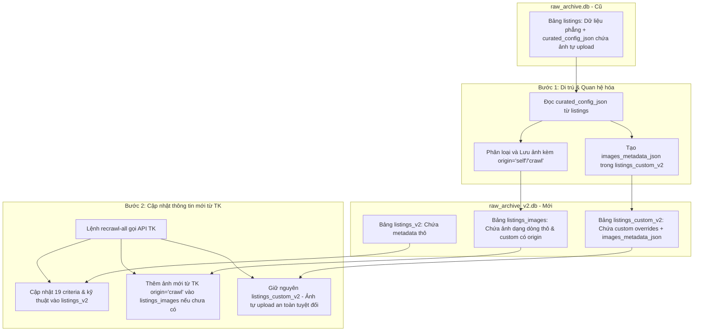

# US-089C: Triển khai Cơ chế Đồng bộ Hai Chiều Liên Database (Cross-Pool Sync)

## User story
**As an** Admin  
**I want** triển khai cơ chế đồng bộ hai chiều local giữa hai CSDL `raw_archive_v2.db` (Pool2) và `raw_archive.db` (Pool1)  
**So that** dữ liệu luôn nhất quán giữa phân hệ cũ và phân hệ mới, tránh tình trạng phải nhập liệu 2 lần và đảm bảo tương thích ngược 100%.

## Acceptance
- [ ] **Hàm đồng bộ dữ liệu `sync_between_databases(source_pool, target_pool, tk_id=None)`**:
  - Triển khai trong `pool_lego.py`, so khớp dữ liệu thông qua khóa định danh `tk_id` hoặc `System_ID`.
- [ ] **Chiều xuôi: Đồng bộ và làm phẳng (Pool2 -> Pool1 - Bảo đảm không trùng căn)**:
  - Khi một căn hộ được cập nhật/xuất bản trong Pool2, tự động lấy dữ liệu từ `listings_v2` và `listings_custom_v2`, lấy danh sách hình ảnh từ `listings_images`.
  - **Khử trùng lặp**: So khớp dòng tin trong Pool 1 theo `System_ID` hoặc `Mã Khang Ngô (ID)`. Nếu tìm thấy, thực hiện `UPDATE` đè dữ liệu mới (bao gồm cập nhật `tk_id` sang UUID mới). Nếu không tìm thấy, thực hiện `INSERT` dòng mới. Điều này ngăn chặn triệt để việc trùng lặp căn hộ trong Pool 1 do đổi mã TK.
  - Thực hiện làm phẳng danh sách ảnh: nội thất (`interior`) điền vào `Ảnh 1` đến `Ảnh 25`, hẻm (`alley`) điền vào `Hình Hẻm 1` đến `Hình Hẻm 10`, sơ đồ (`diagram`) điền vào `Sơ đồ thửa đất 1` đến `5`.
  - Ghi đè dòng dữ liệu làm phẳng tương ứng vào bảng `listings` của file `raw_archive.db`.
- [ ] **Chiều ngược: Đồng bộ và quan hệ hóa (Pool1 -> Pool2 - Ad-hoc theo Địa chỉ)**:
  - Tiến trình chạy dưới dạng **ad-hoc** nhận tham số đầu vào là **Số nhà + Tên đường** do admin nhập khi tìm trên hệ thống TK mới không thấy căn nhà tương ứng.
  - Chuẩn hóa địa chỉ và tính toán `Mã Khang Ngô (ID)` tương ứng.
  - Truy vấn CSDL Pool 1 (`raw_archive.db`) tìm dòng tin khớp địa chỉ để kéo (migrate) sang Pool 2.
  - Di trú dữ liệu phẳng sang `listings_v2` dưới dạng mã legacy `LEGACY-[mã cũ]` và trạng thái `published_legacy` (do không tìm thấy trên hệ thống mới) và lưu thông tin custom vào `listings_custom_v2`.
  - Quét các cột ảnh phẳng (25 ảnh, 10 hẻm, 5 sơ đồ) không rỗng, tách chúng thành các dòng ảnh riêng biệt chèn vào bảng `listings_images` với sequence_index.
- [ ] **Cào lại định kỳ toàn bộ CSDL (Recrawl All) & Đối chiếu thay đổi**:
  - Triển khai hành động cào lại định kỳ toàn bộ các căn trong Pool 2 (`listings_v2`), ghi vào bảng thô và không tự động đè lên bảng custom.
  - So khớp thay đổi so với dữ liệu thô cũ, lưu thông tin diff vào cột `pending_diff_json` phục vụ UI hàng đợi duyệt.
- [ ] **Duyệt cập nhật chọn lọc (Selective Apply UI & API)**:
  - Triển khai API cho phép admin chọn ghi đè các trường thông tin thay đổi cụ thể từ bảng thô (`listings_v2`) sang bảng custom (`listings_custom_v2`) và xóa hàng đợi duyệt sau khi hoàn thành.

---

## Chiến lược bảo toàn ảnh tự upload khi nâng cấp & cào lại tin (Safe Migration & Recrawl Strategy)

Để giải quyết triệt để yêu cầu lấy các trường dữ liệu kỹ thuật mới (criteria, bedrooms, restrooms, isSigned...) từ TK cho những căn đã lên sóng nhưng vẫn giữ nguyên vẹn 100% hình ảnh do người dùng tự upload trước đó, quy trình được thiết kế như sau:



1.  **Bước 1: Đồng bộ di trú & khớp địa chỉ (`sync-pool1-to-pool2`):**
    *   **Khớp nối Hệ thống TK mới qua Địa chỉ (Address Matching Bridge):**
        *   Vì mã TK cũ trong Pool 1 và mã TK mới trong Pool 2 có quy tắc khác nhau, hệ thống sử dụng **Địa chỉ nhà (Số nhà + Tên đường)** làm khóa cầu nối.
        *   Với mỗi căn trong Pool 1, hệ thống thực hiện chuẩn hóa địa chỉ (loại bỏ dấu tiếng Việt, viết thường, xóa khoảng trắng thừa, chuẩn hóa tên đường viết tắt/số như cmt8 -> cach mang thang tam, 3/2 -> ba thang hai).
        *   Gọi API tìm kiếm của hệ thống TK mới: `https://backend.thienkhoi.com/product/v1/property?searchBy=address&search=[Tên Đường]` (có thể kèm lọc theo Quận/Phường nếu có ID tương ứng để tối ưu).
        *   Quét danh sách kết quả trả về, thực hiện so khớp số nhà (`ngo_so_nha`) đã được chuẩn hóa.
        *   **Nếu khớp thành công:**
            *   Lấy mã `tk_id` mới (UUID) từ hệ thống TK mới.
            *   Gọi API lấy chi tiết căn nhà từ hệ thống mới để cào đầy đủ thông tin kỹ thuật phong phú mới (bedrooms, restrooms, criteria...) ghi vào `listings_v2` của Pool 2.
        *   **Nếu không khớp thành công (Tin cũ đã ẩn, bán hoặc không tìm thấy):**
            *   Để tránh mất mát dữ liệu, hệ thống tự động di trú dữ liệu cũ sang Pool 2 dưới mã ID tương thích ngược đặc biệt (VD: `LEGACY-[mã TK cũ]`) với trạng thái `published_legacy`.
    *   **Bảo toàn ảnh tự upload:**
        *   Hệ thống đọc `curated_config_json` từ bảng `listings` cũ. Cột này lưu giữ mảng cấu hình ảnh hoàn chỉnh đã duyệt, bao gồm các link ảnh R2/Cloudinary tự tải lên kèm vai trò.
        *   Hệ thống sẽ bóc tách và chuyển các ảnh tự upload này vào bảng `listings_images` (với role thích hợp, gán nhãn `origin='self'`) và đồng thời ghi nhận vào trường `images_metadata_json` của bảng tùy biến `listings_custom_v2`.
        *   *Kết quả:* Ảnh tự upload được bảo toàn nguyên trạng URL và phân nhóm tại database mới.

2.  **Bước 2: Tiến trình Cào lại Định kỳ toàn bộ CSDL (`recrawl-all`):**
    *   Chúng ta triển khai hành động `--action recrawl-all` chạy CLI định kỳ (cron job) hoặc gọi API.
    *   Tiến trình này sẽ quét qua **toàn bộ** danh sách các căn hiện có trong database Pool 2 (bảng `listings_v2`), không phân biệt đã lên sóng hay chưa lên sóng.
    *   Sử dụng cookie Zalo/TK hiện có để gọi Proptech API Thiên Khôi để lấy các thông tin thô mới nhất.
    *   Hệ thống ghi đè thông tin mới vào bảng thô `listings_v2` và chỉ chèn thêm hình ảnh thô mới từ TK vào bảng `listings_images` nếu chưa tồn tại (so khớp `image_url` tránh trùng, gán `origin='crawl'`).
    *   Hệ thống **tuyệt đối không tự động ghi đè** lên bảng custom `listings_custom_v2` để tránh làm hỏng các chỉnh sửa thủ công của admin. Thay vào đó, nó sẽ ghi nhận các thay đổi phát hiện được vào queue để duyệt.
    *   *Kết quả:* Toàn bộ database thô được cập nhật định kỳ, các khác biệt được tổng hợp lại để chờ admin phê duyệt thủ công.

---

## Giải pháp Lưu trữ Nguồn gốc Hình ảnh (Image Origin Tracking)

Quyết định bổ sung trường **`origin`** vào bảng `listings_images` mang lại nhiều giá trị nghiệp vụ quan trọng:

*   **Định nghĩa Cột:** `origin TEXT DEFAULT 'crawl'` (chứa giá trị `'crawl'` đối với ảnh cào tự động từ Thiên Khôi và `'self'` đối với ảnh do Admin tự upload thủ công).
*   **Lợi ích Thực tế:**
    1.  **Tránh ghi đè nhầm (Recrawl Safety):** Khi tiến trình cào lại hoạt động, hệ thống biết chính xác chỉ thêm/đồng bộ các ảnh có `origin = 'crawl'`, tuyệt đối không động chạm hoặc ghi đè lên các ảnh `origin = 'self'`.
    2.  **Kiểm toán chất lượng ảnh (Auditing Efficiency):** Việc lọc tìm các căn nhà chứa hình ảnh tự chụp để kiểm tra dung lượng/ R2 CDN trở nên cực kỳ đơn giản qua câu lệnh SQL (`SELECT * FROM listings_images WHERE origin = 'self'`) thay vì phải phân tích/so khớp chuỗi URL phức tạp.
    3.  **Hỗ trợ giao diện UI (UI Badges):** Giao diện Web Admin Curator có thể hiển thị biểu tượng/nhãn riêng (ví dụ: "Ảnh tự chụp" 📸) để Biên tập viên phân biệt nhanh chóng với ảnh thô của TK.

---

## Cơ chế Đối chiếu & Tổng hợp Thay đổi (Crawl Diff Tracking)

Để giúp biên tập viên biết chính xác thông tin nào đã thay đổi sau khi cào lại định kỳ và cho phép họ duyệt cập nhật thủ công từ bảng thô (`listings_v2`) sang bảng tùy biến (`listings_custom_v2`), hệ thống sẽ triển khai quy trình sau:

1. **Lưu trữ Khác biệt Phát hiện (`pending_diff_json`)**:
   - Bổ sung cột **`pending_diff_json TEXT`** vào bảng `listings_v2` của Pool 2.
   - Khi tiến trình cào lại hoạt động, trước khi ghi đè vào `listings_v2`, hệ thống so sánh dữ liệu mới cào với dữ liệu thô cũ trong CSDL.
   - So khớp các trường nghiệp vụ quan trọng (Giá chào `Gia_chao`, Trạng thái nguồn `status_nguon`, Mô tả chi tiết, Số phòng ngủ, Số nhà vệ sinh, Hướng, Diện tích, Số tầng, Mặt tiền, và các cột Criteria).
   - Nếu phát hiện thay đổi, hệ thống tổng hợp thành cấu trúc JSON và lưu vào cột `pending_diff_json` để đánh dấu tin này có thay đổi mới từ partner.
     ```json
     {
       "gia_tri_thay_doi": {
         "Gia_chao": {"label": "Giá chào", "old": "15 tỷ", "new": "14.5 tỷ"},
         "status_nguon": {"label": "Trạng thái", "old": "Đang bán", "new": "Dừng bán"}
       }
     }
     ```
   - Nếu dữ liệu cào lại giống hệt dữ liệu cũ, cột `pending_diff_json` sẽ được đặt về `NULL`.

2. **UI & API Duyệt & Cập nhật Chọn lọc (Selectively Apply Updates)**:
   - **Giao diện Hàng đợi Duyệt (Review Queue)**: Thêm màn hình/tab trong Web Admin liệt kê các căn nhà có `pending_diff_json IS NOT NULL`.
   - **Modal So sánh Side-by-Side**: Khi admin click xem, UI hiển thị bảng đối chiếu 3 cột:
     - Tên trường | Giá trị Custom hiện tại | Giá trị Raw mới từ TK | Hành động (Cập nhật sang Custom)
   - **API Cập nhật Chọn lọc**:
     - Thêm endpoint `POST /api/listings/apply-diff` nhận payload `{ "System_ID": "...", "fields": ["Gia_chao", "status_nguon"] }`.
     - API đọc các trường được chọn từ bảng thô `listings_v2` và ghi đè sang cột tương ứng ở bảng tùy biến `listings_custom_v2`.
     - Tự động xóa `pending_diff_json` (set về `NULL`) sau khi admin hoàn tất cập nhật hoặc bấm "Bỏ qua thay đổi".

3. **Hiển thị Kết quả CLI**:
   - Khi chạy CLI `--action recrawl-all`, hệ thống in ra bảng màu/nhật ký text các trường thay đổi ra terminal cho từng căn hộ để kiểm soát thời gian thực.

---

## User Review Required

> [!IMPORTANT]
> **1. Ranh giới Database:**
> Mặc định, cả hai file `raw_archive.db` và `raw_archive_v2.db` phải nằm trong cùng thư mục gốc của dự án. Hệ thống sẽ tự động gọi `init_db()` để tạo các cấu trúc bảng nếu database đích chưa tồn tại trước khi chạy đồng bộ.
>
> **2. Rã/Gom hình ảnh:**
> - **Chiều xuôi (Pool2 -> Pool1):** 
>   - `interior` -> phẳng lần lượt `Anh_1..25`
>   - `alley` -> phẳng lần lượt `Hinh_Hem_1..10`
>   - `diagram` -> phẳng lần lượt `So_do_thua_dat_1..5`
>   - `facade` / `cover` -> `Hinh_Mat_Tien`. Nếu không có, tự động lấy `Anh_1` làm fallback.
> - **Chiều ngược (Pool1 -> Pool2):**
>   - Đọc các cột ảnh phẳng và đưa vào bảng `listings_images` với sequence_index tương ứng.
>   - Tự động lọc sạch các ô ảnh rỗng để tránh tạo các bản ghi rác trong `listings_images`.
>   - Nếu link ảnh chứa Cloudflare R2 (`r2.dev`) hoặc Cloudinary (`cloudinary.com`), lưu đồng thời vào cả hai trường `image_url` và `cloudinary_url` trong `listings_images` để bảo toàn tiến trình di cư ảnh.

---

## Solution

### 1. Phân tách và làm phẳng ảnh (Pool2 -> Pool1)
- Truy vấn `listings_v2` và `listings_custom_v2` bằng khóa chính `tk_id`/`System_ID`.
- Truy vấn các dòng hình ảnh tương ứng trong `listings_images`.
- **Khử trùng lặp**: Tra cứu dòng tin trong Pool 1 matching theo `System_ID`. Nếu không có, matching theo `Mã Khang Ngô (ID)`. Nếu khớp, thực hiện `UPDATE` ghi đè dòng đó thay vì chèn dòng mới.
- Phân loại ảnh theo vai trò (`diagram`, `alley`, `interior`, `facade`/`cover`).
- Ánh xạ mảng ảnh phẳng vào các cột `POOL_HEADERS` tương ứng:
  - `interior` -> phẳng lần lượt `Anh_1` đến `Anh_25`.
  - `alley` -> phẳng lần lượt `Hinh_Hem_1` đến `Hinh_Hem_10`.
  - `diagram` -> phẳng lần lượt `So_do_thua_dat_1` đến `So_do_thua_dat_5`.
  - `facade`/`cover` -> `Hinh_Mat_Tien` (nếu không có, lấy `Anh_1` làm fallback).
- Ghi đè hoặc cập nhật vào bảng `listings` ở `raw_archive.db`.

### 2. Khớp địa chỉ & Quan hệ hóa ảnh phẳng Ad-hoc (Pool1 -> Pool2)
- Nhận tham số đầu vào là **Số nhà + Tên đường** cần tìm kiếm từ Pool 1.
- Chuẩn hóa địa chỉ đầu vào và truy vấn trong bảng `listings` của CSDL Pool 1 tìm dòng tin khớp địa chỉ (khớp theo `Mã Khang Ngô (ID)` hoặc số nhà/tên đường đã chuẩn hóa).
- Nếu tìm thấy: Kéo bản ghi này sang Pool 2, ghi thông tin thô vào `listings_v2` dưới mã legacy `LEGACY-[mã cũ]` (trạng thái `published_legacy`) và lưu custom overrides vào `listings_custom_v2`.
- Quét toàn bộ các cột ảnh phẳng của dòng dữ liệu:
  - Nếu cột ảnh có giá trị (không rỗng):
    - Xác định vai trò dựa trên cột nguồn (`Anh_X` -> `interior`, `Hinh_Hem_X` -> `alley`, `So_do_thua_dat_X` -> `diagram`, `Hinh_Mat_Tien` -> `facade`).
    - **Phân loại nguồn gốc:** So khớp URL ảnh phẳng với mảng `raw_images_tk_json` và `raw_drive_images_json` để tự động gán nhãn `origin = 'crawl'` hoặc `origin = 'self'`.
    - Lưu đồng thời vào `image_url` and `cloudinary_url` (nếu chứa `cloudinary.com` hoặc `r2.dev`).
    - Ghi dòng mới vào `listings_images` liên kết theo `tk_id` kèm `sequence_index` tự tăng.
- Gom các ảnh an toàn (`interior` và `alley`) lưu vào mảng JSON `images_metadata_json` ở `listings_custom_v2`.

### 3. Cào lại Định kỳ toàn bộ CSDL (Recrawl All)
- Cấu hình CLI nhận `--action recrawl-all` để cào lại toàn bộ các căn trong Pool 2 (`listings_v2`), bất kể đã lên sóng hay chưa.
- Ghi dữ liệu thô mới nhất vào `listings_v2` và cập nhật ảnh thô mới vào `listings_images` (`origin = 'crawl'`).
- Không tự động cập nhật bảng custom `listings_custom_v2` để bảo toàn tùy chỉnh thủ công của admin.

### 4. Đối chiếu & Duyệt cập nhật Chọn lọc (Crawl Diff & Selective Apply)
- **Lưu trữ diff**: So sánh dữ liệu cào mới với dữ liệu cũ trong `listings_v2`. Nếu có thay đổi ở các trường chính (Giá chào, Trạng thái nguồn, Mô tả, Số PN, Số WC, các cột Criteria...), tổng hợp vào cột `pending_diff_json` của bảng `listings_v2`.
- **Hàng đợi duyệt**: Web Admin hiển thị hàng đợi các căn có `pending_diff_json IS NOT NULL`.
- **API Cập nhật chọn lọc**: Triển khai API `POST /api/listings/apply-diff` để lưu các trường do admin chọn từ raw `listings_v2` sang custom `listings_custom_v2`, và `POST /api/listings/clear-diff` để bỏ qua thay đổi (set `pending_diff_json` về `NULL`).

---

## 📋 Implementation Plan

### 1. Viết hàm đồng bộ & cào lại trong `pool_lego.py`
- Bổ sung cột `origin` cho `listings_images` và cột `pending_diff_json` cho `listings_v2` (tích hợp self-healing migration).
- Cài đặt `sync_between_databases(source_pool, target_pool, tk_id=None)` chống trùng căn khi đồng bộ xuôi Pool2 -> Pool1.
- Cài đặt `recrawl_all_listings()` để quét và cào lại định kỳ toàn bộ CSDL, thực hiện so khớp và lưu log thay đổi vào `pending_diff_json`.

### 2. CLI Entrypoint trong `pool_lego.py`
- Tích hợp argparse nhận `--action` (`sync-pool2-to-pool1`, `sync-pool1-to-pool2`, hoặc `recrawl-all`).
- Gọi hàm tương ứng và xuất nhật ký log thay đổi trực quan ra terminal.

### 3. Flask API trong `manager.py`
- Thêm endpoint `POST /api/sync-databases` nhận JSON `{ "source": "...", "target": "...", "tk_id": "..." }`.
- Thêm endpoint `POST /api/sync-databases/recrawl-all` chạy ngầm cào lại định kỳ toàn bộ CSDL.
- Thêm endpoint `POST /api/listings/apply-diff` và `POST /api/listings/clear-diff` phục vụ UI duyệt cập nhật chọn lọc.

---

## 📝 Task Checklist (TODO)

- [ ] **Thiết kế & Khảo sát:**
  - [x] Đối chiếu schema 100 cột phẳng cũ và schema quan hệ mới để đảm bảo mapping chuẩn xác.
- [ ] **Triển khai Code:**
  - [ ] Thêm cột `origin TEXT DEFAULT 'crawl'` và logic di trú tự động cho bảng `listings_images` trong `pool_lego.py`.
  - [ ] Thêm cột `pending_diff_json TEXT` và logic di trú tự động cho bảng `listings_v2` trong `pool_lego.py`.
  - [ ] Triển khai hàm `sync_between_databases()` và logic CLI trong `pool_lego.py`.
  - [ ] Triển khai hàm `recrawl_all_listings()` trong `pool_lego.py`.
  - [ ] Triển khai logic đối chiếu dữ liệu (Crawl Diff Tracking) khi lưu thô trong `pool_lego.py`.
  - [ ] Bổ sung các endpoint API đồng bộ, cào lại và trả về log thay đổi trong `manager.py`.
- [ ] **Kiểm thử cục bộ & Đảm bảo Chất lượng:**
  - [ ] Viết script unit test `scratch/test_cross_pool_sync.py` chạy thử đồng bộ hai chiều và cào lại tin đã lên sóng trên DB mock.
  - [ ] Viết unit test kiểm chứng cơ chế đối chiếu thay đổi (diff tracking) trả về đúng cấu trúc so sánh cũ/mới.
  - [ ] Đảm bảo 100% test pass và không có lỗi cú pháp.

---

## Verification Plan

### Automated Tests
- Chạy biên dịch kiểm tra lỗi cú pháp: `python -m py_compile pool_lego.py manager.py`.
- Viết unit test tự động tại `scratch/test_cross_pool_sync.py` chạy thử đồng bộ hai chiều, verify số lượng bản ghi văn bản và hình ảnh dạng dòng khớp 100% ở cả hai DB. Kiểm chứng cào lại không làm mất ảnh tự upload và nhãn `origin` được gán chính xác.

### Manual Verification
1. Gọi lệnh CLI đồng bộ ngược toàn bộ DB cũ sang mới theo địa chỉ ad-hoc: `python pool_lego.py --action sync-pool1-to-pool2 --so_nha "12/34" --duong "Nguyễn Trãi"`.
2. Kiểm tra `raw_archive_v2.db` xem số lượng bản ghi và hình ảnh trong `listings_images` đã khớp với rổ hàng cũ và kiểm chứng cột `origin` phân loại chuẩn `'crawl'` / `'self'`.
3. Gọi CLI cào lại định kỳ toàn bộ CSDL: `python pool_lego.py --action recrawl-all`.
4. Kiểm tra các trường kỹ thuật mới và verify ảnh tự upload vẫn được bảo toàn nguyên vẹn trong `listings_custom_v2`.
5. Gọi API `/api/sync-databases` bằng cURL hoặc từ giao diện để xác minh đồng bộ xuôi `sync-pool2-to-pool1` một căn lẻ hoạt động trơn tru.

---

## Files touched
- `pool_lego.py` — Chứa hàm đồng bộ liên CSDL và CLI.
- `manager.py` — API Router đồng bộ.
- `docs/stories/_inbox/US-089C_pool2_cross_pool_sync.md` — User Story.
