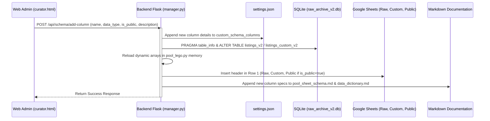
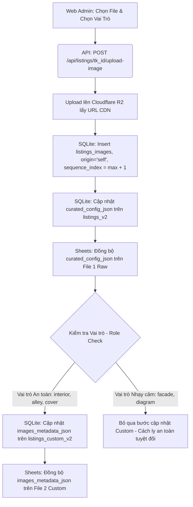

# US-089D: Luồng Tự động Mở rộng Schema, Đăng tải Hình ảnh Thủ công & Chuyển đổi toàn diện sang R2

## User story
**As an** Admin  
**I want** xây dựng tính năng tự động mở rộng thuộc tính mới (Dynamic Schema), luồng tải lên hình ảnh thủ công từ Web Admin, và chuyển đổi toàn bộ dự án từ Cloudinary sang Cloudflare R2  
**So that** quy trình mở rộng schema diễn ra đồng bộ chỉ sau 1 thao tác, và hình ảnh tự thêm hay cào mới được lưu trữ, phân phối an toàn, nhất quán bằng Cloudflare R2 thay thế hoàn toàn Cloudinary.

## Acceptance
- [ ] **API Tự động mở rộng thuộc tính (`POST /api/schema/add-column`)**:
  - Nhận tên cột, kiểu dữ liệu, flag whitelist công khai và mô tả.
  - Tự động hóa đồng thời 4 bước không thể gián đoạn (Atomic Flow):
    1. Thêm cột mới vào `settings.json` (danh sách whitelist/schema).
    2. Chạy `ALTER TABLE ADD COLUMN` nâng cấp database local cho `listings_v2` và `listings_custom_v2`.
    3. Gọi Google Sheets API chèn thêm cột tiêu đề mới vào File 1 Raw, File 2 Custom và File 3 Public (nếu thuộc whitelist).
    4. Tự động ghi nhận thông tin cột mới vào file tài liệu [docs/pool_sheet_schema.md](file:///d:/LHTBrain/01_PROJECTS/BDS-KhangNgo/docs/pool_sheet_schema.md) và [docs/data_dictionary.md](file:///d:/LHTBrain/01_PROJECTS/BDS-KhangNgo/docs/data_dictionary.md).
- [ ] **Đăng tải ảnh thủ công từ Web Admin**:
  - Hỗ trợ tải ảnh lên Cloudflare R2 lấy link CDN.
  - Lưu bản ghi ảnh vào SQLite table `listings_images` (local) và cập nhật cột `curated_config_json` trên File 1 Raw.
  - Nếu vai trò ảnh là an toàn (`interior`, `alley`, `cover`), tự động cập nhật liên kết mới vào chuỗi `images_metadata_json` trên File 2 Custom.
  - Nếu là ảnh nhạy cảm (`facade`, `diagram`), chỉ lưu tại SQLite (listings_images) và cột `curated_config_json` của File 1 Raw, tuyệt đối cách ly khỏi `images_metadata_json` của Custom.
- [ ] **Loại bỏ hoàn toàn Cloudinary và chuyển đổi sang R2 (Áp dụng toàn dự án)**:
  - Tự động đổi tên cột `cloudinary_url` thành `r2_url` trong bảng `listings_images` của cơ sở dữ liệu SQLite local để phản ánh đúng hạ tầng thực tế.
  - Đồng bộ hóa toàn bộ câu lệnh SQL, API và logic trong python backend (`manager.py`, `pool_lego.py`) tham chiếu đến `cloudinary_url` chuyển sang `r2_url`.
  - Thay thế trường `cloudinary_url` bằng `r2_url` ở phía Client và Curator Dashboard (`index.html`, `curator.html`, `curator_html_data.py`).
  - Xóa bỏ các cấu hình Cloudinary (`cloudinary_cloud_name`, `cloudinary_api_key`, `cloudinary_api_secret`) khỏi `settings.json` và codebase.

## Solution

### 1. Luồng Tự động mở rộng Schema (Atomic Schema Extension)
Khi Biên tập viên thêm một thuộc tính mới (ví dụ: "Pháp lý"), hệ thống sẽ thực hiện chuỗi các bước không được phép gián đoạn (Atomic Flow):



- **Mở rộng settings.json:** Lưu thông số cấu hình của cột mới dưới dạng danh sách cấu trúc để đảm bảo tính tiến hóa và tự phục hồi khi reset.
- **SQLite Migrations:** Dùng lệnh `PRAGMA table_info` kiểm tra xem cột đã tồn tại chưa để tránh lỗi. Sau đó, chạy `ALTER TABLE ADD COLUMN` trên cả hai bảng `listings_v2` (theo `data_type` được chọn) và `listings_custom_v2` (kiểu `TEXT` để phục vụ custom edit).
- **Google Sheets Header Ingestion:**
  - File 1 Raw: Thêm vào cuối dòng 1.
  - File 2 Custom: Thêm vào cuối dòng 1.
  - File 3 Public (nếu `is_public` = `true`): Chèn cột mới **trước cột "Last updated"** (vốn là ranh giới phân tách các cột metadata ảnh phía sau).
- **Tài liệu hóa tự động:** Định vị bảng Markdown trong `docs/pool_sheet_schema.md` và `docs/data_dictionary.md` để tự động chèn một hàng mô tả mới vào cuối bảng, giữ cho tài liệu luôn cập nhật song hành cùng code.

---

### 2. Luồng Tải ảnh thủ công & Cách ly Hình ảnh Nhạy cảm (Manual Upload & Role Isolation)
Biên tập viên có thể tải lên tệp ảnh từ giao diện. Hệ thống tải tệp trực tiếp lên Cloudflare R2, sau đó lưu vết vào SQLite cục bộ và Google Sheets theo cơ chế cách ly PII:



- **Quy định về ảnh tại File Custom (Bảo mật PII):**
  - Các ảnh vai trò `facade` (mặt tiền) và `diagram` (sổ đỏ/sơ đồ) chỉ nằm ở CSDL thô cục bộ và cột `curated_config_json` của File 1 Raw.
  - Tuyệt đối cách ly khỏi File 2 Custom và File 3 Public nhằm loại bỏ hoàn toàn nguy cơ rò rỉ địa chỉ hoặc thông tin nội bộ của chủ nhà ra ngoài khi tạo link share.

---

### 3. Di cư và Đổi tên cột từ Cloudinary sang R2
*   **Database Migration:** Khi hàm `init_db()` được khởi chạy, nó sẽ tự động truy vấn thông tin bảng `listings_images`. If có cột `cloudinary_url` nhưng không có cột `r2_url`, hệ thống sẽ tự động chạy:
    ```sql
    ALTER TABLE listings_images RENAME COLUMN cloudinary_url TO r2_url;
    ```
*   **Backend Refactor:** Đổi tên tất cả các biến, câu lệnh SQL và khóa JSON từ `cloudinary_url` sang `r2_url`. Loại bỏ hoàn toàn module và cấu hình của Cloudinary.
*   **Client Refactor:** Cập nhật tệp `index.html` và `curator.html` đổi trường tham chiếu sang `r2_url`, nhận diện ảnh R2 để hiển thị và tối ưu hóa hình ảnh.

---

## 📋 Implementation Plan
> [!plan]- Kế hoạch Triển khai
> - **Cách tiếp cận:** Tích hợp di cư SQLite tự động đổi tên cột sang `r2_url`. Refactor toàn bộ backend python và các trang HTML frontend sử dụng `r2_url` thay thế `cloudinary_url`. Cài đặt API endpoint cập nhật schema và API upload ảnh thủ công đẩy lên Cloudflare R2.
> - **Các bước triển khai:**
>   1. Viết logic di cư schema trong `pool_lego.py` -> `init_db()`.
>   2. Thay thế `cloudinary_url` bằng `r2_url` trong `pool_lego.py` và `manager.py`.
>   3. Viết API router `POST /api/schema/add-column` trong `manager.py`.
>   4. Viết API router `POST /api/listings/<tk_id>/upload-image` đẩy lên R2.
>   5. Cập nhật frontend `curator.html`, `index.html` sử dụng `r2_url` và đổi nhãn Cloudinary -> R2.
>   6. Loại bỏ cấu hình Cloudinary khỏi `settings.json`.

## 📝 Task Checklist (TODO)
> [!todo]- Danh sách việc cần làm để theo dõi tiến độ
> - [ ] **Phân hệ Cơ sở dữ liệu (pool_lego.py):**
>   - [ ] Cập nhật định nghĩa bảng `listings_images` đổi tên cột thành `r2_url`.
>   - [ ] Viết đoạn mã auto-migration đổi tên cột từ `cloudinary_url` sang `r2_url` trong `init_db()`.
>   - [ ] Thay thế tham chiếu `cloudinary_url` thành `r2_url` trong các câu lệnh SQL của `pool_lego.py`.
> - [ ] **Phân hệ Web Backend (manager.py):**
>   - [ ] Thay thế tham chiếu `cloudinary_url` thành `r2_url` trong các câu lệnh SQL của `manager.py`.
>   - [ ] Loại bỏ hàm `upload_image_to_cloudinary()` và logic upload Cloudinary.
>   - [ ] Triển khai API `/api/listings/<tk_id>/upload-image` tải ảnh lên R2.
>   - [ ] Triển khai API `/api/schema/add-column` cập nhật cấu hình và DB.
> - [ ] **Phân hệ Frontend (curator.html & index.html):**
>   - [ ] Đổi tên trường `cloudinary_url` thành `r2_url` trong `curator.html` và `index.html`.
>   - [ ] Cập nhật giao diện Trạm ảnh (Image Station) hỗ trợ form upload lên R2 thủ công.
>   - [ ] Cập nhật hàm tối ưu hiển thị ảnh `fixImgUrl` hỗ trợ nhận diện domain R2.
>   - [ ] Đồng bộ hóa `curator.html` sang `curator_html_data.py`.
> - [ ] **Kiểm thử & Khởi chạy:**
>   - [ ] Tạo unit test kiểm chứng di cư SQLite tự động `scratch/test_r2_migration.py`.
>   - [ ] Loại bỏ cấu hình Cloudinary cũ trong `settings.json`.
>   - [ ] Xác minh toàn bộ ảnh hiển thị sắc nét từ R2 trên Web Client.

## Verification Plan

### Automated Tests
- Chạy biên dịch kiểm tra lỗi cú pháp: `python -m py_compile pool_lego.py manager.py`.
- Viết unit test tự động di cư SQLite và gọi API upload ảnh tại `scratch/test_r2_migration.py` để verify dữ liệu.

### Manual Verification
1. Xóa các khóa Cloudinary trong settings.json, chạy Flask server.
2. Kiểm tra SQLite xem cột `cloudinary_url` đã được đổi thành `r2_url` và dữ liệu link R2 cũ được giữ nguyên.
3. Mở client dashboard và admin dashboard, verify ảnh hiển thị bình thường.
4. Tải lên ảnh mới và verify link R2 được lưu đúng trường `r2_url` trên SQLite và Sheets.

## Files touched
- `settings.json` — Loại bỏ cấu hình Cloudinary.
- `pool_lego.py` — Schema và di cư database.
- `manager.py` — API upload R2 và API schema.
- `curator.html` — Thay đổi giao diện R2 và upload.
- `index.html` — Hiển thị ảnh qua trường `r2_url` và fixImgUrl.
- `curator_html_data.py` — Đồng bộ HTML.
- `docs/stories/_inbox/US-089D_pool2_dynamic_schema.md` — User Story.
