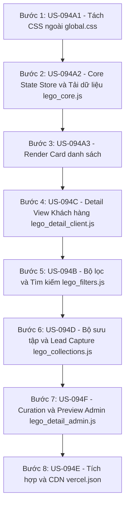

# US-094: Tái cấu trúc trang chủ index.html theo Kiến trúc Lego Frontend

## Master User Story
**As an** Admin / Developer  
**I want** phân rã tệp index.html nguyên khối 12,000 dòng thành các khối module Lego Frontend độc lập và kiểm soát trạng thái bằng LegoState Store  
**So that** hệ thống chạy mượt mà, ổn định trên cả Desktop & Mobile, loại bỏ hoàn toàn rủi ro hồi quy sập chéo, và tăng tốc độ tải trang qua CDN caching của Vercel.

## 🚨 Nguyên Tắc Vận Hành & Bảo Vệ Hệ Thống (BẮT BUỘC)

> [!IMPORTANT]
> **Chiến lược Tích hợp & Bàn giao Liên tục (CI/CD Continuous Delivery):**
> Nhằm giảm thiểu tối đa rủi ro tích hợp, chúng ta **bắt buộc** phải hoàn thiện, kiểm thử, nghiệm thu và gộp (merge) từng US con lên nhánh chính `main` (Production) trước khi chuyển sang US con tiếp theo. Tuyệt đối **không tích lũy** cả 8 US con để gộp chung 1 lần. 
> *Luồng thực hiện:* Tạo nhánh ảo `feature/US-094A1` ➔ Phát triển & Test 100% PASS ➔ PO duyệt Sandbox ➔ Chạy quy trình `Test Pass.md` để merge vào `main` & deploy Live ➔ Xóa nhánh ảo ➔ Tạo tiếp nhánh ảo `feature/US-094A2` từ `main` mới.

> [!IMPORTANT]
> **Khớp nối trạng thái toàn cục Event-Driven (`window.LegoState`):**
> Nhằm tránh rủi ro **Phụ thuộc vòng (Circular Dependency)**, Core State Store sẽ hoạt động theo mô hình Event-Driven thuần túy:
> *   Store (`lego_core.js`) chỉ quản lý lưu trữ dữ liệu và phát đi các sự kiện (`"rawDataLoaded"`, `"filtersChanged"`).
> *   Core **tuyệt đối không gọi trực tiếp** các hàm lọc của `lego_filters.js` hay render của `lego_render.js`. Các module ngoài tự đăng ký lắng nghe (subscribe) và tương tác ngược lại thông qua các API Setter chuẩn hóa của Store.

> [!IMPORTANT]
> **Hiệu năng vẽ lại DOM & Chống chớp nháy (DOM Reflow Mitigations):**
> *   Mọi thao tác vẽ lại danh sách hàng loạt bắt buộc phải sử dụng **`DocumentFragment`** để dựng giao diện trong bộ nhớ đệm trước khi append vào DOM, giảm thiểu tối đa hiện tượng chớp nháy màn hình (layout shift).
> *   Áp dụng kỹ thuật **Debounce** (150-200ms) cho các ô tìm kiếm gõ chữ thời gian thực để tránh quá tải CPU trình duyệt.

> [!IMPORTANT]
> **Bảo mật trạng thái & Xử lý lỗi nạp động (Security & Graceful Degradation):**
> *   Việc nạp động module Admin (`lego_detail_admin.js`) phải được bọc trong cấu trúc **Error Boundary** (`try/catch` hoặc `.catch()`) để hiển thị cảnh báo UI thân thiện cho người dùng nếu kết nối mạng lỗi thay vì treo ngầm ứng dụng.
> *   Tránh rủi ro **Giả mạo trạng thái (State Tampering)** bằng cách bắt buộc xác thực sự tồn tại và tính hợp lệ của Google Access Token tại local trước khi render các tính năng Admin nhạy cảm.

---

## Chiến lược Di cư & Kiến trúc Khớp nối (Migration & Integration Strategy)
- **Cách tiếp cận:** Di cư từng bước cô lập (Incremental Refactoring) bắt đầu từ việc tách CSS Core ➔ Cấu trúc dữ liệu và Render danh sách ➔ Chi tiết modal của Khách hàng ➔ Bộ lọc và giỏ hàng ➔ Đặc quyền Curation của Admin ➔ Tích hợp & dọn dẹp.
- **Khớp nối dữ liệu (Data & State Junction):** Các module Javascript giao tiếp không đồng bộ thông qua mô hình Store đóng gói `window.LegoState` bằng cơ chế Event-Driven (chỉ phát và nhận sự kiện, không gọi trực tiếp hàm của nhau).
- **Sơ đồ kiến trúc phân rã (Decomposition Map):**

## Bảng theo dõi các User Stories con (Sub-US Progress Tracker)

| Mã US | Tên User Story Con | Size | Trạng thái | Link Tài liệu |
| :--- | :--- | :---: | :---: | :--- |
| US-094A1 | Tách biệt CSS ngoài ra global.css | S | accepted | [[US-094A1_lego_frontend_css\|US-094A1]] |
| US-094A2 | Xây dựng Lego Core State Store & Tải dữ liệu | M | accepted | [[US-094A2_lego_frontend_core\|US-094A2]] |
| US-094A3 | Phân tách Engine Render danh sách Card BĐS | M | accepted | [[US-094A3_lego_frontend_render\|US-094A3]] |
| US-094C | Cô lập Module Chi tiết & Carousel thực tế của Khách hàng | S | accepted | [[US-094C_lego_frontend_preview\|US-094C]] |
| US-094B | Cô lập Module Bộ lọc & Tìm kiếm thông minh | M | accepted | [[US-094B_lego_frontend_filters\|US-094B]] |
| US-094D | Cô lập Module Bộ sưu tập & Lead Capture | S | accepted | [[US-094D_lego_frontend_collections\|US-094D]] |
| US-094F | Cô lập Module Chi tiết, Preview & Curation dành riêng cho Admin | L | accepted | [[US-094F_lego_frontend_curation\|US-094F]] |
| US-094E | Tích hợp toàn diện, tối ưu hiệu năng và dọn dẹp index.html | S | accepted | [[US-094E_lego_frontend_integration\|US-094E]] |

## 📋 Overall Progress Checklist
- [x] **US-094A1:** Tách biệt CSS ra file `global.css` (Chốt ngày: 2026-06-15)
- [x] **US-094A2:** Xây dựng Store `LegoState` và silent login Google (Chốt ngày: 2026-06-15)
- [x] **US-094A3:** Phân tách Render Card Khách hàng và Admin sử dụng `DocumentFragment` (Chốt ngày: 2026-06-16)
- [x] **US-094C:** Cô lập Detail Sheet và Carousel phóng to ảnh cho khách hàng (Chốt ngày: 2026-06-16)
- [x] **US-094B:** Cô lập bộ lọc và engine Smart Search, tích hợp Debounce (Chốt ngày: 2026-06-16)
- [x] **US-094D:** Di cư logic Bộ sưu tập, nén Bitmask và capture form (Chốt ngày: 2026-06-16)
- [x] **US-094F:** Di cư form curation Admin, upload local và R2 rotation (Chốt ngày: 2026-06-16)
- [x] **US-094E:** Tích hợp, sửa History State Back-button, cấu hình CDN cache headers (Chốt ngày: 2026-06-16)

## 🔄 Change Requests (Yêu cầu Thay đổi cấp Epic)
*(Chưa có thay đổi nào được ghi nhận)*

## Master Verification Plan (Kịch bản kiểm thử E2E tổng thể)

> [!check]- Automated E2E Testing (BẮT BUỘC - Desktop & Mobile)
> - **Script kiểm thử chính:** [test_e2e_curator.py](file:///d:/LHTBrain/01_PROJECTS/BDS-KhangNgo/scratch/test_e2e_curator.py)
> - **Kịch bản E2E:** 
>   1. Chạy trên **Desktop viewport (1280x800)**: Giả lập hành vi Admin và Khách hàng trên PC (Lọc, Preview, Curation, Save...).
>   2. Chạy trên **Mobile viewport (375x812, hasTouch=True)**: Giả lập hành vi vuốt chạm, responsive, Carousel và Lead capture.
>   *Yêu cầu:* Đạt tỷ lệ **100% PASS** trên toàn bộ các test cases đa thiết bị trước khi merge Epic về `main`.

> [!check]- Manual Verification
> - [Các bước test thủ công tích hợp tổng thể của PO trên giao diện thực tế]
