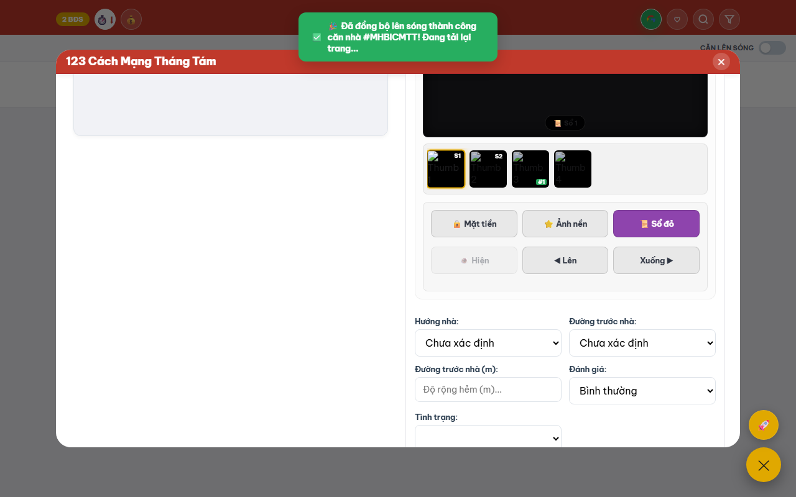
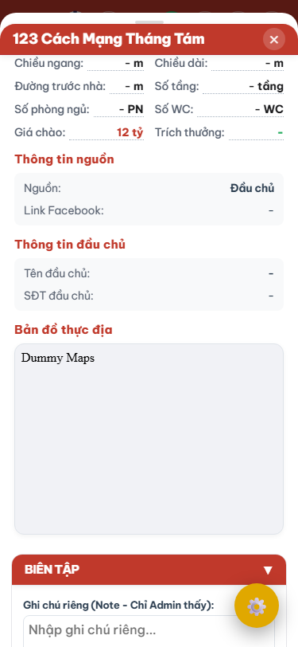

# US-096B: Frontend Load & Detail View Admin

## User story
**As an** Admin  
**I want** ứng dụng web (Frontend) tự động nhận diện cấu hình active pool từ backend, và hiển thị ô nhập liệu Rộng hẻm mới `Custom_Rong_Hem` trên Form Biên tập của Admin.  
**So that** tôi có thể mở chi tiết của bất kỳ căn nhà nào (kể cả căn thô chưa lên sóng) và xem được thông số hẻm tùy biến đã lưu trước đó.

## Acceptance Criteria
- [x] **Nhận cấu hình động**: Frontend gọi `/api/config` khi khởi chạy, lưu vào `LegoState.config` và nhận biết được hệ thống đang chạy Pool1 hay Pool2.
- [x] **Ô nhập liệu Rộng hẻm m**: Bổ sung một trường input số `#curator_custom_rong_hem` nhãn "Rộng hẻm tùy chỉnh (m)" vào Form Curation Admin trong `index.html`.
- [x] **Load dữ liệu Custom**:
  - Khi mở xem chi tiết căn nhà trong vai trò Admin, thông tin hiển thị trên form được nạp từ trường `custom_Custom_Rong_Hem` (hoặc tương đương) của API chi tiết.
  - Nếu căn nhà ở trạng thái thô chưa lên sóng (chưa có bản ghi Custom), giá trị hẻm thô (từ Pool 2) sẽ được hiển thị làm gợi ý mặc định (fallback).

---

## Solution
1. **Frontend Core (`lego_core.js`):**
   - Đảm bảo `LegoState.loadConfig()` gọi endpoint `/api/config` để nạp Spreadsheet IDs trước khi thực hiện nạp dữ liệu.
   - Thêm parser bóc tách trường hẻm tùy chọn linh hoạt theo từng chế độ.
2. **Form Admin UI (`index.html`):**
   - Thêm phần tử HTML cho ô nhập Rộng hẻm tùy biến nằm cạnh trường "Phân loại hẻm" trong Admin Curation Modal.
3. **Detail View Admin Logic (`lego_detail_admin.js`):**
   - Khi render form biên tập (`renderCurationForm`), gán giá trị của `Custom_Rong_Hem` vào ô nhập liệu mới. Nếu không có giá trị custom, fallback sang giá trị hẻm thô từ Pool 2 (`minimumRoadWidth` hoặc `Duong_truoc_nha_m`).

---

## 📝 Task Checklist (TODO)
- [x] **Frontend Configuration Integration**
  - [x] Gọi và nạp `/api/config` vào `LegoState.config` trong `lego_core.js`.
- [x] **Admin UI Form Expansion**
  - [x] Thêm thẻ input `#curator_custom_rong_hem` vào form biên tập trong `index.html`.
- [x] **Curation Data Mapping**
  - [x] Cập nhật `renderCurationForm` trong `lego_detail_admin.js` to hiển thị đúng dữ liệu hẻm tùy biến.

---

## Proposed Changes

### [Component: Epic Master - US-096]
#### [MODIFY] [US-096_connect_vercel_web_to_pool2.md](file:///d:/LHTBrain/01_PROJECTS/BDS-KhangNgo/docs/stories/_inbox/US-096_connect_vercel_web_to_pool2.md)
*   Epic Master quản lý tổng thể tiến độ và cấu trúc liên kết của phân hệ.
*   Cập nhật phần Solution và Task Checklist của Epic để theo dõi 5 story con.

---

### [Component: US-096A - API Config & SQLite Schema Upgrade]
#### [NEW] [US-096A_pool2_vercel_api_config.md](file:///d:/LHTBrain/01_PROJECTS/BDS-KhangNgo/docs/stories/_inbox/US-096A_pool2_vercel_api_config.md)
*   **Mục tiêu:**
    *   Thêm cột `Custom_Rong_Hem` vào mảng `CUSTOM_HEADERS` và `custom_cols` trong `pool_lego.py`.
    *   Tự động chạy SQLite migration tạo cột `Custom_Rong_Hem` trong `listings_custom_v2`.
    *   Tạo endpoint `/api/config` trong `api/index.js` và `manager.py` trả về Spreadsheet IDs động tương ứng với Pool Hệ thống được chọn (Pool1 / Pool2).
*   **Tệp thay đổi:**
    *   [pool_lego.py](file:///d:/LHTBrain/01_PROJECTS/BDS-KhangNgo/pool_lego.py)
    *   [manager.py](file:///d:/LHTBrain/01_PROJECTS/BDS-KhangNgo/manager.py)
    *   [api/index.js](file:///d:/LHTBrain/01_PROJECTS/BDS-KhangNgo/api/index.js)

---

### [Component: US-096B - Frontend Curation Load]
#### [NEW] [US-096B_pool2_vercel_frontend_load.md](file:///d:/LHTBrain/01_PROJECTS/BDS-KhangNgo/docs/stories/_inbox/US-096B_pool2_vercel_frontend_load.md)
*   **Mục tiêu:**
    *   Frontend gọi `/api/config` lưu cấu hình Spreadsheet IDs động vào `LegoState.config` khi khởi động.
    *   Bóc tách cột Google Sheet theo cơ chế động (hỗ trợ cả Pool1 cũ và Pool2 mới).
    *   Load dữ liệu tùy biến (từ Source 2 Sheet / SQLite Custom) và nạp chúng vào các control hiện có trên form (Hướng, Phân loại hẻm, Số phòng ngủ, Số WC, Ngủ trệt, CHDV, Đánh giá, Tình trạng). Fallback lấy từ Pool 2 thô nếu chưa có dữ liệu custom.
*   **Tệp thay đổi:**
    *   [static/js/lego_core.js](file:///d:/LHTBrain/01_PROJECTS/BDS-KhangNgo/static/js/lego_core.js)
    *   [static/js/lego_detail_admin.js](file:///d:/LHTBrain/01_PROJECTS/BDS-KhangNgo/static/js/lego_detail_admin.js)
    *   [index.html](file:///d:/LHTBrain/01_PROJECTS/BDS-KhangNgo/index.html)

---

### [Component: US-096C - Curation Save - Text & Specs Curing]
#### [NEW] [US-096C_pool2_vercel_curation_save.md](file:///d:/LHTBrain/01_PROJECTS/BDS-KhangNgo/docs/stories/_inbox/US-096C_pool2_vercel_curation_save.md)
*   **Mục tiêu:**
    *   Hàm `saveSourceChanges` và `saveNewListingFromPool` trong `lego_detail_admin.js` thu thập giá trị văn bản, thông số kỹ thuật, bao gồm cả Rộng hẻm m tùy biến từ control có sẵn (`#edit-duong-truoc-nha` hoặc `#editDuong`).
    *   Gửi payload cập nhật lên API `PUT /api/listings/<tk_id>` để cập nhật SQLite bảng `listings_custom_v2`.
    *   Đồng bộ dữ liệu văn bản tùy biến lên Source 2 (tab `Custom`).
*   **Tệp thay đổi:**
    *   [static/js/lego_detail_admin.js](file:///d:/LHTBrain/01_PROJECTS/BDS-KhangNgo/static/js/lego_detail_admin.js)
    *   [manager.py](file:///d:/LHTBrain/01_PROJECTS/BDS-KhangNgo/manager.py)

---

### [Component: US-096D - Image Curation - Selection, Roles, Ordering, & Rotation]
#### [NEW] [US-096D_pool2_vercel_image_curation.md](file:///d:/LHTBrain/01_PROJECTS/BDS-KhangNgo/docs/stories/_inbox/US-096D_pool2_vercel_image_curation.md)
*   **Mục tiêu:**
    *   Hỗ trợ kéo thả sắp xếp, ẩn/hiện, chọn vai trò ảnh và xoay ảnh vật lý trên Web Admin.
    *   Khi lưu, đồng bộ thay đổi vào SQLite `listings_images` và tab `Images` của Pool 2 Sheet.
    *   Thực thi cơ chế Logical Delete (không xóa cứng, đổi role thành hidden/deleted) để tránh bộ recrawl cào đè.
    *   Cập nhật các chuỗi JSON cache `curated_config_json` (bảng Listings) và `images_metadata_json` (bảng Custom, đã cách ly ảnh nhạy cảm facade/diagram).
*   **Tệp thay đổi:**
    *   [static/js/lego_detail_admin.js](file:///d:/LHTBrain/01_PROJECTS/BDS-KhangNgo/static/js/lego_detail_admin.js)
    *   [manager.py](file:///d:/LHTBrain/01_PROJECTS/BDS-KhangNgo/manager.py)
    *   [pool_lego.py](file:///d:/LHTBrain/01_PROJECTS/BDS-KhangNgo/pool_lego.py)

---

### [Component: US-096E - Public Whitelist Publication]
#### [NEW] [US-096E_pool2_vercel_public_publish.md](file:///d:/LHTBrain/01_PROJECTS/BDS-KhangNgo/docs/stories/_inbox/US-096E_pool2_vercel_public_publish.md)
*   **Mục tiêu:**
    *   Khi nhấn "Lên sóng", trích xuất dữ liệu tùy biến đã duyệt sạch, lọc bỏ các cột PII bảo mật.
    *   Đồng bộ các thuộc tính whitelist (đã bao gồm `Custom_Rong_Hem`) lên tab `Public` của Public Sheet.
    *   Rã phẳng mảng ảnh công khai an toàn (từ `images_metadata_json`) thành các cột Ảnh 1..Ảnh N nằm phía sau cột "Last updated" trên Public Sheet.
*   **Tệp thay đổi:**
    *   [pool_lego.py](file:///d:/LHTBrain/01_PROJECTS/BDS-KhangNgo/pool_lego.py)

---

## Verification Plan

### Automated Tests
- Chạy toàn bộ bộ kiểm thử Playwright để xác minh (bao gồm cả tệp test mới tự động được phát hiện):
  ```powershell
  python scratch/run_all_e2e.py
  ```
- Để chạy test ở chế độ có hiển thị giao diện Chrome (Headed), sử dụng:
  ```powershell
  python scratch/run_all_e2e.py --headed
  ```
- *Lưu ý:* Khi viết mới test case E2E cho Pool 2 (`scratch/test_e2e_pool2_transition.py`), script runner sẽ tự động quét, tích hợp và thực thi song song mà không cần khai báo cứng.

### Manual Verification
1. Kích hoạt chế độ Pool2, kiểm tra xem SQLite CSDL có tự sinh cột `Custom_Rong_Hem` không bằng pragma query.
2. Mở Web Admin, truy cập một căn, chỉnh sửa một số thông tin văn bản, thay đổi rộng hẻm thành `4.5` trên control có sẵn. Bấm Lưu và xác minh CSDL SQLite bảng `listings_custom_v2` và Google Sheet Custom đã lưu thành công dữ liệu mới.
3. Ẩn 2 ảnh bất kỳ và đổi thứ tự ảnh. Xác minh SQLite bảng `listings_images` và Google Sheet Pool 2 tab `Images` nhận đúng các đổi vai trò (hidden), không bị xóa cứng.
4. Kích hoạt trạng thái Active, nhấn Lên sóng, kiểm tra xem Google Sheet Public nhận đúng dữ liệu whitelist sạch (không chứa PII) và rã ảnh phẳng thành công từ cột Ảnh 1 trở đi, đặt phía sau cột "Last updated".

### Verification Evidence
*   **Alley Width Input Evidence:**
    
*   **Desktop Curation Screenshot:**
    
*   **Mobile Curation Screenshot:**
    
