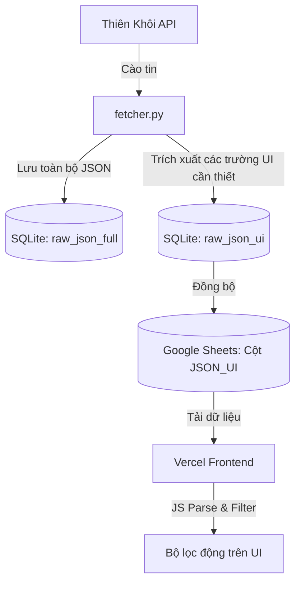

# US-100: Thiết lập cơ chế lưu trữ JSON động hai tầng và bộ lọc tìm kiếm tùy biến không cấu trúc (Unstructured JSON Filtering Framework)

## User story
**As an** Admin / Người phân tích rổ hàng
**I want** Hệ thống tự động lưu trữ 100% JSON thô cào về ở cục bộ (SQLite) và đồng bộ một phiên bản JSON tinh gọn động lên Google Sheets phục vụ cho việc lọc/tìm kiếm trực tiếp ở giao diện
**So that** Tôi có thể lọc tìm kiếm bất kỳ trường thông tin phụ nào phát sinh sau này mà không cần thay đổi cấu trúc cột của bảng SQLite/GSheet, cũng như không cần cào lại dữ liệu khi bổ sung trường mới.

## Acceptance Criteria
- [x] **Lưu trữ CSDL cục bộ 2 tầng (SQLite):**
  - Bổ sung 2 cột mới vào bảng `listings` trong SQLite: `raw_json_full` (TEXT - lưu toàn bộ JSON API gốc từ Thiên Khôi) và `raw_json_ui` (TEXT - lưu JSON tinh gọn gồm các trường chọn lọc phục vụ UI).
  - Cập nhật hàm `save_raw_to_sqlite` để tự động ghi đè/cập nhật hai cột này khi cào tin thô về.
- [x] **Đồng bộ đám mây tối ưu (Google Sheets):**
  - Khai báo thêm cột `JSON_UI` ở cuối danh sách cột tab `Pool` trên Google Sheet.
  - Đồng bộ giá trị từ cột `raw_json_ui` lên cột `JSON_UI` trên Google Sheet (tuyệt đối không đẩy `raw_json_full` lên Sheet để tránh quá tải dung lượng).
- [x] **Cấu hình trích xuất động và Script bảo trì (Mở rộng không cần cào lại):**
  - Thiết lập danh sách các trường cần trích xuất cho UI trong `settings.json` (ví dụ: `\"json_ui_fields\": [\"Criteria_Duong_truoc_nha\"]`).
  - Viết một script bảo trì cục bộ `scratch/sync_json_ui.py` để khi cấu hình danh sách trường thay đổi, script sẽ tự động quét cột `raw_json_full` -> trích xuất các trường mới -> cập nhật lại cột `raw_json_ui` và đồng bộ lên Google Sheet cho toàn bộ các căn đang có.
  - **Tự động vá dữ liệu thô thiếu (Self-healing):** Nếu phát hiện căn nhà nào trong SQLite chưa có cột `raw_json_full` (do cào từ các phiên bản cũ trước đây), script sẽ tự động gọi API Thiên Khôi để tải chi tiết căn bằng session cookie hiện tại và cập nhật lại trước khi xử lý, giúp CSDL luôn tự hoàn thiện dữ liệu.
- [x] **File khởi chạy `.bat` và Tích hợp UI Admin:**
  - Tạo file `DONG_BO_JSON_UI.bat` tại thư mục gốc để kích hoạt nhanh tiến trình đồng bộ hàng loạt chỉ với 1 click.
  - Tích hợp nút bấm trực quan "🔄 Đồng bộ JSON UI Hàng loạt" trên giao diện quản trị (`curator.html`) gọi tới API endpoint `/api/sync-json-ui` trong `manager.py` để kích hoạt đồng bộ từ trình duyệt.
- [x] **Frontend Vercel / Bộ lọc tìm kiếm động tự sinh:**
  - Thiết lập endpoint `/api/config` trên Vercel (bảo mật, loại bỏ API Key) và local server để trả về cấu hình `json_ui_filters`.
  - Cập nhật `static/js/lego_filters.js` tự động đọc cấu hình `json_ui_filters` khi tải trang và dựng (render) giao diện các bộ lọc (Combobox/Input) động tương ứng.
  - Cập nhật logic lọc để đọc cột `JSON_UI` (cột cuối cùng) từ Google Sheet, tự động parse và lọc chính xác theo các giá trị người dùng nhập/chọn trên các bộ lọc tự động sinh này.
- [x] **Báo cáo lỗi và Quản trị căn lỗi (Troubleshooting Panel):**
  - Khi cào tự động bị thất bại, ghi nhận trạng thái chi tiết vào cột `status` trong SQLite dạng `crawl_failed:deleted` (404) hoặc `crawl_failed:cookie_expired` (401/403).
  - Tích hợp một bảng hiển thị các căn lỗi cào trên `curator.html`. Hiển thị lý do lỗi rõ ràng và cung cấp hai nút hành động: **Thử lại** (gọi API recrawl khi đã cập nhật cookie) và **Xóa vĩnh viễn** (gọi API delete).

## Solution Design

### Sơ đồ luồng dữ liệu (Dataflow Diagram)

### Quy trình cấu hình thêm một bộ lọc mới bằng UI (Không chạm vào code & settings.json)
Khi cần hiển thị hoặc lọc một thông tin mới (ví dụ: Trạng thái tranh chấp `isDispute`):
1. **Bước 1 (Nhập cấu hình):** Mở giao diện Admin `curator.html` (Local), tìm đến bảng **Cấu hình Bộ lọc Động**. Điền các trường:
   - *Khóa dữ liệu thô (JSON Key)*: `isDispute`
   - *Tên hiển thị bộ lọc (Label)*: `Trạng thái tranh chấp`
   - *Loại bộ lọc (Type)*: `Select/Combobox`
   - *Các tùy chọn (Options)*: `,Không tranh chấp,Có tranh chấp` (phân cách bằng dấu phẩy)
   - Click nút **Thêm bộ lọc** và **Lưu Cấu hình**. Giao diện sẽ tự động cập nhật cấu hình backend.
2. **Bước 2 (Chạy đồng bộ):** Bấm trực tiếp nút **"🔄 Đồng bộ JSON UI Hàng loạt"** ngay trên giao diện `curator.html`. Tiến trình này tự động quét cột `raw_json_full` của các căn có sẵn, trích xuất trường mới và đẩy đồng bộ lên Google Sheets trong vài giây.
3. **Bước 3 (Hoàn tất tự động):** Tải lại trang web (cả local và Vercel). Một bộ lọc mới mang tên *"Trạng thái tranh chấp"* dạng Combobox sẽ tự động hiển thị ở cột bên trái và sẵn sàng để bạn lọc tìm kiếm ngay lập tức!

---

## 📋 Implementation Plan
- Thiết lập lưu trữ JSON thô cấp 2 (`raw_json_full` & `raw_json_ui`) cục bộ SQLite.
- Đồng bộ trường `JSON_UI` lên Google Sheets để giữ cấu hình gọn nhẹ.
- Xây dựng framework tự dựng bộ lọc động (`lego_filters.js` đọc cấu hình `/api/config`).
- Tích hợp UI dọn dẹp lỗi cào và hỗ trợ cào lại (Troubleshooting Panel).
- Triển khai cơ chế Cache-Busting để tự động cập nhật cache tĩnh trên client sau mỗi lần deploy.

## 📝 Task Checklist
- [x] Sửa đổi schema SQLite (`listings` table) & cập nhật parser trong `fetcher.py`.
- [x] Triển khai đồng bộ lên GSheets trong `pool_lego.py`.
- [x] Tạo script đồng bộ hàng loạt `scratch/sync_json_ui.py` & file `.bat` đi kèm.
- [x] Xây dựng UI Config & Troubleshooting Panel trên `curator.html` & `manager.py`.
- [x] Phát triển logic render bộ lọc động từ config và parse lọc frontend (`lego_filters.js`).
- [x] Triển khai và sửa lỗi login Google Client ID mặc định (`lego_core.js`).
- [x] Vá lỗi kiểu dữ liệu thô `val.trim is not a function` trong `lego_core.js` và `lego_helpers.js`.
- [x] Tái thiết lập cơ chế Cache-Busting qua `scratch/bump_version.py` và git hook `pre-commit` để giải phóng kẹt bộ nhớ đệm trên trình duyệt người dùng.

## Verification Plan
1. **Kiểm thử cục bộ (E2E Test local)**:
   - Chạy `python scratch/test_reset_filters_complete.py` để verify tính toàn vẹn của nút xóa lọc và trạng thái localStorage.
2. **Kiểm thử di động tự động trên Production (E2E Playwright Mobile)**:
   - Chạy `python scratch/test_prod_mobile_filtering.py` để tự động mở trình duyệt Pixel 5, đăng nhập admin, mở filter panel, chọn bộ lọc động quận 1 + Ngõ ngách (2 - 2.5m), kiểm tra việc hiển thị đúng căn Nguyễn Văn Nguyễn trên live production.

## Files touched
- `fetcher.py` (Lưu JSON thô và rút trích UI JSON)
- `pool_lego.py` (Đồng bộ cột JSON_UI lên Sheets)
- `manager.py` (API sync-json-ui & api-config)
- `static/js/lego_core.js` (Vá lỗi Client ID và ép kiểu String trước khi trim JSON_UI)
- `static/js/lego_helpers.js` (Ép kiểu String trước khi trim JSON_UI và lưu trữ trạng thái lọc động khi F5)
- `static/js/lego_filters.js` (Render bộ lọc động tự sinh và sửa nút Xóa lọc)
- `api/index.js` (Vá lỗi Client ID mặc định)
- `index.html` (Bổ sung tham số cache-busting version)
- `scratch/bump_version.py` (Tập lệnh tự động tăng số hiệu phiên bản index.html)
- `.git/hooks/pre-commit` (Tự động hóa pre-commit E2E & version bump)

## 🧠 Retro, Lessons Learned & Good Practices

### 1. Nhật ký các sự cố phát sinh (Incidents Log)
* **Sự cố 1 (Google Client ID Typo)**: 
  * *Mô tả*: Người dùng xóa cache thì bị kẹt màn hình `Access blocked: Authorization Error / Error 401: invalid_client` từ Google khi cố đăng nhập lại.
  * *Nguyên nhân*: Lỗi typo Client ID mặc định (thiếu chữ `q` trong ID ghi cứng `fmoudokb...`) chỉ phát lộ khi localStorage bị dọn trống và kích hoạt cơ chế fallback về Client ID mặc định lỗi.
  * *Bài học*: Tránh ghi cứng (hardcoded) các thông tin xác thực quan trọng ở nhiều nơi. Cần thực hiện kiểm thử E2E trường hợp dọn sạch localStorage (clean state).
* **Sự cố 2 (Lỗi val.trim is not a function)**:
  * *Mô tả*: Toàn bộ ứng dụng bị sập màn hình đỏ báo lỗi parse dữ liệu ngay khi vừa nạp dữ liệu sheet thô.
  * *Nguyên nhân*: Các ô dữ liệu từ Google Sheets API có kiểu dữ liệu là số (`Number`) hoặc trống (`null`) được nạp trực tiếp vào vòng lặp tìm kiếm JSON_UI và gọi thẳng `.trim()`.
  * *Bài học*: Phải luôn luôn phòng thủ kiểu dữ liệu (type defensive) khi làm việc với API bên ngoài hoặc dữ liệu do người dùng nhập. Cần ép kiểu String tường minh: `val ? String(val).trim() : ''` trước khi gọi các hàm xử lý chuỗi.
* **Sự cố 3 (Kẹt cache tĩnh của trình duyệt - Stale Cache)**:
  * *Mô tả*: Sau khi deploy bản vá `val.trim`, điện thoại của khách hàng vẫn báo lỗi sập đỏ mặc dù file trên máy chủ đã thay đổi.
  * *Nguyên nhân*: File `index.html` chứa các query parameter tĩnh `?v=202606201715` và tập lệnh tự động hóa phiên bản `bump_version.py` bị mất khỏi máy local. Điều này làm trình duyệt di động vẫn dùng file JS cũ trong bộ nhớ đệm.
  * *Bài học*: Query parameter cache-busting bắt buộc phải thay đổi ở mọi lần triển khai production. Cần tự động hóa tuyệt đối khâu này bằng Git hooks (`pre-commit`) thay vì dựa vào thủ công.

### 2. Thực tiễn tốt đề xuất (Good Practices)
- **Tập trung hóa thông tin cấu thực**: Google Client ID nên được lấy từ API cấu hình `/api/config` để tránh ghi cứng phân tán trong mã nguồn Frontend.
- **Rào chắn commit (Safe Committing Gate)**: Tận dụng tối đa pre-commit hook để chạy E2E trước khi cho phép commit và tự động bump version cache-busting để đảm bảo code đẩy lên luôn chạy ổn định và luôn được cập nhật tức thì trên thiết bị người dùng.
- **Chụp ảnh màn hình kiểm thử responsive**: Kiểm thử E2E giao diện mobile bắt buộc phải ghi nhận hình ảnh viewport để phát hiện sớm các lỗi che khuất phím bấm (như nút filterBtn bị panel đè lên).

