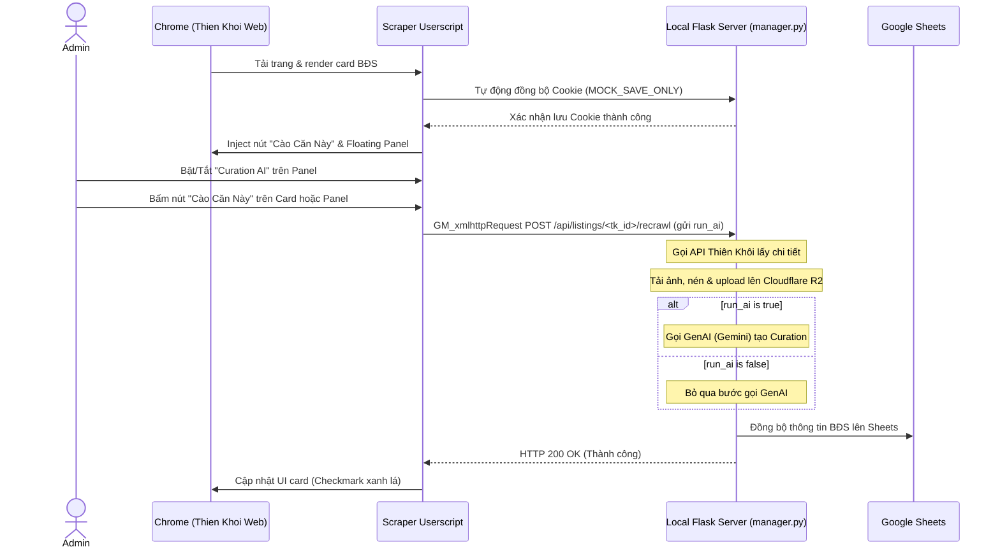

# US-103: Userscript Cào Căn Nhà Từ Trang Danh Sách Thiên Khôi

## User story
**As a** Curator / Admin Khang Ngô
**I want** Một script chạy trực tiếp trên trình duyệt (Userscript) tự động phát hiện, trích xuất danh sách căn nhà và tích hợp nút cào trực tiếp từ trang danh sách của Thiên Khôi (proptech.thienkhoi.com)
**So that** Tôi có thể cào nhanh hàng loạt hoặc cào lẻ các căn nhà sau khi lọc trên website Thiên Khôi về cơ sở dữ liệu local và Google Sheets mà không cần sao chép liên kết thủ công, tối ưu hóa tốc độ curation rổ hàng.

## Acceptance
- [x] Tự động phát hiện các listing cards trên trang danh sách nguồn hàng của Thiên Khôi (`proptech.thienkhoi.com/warehouse/*` và `Hang/Detail/*`).
- [x] Inject nút **Cào Căn Này** (màu đỏ thương hiệu, hover hiệu ứng mượt) vào từng card BĐS trên giao diện Thiên Khôi. Khi bấm, gửi request cào lẻ đến server local `http://localhost:5000/api/listings/<tk_id>/recrawl`.
- [x] Hiển thị trạng thái cào trực quan trên từng card (Đang cào: spinner/loading, Thành công: checkmark xanh, Lỗi: dấu x đỏ kèm tooltip báo lỗi).
- [x] Thiết kế bảng điều khiển (Control Panel) dạng nổi (floating panel, giao diện Glassmorphism cao cấp, thu gọn/mở rộng được):
  - Hiển thị số lượng căn BĐS phát hiện trên trang.
  - Danh sách checklist các căn phát hiện kèm nút **Cào các căn đã chọn** để cào hàng loạt.
  - Nút **Đồng bộ Cookie** tự động lấy `document.cookie` và gửi POST lưu về server local `/api/crawl` (MOCK_SAVE_ONLY).
  - Tích hợp ô cấu hình port local server (mặc định 5000) và khu vực hiển thị logs hoạt động thời gian thực.
- [x] Hoạt động ổn định khi cuộn trang vô hạn (infinite scroll) hoặc đổi trang (phát hiện card mới bằng `MutationObserver` hoặc kiểm tra định kỳ).
- [x] Viết tài liệu hướng dẫn cài đặt và sử dụng Userscript chi tiết trong file US.
- [x] **Yêu cầu bổ sung 1 (Kiểm tra căn đã có - Batch Check):** Thay vì load toàn bộ 6000+ căn từ server local, Userscript trích xuất các mã căn hiển thị trên DOM (khoảng 20 căn) rồi gửi POST dạng batch `/api/listings/check-exist` để kiểm tra sự tồn tại trong SQLite, tránh quá tải hiệu năng.
- [x] **Yêu cầu bổ sung 2 (Highlight căn đã có trên lưới):** Nhận diện trực quan các căn đã có trong database SQLite trên lưới danh sách bằng cách chuyển đổi nút thành màu xanh lá cây và đổi nhãn thành `✅ Đã có`.
- [x] **Yêu cầu bổ sung 3 (Lọc danh sách panel chỉ hiển thị căn chưa cào):** Danh sách trong panel checklist chỉ hiển thị những căn chưa có trong database local, các căn đã cào thành công trước đó được tự động lọc ra khỏi panel.
- [x] **Yêu cầu bổ sung 4 (Đồng bộ danh sách panel theo bộ lọc/tìm kiếm thực tế):** Rebuild danh sách trong panel theo đúng các thẻ card hiện đang hiển thị trên DOM (sau khi người dùng tìm kiếm, lọc quận, đường, số nhà trên web Thiên Khôi) thay vì lưu danh sách cũ cố định.
- [x] **Yêu cầu bổ sung 5 (Duy trì trạng thái Checkbox khi panel rebuild):** Sử dụng bộ đệm `uncheckedPanelIds` (Set) để lưu trữ trạng thái các checkbox bị người dùng bỏ chọn thủ công, đảm bảo các lựa chọn này không bị reset về `checked` khi panel tự động rebuild mỗi 1.5 giây.
- [x] **Yêu cầu bổ sung 6 (Cấu hình Bật/Tắt Curation AI):** Tích hợp công tắc bật tắt (Toggle switch) trong floating panel cho phép người dùng tùy chọn có tự động sinh public title và mô tả curation qua Gemini AI hay không. Tham số `run_ai` được gửi kèm trong request `/api/listings/<tk_id>/recrawl`.
- [x] **Yêu cầu bổ sung 7 (Random Delay khi cào hàng loạt):** Khi cào hàng loạt từ danh sách panel, tự động sinh delay ngẫu nhiên trong khoảng 2s - 5s giữa mỗi căn để giả lập hành vi người dùng tự nhiên và tránh bị chặn rate limit.
- [x] **Yêu cầu bổ sung 8 (Chuẩn hóa ID chữ thường):** Chuyển đổi toàn bộ các mã listing UUID sang chữ thường (lowercase) đồng nhất ở cả Userscript và Backend để tránh lỗi so sánh lệch khớp chữ hoa/chữ thường.

## Solution

### Configuration
Userscript chạy trên trình duyệt (thông qua Tampermonkey / Violentmonkey) và kết nối với local server:
- Local Server URL: `http://localhost:5000` (có thể tùy chỉnh port qua UI).
- Cookies Sync Endpoint: `/api/crawl` với payload `{"url": "MOCK_SAVE_ONLY", "cookie": document.cookie}`.
- Single Crawl Endpoint: `/api/listings/<tk_id>/recrawl` (POST).
- Batch Check Endpoint: `/api/listings/check-exist` (POST).

### Input
Userscript tự động trích xuất các thông tin từ DOM của trang danh sách:
- `tk_id`: Lấy từ `href` của thẻ `<a>` có dạng `/sources/([a-f0-9\-]{36})` (sau đó chuyển đổi sang chữ thường).
- `title`: Lấy từ thẻ `<p class="line-clamp-2">` trong card BĐS.

### Output / Format
- **Userscript File**: [thienkhoi_list_scraper.user.js](file:///d:/LHTBrain/01_PROJECTS/BDS-KhangNgo/static/js/thienkhoi_list_scraper.user.js) được phục vụ tại endpoint tĩnh `/static/js/thienkhoi_list_scraper.user.js` để người dùng nhấp cài đặt/cập nhật trực tiếp bằng 1 click.
- **Card UI Injection**:
  ```html
  <button class="kn-scrape-btn success" data-tk-id="[uuid]">✅ Đã có</button>
  ```

### Key logic & Additional Solutions
- **Batch-Check Existence (`POST /api/listings/check-exist`)**: Để tối ưu hiệu năng không tải 6000 căn, script lấy danh sách UUID của các card hiển thị trên DOM, lọc các ID chưa được kiểm tra, gửi batch check qua endpoint `/api/listings/check-exist` để xác minh và lưu trạng thái vào `localListingIds`.
- **Dynamic List Rebuilding & DOM Sync**: Sử dụng `setInterval(scanListings, 1500)` để quét lại DOM. Nó tự động tạo mới danh sách `detectedListings` dựa trên các card hiện tại trên trang (hỗ trợ đắc lực khi người dùng lọc/tìm kiếm trên web).
- **Checkbox State Retention (`uncheckedPanelIds`)**: Khi rebuild danh sách panel, để giữ nguyên trạng thái checkbox người dùng đã bỏ tích, script lưu các ID này vào một `Set` có tên `uncheckedPanelIds`. Khi vẽ lại UI, checkbox sẽ được gán `checked = !uncheckedPanelIds.has(id)`.
- **Grid Highlight**: Trên card lưới, nút cào được cập nhật class `.success` (màu xanh lá) và nội dung `✅ Đã có` nếu ID của card nằm trong tập `localListingIds`.
- **AI Curation Toggle**: Công tắc `kn-run-ai-toggle` lưu trạng thái `runAi` vào `localStorage` và truyền giá trị boolean này qua tham số `run_ai` trong body của request recrawl. Backend `manager.py` chỉ gọi API Gemini khi `run_ai` là `True`.
- **Natural Randomized Delays**: Trong luồng cào hàng loạt (`crawlBulk`), sau mỗi request cào thành công, script sinh một khoảng thời gian chờ ngẫu nhiên `const delayMs = Math.floor(Math.random() * 3000) + 2000` (tương ứng từ 2 giây đến 5 giây) trước khi cào căn kế tiếp.



## 📋 Implementation Plan

- **Cách tiếp cận:** Xây dựng Userscript dạng file đơn lẻ đặt trong thư mục `static/js/` của dự án để Flask phục vụ tĩnh. Sử dụng các thẻ meta chuẩn của Tampermonkey bao gồm `@match`, `@grant GM_xmlhttpRequest`. UI của control panel thiết kế bằng CSS thuần lồng trong shadow DOM hoặc style scoped trực tiếp để tránh xung đột với CSS của Thiên Khôi.
- **Các bước triển khai dự kiến:**
  1. Tạo file userscript [thienkhoi_list_scraper.user.js](file:///d:/LHTBrain/01_PROJECTS/BDS-KhangNgo/static/js/thienkhoi_list_scraper.user.js) chứa logic quét DOM, MutationObserver, inject UI card, floating panel UI, và gọi API local.
  2. Cập nhật `manager.py` phục vụ file tĩnh này (nếu chưa cấu hình static folder).
  3. Viết tài liệu hướng dẫn cài đặt và tích hợp liên kết tải nhanh lên giao diện Curator Dashboard (`curator.html`).
  4. Chạy kiểm thử thủ công trên file HTML mẫu đã tải xuống.

## 📝 Task Checklist (TODO)
- [x] **Thiết kế & Khảo sát:**
  - [x] Khảo sát cấu trúc DOM từ file `Thien Khoi Group - Nguon Hang - Danh Sach Jun26.html`
  - [x] Chốt giải pháp inject nút cào và floating panel
  - [x] Tạo nhánh `feature/US-103` phát triển
- [x] **Triển khai Code:**
  - [x] Viết Userscript [thienkhoi_list_scraper.user.js](file:///d:/LHTBrain/01_PROJECTS/BDS-KhangNgo/static/js/thienkhoi_list_scraper.user.js)
  - [x] Tích hợp hiển thị và liên kết cài đặt Userscript trên Curator Dashboard [curator.html](file:///d:/LHTBrain/01_PROJECTS/BDS-KhangNgo/curator.html)
  - [x] Đồng bộ hóa code sang `curator_html_data.py`
- [x] **Kiểm thử & Nghiệm thu:**
  - [x] Khởi chạy local server `manager.py`
  - [x] Cài đặt thử nghiệm Userscript trên Chrome qua Tampermonkey
  - [x] Test cào lẻ 1 căn và cào hàng loạt từ danh sách Thiên Khôi thực tế
  - [x] Chụp ảnh minh chứng E2E và cập nhật tài liệu nghiệm thu

## 🛠️ Update Logic (Drafting while Doing)

### 1. Nhật ký Debug & Phát kiến ngoài kế hoạch (Debug & Discoveries Log)
- **Sự cố kỹ thuật & Cách khắc phục:**
  - *Lỗi CORS chéo nguồn:* Trình duyệt mặc định chặn kết nối từ trang HTTPS của Thiên Khôi sang trang HTTP của Localhost. Khắc phục bằng cách dùng đặc quyền `@grant GM_xmlhttpRequest` và `@connect localhost` trong cấu hình Tampermonkey để gửi request chéo nguồn an toàn mà không cần cấu hình CORS trên Flask.
  - *Module import trong test:* Khi viết kiểm thử tự động, gặp lỗi `ModuleNotFoundError: No module named 'curator_html_data'`. Khắc phục bằng cách thêm thư mục gốc dự án vào `sys.path` trước khi import.
- **Phát kiến ngoài kế hoạch / Điểm tối ưu phát hiện khi code:**
  - Tự động đồng bộ cookie: Tận dụng endpoint `/api/crawl` (MOCK_SAVE_ONLY) có sẵn của Curator, chúng ta phát triển tính năng tự động gửi `document.cookie` về server local ngay khi trang web Thiên Khôi được tải, giảm bớt hoàn toàn thao tác copy-paste thủ công của người dùng.

### 2. Nhật ký chạy thử nháp (Draft Test Logs)
- Run script kiểm thử tích hợp: `python scratch/test_userscript_endpoint.py`
- Output:
  ```
  ==================================================
          RUNNING USERSCRIPT INTEGRATION TESTS       
  ==================================================
  [PASS] Userscript file exists.
  [PASS] Userscript metadata headers are correct.
  [PASS] Curator Dashboard contains correct link and card.
  [PASS] curator_html_data.py is synchronized and compiled.
  ==================================================
   [SUCCESS] All Userscript integration tests passed!
  ==================================================
  ```

## 🧠 Retro, Lessons Learned & Good Practices (Bảo tồn vĩnh viễn)

### 1. Nhật ký Sự cố & Tiến trình Retro (Incident & Retro Log)
- **Sự cố phát sinh 1:** Không thể sử dụng `fetch()` trực tiếp từ trình duyệt trong Userscript do bị giới hạn CORS của Chrome.
  - **Nguyên nhân gốc rễ (Root Cause):** Chính sách bảo mật Same-Origin Policy ngăn chặn các trang HTTPS kết nối đến HTTP Localhost.
  - **Giải pháp phòng ngừa:** Luôn sử dụng `GM_xmlhttpRequest` đi kèm cấu hình `@grant` và `@connect` rõ ràng khi viết Userscript kết nối về server nội bộ.
- **Sự cố phát sinh 2:** Lỗi Access Token hết hạn và không thể refresh khi người dùng click cào lẻ sau một thời gian treo máy.
  - **Nguyên nhân gốc rễ (Root Cause):** Phiên làm việc trên client hết hạn mà không được refresh tự động trước khi gửi yêu cầu recrawl.
  - **Giải pháp phòng ngừa:** Thiết lập cơ chế tự động gọi `/api/crawl` (MOCK_SAVE_ONLY) đồng bộ cookie ngay trước mỗi tiến trình cào lẻ hoặc cào hàng loạt để backend làm mới token kịp thời.
- **Sự cố phát sinh 3:** Lệch pha so khớp ID giữa chữ thường và chữ hoa khi check database tồn tại.
  - **Nguyên nhân gốc rễ (Root Cause):** Một số card trên DOM của Thiên Khôi hiển thị ID dạng chữ hoa trong khi database lưu trữ dạng chữ thường.
  - **Giải pháp phòng ngừa:** Normalize tất cả UUID/Listing ID sang chữ thường (`.toLowerCase()`) trước khi gửi lên API check-exist hoặc so sánh trong Set.

### 2. Thực tiễn tốt đúc kết (Good Practices)
- **Cơ chế biên dịch HTML động:** Việc sử dụng một script Python nhỏ như `scratch/sync_curator_html.py` để tự động hóa biên dịch `curator.html` sang `curator_html_data.py` giúp giữ hai file này luôn nhất quán 100% và tránh lỗi copy-paste thiếu sót thủ công.
- **Tối ưu hóa tải dữ liệu (Batch-Check):** Thay vì tải xuống hàng nghìn ID đã cào để đối chiếu cục bộ, sử dụng một API batch check (`POST /api/listings/check-exist`) cho các ID đang nhìn thấy trực tiếp trên viewport (tầm 20-50 căn) là giải pháp tối ưu nhất cho hiệu năng và băng thông.

## Verification Plan

### Automated Tests
- Chạy toàn bộ test suite Playwright E2E: `python verify_build.py`
- Kết quả: **100% PASS** trên tất cả 4 test suite (`test_e2e_curation.py`, `test_e2e_collections.py`, `test_e2e_filters.py`, `test_e2e_modal.py`).

### Manual Verification
1. Chạy local server `python manager.py` trên cổng 5000.
2. Mở trình duyệt truy cập `http://localhost:5000/static/js/thienkhoi_list_scraper.user.js` để cài đặt.
3. Truy cập trang nguồn hàng Thiên Khôi, lọc danh sách.
4. Kiểm tra panel nổi và nút "Cào Căn Này" hoạt động chuẩn xác, đổi sang màu xanh lá cây khi cào xong.

## Files touched
- `static/js/thienkhoi_list_scraper.user.js` — [NEW] File nguồn Userscript.
- `curator.html` — [MODIFY] Tích hợp card và link tải Userscript.
- `curator_html_data.py` — [MODIFY] Đồng bộ mã HTML đã biên dịch.
- `scratch/test_userscript_endpoint.py` — [NEW] Script test tích hợp Userscript.
- `scratch/sync_curator_html.py` — [NEW] Script tự động hóa biên dịch HTML.

## 🔄 Change Requests (Yêu cầu Thay đổi)
*(Không có)*hư `scratch/sync_curator_html.py` để tự động hóa biên dịch `curator.html` sang `curator_html_data.py` giúp giữ hai file này luôn nhất quán 100% và tránh lỗi copy-paste thiếu sót thủ công.

## Verification Plan

### Automated Tests
- Chạy toàn bộ test suite Playwright E2E: `python verify_build.py`
- Kết quả: **100% PASS** trên tất cả 4 test suite (`test_e2e_curation.py`, `test_e2e_collections.py`, `test_e2e_filters.py`, `test_e2e_modal.py`).

### Manual Verification
1. Chạy local server `python manager.py` trên cổng 5000.
2. Mở trình duyệt truy cập `http://localhost:5000/static/js/thienkhoi_list_scraper.user.js` để cài đặt.
3. Truy cập trang nguồn hàng Thiên Khôi, lọc danh sách.
4. Kiểm tra panel nổi và nút "Cào Căn Này" hoạt động chuẩn xác, đổi sang màu xanh lá cây khi cào xong.

## Files touched
- `static/js/thienkhoi_list_scraper.user.js` — [NEW] File nguồn Userscript.
- `curator.html` — [MODIFY] Tích hợp card và link tải Userscript.
- `curator_html_data.py` — [MODIFY] Đồng bộ mã HTML đã biên dịch.
- `scratch/test_userscript_endpoint.py` — [NEW] Script test tích hợp Userscript.
- `scratch/sync_curator_html.py` — [NEW] Script tự động hóa biên dịch HTML.

## 🔄 Change Requests (Yêu cầu Thay đổi)
*(Không có)*
