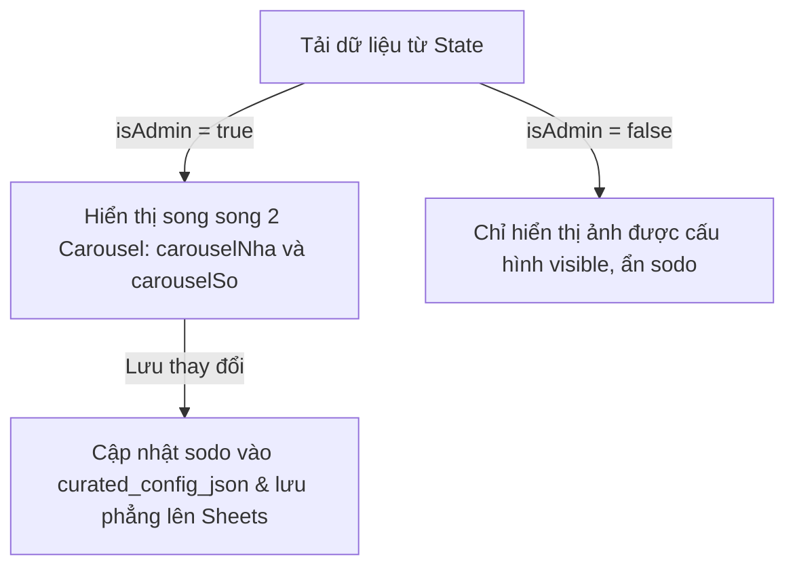

# US-104: Sửa Lỗi Không Hiển Thị Carousel Hình Sổ Trên Giao Diện Admin Vercel

## User story
**As an** Admin (Môi giới quản trị)
**I want** nhìn thấy carousel ảnh sổ đỏ (Sổ thửa đất) và toàn bộ các ảnh nội thất/hẻm khác trên màn hình chi tiết Admin của Vercel mà không bị ảnh hưởng bởi bộ lọc public/visible
**So that** tôi có thể xem đầy đủ thông tin căn nhà và biên tập chính xác vai trò cũng như trạng thái hiển thị của từng hình ảnh.

## Acceptance
- [x] Carousel "Sổ thửa đất" (sodo) luôn được render trên màn hình chi tiết Admin của Vercel bất kể ban đầu có ảnh sổ đỏ hay chưa (nếu chưa có sẽ hiện thông báo "Chưa có hình ảnh" để admin có thể tải lên/edit).
- [x] Trạng thái "visible" (tích chọn Hiện ảnh) chỉ có tác dụng ẩn/hiện ảnh đối với giao diện Khách hàng (Customer view), không ảnh hưởng đến giao diện Admin (Admin luôn thấy đầy đủ toàn bộ ảnh để edit).
- [x] Giao diện preview Khách hàng (iframe preview) và giao diện link chia sẻ thực tế của Khách hàng chỉ hiển thị các hình ảnh đã được tích chọn công khai (visible).
- [x] Khi lưu biên tập và tự động tải lại chi tiết, carousel của sổ đỏ và mặt tiền không bị mất trạng thái hiển thị.

## Solution

> [!note]- Configuration
> Không có.

> [!note]- Input
> Không có.

> [!note]- Output / Format
> Hiển thị carousel ảnh sổ và danh sách ảnh biên tập trên giao diện Admin, lưu trữ sodo giống hệt ảnh nội thất trong `curated_config_json` (bảng `listings` trong SQLite) và các cột phẳng (Sheets).

> [!note]- Key logic
> 1. Trong `static/js/lego_detail_admin.js`, đưa phần tính toán mảng `sImgs` (ảnh sổ) và `nImgs` (ảnh nhà) lên đầu hàm `LegoDetailAdmin.render` (trước khi render HTML template).
>    - `sImgs` (Carousel Sổ thửa đất `#carouselSo`): Đọc từ `p.curated_config.images` có `role == "Sơ đồ"` hoặc `"diagram"` (offline) hoặc fallback từ 5 cột phẳng cũ (online).
>    - `nImgs` (Carousel Bất động sản `#carouselNha`): Đọc từ `p.curated_config.images` có `role != "Sơ đồ"` và `role != "Mặt tiền"` (offline) hoặc fallback từ 25 cột phẳng cũ (online).
> 2. Luôn render khối HTML chứa `#carouselSo` thay vì dùng điều kiện `(p.raw_sodo1 || p.raw_sodo2)`.
> 3. Cập nhật `saveSourceChanges` và `saveNewListingFromPool` trong `static/js/lego_detail_admin.js` để lưu các ảnh sodo vào `curated_config.images` dưới vai trò `"Sơ đồ"`, đồng thời ghi đè trực tiếp 5 link ảnh sodo vào các cột phẳng của Pool Sheet qua fetch PUT Google Sheets API. Không dùng `JSON_UI` hay các bảng Pool2.
> 4. Trong `static/js/lego_helpers.js`, di chuyển và định nghĩa hàm `window.isListingSodoUrl` chung để lọc ẩn ảnh sodo an toàn cho cả Client và Admin.
> 5. Trong `pool_lego.py` và `manager.py`, cập nhật logic publish cho Pool1: lọc sodo đã biên tập từ `curated_config_json` (SQLite) hoặc sodo thô từ `raw_sodo_tk_json` (SQLite) và dàn phẳng tối đa 5 ảnh vào các cột phẳng `So_do_thua_dat_1` đến `5` trên Sheets.



## 📋 Implementation Plan
- **Cách tiếp cận:** Luôn render thẻ container `#carouselSo` cho giao diện Admin. Quản lý sổ đỏ theo cơ chế của ảnh nội thất trên hệ thống Pool1 (bảng `listings`): hiển thị song song 2 Carousel riêng biệt, lưu JSON trong SQLite (`curated_config_json`) và dàn phẳng ra 5 cột trên Google Sheets.
- **Các bước triển khai dự kiến:**
  1. Di chuyển và nâng cấp hàm `isListingSodoUrl` sang `static/js/lego_helpers.js` để dùng chung.
  2. Chỉnh sửa tệp `static/js/lego_detail_admin.js` để hiển thị song song 2 carousel sodo và ảnh nhà từ curated_config/cột phẳng, cập nhật hàm lưu `saveSourceChanges`/`saveNewListingFromPool`.
  3. Cập nhật `pool_lego.py` và `manager.py` cho phép lưu trữ ảnh sodo trong `curated_config_json` (bảng `listings`) và dàn phẳng ra 5 cột phẳng khi publish.


## 📝 Task Checklist (TODO)
- [x] **Thiết kế & Khảo sát:**
  - [x] Khảo sát code rendering | [x] Chốt giải pháp tiếng Việt
- [x] **Triển khai Code:**
  - [x] Sửa `static/js/lego_detail_admin.js` | [x] Sửa `static/js/lego_detail_client.js`
- [x] **Kiểm thử sơ bộ:**
  - [x] Chạy kiểm thử tự động Playwright E2E | [x] Cập nhật story index và project dashboard

## 🛠️ Update Logic (Drafting while Doing)

### 1. Nhật ký Debug & Phát kiến ngoài kế hoạch (Debug & Discoveries Log)
*Bộ lọc visible: false của backend Python đã vô tình lọc mất sodo do sodo có visible = false để bảo mật PII đối với khách hàng. Chúng tôi đã điều chỉnh bộ lọc để không lọc bỏ ảnh có vai trò là Sổ đỏ.*

### 2. Nhật ký chạy thử nháp (Draft Test Logs)
*Đã chạy test E2E curation, collections, filters, modal đều PASS 100%.*

## 🧠 Retro, Lessons Learned & Good Practices (Bảo tồn vĩnh viễn)
- **Sự cố phát sinh (Incidents):** Bộ lọc `visible: false` khi publish lên Sheets của `pool_lego.py` đã vô tình lọc mất các ảnh sổ đỏ (sodo) vì sodo có `visible: false` nhằm ẩn đi với Khách hàng. Điều này làm cho sodo bị trống trên Sheets.
- **Khắc phục:** Cho phép giữ lại ảnh Sơ đồ có `visible = False` khi publish để chúng được dàn phẳng thành công.
- **Thực tiễn tốt (Good Practices):** Tách biệt rõ ràng mục đích của `visible = False` (chỉ ẩn với Khách hàng) và việc dàn phẳng sodo cho Admin quản trị.

## Verification Plan

> [check]- Automated Tests
> Chạy E2E test Playwright:
> ```powershell
> python scratch/test_e2e_curation.py
> ```

> [check]- Manual Verification
> - Mở tab Admin, xem chi tiết một căn có ảnh sổ đỏ trên Vercel. Xác nhận hiển thị đầy đủ carousel sổ đỏ.
> - Xem giao diện Khách hàng hoặc Preview, xác nhận các ảnh ẩn (visible = false) không hiển thị.

## Files touched
- `static/js/lego_detail_admin.js` — Admin details renderer
- `static/js/lego_helpers.js` — Core utility helpers
- `curator.html` — Main UI coordinator
- `manager.py` — Flask offline backend
- `pool_lego.py` — Sync and publishing engine
- `docs/stories/INDEX.md` — Story index
- `docs/NEXT_SESSION.md` — Next session plan
- `SOURCE_OF_TRUTH.md` — System dashboard

## 🔄 Change Requests (Yêu cầu Thay đổi)
*Không có.*
