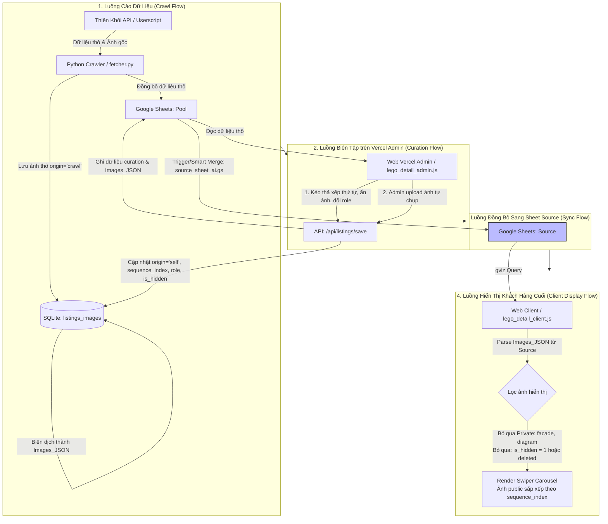

# US-120: Quản lý Hình ảnh Đa Nguồn và Đồng bộ Dữ liệu Lâu dài

## User Story
**As a** Product Owner / Administrator
**I want** to manage house images from two sources (original crawl and user upload) with specific roles, visibility states, and privacy controls
**And** allow flexible merging, sorting, and hiding of these images for client display regardless of their source
**And** transition from flat image columns on Google Sheets to a unified JSON column structure
**So that** the system can scale sustainably to 5,000+ houses, reduce API quota errors, and preserve user-uploaded images during recrawls.

## Acceptance Criteria

### 1. Phân loại Vai trò & Quyền truy cập Hình ảnh (Image Roles & Privacy)
- [ ] Mỗi hình ảnh thuộc một trong các vai trò:
  - `facade` (Hình mặt tiền): Chỉ có 1 ảnh mỗi căn. **Private** (Chỉ Admin xem).
  - `diagram` (Hình sổ / Sơ đồ thửa đất): Nhiều ảnh. **Private** (Chỉ Admin xem).
  - `alley` (Hình hẻm): Nhiều ảnh. **Public** (Khách xem được).
  - `interior` (Hình nội thất): Nhiều ảnh. **Public** (Khách xem được).
  - `background` (Hình nền): Chỉ có 1 ảnh mỗi căn. **Public** (Khách xem được).
- [ ] Các ảnh **Public** (`interior`, `alley`, `background`) của cả 2 nguồn (gốc và user upload) có thể được kết hợp và sắp xếp theo thứ tự hiển thị tùy biến cho khách hàng cuối (`sequence_index`), không phân biệt nguồn hình.
- [ ] Các ảnh **Private** (`facade`, `diagram`) được cách ly bảo mật, không hiển thị trên giao diện của khách hàng cuối hoặc các link chia sẻ công khai.

### 2. Quản lý Đa Nguồn & Trạng thái Ẩn/Hiện (Original Crawl vs User Upload & Visibility)
- [ ] Cho phép Admin tải lên hình ảnh tự chụp/local (nguồn `self`) và gán vai trò (`facade`, `diagram`, `alley`, `interior`, `background`).
- [ ] Cho phép Admin ẩn một hoặc nhiều hình ảnh bất kỳ khỏi client view bằng cách bật trạng thái `is_hidden = 1` (hoặc chuyển role sang `hidden`/`deleted`).
- [ ] Khi chạy tiến trình cào lại tin (recrawl) từ Thiên Khôi:
  - Dữ liệu hình ảnh từ Thiên Khôi (nguồn `crawl`) được cập nhật (thêm ảnh mới cào được, đánh dấu ẩn/xóa các ảnh cũ không còn tồn tại trên nguồn bằng cách set `role = 'deleted'` hoặc `is_hidden = 1`).
  - Toàn bộ hình ảnh do người dùng upload (nguồn `self`) **bắt buộc phải được giữ nguyên**, không bị ảnh hưởng, ghi đè hoặc xóa mất.

### 3. Tối ưu hóa Lưu trữ SQLite (Relational Storage)
- [ ] Lưu trữ hình ảnh dạng quan hệ 1-nhiều trong bảng `listings_images` với cấu trúc:
  - `id` (INTEGER PRIMARY KEY AUTOINCREMENT)
  - `tk_id` (TEXT, khóa ngoại liên kết bảng `listings`)
  - `image_url` (TEXT, URL ảnh gốc)
  - `r2_url` (TEXT, URL CDN Cloudflare R2 sau khi di cư)
  - `role` (TEXT: `facade`, `diagram`, `alley`, `interior`, `background`, `deleted`)
  - `sequence_index` (INTEGER, chỉ số sắp xếp hiển thị)
  - `origin` (TEXT: `crawl`, `self`)
  - `is_hidden` (INTEGER DEFAULT 0, trạng thái ẩn ảnh đối với khách hàng cuối)
  - `uploaded_at` (TEXT, timestamp lưu thời gian upload)
- [ ] Tự động đồng bộ danh sách ảnh đã xử lý thành một trường JSON tổng hợp `Images_JSON` (hoặc `images_metadata_json`) trong bảng `listings_v2` / `listings` để phục vụ truy vấn nhanh ở frontend.

### 4. Tối ưu hóa Google Sheets (Long-term Scalability)
- [ ] Loại bỏ 40+ cột phẳng lưu ảnh cũ trên tab `Pool` và `Source` (như `Sơ đồ thửa đất 2-5`, `Hình Hẻm 1-10`, `Ảnh 1-25`).
- [ ] Chỉ giữ lại 3 cột phục vụ hiển thị visual trên Google Sheets:
  - `Hình Nhận Diện`: Công thức hiển thị ảnh đại diện `=IMAGE(...)`.
  - `Hình Mặt Tiền`: URL ảnh mặt tiền (dùng làm tham số cho công thức hiển thị).
  - `Sơ đồ thửa đất 1` (hoặc `Sơ đồ 1`): URL sơ đồ chính để admin xem nhanh.
- [ ] Thêm 1 cột duy nhất tên là `Images_JSON` để lưu chuỗi JSON nén của toàn bộ danh sách hình ảnh hoạt động của căn nhà (chứa vai trò, thứ tự sắp xếp, nguồn gốc, trạng thái ẩn/hiện).
- [ ] Nâng cấp script Apps Script `pool_backend_v3.gs` và Python server `manager.py` tương thích với cấu trúc rút gọn này, giảm kích thước ô lưu trữ và tránh tối đa lỗi API 429 khi đồng bộ số lượng hàng lớn (5,000+ căn).

---

## Sơ đồ Quy trình Hoạt động (System Architecture Flowcharts)

---

## 📋 Implementation Plan

### Bước 1: Thiết kế Cơ sở Dữ liệu & SQLite Migration
- [ ] Định nghĩa và cấu trúc lại bảng `listings_images` trong SQLite local (`pool_lego.py` và `manager.py`).
- [ ] Viết script migration di chuyển dữ liệu ảnh phẳng cũ từ `listings` sang bảng `listings_images` và gán nhãn `origin='crawl'` hoặc `origin='self'` dựa trên các thuộc tính sẵn có.

### Bước 2: Tái cấu trúc Google Sheets & Apps Script
- [ ] Sao lưu sheet Pool/Source hiện tại.
- [ ] Thu gọn cột trên Google Sheets tab Pool và Source (xóa các cột ảnh phẳng không cần thiết, thêm cột `Images_JSON`).
- [ ] Cập nhật `pool_backend_v3.gs` và `source_sheet_ai.gs` để map và đồng bộ cột `Images_JSON`.

### Bước 3: Nâng cấp Python Backend APIs
- [ ] Cập nhật luồng cào tin (`fetcher.py` / `pool_lego.py`): khi recrawl tin cũ, đối chiếu danh sách ảnh thô mới và cũ, thêm ảnh thô mới vào `listings_images` (origin='crawl'), ẩn ảnh cũ bị mất (role='deleted'), bảo vệ nguyên vẹn các ảnh có origin='self'.
- [ ] Cập nhật API Lưu biên tập (`/api/listings/save`): nhận payload `images` đã sắp xếp và ẩn hiện từ Admin UI, ghi nhận `sequence_index`, `role`, và `is_hidden` mới vào SQLite và đẩy lên Google Sheets dưới dạng JSON.

### Bước 4: Tích hợp Frontend Web Admin Curation UI
- [ ] Cập nhật Panel Biên tập Hình ảnh trên Vercel Admin (`lego_detail_admin.js`):
  - Hiển thị danh sách ảnh thống nhất từ SQLite (`Images_JSON`).
  - Cho phép drag-and-drop thay đổi thứ tự sắp xếp.
  - Dropdown chọn vai trò ảnh (`facade`, `diagram`, `alley`, `interior`, `background`).
  - Nút upload ảnh mới (lưu thẳng vào Cloudflare R2 và chèn vào danh sách với origin='self').
  - Nút Ẩn/Hiện ảnh (chuyển trạng thái `is_hidden = 1` hoặc set `role = 'deleted'`).

### Bước 5: Cập nhật Frontend Client View
- [ ] Cập nhật Client Detail View (`lego_detail_client.js`):
  - Parse trường `Images_JSON` hiển thị ảnh.
  - Lọc bỏ các ảnh có role Private (`facade`, `diagram`) hoặc bị ẩn (`is_hidden = 1` / `deleted`).
  - Hiển thị các ảnh Public (`interior`, `alley`, `background`) theo thứ tự `sequence_index` trong slider/lightbox.
  - Sử dụng ảnh `background` làm hình nền chính nếu được cấu hình.
