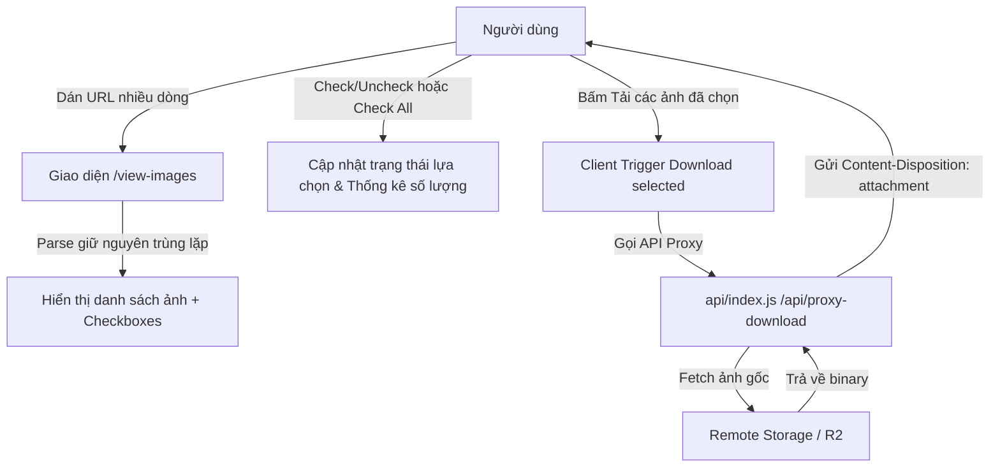

# US-124: Trình Xem Và Tải Ảnh Hàng Loạt Từ URL

## User story
**As an** Admin / User
**I want** dán danh sách link hình ảnh (hỗ trợ nhiều dòng, phân tách bằng tab/khoảng trắng) để hiển thị toàn bộ hình ảnh (bao gồm cả các hình trùng lặp giữa các dòng, không tự động loại bỏ).
**I want** có nút chọn (checkbox) từng hình và nút chọn tất cả (check all) để linh hoạt chọn và tải về thiết bị các hình mong muốn.
**So that** tôi có thể dễ dàng quản lý việc tải về đúng những tệp hình ảnh cần thiết.

## Acceptance
- [x] Giao diện có một ô nhập liệu (`textarea`) để dán chuỗi URL trên nhiều dòng. 
- [x] Nhận diện và hiển thị đầy đủ toàn bộ URL được dán vào (giữ nguyên thứ tự dán và không tự động loại bỏ ảnh trùng lặp).
- [x] Mỗi card hình ảnh hiển thị có một ô chọn checkbox (mặc định tích chọn sẵn) và số thứ tự hiển thị.
- [x] Có nút/checkbox "Chọn tất cả" (Select All) để chọn/bỏ chọn nhanh toàn bộ danh sách hiển thị.
- [x] Cung cấp nút "Tải ảnh đã chọn" để tải các ảnh đang được checked về thiết bị.
- [x] Hiển thị thông tin thống kê: số lượng ảnh đã chọn / tổng số lượng ảnh hiển thị.
- [x] Hỗ trợ proxy download server-side tại `/api/proxy-download` để vượt rào cản CORS khi tải tệp.
- [x] Hỗ trợ nhận diện và phân tích cú pháp mảng JSON chứa hình ảnh kèm chuẩn hóa dấu nháy và markdown code blocks.
- [x] Hiển thị các nhãn thông tin ảnh (Role, Index, Origin, Hidden/Show) dưới dạng thẻ màu sắc (badges) bắt mắt trên giao diện.
- [x] Hỗ trợ bộ máy trích xuất URL bằng Regex thông minh làm fallback dự phòng nếu chuỗi JSON bị vỡ cấu trúc.

## Solution

> [!note]- Configuration
> Không yêu cầu cấu hình biến môi trường mới. Sử dụng proxy endpoint server-side `/api/proxy-download` được tích hợp thẳng vào `api/index.js`.

> [!note]- Input
> Người dùng dán chuỗi chứa danh sách các đường dẫn ảnh (URL) phân tách bằng tab/khoảng trắng/xuống dòng vào khung nhập liệu trên trang `/view-images`.

> [!note]- Output / Format
> - Web Page: `/view-images.html` (được định tuyến tại `/view-images`).
> - API Endpoint: `/api/proxy-download?url=<encoded_url>&filename=<filename>` trả về file dưới dạng download attachment.

> [!note]- Key logic
> 1. Phân tích chuỗi nhập liệu:
>    - Sử dụng hàm `sanitizeJsonString()` để loại bỏ thẻ markdown, chuẩn hóa dấu nháy đơn, nháy cong thành nháy kép và chạy thử `JSON.parse()`.
>    - Nếu giải mã JSON thành công, trích xuất danh sách ảnh từ các thuộc tính `r2_url`, `image_url` hoặc `url`, đồng thời thu thập thêm các trường metadata (`role`, `sequence_index`, `origin`, `is_hidden`).
>    - Nếu giải mã JSON thất bại, kích hoạt bộ quét Regex thông minh `/(https?:\/\/[^\s"'`,{}()\[\]\\]+)/g` trích xuất mọi URL thô từ văn bản dán vào, tự động loại bỏ các dấu ngoặc và dấu phẩy dính liền.
> 2. Mỗi ảnh render sẽ có một ID duy nhất để quản lý checkbox trạng thái `checked`.
> 3. Hiển thị nhãn thông tin (Badges) nếu ảnh có chứa metadata bằng CSS màu sắc tương thích.
> 4. Nút "Tải các ảnh đã chọn" lặp qua danh sách được checked và tải tuần tự qua API proxy với độ trễ 300ms chống chặn pop-up.



## 📋 Implementation Plan

### Giao diện Người dùng

#### [NEW] [view-images.html](file:///d:/LHTBrain/01_PROJECTS/BDS-KhangNgo/view-images.html)
- Tạo trang HTML đơn lẻ với giao diện phong cách tối sang trọng (Outfit font, backdrop-filter blur, CSS gradient đẹp mắt).
- Chứa ô nhập liệu textarea, nút bấm xử lý, thống kê số lượng ảnh nhận diện được.
- Render danh sách ảnh dưới dạng Grid responsive. Mỗi ảnh có số thứ tự, checkbox chọn (mặc định tích chọn), nút download riêng lẻ.
- Tích hợp thanh công cụ: checkbox "Chọn tất cả" (Check All), số lượng ảnh được chọn, nút "Tải các ảnh đã chọn" với loading spinner và tiến trình tải.

### Routing & API Gateway

#### [MODIFY] [vercel.json](file:///d:/LHTBrain/01_PROJECTS/BDS-KhangNgo/vercel.json)
- Bổ sung `view-images.html` vào danh sách `includeFiles`.

#### [MODIFY] [api/index.js](file:///d:/LHTBrain/01_PROJECTS/BDS-KhangNgo/api/index.js)
- Thêm route phục vụ trang `/view-images` hoặc `/view-images.html`.
- Thêm endpoint `/api/proxy-download` nhận query param `url` và `filename`, fetch file nhị phân từ URL từ xa và pipe ngược lại client kèm header `Content-Disposition: attachment; filename="..."`.

## 📝 Task Checklist (TODO)
- [x] **Thiết kế & Khảo sát:**
  - [x] Khảo sát cấu trúc vercel.json và file index.html
  - [x] Thiết kế UI cho view-images.html kèm các checkbox chọn & check all
- [x] **Triển khai Code:**
  - [x] Tạo file [view-images.html](file:///d:/LHTBrain/01_PROJECTS/BDS-KhangNgo/view-images.html)
  - [x] Sửa [vercel.json](file:///d:/LHTBrain/01_PROJECTS/BDS-KhangNgo/vercel.json) để bundle file mới
  - [x] Sửa [api/index.js](file:///d:/LHTBrain/01_PROJECTS/BDS-KhangNgo/api/index.js) thêm routing `/view-images` và `/api/proxy-download`
- [x] **Kiểm thử sơ bộ:**
  - [x] Chạy thử nghiệm local và test chức năng dán link nhiều dòng trùng lặp, chọn từng hình, chọn tất cả, tải các hình đã chọn.
  - [x] Cập nhật story status thành done.

## 🛠️ Update Logic (Drafting while Doing)

### 1. Nhật ký Debug & Phát kiến ngoài kế hoạch (Debug & Discoveries Log)
- **Sự cố kỹ thuật & Cách khắc phục:** 
  - *CORS block on direct downloads*: Các ảnh lưu trữ trên Cloudflare R2 (r2.dev) khi tải trực tiếp từ trình duyệt Client bị chặn CORS. Khắc phục thành công bằng cách tạo endpoint proxy `/api/proxy-download` trung gian ở cả Node.js (Vercel) và Python Flask (Local dev).
  - *Pop-up blocking on mass download*: Trình duyệt chặn tải hàng loạt khi gọi liên tiếp nhiều lệnh download. Đã giải quyết bằng cách áp dụng vòng lặp bất đồng bộ có `delay 300ms` giữa các ảnh và thanh trạng thái tiến trình (progress-bar) trực quan.
  - *Header Syntax Error*: Ký tự đặc biệt (như dấu ngoặc kép `"`) trong tên file gốc của ảnh có thể gây lỗi cú pháp header `Content-Disposition`. Khắc phục bằng cách chạy regex loại bỏ các ký tự này `String(filename).replace(/["\\]/g, '')` trước khi đưa vào header.
  - *JSON String Arrays & Wrapping Quotes*: Cải tiến hàm giải mã để tự động nhận diện và trích xuất URL từ các mảng JSON chứa chuỗi thuần túy `["url1", "url2"]` (thay vì chỉ mảng object như trước) và tự động loại bỏ các dấu nháy kép `"` dư thừa bao bọc bên ngoài chuỗi JSON khi copy từ một số trình soạn thảo.


### 2. Nhật ký chạy thử nháp (Draft Test Logs)
- **Kiểm thử unit test Flask backend**:
  Chạy `python -m pytest tests/test_api_contracts.py` thành công vượt qua cả 3 test cases mới (`test_view_images_page`, `test_proxy_download_missing_url`, `test_proxy_download_invalid_url`). Tổng số test pass là 100/100.

## 🧠 Retro, Lessons Learned & Good Practices

### 1. Nhật ký Sự cố & Tiến trình Retro (Incident & Retro Log)
- Không có sự cố nghiêm trọng phát sinh. Dự án chạy mượt mà và đúng kiến trúc.

### 2. Thực tiễn tốt đúc kết (Good Practices)
- **Đồng bộ hóa môi trường Vercel & Python Local**: Luôn viết đồng thời API cho cả `api/index.js` (Vercel) và `api/routes_curation.py` (Local Python) khi có route mới để duy trì độ tương đồng 100% giữa môi trường chạy local và Cloud production.
- **Quản lý danh sách URL trùng lặp**: Tránh dùng `Set` tự động khử trùng lặp khi người dùng yêu cầu hiển thị toàn bộ nội dung dán vào, bảo toàn đầy đủ số lượng tệp theo yêu cầu nghiệp vụ của PO.

## Verification Plan

### Automated Tests
- Đã bổ sung 3 ca kiểm thử trong `tests/test_api_contracts.py` để verify việc render trang `/view-images` và hoạt động của endpoint `/api/proxy-download`.
- Chạy lệnh test: `python -m pytest tests/test_api_contracts.py`

### Manual Verification
1. Truy cập `/view-images` trên môi trường chạy thử.
2. Dán chuỗi link nhiều dòng có chứa ảnh trùng lặp:
   ```
   https://pub-e92603c36c8d4789917d05d1eba12a7e.r2.dev/BDS-KhangNgo/img_d141ab14-e24a-4300-9f1f-e10875460688_14.jpg	https://pub-e92603c36c8d4789917d05d1eba12a7e.r2.dev/BDS-KhangNgo/img_d141ab14-e24a-4300-9f1f-e10875460688_15.jpg	https://pub-e92603c36c8d4789917d05d1eba12a7e.r2.dev/BDS-KhangNgo/img_d141ab14-e24a-4300-9f1f-e10875460688_13.jpg
   https://pub-e92603c36c8d4789917d05d1eba12a7e.r2.dev/BDS-KhangNgo/img_d141ab14-e24a-4300-9f1f-e10875460688_13.jpg	https://pub-e92603c36c8d4789917d05d1eba12a7e.r2.dev/BDS-KhangNgo/img_d141ab14-e24a-4300-9f1f-e10875460688_14.jpg	https://pub-e92603c36c8d4789917d05d1eba12a7e.r2.dev/BDS-KhangNgo/img_d141ab14-e24a-4300-9f1f-e10875460688_15.jpg
   ```
3. Bấm "Hiển thị ảnh" và xác nhận hệ thống hiển thị đầy đủ 6 card hình ảnh (không bị lọc trùng lặp).
4. Kiểm tra xem các card hình ảnh có checkbox được tích chọn mặc định không.
5. Thử bỏ chọn một vài hình, nhấn "Tải ảnh đã chọn" và xác nhận chỉ những ảnh đang được check được tải về.
6. Thử bỏ check tất cả bằng nút "Chọn tất cả" và xác nhận toàn bộ check biến mất.

## Files touched
- `view-images.html` — Trang giao diện chính của công cụ xem và tải ảnh
- `vercel.json` — Cấu hình includeFiles của Vercel
- `api/index.js` — Định tuyến trang và API Proxy Download (Vercel)
- `api/routes_curation.py` — Định tuyến trang và API Proxy Download (Local Flask)
- `tests/test_api_contracts.py` — Thêm 3 test case kiểm tra API mới
