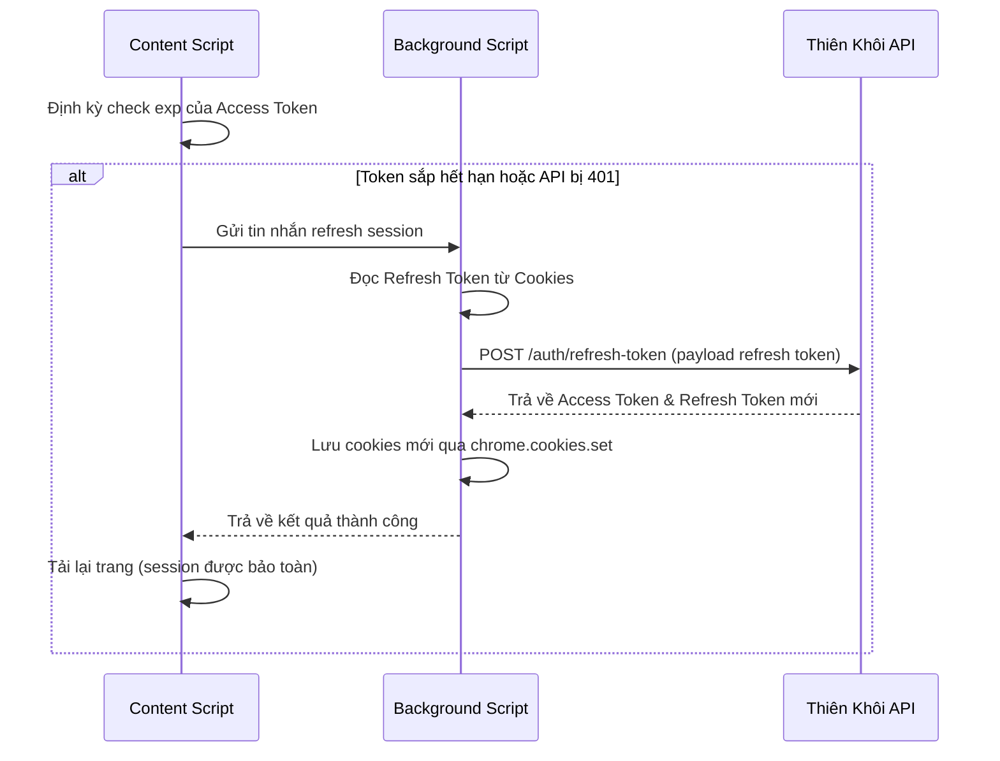

# US-125: Tự động Login và Tự động Cuộn trên trang danh sách Thiên Khôi

## User story
**As a** Sale/Admin cào dữ liệu BĐS
**I want** Tiện ích mở rộng Crawler tự động cuộn trang danh sách để tải thêm nhà và tự động đăng nhập/làm mới token khi hết hạn
**So that** Quá trình cào thông tin nguồn hàng diễn ra liên tục, mượt mà mà không bị ngắt quãng bởi việc hết hạn session hoặc phải cuộn chuột thủ công.

## Logic hiện tại liên quan
- **DF-003 Luồng Dữ Liệu Cào & Nhập Kho Tin Thô v1**: Đặc tả luồng cào dữ liệu thô và đẩy dữ liệu về backend/GAS.
  - Yêu cầu này **XÁC NHẬN** logic trên vì tiện ích cào dữ liệu chạy nền ở tab chi tiết vẫn trích xuất đầy đủ các trường thông tin thô và gửi POST về GAS/API như cũ, không làm ảnh hưởng đến cơ chế lưu trữ SQLite.
- **SF-001 Kiến Trúc Hệ Thống Tổng Quan v1**: Mô tả sự phối hợp giữa Chrome Extension (Client-side) và SQLite/GAS (Backend-side).
  - Yêu cầu này **BỔ SUNG** logic trên bằng cách tự động hóa ở phía Client-side (Chrome Extension) để đảm bảo phiên làm việc (session) hợp lệ thông qua Silent Refresh/Auto Login và khôi phục bộ lọc nâng cao (bao gồm thời gian cập nhật) sau khi đăng nhập lại.

## Acceptance
- [ ] **Tính năng Auto Scroll**:
  - Có nút Bật/Tắt chế độ Auto Scroll trên giao diện Floating Widget của trang danh sách.
  - Khi bật, tiện ích tự động cuộn xuống cuối trang (bao gồm cả cửa sổ chính và các thẻ div có thuộc tính overflow-auto) sau mỗi 3 giây.
  - Tự động ngắt (turn OFF) và hiển thị thông báo Toast nếu sau 3 lần cuộn liên tiếp mà số lượng nhà không tăng thêm (để tránh lặp vô tận khi hết dữ liệu hoặc lỗi mạng).
- [ ] **Tính năng Tự động Làm mới Token (Silent Refresh)**:
  - Tiện ích tự động giải mã `TKG_accessToken` định kỳ (mỗi 30 giây) để kiểm tra thời gian hết hạn (`exp`).
  - Nếu token còn hạn dưới 5 phút, tiện ích tự động gửi yêu cầu đến background script để gọi API Refresh Token ngầm: `https://backend.thienkhoi.com/auth/v1/auth/refresh-token`.
  - Cập nhật cookies xác thực mới (`TKG_accessToken`, `TKG_refreshToken`) trực tiếp vào trình duyệt qua API `chrome.cookies` và reload trang ngầm.
- [ ] **Tính năng Tự động Đăng nhập Dự phòng (Auto-Fill Login)**:
  - Nếu không thể refresh (do refresh token hết hạn) và trang bị chuyển hướng về `/login` hoặc `/sign-in`.
  - Tự động điền số điện thoại & mật khẩu đã lưu trong `chrome.storage.local` vào form đăng nhập, kích hoạt sự kiện input của React để nhận trạng thái và tự động click nút Đăng nhập.
- [ ] **Tính năng Tìm kiếm Theo Từ Khóa & Bộ Lọc Nâng Cao (CR-01 - Đã cập nhật)**:
  - Giao diện Floating Widget hỗ trợ:
    - Ô nhập danh sách từ khóa tìm kiếm (textarea, mỗi dòng một từ khóa địa chỉ/mã hàng).
    - Bộ thiết lập lọc nâng cao: Tỉnh/thành phố (mặc định TP Hồ Chí Minh), Quận huyện (trước sáp nhập), Phường xã, Từ giá (tỷ), Đến giá (tỷ), **Thời gian cập nhật (Từ ngày, Đến ngày)**.
  - Khi bắt đầu tác vụ, tiện ích tự động mở panel "Bộ lọc" trên web Thiên Khôi, click chọn các dropdown Tỉnh/Quận/Phường tương ứng và nhập giá trị Từ giá/Đến giá, Thời gian cập nhật Từ ngày/Đến ngày, sau đó click "Xác nhận".
  - Chạy vòng lặp cào theo danh sách từ khóa địa chỉ:
    1. Nhập từ khóa hiện tại vào ô tìm kiếm chính trên trang danh sách, mô phỏng gán React-safe và click tìm kiếm.
    2. Chờ kết quả tải xong. Cào **tất cả** các card kết quả xuất hiện trên trang mà không cần so khớp lại địa chỉ ở client (do bộ lọc của Thiên Khôi đã đảm nhận việc lọc).
    3. Tự động mở chi tiết từng card trong tab chạy nền, cào dữ liệu và tự đóng tab khi hoàn thành.
  - **Tự động áp dụng lại bộ lọc khi Session hết hạn**:
    - Khi token hết hạn và tiện ích tự động login lại thành công, trang web tải lại và mất toàn bộ bộ lọc cũ.
    - Tiện ích tự động nhận diện trạng thái tác vụ đang chạy, đọc bộ lọc đã lưu từ `chrome.storage.local`, tự động mở lại panel "Bộ lọc", điền/chọn lại toàn bộ các tham số lọc (bao gồm Thời gian cập nhật), click "Xác nhận" và tiếp tục tiến trình cào đang dang dở.


## Solution

### 1. Kiến trúc luồng xử lý
- **manifest.json**: Bổ sung các quyền `"cookies"`, `"storage"`, và cấp phép kết nối Host Permissions cho:
  - `"https://data.thienkhoi.com/*"` (trang danh sách cũ)
  - `"https://proptech.thienkhoi.com/*"` (trang danh sách mới)
  - `"https://backend.thienkhoi.com/*"` (API xác thực / làm mới token)
- **background.js**:
  - Đóng vai trò lớp trung gian bảo mật (Cookie Proxy) để giải quyết rào cản `HttpOnly`.
  - Nhận yêu cầu `silentRefresh` từ content script.
  - Sử dụng API `chrome.cookies.get` để đọc `TKG_refreshToken` một cách an toàn.
  - Gửi yêu cầu HTTP POST đến API refresh của Thiên Khôi: `https://backend.thienkhoi.com/auth/v1/auth/refresh-token`.
  - Nhận token mới, dùng `chrome.cookies.set` ghi đè trực tiếp các cookie xác thực vào trình duyệt và phản hồi về content script.
  - **Tương tác Tab chạy nền**: Nhận yêu cầu `openAutoCrawlTab` và gọi `chrome.tabs.create({ url, active: false })` để mở tab chi tiết chạy nền, lưu ánh xạ ID tab ➔ ID địa chỉ. Nhận yêu cầu `closeTab` từ tab chi tiết chạy nền và gọi `chrome.tabs.remove(tabId)` để đóng tab và gửi thông báo hoàn thành về tab danh sách điều phối.
- **content.js**:
  - Gắn một hộp điều khiển nổi (Floating Control Panel) ở góc màn hình khi ở trang danh sách nguồn hàng.
  - Giải mã JWT `TKG_accessToken` (đọc ngầm thông qua gửi yêu cầu cho background script) để check thời gian hết hạn (`exp`) định kỳ 30 giây.
  - Triển khai hàm `checkAndRefreshSession()` gửi tin nhắn yêu cầu background làm mới session ngầm trước khi token hết hạn 5 phút.
  - Triển khai hàm `autoFillLoginForm()` chạy khi phát hiện đường dẫn chứa `/login` hoặc `/sign-in`, sử dụng helper `setReactInputValue` để gán giá trị React-safe vào form trước khi click submit.
  - Triển khai hàm `performAutoScroll()` thực hiện cuộn thông minh (cuộn cả window và các div `.overflow-auto`/`.custom-scrollbar`) có cơ chế tự ngắt dựa trên việc đếm số lượng listings.
  - **Logic điều phối Tìm kiếm & Bộ lọc (CR-01)**:
    - Hỗ trợ lưu cấu hình bộ lọc (Tỉnh, Quận, Phường, Từ giá, Đến giá, Thời gian cập nhật Từ ngày/Đến ngày) vào `chrome.storage.local`.
    - Triển khai hàm `applyFiltersUI()`: Tìm và click nút "Bộ lọc" trên web ➔ click mở dropdown Tỉnh/thành phố, chọn "TP Hồ Chí Minh" (hoặc trị chỉ định) ➔ mở các dropdown Quận/Phường tương ứng và click chọn ➔ điền Từ giá/Đến giá ➔ điền Thời gian cập nhật Từ ngày/Đến ngày bằng `setReactInputValue` ➔ click nút "Xác nhận" màu đỏ.
    - Triển khai hàng đợi từ khóa tìm kiếm: Nhập từ khóa hiện tại vào ô search chính ➔ bấm tìm kiếm ➔ cào tất cả card kết quả hiển thị bằng cách mở tab chạy nền chi tiết (có gán query `?autoCrawl=true`).
    - Lắng nghe sự kiện đóng tab chạy nền từ background script ➔ chuyển sang card tiếp theo hoặc từ khóa tiếp theo.
    - **Cơ chế hồi phục bộ lọc sau đăng nhập**: Khi trang reload sau khi tự động login, hàm khởi tạo phát hiện cờ tác vụ cào đang chạy ➔ gọi lại `applyFiltersUI()` để thiết lập lại môi trường lọc (bao gồm khoảng Thời gian cập nhật) trước khi tiếp tục cào.




## 📋 Implementation Plan

### Chrome Extension Crawler (`Chrome_Ext_Crawl_TK/`)

#### [MODIFY] [manifest.json](file:///d:/LHTBrain/01_PROJECTS/Chrome_Ext_Crawl_TK/manifest.json)
- Thêm `"cookies"` và `"storage"` vào mảng `"permissions"`.
- Thêm `"https://proptech.thienkhoi.com/*"` và `"https://backend.thienkhoi.com/*"` vào `"host_permissions"` và `"matches"`.

#### [MODIFY] [background.js](file:///d:/LHTBrain/01_PROJECTS/Chrome_Ext_Crawl_TK/background.js)
- Triển khai lắng nghe tin nhắn `action: "silentRefresh"`.
- Đọc `TKG_refreshToken` bằng `chrome.cookies.get({ url: "https://proptech.thienkhoi.com", name: "TKG_refreshToken" })`.
- Thực hiện fetch POST đến `https://backend.thienkhoi.com/auth/v1/auth/refresh-token` với payload có dạng:
  ```json
  {
    "refresh_token": "...",
    "appLogin": "nguonhang",
    "platform": "web"
  }
  ```
- Nhận kết quả và ghi đè cookie trình duyệt qua `chrome.cookies.set` cho cả hai token.

#### [MODIFY] [content.js](file:///d:/LHTBrain/01_PROJECTS/Chrome_Ext_Crawl_TK/content.js)
- Thêm Floating UI để điều khiển bật/tắt Auto Scroll, ô nhập bộ lọc nâng cao (Tỉnh, Quận, Phường, Từ giá, Đến giá, Thời gian cập nhật Từ ngày/Đến ngày) và danh sách từ khóa tìm kiếm.
- Triển khai vòng lặp cuộn trang định kỳ 3 giây: cuộn `window` và cuộn các container có thuộc tính `overflow-auto`/`.custom-scrollbar`.
- Xây dựng logic tự động đếm số lượng listings, dừng cuộn nếu số lượng không đổi sau 3 lần cuộn liên tiếp.
- Triển khai check hạn dùng Token bằng cách định kỳ yêu cầu background script đọc cookie `TKG_accessToken` và giải mã JWT `payload.exp`. Kích hoạt tiến trình làm mới token ngầm khi còn ít hơn 5 phút.
- Triển khai tự điền thông tin đăng nhập bằng cách lấy thông tin từ `chrome.storage.local` và dùng helper `setReactInputValue()` trước khi click nút đăng nhập.
- **Triển khai logic Tìm kiếm & Áp dụng Bộ Lọc**:
  - Lưu cấu hình bộ lọc đang hoạt động vào `chrome.storage.local`.
  - Triển khai `applyFiltersUI()`: Nhấp mở panel "Bộ lọc" ➔ Nhấp mở dropdown Tỉnh/thành phố, tìm tùy chọn "TP Hồ Chí Minh" và click chọn ➔ Tương tự mở Quận huyện và Phường xã để click chọn các tùy chọn tương ứng ➔ Nhập Từ giá/Đến giá, Thời gian cập nhật Từ ngày/Đến ngày bằng `setReactInputValue` ➔ Click nút "Xác nhận" màu đỏ.
  - Triển khai hàng đợi cào từ khóa: Gõ từ khóa tìm kiếm ➔ Đợi kết quả tải xong ➔ Mở tab chạy nền chi tiết cho tất cả card kết quả trả về (`chrome.runtime.sendMessage({ action: "openAutoCrawlTab", url: detailUrl + "?autoCrawl=true" })`) mà không cần so khớp thủ công địa chỉ.
  - Lắng nghe sự kiện đóng tab chạy nền ➔ Chuyển sang card tiếp theo hoặc từ khóa tiếp theo.
  - Khi phát hiện trang tải lại sau đăng nhập tự động ➔ Tự động gọi lại `applyFiltersUI()` để khôi phục trạng thái lọc trước khi tiếp tục cào.


---

## 📝 Task Checklist (TODO)
- [ ] **Thiết kế & Khảo sát:**
  - [x] Khảo sát cấu trúc trang danh sách và luồng xác thực token.
  - [x] Tạo tài liệu User Story và cập nhật kế hoạch triển khai.
  - [x] Đánh giá kiến trúc giải pháp bằng Transformation Manager.
- [ ] **Triển khai Code:**
  - [x] Cấu hình [manifest.json](file:///d:/LHTBrain/01_PROJECTS/Chrome_Ext_Crawl_TK/manifest.json) (cookies permission + host permissions).
  - [x] Viết logic giải mã JWT & kiểm tra hạn dùng trong [content.js](file:///d:/LHTBrain/01_PROJECTS/Chrome_Ext_Crawl_TK/content.js).
  - [x] Xây dựng background listener đọc/ghi cookies, gọi API Refresh, mở/đóng tab chạy nền trong [background.js](file:///d:/LHTBrain/01_PROJECTS/Chrome_Ext_Crawl_TK/background.js).
  - [x] Viết UI Widget nổi điều khiển Auto Scroll, ô nhập bộ lọc (Tỉnh, Quận, Phường, Giá, Thời gian cập nhật) & khung nhập danh sách địa chỉ tìm kiếm trong [content.js](file:///d:/LHTBrain/01_PROJECTS/Chrome_Ext_Crawl_TK/content.js).
  - [x] Triển khai hàm `applyFiltersUI()` nhấp mở panel bộ lọc và chọn các dropdown Tỉnh/Quận/Phường, nhập ô Giá và ô Thời gian cập nhật trên web Thiên Khôi trong [content.js](file:///d:/LHTBrain/01_PROJECTS/Chrome_Ext_Crawl_TK/content.js).
  - [x] Triển khai hàng đợi cào từ khóa tìm kiếm và tự động mở tab chạy nền cho tất cả card kết quả trả về trong [content.js](file:///d:/LHTBrain/01_PROJECTS/Chrome_Ext_Crawl_TK/content.js).
  - [x] Triển khai tự động khôi phục và áp dụng lại bộ lọc khi phát hiện reload trang sau khi đăng nhập tự động thành công trong [content.js](file:///d:/LHTBrain/01_PROJECTS/Chrome_Ext_Crawl_TK/content.js).
  - [x] Triển khai hàm React-safe input setter & auto-submit form đăng nhập trong [content.js](file:///d:/LHTBrain/01_PROJECTS/Chrome_Ext_Crawl_TK/content.js).
  - [x] Viết logic tự động cào khi phát hiện cờ `autoCrawl=true` trên tab chi tiết và tự đóng tab trong [content.js](file:///d:/LHTBrain/01_PROJECTS/Chrome_Ext_Crawl_TK/content.js).
- [ ] **Kiểm thử & Đóng gói:**
  - [x] Kiểm thử tính năng Auto Scroll trên trang danh sách nguồn hàng.
  - [x] Kiểm thử cào theo bộ lọc nâng cao và danh sách địa chỉ (kiểm tra tự động điền bộ lọc, gõ tìm kiếm địa chỉ thô, mở tab chạy nền cho kết quả, cào và tự đóng tab).
  - [x] Kiểm thử tự động khôi phục bộ lọc sau khi giả lập token hết hạn, đăng nhập lại thành công.
  - [x] Kiểm thử tự động Refresh Token ngầm khi giả lập token hết hạn.
  - [x] Kiểm thử tự điền và gửi form đăng nhập ở màn hình login.
  - [x] Đóng gói và cập nhật nhật ký hoàn thành.


---

## 🛠️ Update Logic (Drafting while Doing)

### 1. Nhật ký Debug & Phát kiến ngoài kế hoạch (Debug & Discoveries Log)
- **Sự cố kỹ thuật & Cách khắc phục:**
  - *Bypass HttpOnly Cookies:* Đọc ghi token jwt HttpOnly được đẩy về Service Worker (`background.js`) thông qua API `chrome.cookies`.
  - *React Virtual DOM state synchronization:* Sử dụng helper định nghĩa nguyên bản prototype setter của HTMLInputElement/HTMLTextAreaElement để kích hoạt sủi bọt sự kiện input/change giúp React nhận dạng giá trị điền tự động.
- **Phát kiến ngoài kế hoạch / Điểm tối ưu phát hiện khi code:**
  - *Tự động áp dụng lại bộ lọc (Auto re-apply):* Đã tích hợp lưu trữ trạng thái bộ lọc (Tỉnh/Quận/Phường/Giá/Thời gian cập nhật) vào local storage để khôi phục trạng thái lọc sau khi extension tự động login thành công.
  - *Cào không so khớp ở Client:* Tận dụng bộ lọc và ô search chính xác của Thiên Khôi để tự động cào toàn bộ card kết quả tìm kiếm thông qua tab nền ẩn danh, tránh viết thuật toán so khớp địa chỉ phức tạp ở phía extension.

### 2. Nhật ký chạy thử nháp (Draft Test Logs)
- Đã kiểm tra sự tương thích của hàm `applyFiltersUI()` trên trang danh sách mới bằng việc giả lập tương tác click tuần tự các dropdown tùy chọn Tỉnh/Quận/Phường.

---

## 🧠 Retro, Lessons Learned & Good Practices (Bảo tồn vĩnh viễn)

### 1. Nhật ký Sự cố & Tiến trình Retro (Incident & Retro Log)
- **Sự cố phát sinh:** Tác vụ click chọn dropdown không kích hoạt đúng tùy chọn hoặc dropdown con bị disabled.
- **Nguyên nhân gốc rễ (Root Cause):** Việc click chọn Province kích hoạt request API bất đồng bộ để load danh sách District. Nếu click chọn District ngay lập tức, DOM chưa kịp load tùy chọn mới hoặc phần tử vẫn ở trạng thái disabled.
- **Giải pháp phòng ngừa:** Áp dụng khoảng trễ an toàn (delay chain) 300ms - 800ms giữa các lượt click chọn dropdown lồng nhau để đảm bảo dữ liệu load đầy đủ.

### 2. Thực tiễn tốt đúc kết (Good Practices)
- **Kinh nghiệm code & Cấu hình:** Truyền cờ `?autoCrawl=true` qua URL khi mở tab chạy nền giúp tab chi tiết tự kích hoạt cào và tự đóng độc lập mà không cần chia sẻ dữ liệu bộ nhớ phức tạp.
- **Kinh nghiệm kiểm thử:** Giả lập xóa cookie JWT để kiểm tra tiến trình đăng nhập và hồi phục bộ lọc hoạt động mượt mà.

---

## Verification Plan

### Automated Tests
- N/A (Tiện ích mở rộng Chrome chạy Client-side, xác minh trực quan qua giao diện).

### Manual Verification
1. Nạp tiện ích mở rộng Chrome đã sửa đổi vào trình duyệt (Developer Mode).
2. Truy cập `https://proptech.thienkhoi.com/warehouse/sources`.
3. Bật công tắc **Auto Scroll** trên widget nổi và kiểm tra xem danh sách có tự động kéo xuống và tải thêm nhà sau mỗi 3 giây không.
4. Đợi đến khi cuộn hết danh sách, xác nhận widget hiển thị thông báo "Đã cuộn hết danh sách" và tự động tắt công tắc Auto Scroll.
5. Thử nghiệm **Cào theo Bộ lọc & Danh sách địa chỉ**:
   - Thiết lập bộ lọc trên widget: Tỉnh: `TP Hồ Chí Minh`, Quận: `Quận 3`, Từ giá: `5` Tỷ, Đến giá: `10` Tỷ.
   - Nhập danh sách từ khóa:
     ```
     159.1a
     Trần Quốc Thảo
     ```
   - Bấm **Bắt đầu cào địa chỉ**.
   - Xác nhận tiện ích tự động click nút "Bộ lọc" trên web, chọn Quận 3, điền Từ giá 5, Đến giá 10 và click Xác nhận.
   - Xác nhận tiện ích tự điền `159.1a` vào ô search chính, trigger tìm kiếm, và mở tab chạy nền cho tất cả kết quả trả về để cào, sau đó tự đóng tab và chuyển sang từ khóa `Trần Quốc Thảo`.
6. Kiểm tra **Khôi phục bộ lọc sau khi tự động Đăng nhập lại**:
   - Trong khi cào đang chạy, xóa cookie `TKG_accessToken` và `TKG_refreshToken` để giả lập hết hạn session.
   - Xác nhận tiện ích tự chuyển hướng về `/login`, tự điền và đăng nhập lại.
   - Xác nhận sau khi redirect về trang chủ, tiện ích tự động mở lại panel "Bộ lọc", chọn lại đúng Quận 3, giá từ 5 đến 10 tỷ, click "Xác nhận", rồi tiếp tục cào từ khóa tiếp theo trong hàng đợi.
7. Giả lập hết hạn token (sửa cookie `TKG_accessToken` thành chuỗi không hợp lệ), xác nhận hệ thống tự làm mới qua Refresh Token ngầm và reload trang thành công mà không chuyển hướng về màn hình đăng nhập.

---

## Files touched
- `Chrome_Ext_Crawl_TK/manifest.json` — Cấu hình phân quyền cookies, storage và host matches.
- `Chrome_Ext_Crawl_TK/background.js` — Nhận sự kiện refresh token, mở/đóng tab chạy nền và ghi đè cookie trình duyệt.
- `Chrome_Ext_Crawl_TK/content.js` — Triển khai Widget UI (Auto Scroll, Bộ lọc & Cào địa chỉ), logic tìm kiếm, điền bộ lọc Next.js, khôi phục trạng thái và kiểm tra session.


---

## 🔄 Change Requests (Yêu cầu Thay đổi)
> [!quote]- Nhật ký các yêu cầu thay đổi nghiệp vụ của PO trong quá trình thực hiện
> - **CR-01 (2026-07-09):**
>   - **Yêu cầu cũ:** Chỉ tự động cuộn trang để tải thêm nhà hàng loạt.
>   - **Yêu cầu mới:** Thêm tính năng cào theo danh sách địa chỉ chỉ định nhập vào kết hợp bộ lọc (Tỉnh, Quận, Phường, Giá). Không so khớp địa chỉ chuẩn hóa ở client (để bộ lọc và tìm kiếm của Thiên Khôi xử lý). Tự động mở tab chạy nền để cào toàn bộ kết quả. Đặc biệt, bộ lọc phải tự động áp dụng lại sau khi tự động đăng nhập thành công.
>   - **Tác động:** Cập nhật mục Acceptance, Solution, Implementation Plan, Tasks và Manual Verification.


