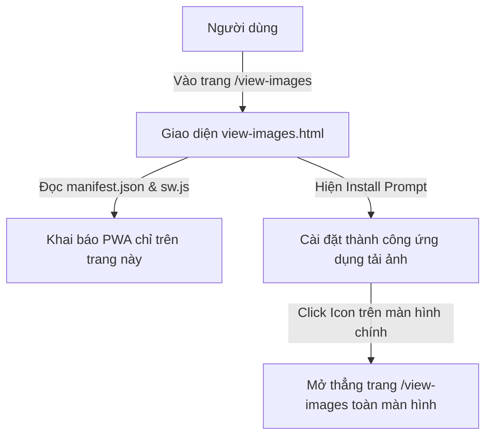

# US-126: Nâng Cấp Trang Tải Ảnh Hàng Loạt Thành Ứng Dụng Cài Đặt (PWA) Cô Lập

## User story
**As an** Admin / Sale
**I want** cài đặt riêng trang web Tải Ảnh Hàng Loạt (`/view-images`) trực tiếp vào màn hình chính của điện thoại hoặc máy tính dưới dạng ứng dụng độc lập (không áp dụng cho trang chủ index.html).
**I want** ứng dụng này hiển thị với biểu tượng icon đại diện sang trọng và mở rộng standalone toàn màn hình.
**So that** tôi có thể truy cập và sử dụng nhanh công cụ tải ảnh hàng loạt bất kỳ lúc nào trực tiếp từ màn hình thiết bị.

## Acceptance
- [ ] Giao diện hỗ trợ chuẩn PWA với tệp cấu hình `manifest.json` có `start_url` được cấu hình là `/view-images`.
- [ ] Ứng dụng khi cài đặt có icon đại diện sang trọng kích thước 192x192 và 512x512.
- [ ] Định nghĩa Service Worker (`sw.js`) để đăng ký ứng dụng ngoại tuyến cơ bản và đáp ứng các tiêu chuẩn bắt buộc của trình duyệt.
- [ ] Chỉ tích hợp đăng ký Service Worker và liên kết Manifest trong file `view-images.html`. **Tuyệt đối không áp dụng và không chỉnh sửa** trang chủ gốc (`index.html`).
- [ ] Khi chạy dưới dạng PWA đã cài đặt, ứng dụng mở thẳng vào trang `/view-images` ở chế độ toàn màn hình (`standalone` mode) không chứa thanh địa chỉ URL.
- [ ] Cấu hình routing trên Vercel Node.js (`api/index.js`) và Flask local (`api/routes_curation.py`) để phục vụ chính xác tệp `/manifest.json` và `/sw.js` từ gốc thư mục.

## Solution

> [!note]- Configuration
> Cấu hình `vercel.json` bổ sung hai tệp `manifest.json` và `sw.js` vào phần `includeFiles`.

> [!note]- Input
> Người dùng truy cập trang `/view-images` bằng Chrome (Android/Desktop) hoặc Safari (iOS) và chọn "Cài đặt ứng dụng" hoặc "Thêm vào màn hình chính".

> [!note]- Output / Format
> - Tệp `/manifest.json` với `start_url: "/view-images"`.
> - Tệp `/sw.js` phục vụ caching cơ bản.

> [!note]- Key logic
> 1. Service Worker được đăng ký tại `/sw.js` (gốc thư mục) để có scope trên toàn bộ domain.
> 2. Đăng ký SW và manifest chỉ xuất hiện trong `view-images.html`.



## 📋 Implementation Plan

### Giao diện & Assets

#### [NEW] [manifest.json](file:///d:/LHTBrain/01_PROJECTS/BDS-KhangNgo/manifest.json)
- Khai báo metadata cho app:
  - `name`: "Tải Ảnh Khang Ngô"
  - `short_name`: "Tải Ảnh BDS"
  - `start_url`: "/view-images"
  - `display`: "standalone"
  - `background_color`: "#0b0f19"
  - `theme_color`: "#38bdf8"
  - `icons`: Khai báo 192x192 và 512x512 trỏ tới `/static/img/icon-192.png` và `/static/img/icon-512.png`.

#### [NEW] [sw.js](file:///d:/LHTBrain/01_PROJECTS/BDS-KhangNgo/sw.js)
- Viết mã Service Worker cơ bản để bắt sự kiện `install`, `activate`, và `fetch` nhằm đáp ứng điều kiện installable của trình duyệt.

#### [NEW] [static/img/icon-512.png](file:///d:/LHTBrain/01_PROJECTS/BDS-KhangNgo/static/img/icon-512.png)
- Sao chép logo vàng kim trên nền tối đã tạo.

#### [NEW] [static/img/icon-192.png](file:///d:/LHTBrain/01_PROJECTS/BDS-KhangNgo/static/img/icon-192.png)
- Phiên bản logo 192x192 tương thích.

---

### Tích hợp PWA vào HTML

#### [MODIFY] [view-images.html](file:///d:/LHTBrain/01_PROJECTS/BDS-KhangNgo/view-images.html)
- Thêm thẻ `<link rel="manifest" href="/manifest.json">`.
- Thêm thẻ `<meta name="apple-mobile-web-app-capable" content="yes">` hỗ trợ iOS Safari.
- Đăng ký service worker trong thẻ script:
  ```javascript
  if ('serviceWorker' in navigator) {
    window.addEventListener('load', () => {
      navigator.serviceWorker.register('/sw.js');
    });
  }
  ```

*Chú ý: Không chỉnh sửa file `index.html`.*

---

### Routing & Gateway

#### [MODIFY] [vercel.json](file:///d:/LHTBrain/01_PROJECTS/BDS-KhangNgo/vercel.json)
- Thêm `"manifest.json", "sw.js"` vào `includeFiles`.

#### [MODIFY] [api/index.js](file:///d:/LHTBrain/01_PROJECTS/BDS-KhangNgo/api/index.js)
- Thêm route cho `/manifest.json` trả về file JSON gốc.
- Thêm route cho `/sw.js` trả về file Javascript gốc với header không cache.

#### [MODIFY] [api/routes_curation.py](file:///d:/LHTBrain/01_PROJECTS/BDS-KhangNgo/api/routes_curation.py)
- Thêm Flask route tương tự cho `/manifest.json` và `/sw.js`.

## 📝 Task Checklist (TODO)
- [ ] **Thiết kế & Khảo sát:**
  - [ ] Thiết kế tệp manifest.json & sw.js
  - [ ] Chuẩn bị thư mục static/img và các icon
- [ ] **Triển khai Code:**
  - [ ] Sao chép và tạo ảnh icon-192.png, icon-512.png từ ảnh AI đã sinh
  - [ ] Tạo file `manifest.json` và `sw.js` ở root
  - [ ] Liên kết manifest và đăng ký sw chỉ trong `view-images.html`
  - [ ] Cập nhật `vercel.json`, `api/index.js`, và `api/routes_curation.py`
- [ ] **Kiểm thử sơ bộ:**
  - [ ] Chạy local verify PWA trong DevTools Application tab (Lighthouse audit installable)
  - [ ] Cập nhật story status thành done.

## 🛠️ Update Logic (Drafting while Doing)
*(Sẽ được điền trong quá trình code)*

## 🧠 Retro, Lessons Learned & Good Practices
*(Sẽ được điền sau khi hoàn thành)*

## Verification Plan

### Automated Tests
- Bổ sung test cases trong `tests/test_api_contracts.py` để xác thực định dạng content-type của `/manifest.json` và `/sw.js`.

### Manual Verification
1. Truy cập trang `/view-images` bằng Chrome.
2. Kiểm tra tab DevTools -> **Application** -> **Manifest** xem có nhận diện được `start_url` là `/view-images` và có lỗi gì không.
3. Cài đặt app và mở lên để kiểm tra chế độ hiển thị toàn màn hình (standalone).

## Files touched
- `manifest.json` — Cấu hình PWA manifest
- `sw.js` — Mã nguồn PWA Service Worker
- `vercel.json` — Đóng gói vercel bundle
- `api/index.js` — Phục vụ file manifest/sw trên Cloud
- `api/routes_curation.py` — Phục vụ file manifest/sw trên Local
- `view-images.html` — Đăng ký PWA
- `tests/test_api_contracts.py` — Test cases cho API PWA
- `static/img/icon-192.png` — Icon app 192x192
- `static/img/icon-512.png` — Icon app 512x512
