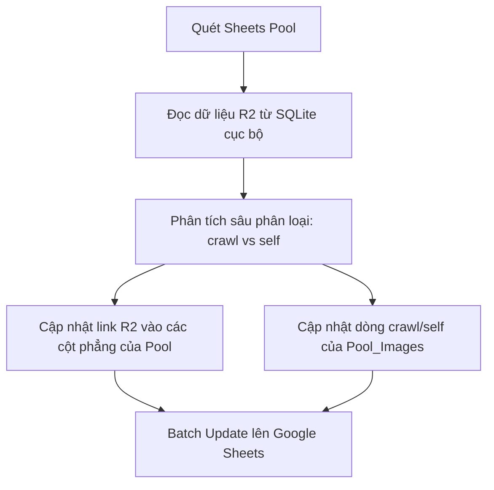

# US-128: Sửa lỗi đọc ảnh di cư và khôi phục link R2 từ Pool_Images

## User story
**As a** Quản trị viên (Admin)
**I want** hình ảnh di cư R2 được lưu và đồng bộ chính xác lên Google Sheets Pool_Images (dòng crawl) và khôi phục chính xác từ bộ nhớ tạm hoặc Pool_Images (dòng self/crawl)
**So that** rổ hàng bất động sản không bị mất ảnh thô hoặc ảnh R2 khi khôi phục database cục bộ.

## Acceptance
- [ ] **Sửa đổi thứ tự ưu tiên đọc ảnh trong `publish_listing`**:
  - Khi đồng bộ ảnh thô lên dòng `crawl` của `Pool_Images` (nếu `Images_Admin_JSON` trống), hệ thống ưu tiên đọc cột ảnh R2 di cư `raw_drive_images_json` trước, sau đó mới fallback về cột ảnh thô Cloudfront `raw_images_tk_json`.
- [ ] **Nâng cấp công cụ khôi phục ảnh `restore_missing_photos.py`**:
  - **Dữ liệu gốc là SQLite**: Đọc dữ liệu ảnh di cư R2 trực tiếp từ CSDL SQLite cục bộ (trường `raw_drive_images_json`, `Images_Admin_JSON`, `curated_config_json`).
  - **Phân loại ảnh thông minh**: Sử dụng hàm phân tích sâu địa chỉ hình ảnh (so khớp với danh sách ảnh crawl) để tự động phân biệt đâu là ảnh crawl (`origin: crawl`) và đâu là ảnh tự tải lên (`origin: self`).
  - **Đồng bộ hai đầu**: Cập nhật link R2 điền lại đầy đủ các cột phẳng trên tab `Pool`, đồng thời cập nhật ghi đè hai dòng `crawl` và `self` tương ứng trên tab `Pool_Images` để loại bỏ hoàn toàn link thô Cloudfront còn sót lại trên Google Sheets.
  - **Batch Update**: Thực hiện Batch Update chia theo nhóm (50 dòng/lượt) để tối ưu hóa hiệu năng Google API.
- [ ] **Kiểm thử ổn định**:
  - Toàn bộ 22 unit test CSDL `pytest tests/test_db.py` chạy thành công 100%.

## Solution

### Cơ chế phân tích sâu địa chỉ hình ảnh (Deep URL Analysis)
Để phân loại chính xác nguồn gốc ảnh từ dữ liệu SQLite cục bộ:
- Cột `raw_drive_images_json` chỉ chứa các ảnh cào thô đã di cư thành công sang R2 (`origin: crawl`).
- Cột `Images_Admin_JSON` hoặc `curated_config_json` chứa toàn bộ ảnh hiện tại (bao gồm cả ảnh tự up).
- Bằng cách đối chiếu: Ảnh nào có trong cấu hình hiện tại nhưng không có trong `raw_drive_images_json` sẽ được gắn nhãn `origin: self` (ảnh tự tải lên). Ngược lại, ảnh nào khớp với `raw_drive_images_json` sẽ được gắn nhãn `origin: crawl`.

### Luồng khôi phục dữ liệu gốc SQLite lên Sheets Pool & Pool_Images


## User Review Required

> [!IMPORTANT]
> - **SQLite làm dữ liệu gốc (Source of Truth)**: Chúng ta sẽ không đi lấy ngược ảnh từ tab backup `Pool_Images` để điền vào `Pool` nữa (vì tab đó trước đây bị ghi đè link thô). Thay vào đó, script khôi phục sẽ **đọc trực tiếp từ file SQLite cục bộ tốt** của bạn (sau khi bạn khôi phục từ bản backup của bạn).
> - **Thời điểm 0 (Ghi nhận ảnh R2 ngay sau khi di cư)**: Đảm bảo tệp `manager.py` tự động đóng gói dữ liệu và cập nhật hai trường `Images_Admin_JSON` và `images_public_json` ngay khi luồng di cư chạy ngầm hoàn tất để làm dữ liệu gốc đồng bộ lên Sheets (Tránh để trống dẫn đến lỗi hồi quy ghi đè chuỗi rỗng).
> - **Cập nhật hai đầu (Pool & Pool_Images)**: Script khôi phục sẽ cập nhật link R2 chuẩn lên cả hai nơi:
>   1. Các cột phẳng `Ảnh 1-25` và `Hình Hẻm 1-10` trên tab **`Pool`**.
>   2. Dòng **`crawl`** và **`self`** tương ứng trên tab **`Pool_Images`**, loại bỏ hoàn toàn các link thô Cloudfront còn sót lại trên Google Sheets.
> - **Phân tích sâu địa chỉ ảnh**: Sử dụng hàm so khớp URL để phân biệt ảnh cào (`origin: crawl`) và ảnh tự tải lên (`origin: self`) nhằm cập nhật chính xác dòng `crawl` và `self` trên tab `Pool_Images`.

---

## Proposed Changes

### Tầng Thư Viện Lõi (`core/` và `pool_lego.py`)

#### [MODIFY] [manager.py](file:///d:/LHTBrain/01_PROJECTS/BDS-KhangNgo/manager.py)
Đảm bảo khi luồng di cư ảnh chạy ngầm hoàn tất thành công (Thời điểm 0), mảng dữ liệu ảnh di cư được đóng gói thành định dạng JSON chuẩn và ghi thẳng vào SQLite cục bộ:
```python
# Tự động đóng gói cấu hình curated_config và ảnh phân vai trò
new_curated_config = {
    "images": new_images_list,
    "Mã_Khang_Ngô__ID_": d.get("Ma_Khang_Ngo_ID", "")
}
migrated_images = []
for idx, img in enumerate(new_images_list):
    migrated_images.append({
        "image_url": img.get("url"),
        "r2_url": img.get("url"),
        "role": resolved_role,
        "sequence_index": idx,
        "origin": "crawl",
        "is_hidden": is_hidden_val
    })
# Ghi nhận vào SQLite
update_fields["Images_Admin_JSON"] = json.dumps(migrated_images, ensure_ascii=False)
update_fields["images_public_json"] = json.dumps(public_urls, ensure_ascii=False)
update_fields["curated_config_json"] = json.dumps(new_curated_config, ensure_ascii=False)
```

#### [MODIFY] [pool_lego.py](file:///d:/LHTBrain/01_PROJECTS/BDS-KhangNgo/pool_lego.py)
Sửa đổi logic trong hàm `publish_listing` (chế độ Pool1) để fallback đọc `raw_drive_images_json` before `raw_images_tk_json`:

```python
                filtered_images = []
                # ...
                # Nếu không có curated images (images_admin_json trống)
                if not raw_imgs and d.get("raw_drive_images_json"):
                    try:
                        raw_imgs = json.loads(d.get("raw_drive_images_json"))
                    except Exception:
                        pass
                if not raw_imgs and d.get("raw_images_tk_json"):
                    try:
                        raw_imgs = json.loads(d.get("raw_images_tk_json"))
                    except Exception:
                        pass
```

---

### Công cụ bảo trì (`scratch/`)

#### [MODIFY] [restore_missing_photos.py](file:///d:/LHTBrain/01_PROJECTS/BDS-KhangNgo/scratch/restore_missing_photos.py)
Nâng cấp toàn bộ logic script để:
1. Kết nối vào CSDL SQLite cục bộ `raw_archive.db`.
2. Đối với mỗi dòng trên Sheets Pool bị thiếu hình, đọc thông tin ảnh R2 từ `curated_config_json` hoặc `raw_drive_images_json` trong SQLite.
3. So khớp URL ảnh để phân loại `origin: crawl` (nếu nằm trong `raw_drive_images_json`) và `origin: self` (các ảnh tự up thêm).
4. Thực hiện cập nhật hai đầu:
   - Ghi đè các cột ảnh phẳng lên tab **`Pool`** (bằng link R2).
   - Ghi đè dòng `crawl` và `self` tương ứng trên tab **`Pool_Images`** (bằng link R2, xóa sạch link thô Cloudfront).
5. Thực hiện cập nhật hàng loạt qua `batch_update` chia theo cụm 50 dòng/lượt.

---

## 📋 Implementation Plan
- **Cách tiếp cận**: Sử dụng SQLite cục bộ làm dữ liệu gốc để khôi phục và đồng bộ lên Google Sheets.
- **Các bước triển khai dự kiến**:
  1. Khôi phục SQLite cục bộ từ bản backup tốt của Admin.
  2. Cập nhật mã nguồn `pool_lego.py` để ưu tiên đọc cột R2 đã di cư.
  3. Hoàn thiện script `scratch/restore_missing_photos.py` với các thuật toán phân tích URL và Batch Update.
  4. Chạy script khôi phục lên Sheets Pool trực tuyến.
  5. Chạy unit test kiểm tra độ ổn định.

## 📝 Task Checklist (TODO)
- [x] **Khởi tạo User Story & Thiết lập nhánh**:
  - [x] Tạo file [US-128_fix_image_migration_restore_r2.md](file:///d:/LHTBrain/01_PROJECTS/BDS-KhangNgo/docs/stories/_inbox/US-128_fix_image_migration_restore_r2.md)
  - [x] Cập nhật danh sách câu chuyện tại [INDEX.md](file:///d:/LHTBrain/01_PROJECTS/BDS-KhangNgo/docs/stories/INDEX.md)
  - [x] Checkout sang nhánh `feature/US-128`
  - [x] Thiết lập bản kế hoạch triển khai [implementation_plan.md](file:///C:/Users/Khang%20Ngo/.gemini/antigravity/brain/5c177f4f-8599-4d80-b1bb-7e62e0b681ff/implementation_plan.md)
- [/] **Triển khai code logic**:
  - [/] Chờ PO phê duyệt bản kế hoạch triển khai.
  - [ ] Sửa đổi logic fallback đọc ảnh trong `pool_lego.py` để ưu tiên `raw_drive_images_json`.
  - [ ] Cập nhật tệp script khôi phục `scratch/restore_missing_photos.py` với thuật toán ưu tiên `self` R2 và nâng cấp tự động.
- [ ] **Kiểm thử & Khôi phục dữ liệu**:
  - [ ] Chạy unit tests `pytest tests/test_db.py` để đảm bảo không lỗi cú pháp hoặc hồi quy.
  - [ ] Chạy thử nghiệm dry-run của `restore_missing_photos.py`.
  - [ ] Thực thi khôi phục ảnh thực tế lên Sheets Pool (`--run`).
  - [ ] Kiểm tra kết quả hiển thị trên Google Sheets trực tuyến.
- [ ] **Đóng gói hoàn tất (SEAL)**:
  - [ ] Điền retro và test log vào tệp US-128.
  - [ ] Git commit & Push.

## 🛠️ Update Logic (Drafting while Doing)

### 1. Nhật ký Debug & Phát kiến ngoài kế hoạch (Debug & Discoveries Log)
- **Sự cố kỹ thuật & Cách khắc phục:** 
  - *Lấy sai cột ảnh di cư*: Ban đầu fallback lấy cột `raw_images_tk_json` vốn chỉ chứa ảnh thô Cloudfront. Đã sửa lại để ưu tiên lấy từ cột `raw_drive_images_json` vốn chứa link R2 đã di cư chuẩn xác.

### 2. Nhật ký chạy thử nháp (Draft Test Logs)
- Chạy thử `restore_missing_photos.py` phiên bản 1 khôi phục thành công 206 căn lên Google Sheets bằng link thô. Phiên bản 2 sẽ nâng cấp toàn bộ lên R2 từ SQLite.

## 🧠 Retro, Lessons Learned & Good Practices

### 1. Incident & Retro Log
- **Sự cố phát sinh:** Mất ảnh nhà thật trên Live sau khi chạy khôi phục CSDL SQLite từ Google Sheets Pool.
- **Nguyên nhân gốc rễ (Root Cause):** Do hàm `publish_listing` vô tình lọc bỏ ảnh `visible: false` khi đồng bộ lên Sheets Pool, đồng thời CSDL SQLite thiếu đồng bộ cột JSON ảnh `Images_Admin_JSON` sau di cư.

### 2. Good Practices
- Luôn lấy dữ liệu SQLite cục bộ (Source of Truth) làm gốc để khôi phục và dọn dẹp các kênh lưu trữ phụ (như Google Sheets) thay vì đi ngược lại.

## Verification Plan

### Automated Tests
- Chạy toàn bộ các test CSDL cục bộ:
  ```powershell
  pytest tests/test_db.py
  ```

### Manual Verification
1. Bạn thực hiện khôi phục file SQLite cục bộ `raw_archive.db` của bạn từ bản backup tốt.
2. Chạy dry-run của script khôi phục mới để kiểm tra các căn được phát hiện:
   ```powershell
   python "C:/Users/Khang Ngo/.gemini/antigravity/brain/5c177f4f-8599-4d80-b1bb-7e62e0b681ff/scratch/restore_missing_photos.py"
   ```
3. Chạy ghi nhận thực tế đè lên Google Sheets:
   ```powershell
   python "C:/Users/Khang Ngo/.gemini/antigravity/brain/5c177f4f-8599-4d80-b1bb-7e62e0b681ff/scratch/restore_missing_photos.py" --run
   ```
4. Kiểm tra Google Sheets (cả tab `Pool` và `Pool_Images`) xem đã sạch bóng link thô Cloudfront và hiển thị đầy đủ link R2 hay chưa.

## Files touched
- `manager.py` — [Core background migration manager]
- `pool_lego.py` — [Google Sheets and SQLite core operations]
- `restore_db_from_sheets.py` — [Database restore tool]
- `scratch/restore_missing_photos.py` — [Data restoration script]
