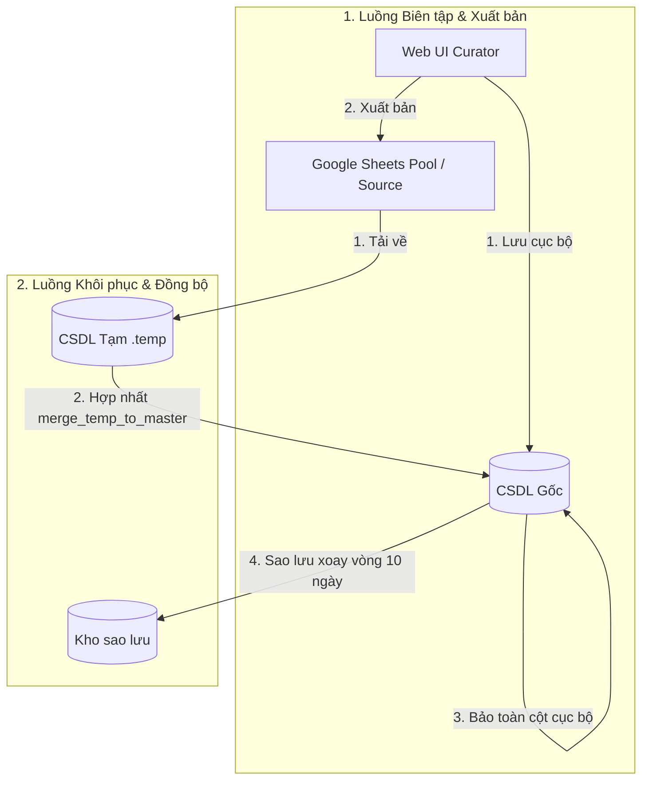

# US-129: Thiết lập cơ chế CSDL Gốc bền vững và đồng bộ gián tiếp qua CSDL Tạm

## User story
**As a** Quản trị viên (Admin) / Chủ sở hữu dự án
**I want** cơ sở dữ liệu SQLite cục bộ được phân tách thành CSDL Gốc bền vững (không bao giờ bị xóa vật lý) và CSDL Tạm trung gian phục vụ đồng bộ từ Google Sheets, kèm theo cơ chế tự động sao lưu luân phiên CSDL Gốc hàng ngày trong 10 ngày.
**So that** hệ thống không bao giờ bị mất mát dữ liệu lịch sử cào thô đầy đủ (`raw_json_full`), link ảnh R2 di cư hay cấu hình biên tập khi khôi phục từ Sheets, và có thể khôi phục lại dữ liệu gốc an toàn khi có sự cố.

## Acceptance
- [ ] **Tách biệt database vật lý**:
  - Tệp CSDL Gốc (`raw_archive.db` hoặc `raw_archive_staging.db`) đóng vai trò là **Master DB** (CSDL Gốc), không bao giờ bị xóa vật lý trong các tiến trình hệ thống, chỉ nhận cập nhật.
  - Tiến trình khôi phục CSDL từ Sheets (`restore_db_from_sheets.py`) sẽ nạp dữ liệu từ Sheets vào một file CSDL Tạm trung gian (`raw_archive.db.temp` hoặc `raw_archive_staging.db.temp`).
- [ ] **Hợp nhất dữ liệu bền vững (Database Merge)**:
  - Triển khai hàm `merge_temp_to_master(temp_db, master_db)` để cập nhật dữ liệu từ CSDL Tạm vào CSDL Gốc dựa vào `tk_id`.
  - **Quy tắc hợp nhất**:
    - Đối với mỗi listing trong CSDL Tạm:
      - Nếu đã tồn tại ở CSDL Gốc: Cập nhật các trường thông tin phẳng (như giá chào, diện tích, trạng thái...) từ CSDL Tạm sang CSDL Gốc. Bảo toàn tuyệt đối các cột chỉ lưu cục bộ (`raw_json_full`, `raw_drive_images_json` nếu CSDL tạm trống, `Images_Admin_JSON` nếu CSDL tạm trống, `raw_images_tk_json`, `raw_sodo_tk_json`).
      - Nếu chưa tồn tại ở CSDL Gốc: Thêm mới dòng dữ liệu hoàn chỉnh từ CSDL Tạm sang CSDL Gốc.
    - Đối với các listings trong CSDL Gốc không có mặt trong CSDL Tạm: Không xóa vật lý khỏi CSDL Gốc, chỉ cập nhật trạng thái `status = 'sheet_deleted'` để đánh dấu đã bị xóa trên Sheets, bảo toàn dữ liệu lịch sử.
- [ ] **Tự động sao lưu xoay vòng (Rotate Backup)**:
  - Thực hiện sao lưu CSDL Gốc hàng ngày, tự động dọn dẹp giữ lại đúng tối đa 10 bản sao lưu gần nhất.
- [ ] **Kiểm thử ổn định**:
  - Viết unit test giả lập cơ chế hợp nhất và xoay vòng sao lưu thành công.
  - Chạy `pytest tests/test_db.py` và `verify_build.py` đạt kết quả xanh (Pass).

## Solution

### Quy trình Luồng Dữ liệu Đồng bộ & Biên tập

Hệ thống hoạt động theo 2 luồng dữ liệu chính để đảm bảo tính nhất quán và bảo vệ dữ liệu cục bộ:

1. **Luồng Biên tập & Xuất bản (Curation & Publish)**:
   * Khi Biên tập viên chỉnh sửa thông tin trên Web UI `/curator`, hệ thống sẽ lưu thay đổi vào **CSDL Gốc (Master DB)** trước (`PUT /api/listings/<tk_id>`).
   * Sau đó, Web UI sẽ gửi lệnh xuất bản (`POST /api/publish/<tk_id>`) để ghi đè dòng dữ liệu đã biên tập lên **Google Sheets (Pool & Source)**.

2. **Luồng Khôi phục & Đồng bộ (Sync & Restore)**:
   * Khi chạy tiến trình đồng bộ hoặc khôi phục (`restore_db_from_sheets.py`), hệ thống tải toàn bộ dữ liệu từ **Google Sheets (Pool & Source)** về và ghi vào **CSDL Tạm (Temp DB - `raw_archive.db.temp`)**.
   * Hệ thống thực hiện sao lưu (Backup) CSDL Gốc trước khi hợp nhất.
   * Chạy lệnh `merge_temp_to_master` để hợp nhất các trường thông tin phẳng từ **CSDL Tạm** sang **CSDL Gốc**, đồng thời bảo toàn các cột ảnh và dữ liệu thô cục bộ trong **CSDL Gốc**.
   * Cuối cùng, xóa bỏ **CSDL Tạm** để giải phóng bộ nhớ.

### Mô hình hợp nhất dữ liệu Master - Temp


## Proposed Changes

### Tầng Thư viện / Script
* **[restore_db_from_sheets.py](file:///d:/LHTBrain/01_PROJECTS/BDS-KhangNgo/restore_db_from_sheets.py)**:
  * Sửa đổi đích đến nạp dữ liệu thành `DB_FILE + ".temp"`.
  * Viết hàm `merge_temp_to_master` và kích hoạt ở cuối tiến trình.
  * Tự động xóa file `.temp` sau khi hoàn thành.
  * Bổ sung cơ chế tự động xoay vòng sao lưu CSDL Gốc lưu tối đa 10 ngày.
* **[pool_lego.py](file:///d:/LHTBrain/01_PROJECTS/BDS-KhangNgo/pool_lego.py)**:
  * Sửa đổi chốt phòng vệ trong `save_raw_to_sqlite` để bảo vệ ảnh cũ khi cào lại có ít ảnh hơn.

## Verification Plan

### Automated Tests
- Chạy unit test kiểm thử:
  ```bash
  pytest tests/test_db.py
  ```

### Manual Verification
- Chạy thử `restore_db_from_sheets.py` để kiểm tra SQLite PRD vẫn giữ nguyên cột `raw_json_full` đầy đủ của các căn nhà và tệp SQLite gốc không bị xóa.
