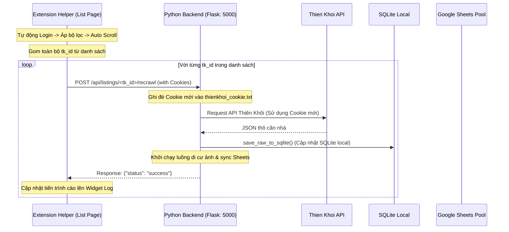

# US-134: Cào trực tiếp tin thô từ trang danh sách Thiên Khôi về SQLite cục bộ (Hybrid Model)

## User story
**As a** Lập trình viên / PO dự án BDS Khang Ngô
**I want** Chrome Extension điều phối (dispatch) gửi yêu cầu cào trực tiếp từ **trang danh sách Thiên Khôi** về Python Local Backend thông qua API `/api/listings/<tk_id>/recrawl` thay vì phải mở từng trang chi tiết.
**So that** Tốc độ cào cực nhanh, không tốn tài nguyên mở/đóng tab liên tục, đồng thời SQLite cục bộ và Google Sheets vẫn được cập nhật dữ liệu chuẩn xác nhất từ API Thiên Khôi.

## Logic hiện tại liên quan
- **DF-003: Luồng Dữ Liệu Cào & Nhập Kho Tin Thô v1**: Xác nhận rằng Python Backend có API `/api/listings/<tk_id>/recrawl` để cào lẻ 1 căn bằng API/HTML Thiên Khôi và lưu thẳng SQLite.
- Yêu cầu này **KẾT HỢP VÀ TỐI ƯU HÓA**:
  - Python Backend có khả năng tự cào bằng API Thiên Khôi (`backend.thienkhoi.com/product/v1/property/{tk_id}`) khi có Cookie của Extension gửi về.
  - Do đó, **không cần mở trang chi tiết nữa**. Extension chỉ cần chạy trên trang danh sách, lấy danh sách `tk_id` và Cookie rồi gửi POST chạy ngầm.

## Acceptance
- [ ] **Cào trực tiếp trên trang danh sách**:
  - Sau khi áp bộ lọc và tự động cuộn trang (Auto Scroll) xong, Extension thu thập toàn bộ `tk_id` của các căn hiện trên trang danh sách.
  - Extension lấy Cookie Thiên Khôi hiện tại và gửi tuần tự từng request POST cào về `http://localhost:5000/api/listings/<tk_id>/recrawl` chạy ngầm (thông qua background script để bypass CORS).
  - Không mở thêm bất kỳ tab chi tiết nào.
- [ ] **Nhật ký hiển thị thời gian thực**:
  - Giao diện Log của Extension hiển thị tiến độ cào: `Đang cào căn 1/20 (TK-XXXX)...`, `Thành công`, `Thất bại`.
  - SQLite local và Google Sheets Pool được cập nhật tức thời khi Backend báo thành công.
- [ ] **Giữ nguyên các ưu điểm UI của Extension**:
  - Tự động điền form đăng nhập & kiểm tra session hết hạn.
  - Tự động cấu hình bộ lọc accordion và click "Xác nhận".
  - Tự động cuộn trang (Auto Scroll) để load infinite scroll danh sách nhà.

## Solution

### Input từ Extension gửi về Local Backend:
`POST http://localhost:5000/api/listings/<tk_id>/recrawl`
```json
{
  "cookie": "cookie_hien_tai_cua_ext"
}
```

### Key logic
1. Extension trích xuất `tk_id` từ href của các thẻ `a` trên trang danh sách (ví dụ `/warehouse/sources/<UUID>`).
2. Gửi request qua `background.js` (để tránh lỗi CORS) tới `/api/listings/<tk_id>/recrawl` của Local Python Backend.
3. Python Backend ghi nhận cookie, cào API Thiên Khôi, lưu SQLite, di cư ảnh và sync Sheets.



## 📋 Implementation Plan

### Chrome Extension (`content.js` & `background.js`)
- Loại bỏ logic mở tab `?autoCrawl=true` chạy nền cũ.
- Thay đổi hàm `autoCrawlAfterFilter()`:
  - Sau khi scroll xong, lấy toàn bộ danh sách link từ `getListingLinks()`.
  - Trích xuất `tk_id` từ các link đó.
  - Lấy cookie hiện tại thông qua `chrome.cookies.getAll` ở `background.js`.
  - Thực hiện một vòng lặp `for` chạy tuần tự (hoặc song song có giới hạn) để gửi lệnh cào về local backend.
  - Cập nhật log trực quan lên Widget.

### Python Backend (`api/routes_crawl.py` & `manager.py`)
- API `/api/listings/<tk_id>/recrawl` hỗ trợ nhận cookie mới từ JSON payload của request để ghi đè vào file cookie cục bộ trước khi thực hiện cào.

## 📝 Task Checklist (TODO)
- [x] **Thiết kế & Khảo sát:**
  - [x] Kiểm tra hàm trích xuất `tk_id` từ URL `/warehouse/sources/<UUID>`.
- [x] **Triển khai Code:**
  - [x] Chỉnh sửa `api/routes_crawl.py` ghi nhận cookie.
  - [x] Sửa `autoCrawlAfterFilter` trong `content.js` để gọi API Backend trực tiếp bằng loop không mở tab.
- [x] **Kiểm thử & Nghiệm thu:**
  - [x] Chạy cào thử trên trang danh sách sau khi lọc và kiểm tra SQLite cục bộ.

## Truth Cards bị ảnh hưởng
- **DF-003 v2**: Bổ sung chi tiết về luồng lọc trùng (deduplication) cục bộ thông qua API `/api/listings/existing_ids` lấy trực tiếp danh sách `tk_id` đã có từ SQLite cục bộ thay vì đọc từ Google Sheets.
