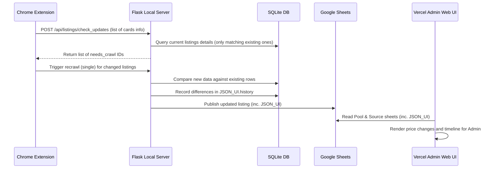

# US-135: Tự Động Phát Hiện Thay Đổi & Lưu Lịch Sử Giá Cho Admin

## User story
**As an** Admin  
**I want** the system to dynamically detect listings with changes on the list page and record their change history when crawling  
**So that** I can track price drops and updates directly on Vercel Admin card list and detail view  

## Acceptance
- [x] Extension dynamically scans and parses listing cards on the list page (id, price, update time text).
- [x] Backend provides `/api/listings/check_updates` to compare listing details against local SQLite, ignoring new listings (no new adds) and returning only existing listings with changes.
- [x] Backend compares new crawl payload with existing SQLite data during `save_raw_to_sqlite` and records changes (including price, description, status, etc.) to `JSON_UI.history` array.
- [x] Vercel Admin card view displays previous and new price along with unit price per square meter on the deed (e.g. `~~15 tỷ (375.3tr)~~ ➔ 13 tỷ (300.5tr)`) calculated using `p.dt_tren_so_custom` for admin users when a price change is recorded.
- [x] Vercel Admin detail view displays a chronological change history timeline under raw specs.

## Logic hiện tại liên quan
- **[DF-001] Luồng Dữ Liệu Biên Tập & Xuất Bản v2**: Xác nhận cơ chế lưu SQLite cục bộ trước khi publish và đồng bộ thông tin phẳng của `JSON_UI` lên Sheets. Việc bổ sung trường `"history"` vào cấu trúc của `JSON_UI` giúp lưu lịch sử thay đổi mà không phá vỡ schema hiện tại hay chính sách ghi đè bảo vệ chất xám.
- **[DF-003] Luồng Dữ Liệu Cào & Nhập Kho Tin Thô v2**: Yêu cầu này bổ sung logic so sánh (diff) dữ liệu mới cào với dữ liệu cũ trong SQLite trước khi ghi đè, tự động ghi nhận lịch sử thay đổi (đặc biệt là giá chào) và tích hợp API `/api/listings/check_updates` phục vụ việc lọc trùng và lọc tin thay đổi linh hoạt từ Extension.
- **[SF-001] Kiến Trúc Hệ Thống Tổng Quan v1**: Xác nhận luồng tương tác giữa Chrome Extension (quét & trigger), Local Backend (xử lý SQLite, R2 và so sánh thay đổi) và Web Vercel Admin (đọc Sheets và hiển thị lịch sử thay đổi an toàn).
## Truth Cards bị ảnh hưởng
- **DF-003 v3**: Cập nhật logic so sánh dữ liệu cào mới với SQLite, ghi nhận lịch sử thay đổi vào `JSON_UI.history` và thời gian quét `Last_Crawl`.

## Solution

> [!note]- Input
> Payload gửi lên `POST /api/listings/check_updates`:
> ```json
> {
>   "listings": [
>     { "tk_id": "uuid", "price": "15", "date_text": "2 giờ trước" }
>   ]
> }
> ```

> [!note]- Output
> Phản hồi từ `POST /api/listings/check_updates`:
> ```json
> {
>   "status": "success",
>   "needs_crawl": ["uuid", ...]
> }
> ```

> [!note]- Key logic
> 1. Lưu trữ lịch sử thay đổi trực tiếp bên trong trường `JSON_UI` dưới dạng thuộc tính `history` của đối tượng JSON:
>    ```json
>    {
>      "createdAtSigned": "...",
>      "updatedAt": "...",
>      "history": [
>        {
>          "type": "price",
>          "old": "15",
>          "new": "13",
>          "date": "11/07/2026 16:44:52"
>        }
>      ]
>    }
>    ```
> 2. So sánh giá trị cũ và mới trong `save_raw_to_sqlite`:
>    - Ép kiểu sang float trước khi so sánh giá trị giá chào (ví dụ: `15.0` vs `15` coi như bằng nhau).
>    - So sánh ngày cập nhật: Chuyển đổi relative date (hôm nay, hôm qua, x giờ trước) thành ngày thực tế và đối chiếu.
> 3. Cách tính đơn giá m²:
>    - `Đơn giá (tr/m²) = (Giá chào * 1000) / Diện tích trên sổ` (sử dụng duy nhất `p.dt_tren_so_custom`).



## 📋 Implementation Plan

### Backend APIs & Data Layer

#### [MODIFY] [pool_lego.py](file:///d:/LHTBrain/01_PROJECTS/BDS-KhangNgo/pool_lego.py)
*   Cập nhật hàm `save_raw_to_sqlite` thực hiện so sánh đối chiếu dữ liệu thô mới cào với dữ liệu cũ đang lưu trong SQLite trước khi `UPDATE`.
*   So sánh các trường thông tin thô: `Giá chào` (`offeringPrice`), `Mô tả chi tiết` (`description`), `Trạng thái` (`status`), `Thông tin liên hệ`, v.v.
*   Nếu có sự thay đổi, tự động tạo bản ghi lịch sử thay đổi dạng:
    ```json
    {
      "type": "price", // hoặc "info", "status"
      "field": "offeringPrice", // hoặc "description", "status"
      "old": "15",
      "new": "13",
      "date": "11/07/2026 16:44:52"
    }
    ```
*   Đọc mảng `"history"` hiện tại trong `JSON_UI` (nếu có), nối tiếp (append) bản ghi thay đổi mới, và lưu ngược lại vào trường `JSON_UI` của SQLite để chuẩn bị đồng bộ lên Google Sheets.

#### [MODIFY] [api/routes_pool.py](file:///d:/LHTBrain/01_PROJECTS/BDS-KhangNgo/api/routes_pool.py)
*   Thêm endpoint `POST /api/listings/check_updates` phục vụ Chrome Extension:
    *   Nhận danh sách các căn trên màn hình dạng: `{"listings": [{"tk_id": "...", "price": "15.5", "date_text": "2 giờ trước"}, ...]}`.
    *   Đối chiếu với CSDL SQLite:
        *   **Bỏ qua hoàn toàn các căn chưa có trong SQLite** (Không thêm mới).
        *   Nếu căn đã có trong SQLite:
            *   So sánh giá thô gửi lên với `offeringPrice` hiện tại trong DB. Nếu khác biệt -> Thêm vào `needs_crawl`.
            *   Phân tích chuỗi `date_text` (ví dụ: chuyển đổi relative date "2 giờ trước", "Hôm qua" hoặc "DD/MM/YYYY" thành đối tượng ngày thực tế) và so sánh với `updatedAt` hoặc `Last Crawl` lưu trong SQLite. Nếu ngày trên trang Thiên Khôi mới hơn ngày trong SQLite -> Thêm vào `needs_crawl`.
    *   Trả về: `{"status": "success", "needs_crawl": ["tk_id_1", "tk_id_2", ...]}`.
*   Thêm endpoint `POST /api/listings/check_all_updates` để người dùng trigger quét và cào lại hàng loạt các căn có thay đổi từ Curator Dashboard (hoặc tự động chạy hàng ngày qua cron/script).

#### [NEW] [scratch/check_daily_updates.py](file:///d:/LHTBrain/01_PROJECTS/BDS-KhangNgo/scratch/check_daily_updates.py)
*   Tạo script chạy hàng ngày (hoặc tích hợp Windows Task Scheduler):
    *   Gọi API quét các trang danh sách gần nhất trên Proptech Thiên Khôi.
    *   Đối chiếu các căn thu được với SQLite (chỉ xử lý các căn đã tồn tại).
    *   Tự động cào chi tiết (`recrawl`) đối với các căn có ngày cập nhật (`updatedAt`) mới hơn hoặc giá chào khác biệt.

---

### Chrome Extension (Crawler)

#### [MODIFY] [Chrome_Ext_Crawl_TK/content.js](file:///d:/LHTBrain/01_PROJECTS/Chrome_Ext_Crawl_TK/content.js)
*   Cập nhật hàm `autoCrawlAfterFilter` để hỗ trợ quét so sánh thay đổi:
    *   Duyệt qua toàn bộ danh sách card trên DOM, bóc tách `tk_id`, `price` (giá chào hiển thị) và `date_text` (ngày cập nhật hiển thị).
    *   Gửi request `POST /api/listings/check_updates` tới local server.
    *   Nhận về danh sách `needs_crawl` (chỉ gồm các căn đã có trong SQLite nhưng có thay đổi về giá hoặc ngày cập nhật).
    *   Chỉ xếp hàng (queue) các link thuộc danh sách `needs_crawl` này để cào lại ngầm.

---

### Frontend Web Vercel Admin

#### [MODIFY] [static/js/lego_render_admin.js](file:///d:/LHTBrain/01_PROJECTS/BDS-KhangNgo/static/js/lego_render_admin.js)
*   Cập nhật hàm render card của Admin:
    *   Đọc mảng `history` từ `p.json_ui_parsed`.
    *   Tìm kiếm sự thay đổi giá gần nhất (nếu có).
    *   Nếu phát hiện lịch sử thay đổi giá, tính toán đơn giá m² cho cả giá cũ và giá mới bằng cách chia cho Diện tích trên sổ (`p.dt_tren_so_custom`).
    *   Hiển thị giá cũ gạch ngang kèm đơn giá m² chỉ sang giá mới bên cạnh badge giá chính thức:
        `~~15 tỷ (375.3tr)~~ ➔ 13 tỷ (300.5tr)`

#### [MODIFY] [static/js/lego_detail_admin.js](file:///d:/LHTBrain/01_PROJECTS/BDS-KhangNgo/static/js/lego_detail_admin.js)
*   Thêm hàm `renderChangeHistory(p)` để sinh giao diện timeline lịch sử thay đổi từ mảng `history` trong `json_ui_parsed`.
*   Tích hợp phần hiển thị timeline này vào cuối khu vực thông tin thô (dưới Bản đồ thực địa, trước panel Biên tập).

## 📝 Task Checklist (TODO)
- [x] **Thiết kế & Khảo sát:**
  - [x] Đọc và đối chiếu với Truth Cards
  - [x] Chốt kiến trúc lưu trữ `JSON_UI.history`
- [x] **Triển khai Backend:**
  - [x] Viết hàm helper phân tích và so sánh ngày cập nhật từ `date_text`
  - [x] Tạo endpoint `POST /api/listings/check_updates` trong `api/routes_pool.py`
  - [x] Bổ sung logic so sánh và lưu history vào `JSON_UI` trong `pool_lego.py`
- [x] **Triển khai Extension:**
  - [x] Sửa `autoCrawlAfterFilter` để bóc tách card DOM (id, price, date_text)
  - [x] Gọi API `check_updates` và lọc queue cào lại ngầm
- [x] **Triển khai Frontend:**
  - [x] Hiển thị giá cũ gạch ngang trên Card Admin (`static/js/lego_render_admin.js`)
  - [x] Hiển thị timeline lịch sử thay đổi trên Detail View (`static/js/lego_detail_admin.js`)
- [x] **Kiểm thử & Đóng gói:**
  - [x] Viết và chạy unit test cho backend
  - [x] Test thủ công toàn bộ luồng cào, so sánh và hiển thị
  - [x] Cập nhật INDEX.md và NEXT_SESSION.md
- [x] **Yêu cầu bổ sung (Additional Requests):**
  - [x] Tích hợp ngày quét `Last_Crawl` vào `JSON_UI` ở Backend và nạp hiển thị ở Frontend Vercel (`lego_core.js`, `lego_helpers.js`)
  - [x] Sắp xếp timeline lịch sử thay đổi giảm dần theo thời gian (mới nhất ở trên cùng), cùng ngày thì hợp đồng nằm dưới
  - [x] Tự động giới hạn ngày phát hiện cào quét theo ngày `updatedAt` thực tế của tin đăng gốc trên nguồn
  - [x] Loại bỏ hiển thị Redundant của sự kiện "Cập nhật trên nguồn"

## 🛠️ Update Logic (Drafting while Doing)
- Đã sửa logic so sánh dữ liệu cào mới với dữ liệu SQLite hiện tại để tự động trích xuất thay đổi giá/mô tả.
- Thay đổi cơ chế ghi thời gian của bản ghi lịch sử: Ưu tiên ngày cập nhật gốc của tin đăng Thiên Khôi (`updatedAt`) thay vì thời gian quét của hệ thống local.
- Lưu trường `Last_Crawl` trực tiếp vào `JSON_UI` để phục vụ đồng bộ dữ liệu lên Google Sheets và tải lên Web Vercel Admin.
- Tinh chỉnh giao diện admin detail timeline: sắp xếp giảm dần, lọc trùng và giới hạn/capping ngày hiển thị tối đa theo `updatedAt` của căn nhà.

## 🧠 Retro, Lessons Learned & Good Practices (Bảo tồn vĩnh viễn)
- **Tận dụng JSON_UI để mở rộng không phá vỡ Schema**: Việc nhúng dữ liệu cấu trúc bổ sung (`history`, `Last_Crawl`) vào cột JSON_UI giúp đồng bộ mượt mà lên Google Sheets và Vercel mà không cần phải thực hiện migrations cột CSDL ở Google Sheets.
- **Self-Healing UI bằng logic JS**: Việc xử lý capping date (`itemDt > upDt ? dateUp : displayDate`) ở Frontend là một cách cực kỳ hiệu quả để giải quyết dữ liệu rác/lệch ngày đã lưu trong DB từ trước mà không cần viết script dọn dẹp DB phức tạp.

## Verification Plan

### Automated Tests
*   Viết unit tests bổ sung trong `tests/test_changes.py` để kiểm thử:
    *   Hàm phân tích ngày `date_text` của backend (hôm nay, hôm qua, định dạng chuẩn).
    *   API `POST /api/listings/check_updates` với các trường hợp: tin mới (bỏ qua), tin cũ không đổi, tin đổi giá, tin đổi ngày.
    *   Logic tự động ghi nhận thay đổi và trộn lịch sử vào `JSON_UI` trong `save_raw_to_sqlite`.
*   Chạy kiểm thử:
    ```bash
    python -m pytest tests/
    ```

### Manual Verification
1. Chạy local server (`CHAY_APP.bat` / port 5001).
2. Dùng extension quét trang danh sách Thiên Khôi đang có các tin có sự thay đổi. Xác minh widget log hiện chính xác số lượng căn có thay đổi cần cào.
3. Kích hoạt cào lại các căn đó. Xác minh log của Flask nhận diện sự thay đổi và SQLite ghi nhận lịch sử vào `JSON_UI`.
4. Mở giao diện Curation Admin trên Local/Staging. Xác minh:
   * Các card danh sách có căn giảm giá hiện đúng định dạng `Giá cũ (đơn giá) ➔ Giá mới (đơn giá)`.
   * Trang chi tiết biên tập của căn nhà hiển thị đầy đủ timeline lịch sử thay đổi.

## Files touched
- `pool_lego.py` — So sánh dữ liệu và ghi lịch sử vào `JSON_UI`
- `api/routes_pool.py` — Tạo endpoint check_updates và cập nhật cờ dừng cho luồng quét ngầm
- `api/routes_crawl.py` — Thêm endpoint dừng cào `/api/crawl/stop`
- `curator.html` — Thêm nút quét thay đổi hàng loạt và nút dừng cào/quét từ Bảng điều hành Web
- `BANG_DIEU_HANH.hta` — Bổ sung nút chạy script quét tự động hàng ngày (Daily Worker) và nâng cấp giữ cửa sổ CMD (`/k`)
- `Chrome_Ext_Crawl_TK/content.js` — Bóc tách DOM list page, tích hợp check_updates và tự động đồng bộ Cookie
- `static/js/lego_render_admin.js` — Hiển thị giá cũ gạch ngang ở card admin
- `static/js/lego_detail_admin.js` — Hiển thị timeline lịch sử thay đổi ở detail admin
- `static/js/lego_core.js` — Ánh xạ `last_crawl` từ poolRow sang listing object `p`
- `static/js/lego_helpers.js` — Ánh xạ `last_crawl` trong `getMappedPoolData` sang listing object `p`
