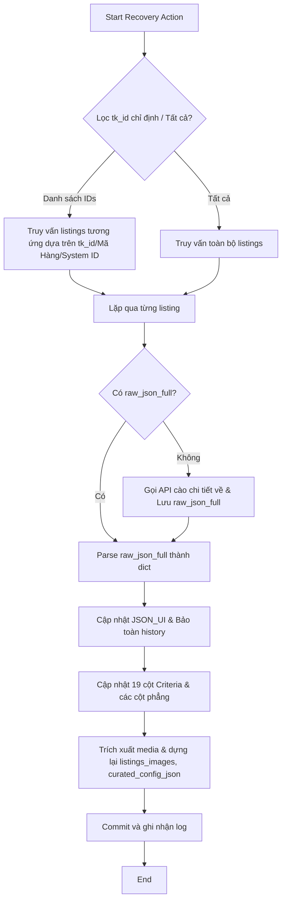

# US-142: Khôi phục dữ liệu listings từ raw_json_full trong SQLite Cục bộ

## User story
**As a** PO / Admin
**I want** có một chức năng/kịch bản phục hồi thông tin của căn nhà từ cột dữ liệu thô `raw_json_full` trong cơ sở dữ liệu SQLite local (bảng `listings` của Pool1)
**So that** tôi có thể cập nhật cấu trúc `JSON_UI` mới nhất, phục hồi các cột metadata phẳng hoặc sửa sự cố mất ảnh trong `listings_images` mà không cần cào lại nguồn từ website đối tác.

## Acceptance
- [x] Cho phép quét toàn bộ hoặc một danh sách căn nhà chỉ định (theo `tk_id` dạng UUID, `Mã Hàng`, hoặc `System ID` - không dùng mã Khang Ngô) có trong SQLite cục bộ (bảng `listings`).
- [x] Phục hồi/cập nhật cột `JSON_UI` dựa trên `raw_json_full`, đồng thời bảo toàn tuyệt đối trường lịch sử đổi giá (`history`) hiện có trong `JSON_UI` cũ.
- [x] Phục hồi/cập nhật các cột phẳng và các cột tiêu chí của `listings` (như `bedrooms`, `restrooms`, `latitude`, `longitude`, các cột `Criteria_...` 19 nhóm) từ `raw_json_full`.
- [x] Khôi phục danh sách hình ảnh trong bảng `listings_images` và trường `curated_config_json` từ mảng `media` của `raw_json_full` (phân loại sơ đồ vs ảnh thường chuẩn xác, chỉ định lại trạng thái `raw_text` nếu ảnh R2 chưa di cư hoàn chỉnh).
- [x] Tích hợp cơ chế Fallback Crawl: Nếu một căn nhà cần khôi phục nhưng cột `raw_json_full` đang trống, tự động gọi API Thiên Khôi để cào chi tiết về cập nhật `raw_json_full` trước khi phục hồi.
- [x] Tích hợp nút bấm trực quan trên **Bảng điều hành HTA** (`BANG_DIEU_HANH.hta`) gọi kịch bản `scratch/recover_raw_json.py` làm "nhạc trưởng" điều phối đầu cuối (E2E), chạy ngầm khôi phục tự động cho toàn bộ database.


## Solution

### 1. Các trường hợp cần khôi phục thông tin căn nhà từ `raw_json_full`
- **Trường hợp 1: Thay đổi/bổ sung cấu hình `JSON_UI`:** Khi thêm các trường mới vào danh sách `"json_ui_fields"` trong `settings.json`, các căn nhà cũ đã cào sẽ thiếu các trường này ở cột `JSON_UI`. Việc chạy recovery sẽ cập nhật lại `JSON_UI` cho toàn bộ database.
- **Trường hợp 2: Khôi phục hình ảnh sau khi chạy `restore_db_from_sheets.py`:** Khi khôi phục DB từ Google Sheets, nếu cột `Images_Admin_JSON` hoặc ảnh trên Sheet bị trống/lỗi, SQLite cục bộ sẽ bị xóa trắng ảnh. Recovery sẽ trích xuất lại ảnh từ `media` trong `raw_json_full` để dựng lại `listings_images`.
- **Trường hợp 3: Nâng cấp schema / thêm cột mới:** Khi hệ thống bổ sung cột mới vào bảng `listings` (như tọa độ, vỉa hè, mặt thoáng, v.v.), recovery sẽ phân tích `raw_json_full` để điền giá trị cho cột mới này mà không cần cào lại.
- **Trường hợp 4: Sửa sai sót do logic phân tích DOM cũ bị lỗi:** Khi phát hiện một lỗi phân tích DOM ở các phiên bản cũ (ví dụ: bóc tách hướng bị sai, gõ nhầm tên cột), recovery sẽ parse lại `raw_json_full` là gói API thô chuẩn để ghi đè sửa lỗi.
- **Trường hợp 5: Khôi phục căn nhà có raw_json_full trống:** Khi chạy khôi phục cho một căn nhà có `raw_json_full` trống (ví dụ: do cào bằng công cụ DOM HTML cũ), hệ thống sẽ tự động gọi API Thiên Khôi để cào chi tiết về, cập nhật `raw_json_full` rồi thực hiện phục hồi.

### 2. Sơ đồ khối khôi phục dữ liệu


## 📋 Implementation Plan

### Tầng Giao Diện Điều Hành (`BANG_DIEU_HANH.hta`)

#### [MODIFY] [BANG_DIEU_HANH.hta](file:///d:/LHTBrain/01_PROJECTS/BDS-KhangNgo/BANG_DIEU_HANH.hta)
- Thêm nút bấm **"⚡ Cứu hộ / Khôi phục dữ liệu từ raw_json_full"** để gọi script `python scratch/recover_raw_json.py`.

### Tầng Thư Viện Lõi (`core/`)

#### [MODIFY] [business_rules.py](file:///d:/LHTBrain/01_PROJECTS/BDS-KhangNgo/core/business_rules.py)
- Thêm hàm `recover_listing_from_raw_json(conn, tk_id, active_table="listings", update_type="all")` thực thi:
  1. Đọc dữ liệu cũ (`JSON_UI`, `curated_config_json`, `status`) từ CSDL.
  2. Parse `raw_json_full`. Nếu lỗi, bỏ qua.
  3. Nếu `update_type` là `"all"` hoặc `"json_ui"`:
     - Dùng `extract_json_ui_data(raw_dict)` để trích xuất `JSON_UI` mới.
     - Trích xuất mảng `history` cũ và trộn vào `JSON_UI` mới.
  4. Nếu `update_type` là `"all"` hoặc `"columns"`:
     - Trích xuất các trường phẳng và 19 cột `Criteria_...`.
  5. Nếu `update_type` là `"all"` hoặc `"images"`:
     - Trích xuất ảnh sơ đồ (`parcel_map`, `certificate_image`) và ảnh thường từ `media`.
     - Rebuild `raw_images_tk_json`, `raw_sodo_tk_json` và repopulate bảng `listings_images` với thứ tự và vai trò chuẩn (diagram/facade/interior).
     - Giữ nguyên trạng thái `status = 'published'` nếu căn đó đang là published; nếu không thì chuyển trạng thái về `raw_text` để kích hoạt di cư R2 nếu danh sách ảnh R2 trống.

### Tầng API Blueprints (`api/`)

#### [MODIFY] [routes_pool.py](file:///d:/LHTBrain/01_PROJECTS/BDS-KhangNgo/api/routes_pool.py)
- Đăng ký endpoint: `POST /api/listings/recover-raw`
  - Chấp nhận các tham số `target_ids`, `all_flag`, `update_type`.
  - Phân giải danh sách `target_ids` bằng cách tìm theo `tk_id` (UUID), `Mã Hàng`, và `System ID` (không khớp theo mã Khang Ngô).
  - Chạy ngầm trong Thread để tránh timeout API và ghi log ra hệ thống logs chung của manager.
  - **Logic Fallback Crawl**: Nếu căn nhà cần recover có `raw_json_full` trống, endpoint sẽ gọi hàm cào chi tiết từ Thiên Khôi (tương đương logic `/api/listings/<tk_id>/recrawl`), lưu vào SQLite rồi chạy tiếp luồng `recover_listing_from_raw_json()`.

### Kịch bản Bảo trì (`scratch/`)

#### [MODIFY] [recover_raw_json.py](file:///d:/LHTBrain/01_PROJECTS/BDS-KhangNgo/scratch/recover_raw_json.py)
- Tái cấu trúc hàm `recover_data()` làm "nhạc trưởng" điều phối đầu cuối:
  - Hỗ trợ tham số đầu vào (qua CLI hoặc gọi trực tiếp từ Flask API).
  - Duyệt qua toàn bộ listings trong CSDL, chạy Fallback Crawl với các căn trống `raw_json_full`, sau đó gọi tuần tự `recover_listing_from_raw_json()` để cập nhật CSDL master.

## 📝 Task Checklist (TODO)
- [x] **Thiết kế & Khảo sát:**
  - [x] Khảo sát cấu trúc `raw_json_full` và mảng `media`.
  - [x] Chốt giải pháp tích hợp qua kịch bản `recover_raw_json.py` và API `/api/listings/recover-raw`.
- [x] **Triển khai Code:**
  - [x] Thêm nút bấm điều hành vào `BANG_DIEU_HANH.hta`.
  - [x] Implement hàm `recover_listing_from_raw_json` trong `core/business_rules.py`.
  - [x] Thêm endpoint `POST /api/listings/recover-raw` vào `api/routes_pool.py`.
  - [x] Tích hợp khôi phục hàng loạt vào `scratch/recover_raw_json.py`.
- [x] **Kiểm thử sơ bộ:**
  - [x] Viết test tự động trong `tests/test_recovery.py`.
  - [x] Chạy thử qua kịch bản `pytest tests/test_recovery.py`.
  - [x] Chạy test thủ công qua Bảng điều hành HTA và kiểm tra logs.

## Verification Plan

### Automated Tests
- Tạo tệp unit test mới `tests/test_recovery.py` để kiểm thử:
  - Khôi phục `JSON_UI` bảo toàn trường `history`.
  - Khôi phục danh sách hình ảnh trong bảng `listings_images` và `curated_config_json` từ JSON thô.
  - Khôi phục các cột metadata phẳng.
  - Kiểm thử cơ chế Fallback Crawl khi `raw_json_full` trống.
  - Kiểm thử phân giải tham số `target_ids` đầu vào (tk_id UUID, Mã Hàng, System ID).
- Lệnh chạy kiểm thử:
  ```bash
  pytest tests/test_recovery.py
  ```

### Manual Verification
1. Mở **Bảng điều hành HTA** (`BANG_DIEU_HANH.hta`).
2. Nhấp nút **"⚡ Cứu hộ / Khôi phục dữ liệu từ raw_json_full"** để chạy ngầm tiến trình khôi phục.
3. Kiểm tra log ở bảng điều khiển console hoặc file log của script để xác nhận tiến độ khôi phục trường `JSON_UI` và tái tạo bảng `listings_images` thành công.
4. Mở Curator dashboard để xác nhận hình ảnh của căn nhà đã xuất hiện đầy đủ mà không cần cào lại.

## Files touched
- `BANG_DIEU_HANH.hta` — Thêm nút bấm điều phối
- `core/business_rules.py` — Chứa hàm xử lý khôi phục chính
- `api/routes_pool.py` — Đăng ký API khôi phục
- `pool_lego.py` — Sửa đổi logic làm sạch hình ảnh cũ lệch tk_id trên Google Sheets
- `scratch/recover_raw_json.py` — Tích hợp gọi khôi phục vào script bảo trì
- `tests/test_recovery.py` — Unit test tính năng khôi phục

