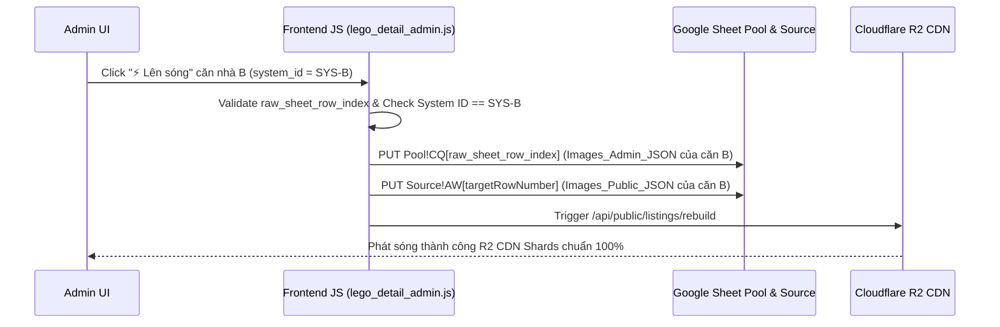

# US-156: Khắc phục Lỗi Lệch Chỉ Số Dòng Sheet Pool & Ngăn Chặn Chép Đè Hình Ảnh Khi Lên Sóng

## User story
**As an** Admin Quản lý Rổ hàng BDS
**I want** khi bấm "⚡ Lên sóng" hoặc "Lưu" bất kỳ căn nhà nào trong rổ hàng (Pool/Source), dữ liệu hình ảnh của căn nhà đó được ghi chính xác 100% vào đúng dòng của căn nhà đó trên Google Sheets và Cloudflare R2 CDN
**So that** các căn nhà khác trong rổ hàng (kể cả căn chưa từng lên sóng như 343A.20 Phan Xích Long hay 525.18 Huỳnh Văn Bánh) không bao giờ bị chép đè dữ liệu ảnh nhầm dòng từ căn nhà khác.

## Logic hiện tại liên quan (Truth Card Gate)
- **[DF-005] Luồng Dữ Liệu Phát Sóng & Đồng Bộ Deployment (R2 CDN Sharding) v4**: Web frontend đọc dữ liệu phát sóng công khai 100% từ Cloudflare R2 CDN JSON Shards (`current.json`, `index.json`, `shard-XXX.json`).
- **[SF-001] Kiến Trúc Hệ Thống Tổng Quan v5**: Vercel Web UI hiển thị rổ hàng công khai từ Cloudflare R2 CDN JSON Shards.
- Yêu cầu này **SỬA LỖI HỒI QUY NGHIÊM TRỌNG (CRITICAL BUG FIX)**:
  1. Dòng 2 trên Sheet Pool là dòng trống. Khi `lego_core.js` lọc bỏ dòng 2 trống (`slice(1).filter(...)`), mảng `POOL_ROWS` trong JS bị lùi 1 đơn vị index so với thực tế trên Sheet. Công thức `indexOf(row) + 2` tính số dòng bị nhỏ hơn thực tế 1 dòng ($\text{Row} - 1$), dẫn đến khi Lên sóng Dòng N (dòng 6 `511.59 Huỳnh Văn Bánh`), code gửi lệnh `PUT` ghi đè nhầm lên Dòng N-1 (dòng 5 `343A.20 Phan Xích Long`).
  2. Vòng lặp copy dữ liệu hình ảnh tại `lego_detail_admin.js:L3744-L3754` tự động lấy các cột ảnh từ `p.pool_row_data` (thuộc căn cũ mở modal gần nhất) chép đè vào `matchedRow` của căn hiện tại mà không kiểm tra System ID.

## Truth Cards bị ảnh hưởng
- **DF-005 v5**: Cập nhật cơ chế đồng bộ dòng nguyên tử theo `raw_sheet_row_index` và chốt chặn validate `System ID` nguyên tử trước khi ghi lên Google Sheet Pool & Source, loại bỏ hoàn toàn rủi ro lệch dòng off-by-one.

## Acceptance
- [x] 1. **Khắc phục lỗi lệch dòng (Off-by-One Row Index Fix)**:
  - `lego_core.js` lưu trực tiếp chỉ số dòng tuyệt đối `raw_sheet_row_index` (1-based index) từ Google Sheets API cho từng dòng, không dựa vào `indexOf` mảng đã filter.
  - Trước khi thực hiện `PUT` lên Sheet Pool, code luôn đối chiếu `System ID` của dòng tại `raw_sheet_row_index`. Nếu không trùng khớp `System ID`, từ chối ghi và báo lỗi.
- [x] 2. **Loại bỏ đoạn code copy ảnh độc hại**:
  - Xóa bỏ hoàn toàn đoạn code chép đè `matchedRow[27]`, `matchedRow[30..54]`, `matchedRow[83..92]` tại `lego_detail_admin.js:L3744-L3754`.
  - Đảm bảo `matchedRow` của căn nào giữ nguyên 100% dữ liệu ảnh của chính căn đó.
- [x] 3. **Clear DOM form inputs khi chuyển căn**:
  - Trong `openS` và `closeS` ([index.html](file:///d:/LHTBrain/01_PROJECTS/BDS-KhangNgo/index.html#L630)), clear sạch `window.imageEditorSlides = []` và toàn bộ các DOM inputs ẩn trong `#sbody` khi đóng/chuyển căn nhà.
- [x] 4. **Khôi phục Dữ liệu Chuẩn từ SQLite Production**:
  - Đọc `Images_Admin_JSON` sạch cho 6 căn từ file CSDL Production `D:\02. CONG VIEC\khangngonhapho.com\raw_archive.db`.
  - Cập nhật đè lại đúng số dòng thực tế trên Sheet Pool & Sheet Source.
  - Rebuild lại toàn bộ Cloudflare R2 CDN Shards sạch 100%.

## Solution

## 📋 Implementation Plan
- **Các bước triển khai:**
  1. Tạo User Story `US-156.md` và cập nhật `docs/stories/INDEX.md`.
  2. Tạo nhánh git `feature/US-156`.
  3. Sửa `lego_core.js` để lưu chỉ số dòng tuyệt đối `raw_sheet_row_index`.
  4. Sửa `lego_detail_admin.js` xóa bỏ đoạn code chép đè L3744-L3754 và bổ sung validate `System ID`.
  5. Viết và chạy script Python `scratch/fix_corrupted_images_from_sqlite.py` khôi phục dữ liệu từ SQLite Production `D:\02. CONG VIEC\khangngonhapho.com\raw_archive.db` lên Sheet Pool & Source, rebuild R2 CDN.
  6. Kiểm thử lại toàn bộ luồng Lên sóng trên Web Vercel Admin.

## 🛠️ Update Logic (Drafting while Doing)
- *Ghi nhận:* CSDL SQLite Production tại `D:\02. CONG VIEC\khangngonhapho.com\raw_archive.db` chứa 6 căn nhà hoàn toàn sạch dữ liệu ảnh.

## Verification Plan

> [!check]- Automated Tests
> `python scratch/fix_corrupted_images_from_sqlite.py`

> [!check]- Manual Verification
> - Mở `/index.html` Admin Dashboard, mở căn A (`137.32.25B Lê Văn Sỹ`) rồi bấm Lên sóng căn B (`525.18 Huỳnh Văn Bánh`). Kiểm tra căn B và căn 343A.20 Phan Xích Long không bị lệch dòng hay đổi ảnh.

## Files touched
- `static/js/lego_core.js` — Lưu thuộc tính `raw_sheet_row_index` tuyệt đối.
- `static/js/lego_detail_admin.js` — Xóa code chép đè ảnh cũ L3744-L3754 và validate System ID trước khi PUT.
- `index.html` — Clear DOM inputs và `window.imageEditorSlides` khi đóng/chuyển modal.
- `scratch/fix_corrupted_images_from_sqlite.py` — Script khôi phục dữ liệu từ SQLite Production sang Google Sheets và R2 CDN.
