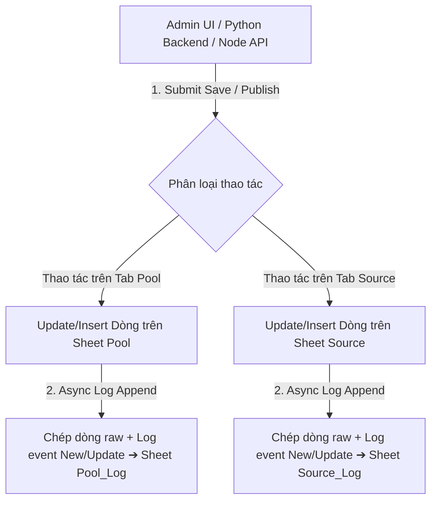

# US-157: Tự Động Ghi Nhật Ký Lịch Sử (Audit Log) Thay Đổi Dữ Liệu Trên Sheets Pool_Log Và Source_Log

## User story
**As an** Admin BDS Khang Ngô
**I want** Mỗi khi có thao tác Lên sóng, Biên tập hoặc Cập nhật/Thêm mới một căn nhà từ Vercel Web UI hoặc Python Local Server làm thay đổi dòng dữ liệu tương ứng trên sheet `Pool` hoặc `Source`, hệ thống tự động ghi chép (append) một dòng mới chứa nguyên vẹn dữ liệu thô (raw row) kèm loại sự kiện (`New` hoặc `Update`) sang sheet `Pool_Log` (trong file `Pool BDS`) và `Source_Log` (trong file `BDS_KhangNgo_Source`)
**So that** Bảo toàn 100% lịch sử biến động dữ liệu, dễ dàng truy vết lịch sử sửa đổi và bảo vệ an toàn CSDL chống mất mát khi có sự cố ghi đè.

## Logic hiện tại liên quan
- **SF-001 System Architecture v5**: Kiến trúc tổng quan 5 thành phần (Local Server, SQLite, Google Sheets, R2 CDN, Background Worker).
- **DF-001 Curation & Publish Flow v7**: Luồng Curation Save & Publish. Quy định tra cứu dòng động trên `Pool` (Dòng 3+) và `Source` (Dòng 4+).
- **DF-002 Sync & Overwrite Policy**: Quy tắc bảo toàn dữ liệu khi đồng bộ hai chiều.
- Yêu cầu này **BỔ SUNG** luồng ghi nhật ký lịch sử append-only (`Pool_Log` và `Source_Log`) mà không làm ảnh hưởng hay thay đổi logic của các bảng chính `Pool` và `Source`.

## Acceptance Criteria
1. **Sheet `Pool_Log` (trong cùng file `Pool BDS`)**:
   - Khi có dữ liệu được thêm mới (New) hoặc cập nhật (Update) trên tab `Pool`, hệ thống tự động chép 1 dòng nguyên văn toàn bộ các cột thô sang tab `Pool_Log`.
   - Vị trí cột `Log event` được phân giải động theo tên Header tại runtime (Rule 6). Giá trị cột `Log event` điền `New` (nếu chèn mới) hoặc `Update` (nếu cập nhật căn cũ).
2. **Sheet `Source_Log` (trong cùng file `BDS_KhangNgo_Source`)**:
   - Khi có dữ liệu được thêm mới (New) hoặc cập nhật (Update) trên tab `Source`, hệ thống tự động chép 1 dòng nguyên văn toàn bộ các cột thô sang tab `Source_Log`.
   - Vị trí cột `Log event` được phân giải động theo tên Header tại runtime (Rule 6). Giá trị cột `Log event` điền `New` (nếu chèn mới) hoặc `Update` (nếu cập nhật căn cũ).
3. **Bao phủ 100% các điểm can thiệp dữ liệu (Rule 11)**:
   - Python Backend (`pool_lego.py`): Hàm `publish_listing()` (cho `Pool`) và `publish_to_source_sheet()` (cho `Source`).
   - Frontend Admin Web UI (`static/js/lego_detail_admin.js`): Luồng Lên sóng / Curation Save gọi Google Sheets REST API v4 trực tiếp từ Vercel Web UI.
   - Node.js Vercel Handler (`api/index.js`): Các endpoint serverless xử lý Sheets.
4. **Cơ chế chịu lỗi thầm lặng (Silent Fallback & Resilience)**:
   - Thao tác append sang `Pool_Log` / `Source_Log` được bọc try-catch không làm gián đoạn luồng chính. Nếu sheet log gặp lỗi (hạn mức API hay mạng), luồng ghi vào sheet chính `Pool`/`Source` vẫn thành công 100%.

## Technical Architecture & Solution

> [!note]- Configuration & Spreadsheet IDs
> ```json
> {
>   "pool_spreadsheet_id": "Lấy từ cfg.sheet_id / cfg.staging_pool_sheet_id",
>   "source_spreadsheet_id": "Lấy từ cfg.source_sheet_id / cfg.staging_source_sheet_id"
> }
> ```

> [!note]- Log Event Schema Rules (Dynamic Header Mapping)
> 1. Dò dòng Header (Dòng 1) của `Pool_Log` và `Source_Log`.
> 2. Tìm chỉ số cột `Log event` via `headers.indexOf("Log event")` (JavaScript) hoặc `get_idx(headers, "Log event")` (Python).
> 3. Nếu chưa tồn tại cột `Log event` trên Header ➔ Tự động bổ sung tên cột `"Log event"` vào ô cuối cùng của Header.
> 4. Tạo mảng dòng log: Copy toàn bộ mảng dữ liệu thô `row_values`, đặt giá trị `log_event` (`New` hoặc `Update`) vào đúng vị trí chỉ số cột `Log event`.



## 📋 Implementation Plan

### 1. Python Core Backend (`pool_lego.py`)
- Viết helper `append_audit_log_py(spreadsheet_id, log_sheet_name, row_values, log_event)`:
  - Sử dụng `gspread` kết nối tới `spreadsheet_id`.
  - Mở worksheet `log_sheet_name` (`Pool_Log` hoặc `Source_Log`).
  - Đọc Header dòng 1, phân giải chỉ số cột `Log event` động.
  - Gọi `sheet.append_row()` hoặc `sheet.append_rows()` đẩy dòng dữ liệu kèm `Log event`.
- Tích hợp gọi `append_audit_log_py` tại:
  - `publish_listing()` ➔ Ghi `Pool_Log` khi chèn mới (`New`) hoặc cập nhật (`Update`).
  - `publish_to_source_sheet()` ➔ Ghi `Source_Log` khi chèn mới (`New`) hoặc cập nhật (`Update`).

### 2. Frontend Admin Web UI (`static/js/lego_detail_admin.js`)
- Viết helper `appendAuditLogFrontend(accessToken, spreadsheetId, logSheetName, rowValues, logEvent)`:
  - Đọc Header dòng 1 của sheet Log qua Google Sheets REST API v4 (`values/${logSheetName}!A1:ZZ1`).
  - Phân giải vị trí cột `Log event` động.
  - Gọi API `values/${logSheetName}!A1:append?valueInputOption=USER_ENTERED` chép dòng dữ liệu thô.
- Tích hợp gọi `appendAuditLogFrontend` tại:
  - Các hàm Lên sóng trực tiếp từ Frontend (`Source!A2:append` ➔ `Source_Log` với `New`, `Source!A${row}` ➔ `Source_Log` với `Update`, `Pool!${col}${row}` ➔ `Pool_Log` với `Update`).

### 3. Node.js Serverless Handler (`api/index.js`)
- Viết helper `appendAuditLogNode(accessToken, spreadsheetId, logSheetName, rowValues, logEvent)` phục vụ các endpoint serverless.

## 📝 Task Checklist (TODO)
- [ ] **Thiết kế & Phân tích:** [ ] Phân tích Header `Pool_Log` & `Source_Log` | [ ] Thiết kế helper audit log động.
- [ ] **Triển khai Code:**
  - [ ] Viết helper `append_audit_log_py()` trong `pool_lego.py` và tích hợp `publish_listing` & `publish_to_source_sheet`.
  - [ ] Viết helper `appendAuditLogFrontend()` trong `static/js/lego_detail_admin.js` và tích hợp các điểm save/publish.
  - [ ] Viết helper `appendAuditLogNode()` trong `api/index.js`.
  - [ ] Xử lý None-safety & bọc try-catch silent fallback.
- [ ] **Kiểm thử & Xác minh:**
  - [ ] Viết và chạy script kiểm thử tự động `scratch/test_us157_audit_log.py`.
  - [ ] Kiểm thử thủ công trên Web Admin UI, kiểm tra dữ liệu xuất hiện trên `Pool_Log` và `Source_Log`.

## 🛠️ Update Logic (Drafting while Doing)
- *Ghi nhận nhật ký debug thực tế khi triển khai code*

## 🧠 Retro, Lessons Learned & Good Practices
- *Ghi nhận bài học kinh nghiệm sau khi hoàn thành US*

## Verification Plan

> [!check]- Automated Tests
> - Script `scratch/test_us157_audit_log.py`:
>   - Gửi request mô phỏng chèn/cập nhật dữ liệu.
>   - Kiểm tra API v4 nhận được lệnh append và ghi đúng cột `Log event` = `New` / `Update` trên cả 2 sheet log.

> [!check]- Manual Verification
> - Đăng/Biên tập 1 căn nhà từ Vercel Web UI.
> - Mở Google Sheets `Pool BDS` ➔ Kiểm tra tab `Pool_Log`.
> - Mở Google Sheets `BDS_KhangNgo_Source` ➔ Kiểm tra tab `Source_Log`.

## Files touched
- `pool_lego.py` — Thêm helper `append_audit_log_py()` và tích hợp luồng publish Python.
- `static/js/lego_detail_admin.js` — Thêm helper `appendAuditLogFrontend()` và tích hợp luồng publish Vercel Admin.
- `api/index.js` — Thêm helper `appendAuditLogNode()` cho Vercel Node handler.
- `docs/stories/_inbox/US-157.md` — Hồ sơ User Story chính thức.
