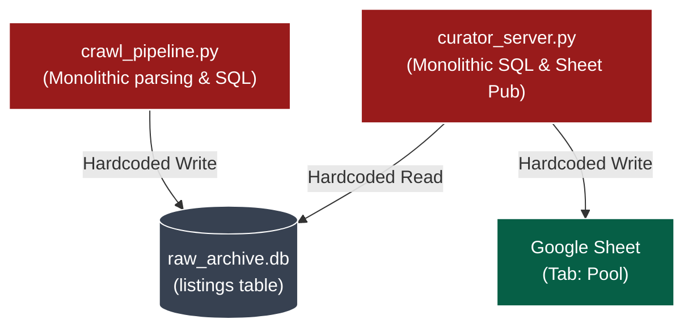
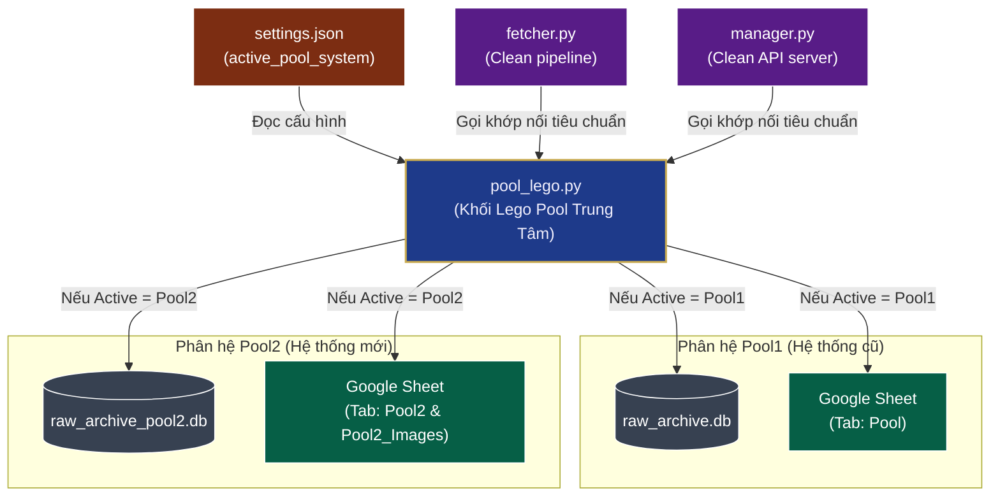

# System Architecture, Deployment & Security Guide (Kiến Trúc, Triển Khai & Bảo Mật Hệ Thống)

Tài liệu này đóng vai trò là bản đồ kiến trúc kỹ thuật chi tiết của hệ sinh thái BDS Khang Ngô, quy định các tiêu chuẩn thiết kế lắp ráp Lego, quy trình deploy và các nguyên tắc bảo mật thông tin.

---

## 🏗️ 1. Bản Đồ Kiến Trúc Hệ Thống (System Architecture Map)

Hệ thống được thiết kế theo mô hình **Khối Lắp Ráp Lego (Modular Lego Architecture)** kết hợp lưu trữ cơ sở dữ liệu độc lập và đồng bộ trực tuyến.

### a. So sánh Kiến trúc Cũ vs Kiến trúc Lego Mới

#### 1. Kiến trúc cũ (Monolithic - Chưa phân rã)
Trước đây, logic điều khiển và các thiết lập cơ sở dữ liệu, phân tích trường thông tin API bị hardcode phân tán trong crawler và server. Khi nâng cấp hoặc đổi cấu hình, nguy cơ gây lỗi cho hệ thống hiện tại là rất cao.



#### 2. Kiến trúc mới (Lego-based - Phân rã qua Khớp nối `pool_lego.py`)
Mã nguồn chính (`fetcher.py` và `manager.py`) được thiết kế tinh gọn và hoàn toàn độc lập với các đặc thù của từng Pool. Mọi logic định tuyến, phân tích schema, lưu trữ SQLite và Google Sheets được giao cho khối Lego trung tâm `pool_lego.py`.



---

## 👥 2. Các Actor & Vai Trò Trong Kiến Trúc Lego

Để đảm bảo tính linh hoạt, hệ thống định nghĩa rõ ràng vai trò của từng thành phần (Actor) và khớp nối giữa chúng:

### 1. `settings.json` (Bảng Công Tắc Điều Phối)
*   **Vai trò:** Lưu trữ tất cả cấu hình động của hệ thống (như Pool hệ thống đang kích hoạt, thời gian trễ cào tin, token, v.v.).
*   **Hành vi:** Đóng vai trò là nguồn chân lý cấu hình duy nhất. Các file Python khác chỉ đọc tham số từ file này, tuyệt đối không hardcode cấu hình trong code.

### 2. `fetcher.py` (Xe Cào Tin / Scraper)
*   **Vai trò:** Chịu trách nhiệm thực thi các kết nối HTTP, tải trang HTML chi tiết hoặc gửi request API đến Thiên Khôi.
*   **Khớp nối Lego:** 
    *   Nó không tự ý quyết định cách lưu dữ liệu thô. 
    *   Sau khi nhận dữ liệu thô từ API, nó gửi trực tiếp cho `pool_lego.py` xử lý thông qua hàm `pool_lego.save_raw_to_sqlite()`.
    *   Sử dụng database file lấy động từ hàm `pool_lego.get_db_file()`.

### 3. `pool_lego.py` (Khớp Nối & Định Tuyến - Trọng Tài Trung Tâm)
*   **Vai trò:** Chứa toàn bộ logic nghiệp vụ đặc thù của các phân hệ Pool (`Pool1` và `Pool2`). 
*   **Hành vi:** 
    *   **Nhận diện Pool:** Đọc `settings.json` để biết Pool nào đang kích hoạt.
    *   **Khởi tạo Database (`init_db`):** Tạo các bảng SQLite tương ứng với Pool (tạo cột truyền thống cho Pool1; tạo 18+19 cột đặc thù và bảng lưu ảnh theo hàng `listings_images` cho Pool2).
    *   **Phân tích API (`parse_proptech_detail`):** Nhận JSON thô từ API chi tiết, chuẩn hóa các trường thông tin, trích xuất đặc tính `criteria` theo `groupCode`, và backup nguyên văn JSON gốc vào `raw_detail_json`.
    *   **Đồng bộ Sheets (`publish_listing`):** Thực thi việc chèn/cập nhật thông tin vào đúng tab Sheet mục tiêu (`Pool` cho Pool1; `Pool2` và `Pool2_Images` cho Pool2).

### 4. `manager.py` (Trạm Điều Hành Biên Tập / Flask Server)
*   **Vai trò:** Chạy ngầm để cung cấp các API REST cho giao diện web biên tập (`curator.html`).
*   **Khớp nối Lego:** 
    *   Lấy danh sách căn từ file database do `pool_lego.get_db_file()` chỉ định.
    *   Đọc/Ghi dữ liệu curation an toàn thông qua các cấu trúc tương thích ngược của `pool_lego.py` để giao diện web con không bị sập.
    *   Khi người dùng bấm **Xuất bản (Publish)**, nó gọi hàm `pool_lego.publish_listing()` để thực hiện đồng bộ mà không cần tự xử lý API Google Sheets.

### 5. Cơ sở dữ liệu SQLite cục bộ (`raw_archive.db` vs `raw_archive_pool2.db`)
*   **Vai trò:** Lưu trữ cache dữ liệu cào tin thô cục bộ, cách ly dữ liệu giữa hai hệ thống.

### 6. Bảng tính trực tuyến Google Sheets (`Pool` vs `Pool2` / `Pool2_Images`)
*   **Vai trò:** Đích đến cuối cùng của dữ liệu để phục vụ cho các luồng Apps Script và hiển thị trang Vercel công khai.

---

## 🔄 3. Chu Kỳ Hoạt Động của Hệ Thống (Execution Lifecycle)

### Luồng Cào và Lưu tin (Crawl & Save Lifecycle)
1.  Người dùng khởi chạy `fetcher.py` để cào tin.
2.  `fetcher.py` hỏi `pool_lego.py` đường dẫn file SQLite kích hoạt.
3.  `fetcher.py` tải dữ liệu chi tiết của căn nhà từ API Thiên Khôi.
4.  `fetcher.py` chuyển dictionary dữ liệu thô cho `pool_lego.save_raw_to_sqlite()`.
5.  `pool_lego.py` kiểm tra cấu hình `settings.json`:
    *   Nếu là **Pool2**: Trích xuất 18 cột thô mới, lọc các nhóm criteria lưu vào 19 cột tương ứng, lưu toàn bộ JSON vào `raw_detail_json`. Lưu toàn bộ ảnh cào được vào bảng `listings_images` dưới dạng dòng.
    *   Nếu là **Pool1**: Trích xuất dữ liệu thô truyền thống và lưu vào SQLite cũ.

### Luồng Biên tập và Xuất bản (Curation & Publish Lifecycle)
1.  Người dùng mở `curator.html`, Flask Server (`manager.py`) khởi động.
2.  `manager.py` đọc cấu hình `settings.json` và kết nối database thô cục bộ tương ứng qua `pool_lego.py`.
3.  Khi hiển thị chi tiết căn nhà:
    *   Với **Pool2**, `manager.py` gọi hàm tương thích ngược của `pool_lego.py` để tự động gộp các dòng ảnh từ bảng `listings_images` thành mảng cột ảo (`Anh_1`...`Anh_25`) để gửi cho giao diện `curator.html` hiển thị bình thường.
4.  Khi người dùng bấm **Xuất bản (Publish)**:
    *   `manager.py` nhận yêu cầu và gọi khớp nối `pool_lego.publish_listing()`.
    *   `pool_lego.py` thực hiện ghi dữ liệu:
        *   **Pool2**: Đẩy 18+19 cột dữ liệu sang tab `"Pool2"`, xóa và ghi đè danh sách hình ảnh theo hàng sang tab `"Pool2_Images"`.
        *   **Pool1**: Đẩy 93 cột dữ liệu (bao gồm ảnh dạng cột) sang tab `"Pool"`.

---

## 🚀 4. Hướng Dẫn Triển Khai Tính Năng Mới (Feature Construction Guide)

Khi phát triển bất kỳ tính năng nào, Lập trình viên/AI bắt buộc phải tuân thủ trình tự thiết kế sau:
1.  **Xác định giao diện (UI) & Dữ liệu (Input/Output):** Phải làm rõ dữ liệu đầu vào lấy từ đâu (cột nào của Pool/Source Sheets) và đầu ra hiển thị ở đâu.
2.  **Sơ đồ hóa logic chính (Mermaid Diagrams):** Bắt buộc vẽ sơ đồ tương tác hoặc thuật toán bằng Mermaid trong phần `Solution` của User Story để PO kiểm duyệt trước khi viết code.
3.  **Tương thích di động (Mobile First):** Mọi tính năng giao diện mới phải hỗ trợ hiển thị tối ưu trên màn hình iPhone/Android, chống zoom ngoài ý muốn, hỗ trợ SPA History State để nút quay lại (Back-button) trên điện thoại không làm sập ứng dụng.

---

## 🔒 5. Các Nguyên Tắc Bảo Mật Hệ Thống (Security & Privacy Rules)

### a. Bảo mật hình ảnh mặt tiền (Facade Image Protection)
*   Hình ảnh mặt tiền thực tế của căn nhà được bảo vệ bằng lớp Google OAuth2 ở Serverless API. Chỉ tài khoản Admin Khang Ngô Nhà Phố được duyệt mới xem được ảnh gốc, tránh lộ địa chỉ thật ra ngoài.

### b. Loại bỏ thông tin nhạy cảm (PII Data Protection)
*   **TUYỆT ĐỐI KHÔNG** gửi số điện thoại, email hoặc tên riêng của chủ nhà lên các mô hình LLM ngoại vi (như OpenAI, Claude).
*   Trước khi đóng gói payload API, hệ thống phải chạy bộ lọc Regex tự động loại bỏ thông tin PII.

---

## 📦 6. Quy Trình Triển Khai & Deploy (Deployment Process)

### Quy trình CI/CD tự động (Git Hooks):
Dự án áp dụng quy trình kiểm soát chất lượng tích hợp liên tục (CI/CD) tự động ở tầng Git:
*   **Pre-commit Hook (`.git/hooks/pre-commit`):** Tự động kích hoạt khi thực hiện `git commit`. Hook này chạy toàn bộ test suite E2E (`python verify_build.py`). 
    *   *Nếu test pass:* Tự động gọi script `bump_version.py` để sinh timestamp `?v=...` mới trong `index.html` và tự động `git add index.html` để hoàn tất commit.
    *   *Nếu test fail:* Commit bị chặn lại để sửa lỗi.
*   **Vercel Deploy & Verification:** Sau khi push lên nhánh `main`, Vercel sẽ tự động kích hoạt build/deploy. Lập trình viên/AI bắt buộc phải truy cập trực tiếp trang web Live Vercel (sử dụng ẩn danh hoặc xóa cache) để kiểm tra xem tham số phiên bản `?v=...` đã thay đổi đúng hay chưa và xác minh trực quan trước khi bàn giao cho người dùng.

### Đóng gói Mini-App Standalone:
*   Đóng gói file chạy độc lập bằng PyInstaller:
    ```bash
    pyinstaller KhangNgoCuratorApp.spec --clean
    ```

---

*Tài liệu này là Source of Truth kỹ thuật cao nhất của hệ thống, hướng dẫn mọi hoạt động phát triển của Agent.*
