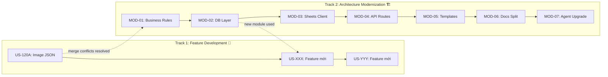
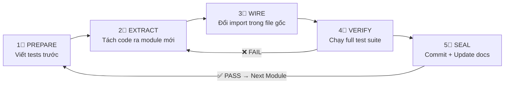
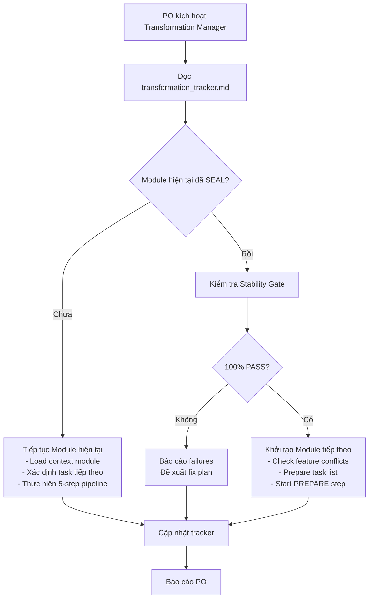
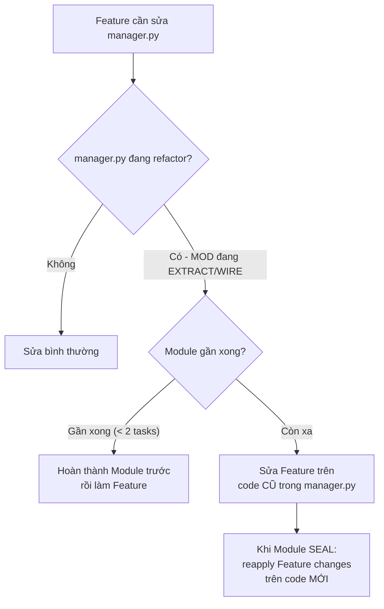

# 🗺️ Lộ Trình Chuyển Đổi Kiến Trúc BDS-KhangNgo

## Tổng Quan Chiến Lược

### Mô hình: Dual-Track Agile (2 làn song song)



> [!IMPORTANT]
> **Nguyên tắc cốt lõi:** Ứng dụng **PHẢI luôn chạy được** ở mọi thời điểm. Không có "big bang refactor". Mỗi Module kết thúc = ứng dụng vẫn hoạt động 100% như trước + code sạch hơn.

---

## 📋 Bảng Theo Dõi Lộ Trình Tổng Quan

| Module | Tên | Mục tiêu | Ước lượng | Phụ thuộc | Trạng thái |
|--------|-----|----------|-----------|-----------|------------|
| MOD-01 | Business Rules Extraction | Tách logic nghiệp vụ ra `core/business_rules.py` | 2-3 sessions | Không | `[ ]` Chờ |
| MOD-02 | Database Layer | Tách DB operations ra `core/db.py` | 2-3 sessions | MOD-01 | `[ ]` Chờ |
| MOD-03 | Sheets Client | Tách Google Sheets API ra `core/sheets_client.py` | 2 sessions | MOD-02 | `[ ]` Chờ |
| MOD-04 | API Routes Split | Tách routes từ manager.py ra `api/routes_*.py` | 3-4 sessions | MOD-02, MOD-03 | `[ ]` Chờ |
| MOD-05 | Template Components | Tách HTML generators từ pool_lego.py | 3-4 sessions | MOD-04 | `[ ]` Chờ |
| MOD-06 | Documentation Split | Tách SOURCE_OF_TRUTH thành module docs | 2 sessions | Bất kỳ lúc nào | `[ ]` Chờ |
| MOD-07 | Agent & Skills Upgrade | Tạo `.agents/` + Gemini Skills | 1-2 sessions | MOD-06 | `[ ]` Chờ |

---

## 🔄 Quy Trình 5 Bước Cho Mỗi Module (Module Pipeline)



### Chi tiết mỗi bước:

| Bước | Tên | Mô tả | Exit Criteria |
|------|-----|-------|---------------|
| 1⃣ | **PREPARE** | Viết unit tests cho logic SẮP tách. Tests gọi functions trong file gốc → phải PASS | Tests PASS trên code cũ |
| 2⃣ | **EXTRACT** | Copy functions sang module mới. Thêm docstring, type hints. KHÔNG xóa code cũ | Module mới compile được |
| 3⃣ | **WIRE** | Đổi imports trong file gốc: xóa function cũ, import từ module mới | File gốc dùng module mới |
| 4⃣ | **VERIFY** | Chạy: (1) Unit tests MOD hiện tại, (2) Full E2E suite, (3) Smoke test thủ công | **100% PASS** tất cả tests |
| 5⃣ | **SEAL** | Git commit, update docs, đánh dấu hoàn thành | Commit on `main`, docs updated |

> [!CAUTION]
> **Stability Gate:** Bước 4⃣ VERIFY là cổng chặn cứng. Nếu BẤT KỲ test nào FAIL → quay lại bước 2⃣ hoặc 3⃣ sửa. KHÔNG ĐƯỢC qua bước 5⃣ khi còn test fail. KHÔNG ĐƯỢC bắt đầu Module tiếp theo khi Module hiện tại chưa SEAL.

---

## 📊 Lộ Trình Chi Tiết Từng Module

### MOD-01: Business Rules Extraction ⭐ BẮT ĐẦU TỪ ĐÂY

**Mục tiêu:** Tách toàn bộ business rules (naming conventions, pricing, data validation) từ `manager.py` và `pool_lego.py` ra `core/business_rules.py`.

**Tại sao đây là Module 1?** Business rules là phần AI hay sửa sai nhất. Tách ra + có tests = tạo "hàng rào" ngay lập tức.

| Task | Mô tả | File tác động | Trạng thái |
|------|-------|---------------|------------|
| MOD-01.1 | **PREPARE:** Viết `tests/test_business_rules.py` — tests cho street normalization (TTMC, HTB, 7SD), house number parsing, price formatting, PII detection | `tests/test_business_rules.py` [NEW] | `[ ]` |
| MOD-01.2 | **PREPARE:** Chạy tests gọi functions trực tiếp từ `manager.py`/`pool_lego.py` → xác nhận PASS | `tests/test_business_rules.py` | `[ ]` |
| MOD-01.3 | **EXTRACT:** Tạo `core/__init__.py` + `core/business_rules.py` — copy functions, thêm docstrings, type hints | `core/business_rules.py` [NEW] | `[ ]` |
| MOD-01.4 | **WIRE:** Trong `manager.py` + `pool_lego.py`: xóa functions đã tách, thêm `from core.business_rules import ...` | `manager.py`, `pool_lego.py` | `[ ]` |
| MOD-01.5 | **VERIFY:** Chạy `pytest tests/test_business_rules.py` → 100% PASS | — | `[ ]` |
| MOD-01.6 | **VERIFY:** Chạy `python scratch/run_all_e2e.py` → 100% PASS | — | `[ ]` |
| MOD-01.7 | **VERIFY:** Khởi động `CHAY_APP.bat`, test thủ công 3 tính năng chính | — | `[ ]` |
| MOD-01.8 | **SEAL:** Git commit `refactor(MOD-01): extract business rules to core/business_rules.py` | — | `[ ]` |
| MOD-01.9 | **SEAL:** Cập nhật `data_standardization_rules.md` link đến module mới | `docs/data_standardization_rules.md` | `[ ]` |

**Stability Gate MOD-01:** `[ ]` Unit Tests PASS | `[ ]` E2E Tests PASS | `[ ]` Smoke Test PASS | `[ ]` PO Confirm

---

### MOD-02: Database Layer

**Mục tiêu:** Tách toàn bộ SQLite operations (connect, init, CRUD, backup) ra `core/db.py`. Loại bỏ duplicate `robust_sqlite_connect()`.

| Task | Mô tả | File tác động | Trạng thái |
|------|-------|---------------|------------|
| MOD-02.1 | **PREPARE:** Viết `tests/test_db.py` — tests cho connect, init_db, CRUD operations, backup | `tests/test_db.py` [NEW] | `[ ]` |
| MOD-02.2 | **PREPARE:** Chạy tests → PASS trên code cũ | `tests/test_db.py` | `[ ]` |
| MOD-02.3 | **EXTRACT:** Tạo `core/db.py` — consolidate `robust_sqlite_connect()` (hiện duplicate 3 chỗ), init_db, query helpers | `core/db.py` [NEW] | `[ ]` |
| MOD-02.4 | **WIRE:** Đổi imports trong `manager.py`, `pool_lego.py`, `fetcher.py` | `manager.py`, `pool_lego.py`, `fetcher.py` | `[ ]` |
| MOD-02.5 | **VERIFY:** Unit tests + E2E tests → 100% PASS | — | `[ ]` |
| MOD-02.6 | **VERIFY:** Test backup/restore workflow thủ công | — | `[ ]` |
| MOD-02.7 | **SEAL:** Git commit + update `database_architecture_guidelines.md` | — | `[ ]` |

**Stability Gate MOD-02:** `[ ]` Unit Tests PASS | `[ ]` E2E Tests PASS | `[ ]` Backup/Restore Test PASS | `[ ]` PO Confirm

---

### MOD-03: Sheets Client

**Mục tiêu:** Tách Google Sheets/Drive API wrapper ra `core/sheets_client.py`.

| Task | Mô tả | File tác động | Trạng thái |
|------|-------|---------------|------------|
| MOD-03.1 | **PREPARE:** Viết `tests/test_sheets_client.py` với mocked API responses | `tests/test_sheets_client.py` [NEW] | `[ ]` |
| MOD-03.2 | **EXTRACT:** Tạo `core/sheets_client.py` — batch read/write, sync logic, credential management | `core/sheets_client.py` [NEW] | `[ ]` |
| MOD-03.3 | **WIRE:** Đổi imports trong `manager.py`, `pool_lego.py`, `restore_db_from_sheets.py` | Multiple files | `[ ]` |
| MOD-03.4 | **VERIFY:** Unit tests (mocked) + E2E tests + sync thử thủ công | — | `[ ]` |
| MOD-03.5 | **SEAL:** Git commit + update `data_dictionary.md` | — | `[ ]` |

**Stability Gate MOD-03:** `[ ]` Unit Tests PASS | `[ ]` E2E Tests PASS | `[ ]` Sync Test PASS | `[ ]` PO Confirm

---

### MOD-04: API Routes Split

**Mục tiêu:** Tách Flask routes từ `manager.py` (6,449 dòng) ra các file routes riêng biệt.

| Task | Mô tả | File tác động | Trạng thái |
|------|-------|---------------|------------|
| MOD-04.1 | **PREPARE:** Viết `tests/test_api_contracts.py` — tests cho mỗi API endpoint response schema | `tests/test_api_contracts.py` [NEW] | `[ ]` |
| MOD-04.2 | **EXTRACT:** Tạo `api/routes_pool.py` — Pool CRUD endpoints | `api/routes_pool.py` [NEW] | `[ ]` |
| MOD-04.3 | **EXTRACT:** Tạo `api/routes_curation.py` — Admin curation endpoints | `api/routes_curation.py` [NEW] | `[ ]` |
| MOD-04.4 | **EXTRACT:** Tạo `api/routes_sync.py` — Sheets sync endpoints | `api/routes_sync.py` [NEW] | `[ ]` |
| MOD-04.5 | **EXTRACT:** Tạo `api/routes_images.py` — Image handling endpoints | `api/routes_images.py` [NEW] | `[ ]` |
| MOD-04.6 | **EXTRACT:** Tạo `api/routes_crawl.py` — Crawler endpoints | `api/routes_crawl.py` [NEW] | `[ ]` |
| MOD-04.7 | **WIRE:** Refactor `manager.py` thành app factory: register Blueprints | `manager.py` | `[ ]` |
| MOD-04.8 | **VERIFY:** Contract tests + E2E tests → 100% PASS | — | `[ ]` |
| MOD-04.9 | **SEAL:** Git commit + update architecture docs | — | `[ ]` |

> [!WARNING]
> MOD-04 là Module lớn nhất và rủi ro nhất. Nếu phát hiện size thực tế > 4 sessions → phân rã thành MOD-04A (pool+search), MOD-04B (curation+images), MOD-04C (sync+crawl).

**Stability Gate MOD-04:** `[ ]` Contract Tests PASS | `[ ]` E2E Tests PASS | `[ ]` Full App Smoke Test PASS | `[ ]` Deploy Vercel thành công | `[ ]` PO Confirm

---

### MOD-05: Template Components

**Mục tiêu:** Tách HTML generators từ `pool_lego.py` (4,104 dòng) ra `templates/components/`.

| Task | Mô tả | File tác động | Trạng thái |
|------|-------|---------------|------------|
| MOD-05.1 | **PREPARE:** Viết `tests/test_templates.py` — snapshot tests cho generated HTML | `tests/test_templates.py` [NEW] | `[ ]` |
| MOD-05.2 | **EXTRACT:** Tạo `templates/components/card.py` — listing card HTML | `templates/components/card.py` [NEW] | `[ ]` |
| MOD-05.3 | **EXTRACT:** Tạo `templates/components/detail_view.py` — detail page HTML | `templates/components/detail_view.py` [NEW] | `[ ]` |
| MOD-05.4 | **EXTRACT:** Tạo `templates/components/admin_panel.py` — admin UI HTML | `templates/components/admin_panel.py` [NEW] | `[ ]` |
| MOD-05.5 | **EXTRACT:** Tạo `templates/components/filter_panel.py` — filter UI HTML | `templates/components/filter_panel.py` [NEW] | `[ ]` |
| MOD-05.6 | **WIRE:** Refactor `pool_lego.py` → import components, giữ lại data layer | `pool_lego.py` | `[ ]` |
| MOD-05.7 | **VERIFY:** Snapshot tests + E2E tests (visual verification) | — | `[ ]` |
| MOD-05.8 | **SEAL:** Git commit + update docs | — | `[ ]` |

**Stability Gate MOD-05:** `[ ]` Snapshot Tests PASS | `[ ]` E2E Tests PASS | `[ ]` Visual Check Desktop + Mobile | `[ ]` PO Confirm

---

### MOD-06: Documentation Split

**Mục tiêu:** Tách SOURCE_OF_TRUTH.md (187KB) thành module docs nhỏ. Có thể làm song song với các Module code.

| Task | Mô tả | File tác động | Trạng thái |
|------|-------|---------------|------------|
| MOD-06.1 | Tạo `docs/business_rules/INDEX.md` — mục lục tất cả rules | [NEW] | `[ ]` |
| MOD-06.2 | Tách rules đặt tên đường → `docs/business_rules/naming_conventions.md` | [NEW] | `[ ]` |
| MOD-06.3 | Tách rules giá → `docs/business_rules/pricing_rules.md` | [NEW] | `[ ]` |
| MOD-06.4 | Tách rules ảnh → `docs/business_rules/image_classification.md` | [NEW] | `[ ]` |
| MOD-06.5 | Tách rules bảo mật → `docs/business_rules/data_security.md` | [NEW] | `[ ]` |
| MOD-06.6 | Tách curation workflow → `docs/business_rules/curation_workflow.md` | [NEW] | `[ ]` |
| MOD-06.7 | Tách search/filter rules → `docs/business_rules/search_filter_rules.md` | [NEW] | `[ ]` |
| MOD-06.8 | Tạo `docs/architecture/system_overview.md` + Mermaid diagrams | [NEW] | `[ ]` |
| MOD-06.9 | Tạo `docs/architecture/api_reference.md` — endpoint catalog | [NEW] | `[ ]` |
| MOD-06.10 | Cập nhật cross-references trong tất cả existing docs | Multiple .md files | `[ ]` |
| MOD-06.11 | **VERIFY:** AI agent đọc đúng docs khi sửa feature liên quan (dry-run test) | — | `[ ]` |

**Stability Gate MOD-06:** `[ ]` Tất cả docs có cross-references | `[ ]` AI dry-run test đọc đúng context | `[ ]` PO review nội dung

---

### MOD-07: Agent & Skills Upgrade

**Mục tiêu:** Tạo `.agents/` directory + Gemini Skills + cập nhật BDS-AGENTS.md thành bản gọn.

| Task | Mô tả | File tác động | Trạng thái |
|------|-------|---------------|------------|
| MOD-07.1 | Tạo `.agents/AGENTS.md` — 5-10 rules cốt lõi + Module Map | `.agents/AGENTS.md` [NEW] | `[ ]` |
| MOD-07.2 | Tạo skill `fix-bug` → `.agents/skills/fix-bug/SKILL.md` | [NEW] | `[ ]` |
| MOD-07.3 | Tạo skill `new-feature` → `.agents/skills/new-feature/SKILL.md` | [NEW] | `[ ]` |
| MOD-07.4 | Tạo skill `data-sync` → `.agents/skills/data-sync/SKILL.md` | [NEW] | `[ ]` |
| MOD-07.5 | Tạo skill `refactor-module` → `.agents/skills/refactor-module/SKILL.md` | [NEW] | `[ ]` |
| MOD-07.6 | Tạo skill `transformation-manager` → xem Section Agent bên dưới | [NEW] | `[ ]` |
| MOD-07.7 | Rút gọn `BDS-AGENTS.md` — chỉ giữ workflows + references | `BDS-AGENTS.md` | `[ ]` |
| MOD-07.8 | **VERIFY:** Test AI conversation mới load đúng skills & rules | — | `[ ]` |

**Stability Gate MOD-07:** `[ ]` AI load đúng AGENTS.md mới | `[ ]` Skills trigger đúng | `[ ]` PO test vài scenarios

---

## 🤖 Transformation Manager Agent

### Thiết kế Gemini Skill: `transformation-manager`

Skill này sẽ là "bộ não" quản lý toàn bộ quá trình chuyển đổi.

**Vị trí:** `.agents/skills/transformation-manager/SKILL.md`

**Chức năng chính:**

```
┌─────────────────────────────────────────────────────┐
│           TRANSFORMATION MANAGER AGENT              │
├─────────────────────────────────────────────────────┤
│                                                     │
│  📊 Dashboard                                       │
│  - Đọc bảng tracking → báo cáo tiến độ tổng thể    │
│  - Highlight module đang active                     │
│  - Cảnh báo blockers/conflicts                      │
│                                                     │
│  🔄 Module Orchestration                            │
│  - Kiểm tra Stability Gate module trước             │
│  - Khởi tạo module tiếp theo                        │
│  - Giao task cho AI session                         │
│                                                     │
│  ⚡ Conflict Resolution                             │
│  - Phát hiện xung đột với Feature Track             │
│  - Đề xuất merge strategy                           │
│  - Cập nhật tracking board                          │
│                                                     │
│  📝 Knowledge Sync                                  │
│  - Cập nhật docs sau mỗi module                     │
│  - Đồng bộ context headers trong code mới           │
│  - Cập nhật MODULE_MAP cho AI sessions khác         │
│                                                     │
└─────────────────────────────────────────────────────┘
```

**Khi nào kích hoạt:**
- PO gõ `@transformation-manager` hoặc "tiếp tục refactor" hoặc "module tiếp theo"
- PO gõ "báo cáo tiến độ refactor"
- AI đang làm feature mà chạm file đang refactor → tự trigger conflict check

**Workflow mỗi session:**



---

## 🔀 Chiến Lược Song Song: Feature Track vs Refactor Track

### Nguyên Tắc Ưu Tiên

```
┌─────────────────────────────────────────────────┐
│  Rule 1: Feature có deadline → làm Feature trước │
│  Rule 2: Refactor ưu tiên khi không có Feature   │
│  Rule 3: KHÔNG sửa file đang refactor cho Feature│
│          → merge refactor xong rồi mới làm       │
│  Rule 4: Feature nhỏ (S) → có thể xen giữa      │
│          2 tasks của cùng 1 Module                │
└─────────────────────────────────────────────────┘
```

### Lịch Trình Session Mẫu

| Session | Track 1 (Feature) | Track 2 (Refactor) | Ghi chú |
|---------|-------------------|--------------------|---------| 
| S1 | — | MOD-01 tasks 1-3 (PREPARE + EXTRACT) | Bắt đầu refactor |
| S2 | — | MOD-01 tasks 4-9 (WIRE + VERIFY + SEAL) | Hoàn thành MOD-01 |
| S3 | US-120A (Image JSON) | — | Feature ưu tiên |
| S4 | — | MOD-02 tasks 1-4 | Tiếp refactor |
| S5 | US-XXX (Feature nhỏ S) | MOD-02 tasks 5-7 | Xen kẽ |
| S6 | — | MOD-03 full | Module nhỏ |
| S7 | US-YYY (Feature lớn) | — | Feature ưu tiên |
| ... | ... | ... | ... |

### Xử Lý Xung Đột (Conflict Resolution)

Khi Feature Track cần sửa file đang trong Refactor Track:



---

## 📄 File Tracking Chính

File tracking sẽ được lưu tại:
**`d:\LHTBrain\01_PROJECTS\BDS-KhangNgo\docs\transformation_tracker.md`**

Đây là file "single source of truth" cho quá trình chuyển đổi. Transformation Manager Agent sẽ đọc/cập nhật file này mỗi session.

---

## 🛡️ Cam Kết An Toàn (Safety Guarantees)

1. **Zero Downtime:** Ứng dụng chạy bình thường suốt quá trình refactor
2. **Rollback có thể:** Mỗi Module là 1 git commit riêng → revert dễ dàng
3. **Test-first:** Viết test TRƯỚC khi tách code → bắt lỗi ngay
4. **Incremental:** Tách từng function, không phải từng file
5. **PO Gate:** Mỗi Module cần PO confirm trước khi qua Module tiếp
6. **Feature không bị block:** Feature track luôn được ưu tiên khi có deadline

> [!TIP]
> **Cách bắt đầu:** Khi PO approve plan này, gõ: `"Bắt đầu MOD-01"` hoặc `@transformation-manager` để kích hoạt.
